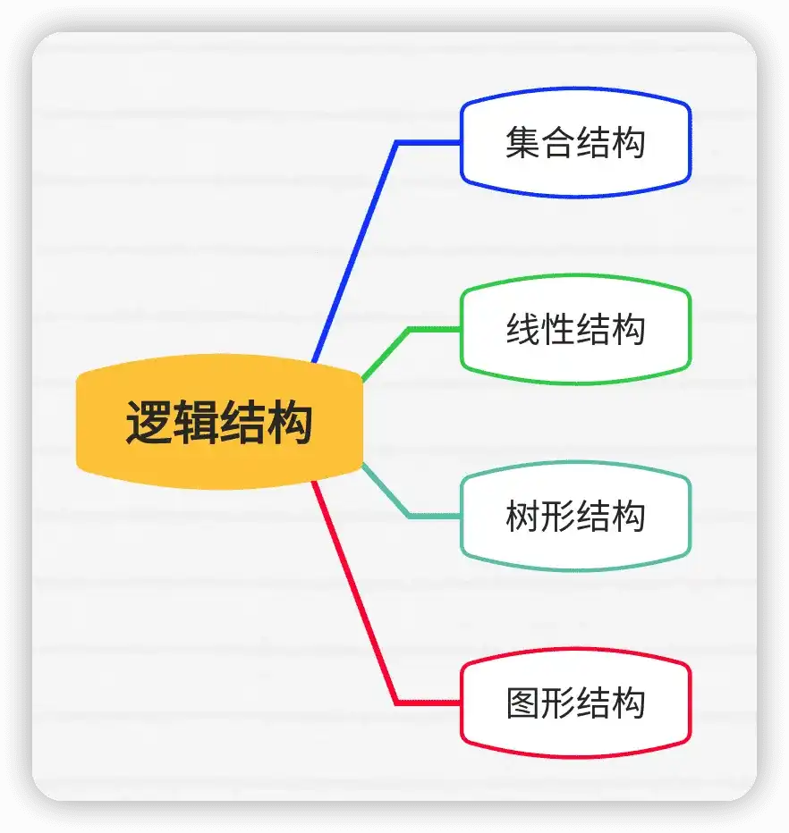
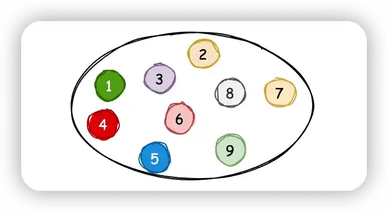
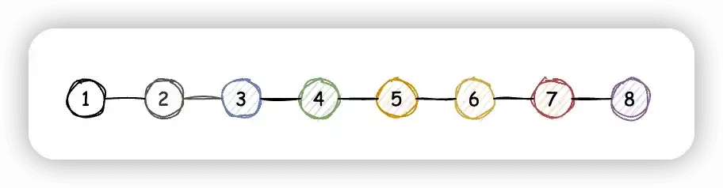
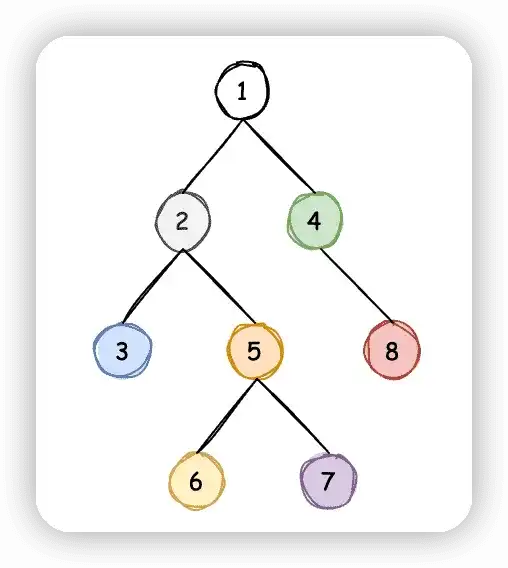
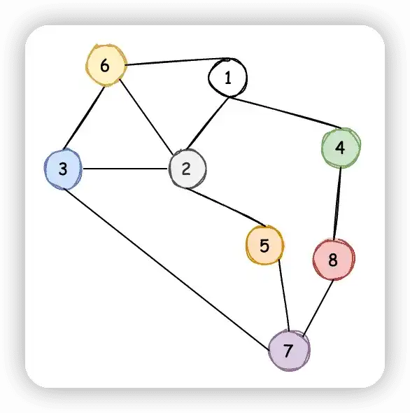
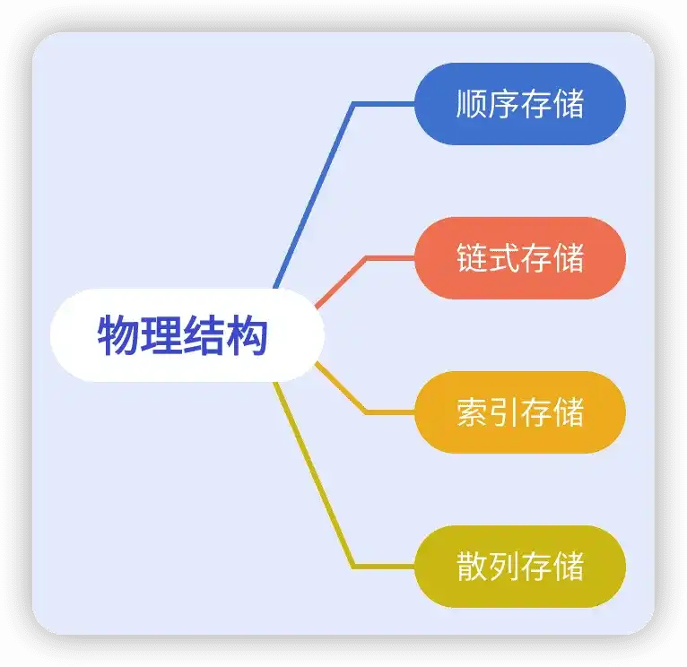
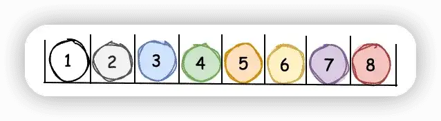
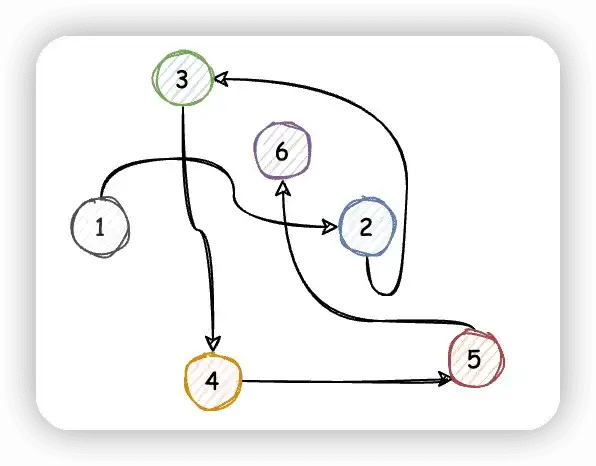

# 数据结构简介

> 作者：[村雨遥](https://github.com/cunyu1943)
> 
> 不要哀求，学会争取，若是如此，终有所获
> 

## 什么是数据结构

在开始正式学习数据结构前，咱们先来看看什么是数据。所谓数据，就是用来描述客观事物的符号，在计算机中就是可以操作的对象，能够被计算机识别并输入给计算机处理的符号集合。数据不仅包括整型、浮点型等数值类型，还包括字符、声音、图像、视频等非数值型类型。

而数据元素就是组成数据的、有一定意义的基本单位，在计算机中一般作为整体来处理，而这些数据元素也叫做记录。

除了数据元素之外，还可以有数据项，一个数据元素可以由若干个数据项所组成，而数据项则是数据中不可分割的最小单位。

不同数据之间，或多或少都存在着一定的关系，而我们把这些关系就叫做结构。所谓数据结构，就是相互间存在一种或多种特定关系的数据元素的集合。

用 Java 中的类来类比，数据就像 Java 中的一个类，数据元素就是类中的各个对象，而数据项则是各个对象中的属性。

## 逻辑结构与物理结构

### 逻辑结构

逻辑结构，就是指数据对象中数据元素之间的相互关系。逻辑结构主要又可以分为 4 种，总结如下：

-   集合结构
-   线性结构
-   树形结构
-   图形结构

1.   **集合结构**

集合结构中的数据元素除了共同属于一个集合之外，元素之间没有其他任何关系，各元素之间是平等的，类似于数学中的集合，如下图所示。

2.   **线性结构**

线性结构中用于描述数据元素之间一对一的关系，最常见就是数组。

3.   **树形结构**

树形结构用于描述数据元素之间的层次关系，最常见的莫过于二叉树。

4.   **图形结构**

用于描述数据元素之间多对多的关系，在用示意图表示图形结构时，需要注意：

-   每个数据元素看做一个节点，用圆圈表示。
-   数据元素间的逻辑关系用节点之间的连线表示，若连线是带箭头的，则说明该关系是有方向的。

### 物理结构

除开逻辑结构之外，还有另一种物理结构，有的书里也叫存储结构。所谓物理结构，指的是数据的逻辑结构在计算机中的存储形式。数据元素的存储结构形式同样主要有四种：

-   顺序存储
-   链式存储
-   索引存储
-   散列存储

1.   **顺序存储**

所谓顺序存储结构，就是把数据元素放在地址连续的存储单元中，其数据之间的逻辑关系和物理关系是一致的。

顺序存储的数据元素只能顺序存放，每个存储结点中只含有一个元素，存储位置反映数据元素间的逻辑关系。这种方式存储密度大，但是插入、删除等操作的效率较差。

2.   **链式存储**

所谓链式存储结构，就是将数据元素存放在任意的存储单元中，这组存储单元既可以是连续的，也可以是不连续的。但是数据元素的链式存储关系并不能反映其逻辑关系，因此需要用一个指针来存放数据元素的地址。通过该指针，我们就能找到相关联数据元素的位置。

链式存储不要求存储空间连续，方便动态操作（插入、删除等），但是存储空间开销大。

3.   **索引存储**

数据元素出了存在一组地址连续的内存空间外，还需要建立一个索引表，索引表中索引知识存储结点的㽾位置或存储区间端点。

4.   **散列存储**

通过散列函数和解决冲突的方式，将关键字散列在连续有限的地址空间中，并将散列函数的值解释成关键字所在元素的存储地址。散列存储的特点是存取速度快，但只能按关键字随机存储，不能顺序存储，也不能折半存储。

## 总结

本文的内容到此就结束了，主要介绍了数据结构的定义，并了解了数据结构中的四种逻辑结构和四种物理结构。关于更多数据结构的知识，咱们就下期文章再见吧！