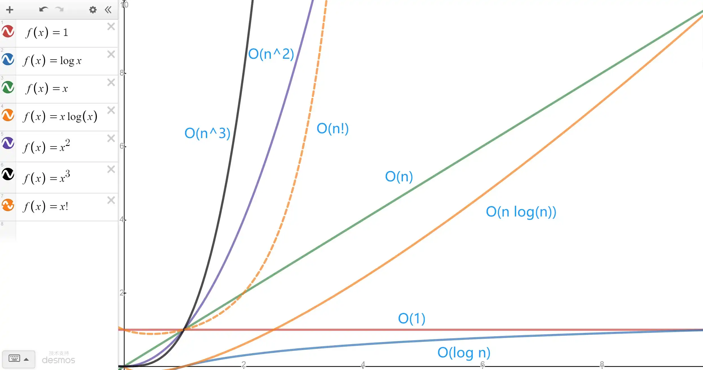

# 时间 & 空间复杂度

> 作者：[村雨遥](https://github.com/cunyu1943)
> 
> 不要哀求，学会争取，若是如此，终有所获
> 

## 前言

所谓算法，其实就是我们用来操作数据、解决程序问题的一组方法。针对同一个问题，我们可以采用不同的算法，然后实现相同的结果。但是针对不同的算法，对于时间和资源的消耗却有不同的差别。而为了分析不同算法的效率，我们常常从 **时间** 和 **空间** 两个方面来对比，然后从中挑出最适合我们的解决方案。

本文主要从时间复杂度和空间复杂度的定义说起，然后介绍常见的时间复杂度和空间复杂度，最后则是对常见排序算法进行了总结。

## 时间复杂度


### 定义

若存在函数 $f(n)$，使得当 $n$ 趋向无穷大时，$T(n) / f(n)$ 的极限值为不等于 0 的常数，则称 $f(n)$ 是 $T(n)$ 的同数量级函数，记作 $T(n)=O(f(n))$，称 $O(f(n))$ 为算法的 **渐进时间复杂度**，简称 **时间复杂度**，用大 O 来表示，称为 **大 O 表示法**；

### 推导时间复杂度的原则

1.  **若运行时间是常数量级，则用常数 1 表示**；
2.  **只保留时间函数中最高阶项**，如 $O(n^2 + 4n)$，保留最高阶项后，成为 $O(n^2)$；
3.  **若最高阶项存在，则省去最高阶项前的系数**，如 $O(4n^2)$，省去最高阶项的系数后，成为 $O(n^2)$；

### 分析时间复杂度的方法

总结起来，对于如何分析一段代码的时间复杂度，主要有如下 3 个实用方法：

1.  **只关注循环执行次数最多的一行代码；**
2.  **加法原则：总复杂度等于量度最大的那段代码的复杂度；**
3.  **乘法原则：嵌套代码的复杂度等于嵌套内外代码复杂度的乘积**；

### 常见的时间复杂度曲线


### 常见时间复杂度

#### $O(1)$

即无论执行多少行，都不会影响到其他区域，此时代码的复杂度就是 $O(1)$，如下面的代码中，假设执行每行代码时间都相同切为 $t$，则 2,3 行各需 1 个执行时间，即为 $t + t = 2t$。此时执行时间复杂度为常数。

```java
void sayHello(String name){
    System.out.prinln("Hello, " + String);
    System.out.prinln("欢迎关注我的公众号：【村雨遥】");
}
```

#### $O(log n)$

如下列二分查找代码中，通过 `while` 循环，能够成倍的缩减搜索范围，假设需要 `x` 次才能跳出循环，则有 `num * 2 * 2 * ... = n` ，其中 `num` 是常数，有 `n` 个 2 相乘，则有 $num * 2 ^x = n$，从而推出 $x = log_2(n/num)$ ，因此时间复杂度用大 O 表示法表示为 $O(log n)$。

```java
int binarySearch(int[] arr, int target){
    int left = 0;
    int right = arr.length - 1;
    while(left <= right){
        int middle = left + (left - right) / 2;
        if(arr[middle] == target){
            return middle;
        }else if(arr[middle] > target){
            right = middle - 1;
        }else {
            left = middle + 1;
        }
    }

    return -1;
}
```

#### $O(n)$

如下面这段代码中，`for` 循环中的代码被执行了 `arr.length` 次，因此所需要的时间和数组长度成正比的，因此可以用 $O(n)$ 来表示它的时间复杂度。利用上述推到原则和分析的方法，可以知道下面代码中循环次数最多的是 4,5 行，总的执行时间是 $O(2n)$，抛去系数后，得到最终时间复杂度 $O(n)$.

```java
int sum(int[] arr){
    int total = 0;

    for(int i = 0; i < arr.length; i++){
        total += arr[i];
    }

    return total;
}
```

#### $O(n log n)$

如果我们将一个复杂度为 $O(logn)$ 的代码重复执行 $n$ 次，那么此时代码的复杂度不就变成 $O(nlogn)$ 了吗。

```java
void hello (int n){
    for( int i = 1 ; i < n ; i++){
        int m = 1;
        while( m < n ){
            m *= 2;
        }
    }
}
```

#### $O(n^2)$

假设我们将时间复杂度为 $O(n)$ 的代码重复执行 $n$ 次，那么此时的时间复杂度就是 $n*O(n)$，即可表示为 $O(n^2)$，表现出来就是双重循环的形式。

```java
void selectionSort(int[] arr, int n){
    for(int i = 0; i < n; i++){
        int min = i;
        for(int j = i + 1; j < n; j++){
            if(arr[j] < arr[min]){
                int tmp = arr[i];
                arr[i] = arr[j];
                arr[j] = tmp;
            }
        }
    }
}
```

#### $O(n^3)$

和 $O(n^2)$，类似，将时间复杂度为 $O(n^2)$ 的代码嵌套循环一次，此时复杂度就变成了  $O(n^3)$，表现出来就是三重循环嵌套的形式。

```java
void demo(int n){
    for(int i = 0; i < n; i++){
        for(int j = 0; j < n; j++){
            for(int k = 0; k < n; k++){
                System.out.print("Hello, World");
            }
            System.out.print("------");
        }
        System.out.print("******");
    }
}
```

#### $O(n!)$

虽然理论上存在时间复杂度为 $O(n!)$ 的算法，但实践中基本遇不到，所以这里就不展开了。

## 空间复杂度

### 定义

空间复杂度是对一个算法在运行过程中临时占用存储空间大小的一个量度（即除开原始序列大小的内存，在算法过程中用到的额外的存储空间），反映的对内存占用的趋势，而不是具体内存，也叫作 **渐进空间复杂度** ，**表示算法的存储空间与数据规模间的增长关系**，用 $S(n)$ 来代替；

### 常用空间复杂度

#### $O(1)$

算法执行所需临时空间不随某一变量 `n` 的大小而变化，则该算法空间复杂度为一个常量，表示为 $S(n) = O(1)$；

```java
int num1 = 1;
int num2 = 2;
int total = num1 + num2;
```

#### $O(n)$

数组占用内存大小为 `n`，而且后续未分配新的空间，因此该算法空间复杂度为 $S(n) = O(n)$；

```java
int[] arr = new int[n];
```

#### $O(n^2)$

二维数组的情况；

```java
int[][] arr = new int[n][n];
```

## 常见排序算法的时间复杂度和空间复杂度

对于面试中常见的的排序算法，以下总结给出了其时间复杂度以及空间复杂度，以及算法稳定性。

| 排序算法 | 平均时间复杂度 | 最好时间复杂度 | 最坏时间复杂度 | 空间复杂度   | 稳定性 |
| -------- | -------------- | -------------- | -------------- | ------------ | ------ |
| 插入排序 | $O(n^2)$       | $O(n)$         | $O(n^2)$       | $O(1)$       | 稳定   |
| 希尔排序 | $O(n^{1.3})$   | $O(n)$         | $O(n^2)$       | $O(1)$       | 不稳定 |
| 选择排序 | $O(n^2)$       | $O(n^2)$       | $O(n^2)$       | $O(1)$       | 不稳定 |
| 堆排序   | $O(nlog_2n)$   | $O(nlog_2n)$   | $O(nlog_2n)$   | $O(1)$       | 不稳定 |
| 冒泡排序 | $O(n^2)$       | $O(n)$         | $O(n^2)$       | $O(1)$       | 稳定   |
| 快速排序 | $O(nlog_2n)$   | $O(nlog_2n)$   | $O(n^2)$       | $O(nlog_2n)$ | 不稳定 |
| 归并排序 | $O(nlog_2n)$   | $O(nlog_2n)$   | $O(nlog_2n)$   | $O(n)$       | 稳定   |
| 计数排序 | $O(n+k)$       | $O(n+k)$       | $O(n+k)$       | $O(n+k)$     | 稳定   |
| 桶排序   | $O(n+k)$       | $O(n)$         | $O(n^2)$       | $O(n+k)$     | 稳定   |
| 基数排序 | $O(n*k)$       | $O(n*k)$       | $O(n*k)$       | $O(n+k)$     | 稳定   |

## 总结

好了，以上就是今天文章的内容了。主要介绍了时间复杂度的定义、推导原则以及常见时间复杂度，还对空间复杂度定义以及常见空间复杂度进行了介绍，最后则是总结了常见排序算法的时间复杂度和空间复杂度。如果觉得文章对你有所帮助，那就点个赞再走吧！