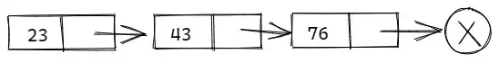
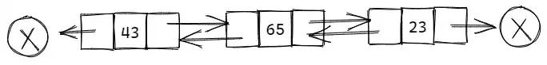

# 链表解惑

> 作者：[村雨遥](https://github.com/cunyu1943)
> 
> 不要哀求，学会争取，若是如此，终有所获
> 

## 🎈 号外

最近，公众号之外，建立了微信交流群，不定期会在群里分享各种资源（影视、IT 编程、考试提升……）&知识。如果有需要，可以**扫码或者后台添加小编微信备注入群**。进群后**优先看群公告**，**呼叫群中【资源分享小助手】**，还能免费帮找资源哦～

<center>
 
</center>
## 一、前言

链表是一种 **递归** 的数据结构，或者为空 `null`，或者指向一个结点（`node`）的引用，一个结点含有 **一个泛型元素和一个指向另一条链表的引用**。

通常分为如下三种类型：

-   **单向链表**：结点被分成两个部分。第一个部分保存或者显示关于结点的信息，第二个部分存储下一个结点的地址，只能向一个方向遍历。
-   **双向链表**：每个数据结点中都有两个指针，分别指向直接后继和直接前驱。
-   **循环链表**：一种 **链式存储结构**，它的最后一个结点指向头结点，形成一个环。

### 1. 单向链表

单向链表包括一个值和一个指向下一结点的指针，其典型结构定义如下：



```java
public class Node{
    // 数据对象
    private Object val;
    // 指向后继结点
    private Node next;
    
    // 无参构造函数
    public Node(){
        // 指向数据对象和后继结点的引用都置空
        this.val = null;
        this.next = null;
    }
    
    // 有参构造函数
    public Node(Object val, Node node){
        this.val = val;
        this.next = node;
    }
    
    // 获取当前存放位置的数据对象
    public Object getVal(){
        return this.val;
    }

    // 将给定元素存放至当前位置，同时返回此前存放的数据对象
    public Object setVal(Object value){
        Object oldVal = this.val;
        this.val = value;
        return oldVal;
    }
    
    // 取当前结点后继结点
    public Node getNext(){
        return this.next;
    }
    
    // 修改当前结点后继结点
    public void setNext(Node newNext){
        this.next = newNext;
    }
}
```

### 2. 双向链表

每个数据结点中都有两个指针，分别指向直接后继和直接前驱，其典型结构定义如下：



```java
public class DoubleNode{
	// 数据对象
    private Object val; 
    // 指向前驱结点
    private DoubleNode prev;
    // 指向后继结点
    private DoubleNode next;
    
    // 无参构造函数
    public DoubleNode(){
        this.val = null;
        this.prev = null;
        this.next = null;
    }
    
    // 有参构造函数
    public DoubleNode(Object value, DoubleNode previous, DoubleNode next){
        this.val = value;
        this.prev = previous;
        this.next = next;
    }
    
    // 获取当前位置数据对象
    public Object getVal(){
        return val;
    }
    
    // 将给定元素放在当前位置，返回此前存放的元素
    public Object setVal(Object value){
        Object oldVal = val;
        val = value;
        return oldVal;
    }
    
    // 获取当前结点后继结点
    public DoubleNode getNext(){
        return next;
    }
    
    // 修改后继结点
    public void setNext(DoubleNode newNext){
        next = newNext;
    }
    
    // 获取当前位置前驱结点
    public DoubleNode getPrev(){
        return prev;
    }
    
    // 修改前驱结点
    public void setPrev(DoubleNode newPrev){
        prev = newPrev;
    }
}
```

## 二、单向链表的增删改查

### 1. 基于链表实现栈

```java
public class MyStack{
    // 指向栈顶元素（头结点）
    private Node head;
    // 栈中元素数目
    private int size;
    
    // 构造方法（构造一个空栈）
    public MyStack(){
        this.head = null;
        this.size = 0;
    }
    
    // 查询栈中元素个数
    public int getSize(){
        return size;
    }
    
    // 判断栈是否为空
    public boolean isEmpty(){
        return head == null;
        // 或者 size == 0;
    }
    
    // 读取栈顶（首结点信息）
    public Object getTop(){
        if(isEmpty()){
            System.out.println("栈空");
        }     
        return head.getVal();
    }
    
    // 压栈（即插入首结点）
    public void insertAtHead(Object val){
        // 创建一个新结点，将其作为首结点插入
        Node node = new Node(val, head);
        // 更新首结点引用
        head = node;
        // 栈中元素数目增加
        size++;
    }
    
   // 出栈（删除首结点）
    public Object removeAtHead(){
        if(isEmpty){
            System.out.println("栈空");
        }
        // 当前结点数据对象
        Object tmp = head.getVal();
        // 更新首结点引用
        head = head.getNext();
        size--;
        return tmp;
    }
} 
```

### 2. 基于链表实现队列

```java
public class MyQueue{
    // 队列首元素（首结点）
    private Node head;
    // 队列尾元素（尾结点）
    private Node tail;
    // 队列规模
    private int size;

    // 构造空队列
    public MyQueue(){
        head = null;
        tail = null;
        size = 0;    
    }

    // 队列规模
    public int getSize(){
        return size;
    }

    // 判断当前队列是否为空
    public boolean isEmpty(){
        return size == 0;
    }

    // 查看队首元素
    public Object getFront(){
        if(isEmpty()){
            System.out.println("队列为空");
        }
        return head.getElem();
    }

    // 入队
    public void enQueue(Object val){
        Node node = new Node();

        // 新结点作为末结点插入
        node.setVal(val);
        node.setNext(null);

        // 若当前队列为空，则直接插入
        if(size == 0){
            head = node;
        }else {
            // 否则将新结点接至队列末端
            tail.setNext(node);
        }

        // 更新指向末结点的引用
        tail = node;
        // 更新队列规模
        size++;
    }

    // 出队
    public Object deQueue(){
        if(size == 0){
            System.out.println("队列为空");
        }

        Object tmp = head.getVal();
        head = head.getNext();
        // 更新队列规模
        size--;
        // 队列为空时，将末结点引用置空
        if(size == 0){
            tail = null;
        }
        return tmp;
    }

    // 遍历队列
    public void traversal(){
        Node node = head;
        while(node != null){
            System.out.println(node.getVal() + "\t");
            node = node.getNext();
        }
    }
}
```

## 三、双向链表的增删改查

实现双向链表时，通常在最前端和最后端各设置一个 **哑元结点**，分别称为 **头结点** 和 **尾结点**，起着 **哨兵** 的作用。但实际上两者并不存储任何实质的数据对象，头（尾）结点的 `next`（`prev`）引用指向首（末）结点，而 `prev`（`next`）引用为空。

### 1. 首尾结点的插入

假设要进行首结点的插入，则通常需要如下步骤，而末结点的插入则是和首结点的插入过程对称。

1.  首先生成一个新结点；
2.  然后将其接入队列的前端；
3.  接着将头结点的 `next` 的引用指向新插入的结点，同时将首结点的 `prev` 的引用指向新插入的结点。

### 2. 首尾结点的删除

假设要进行末结点的删除，通常需要如下步骤，而首结点的删除过程适合尾结点的删除过程对称。

1.  将新的末结点的 `next` 引用指向尾结点；
2.  同时将尾结点的 `prev` 引用指向新的末结点；
3.  最后原先的末结点将会被系统回收。

### 3. 一般结点的插入与删除

要实现在一般结点之间插入新结点，通常需要进行如下步骤：

1.  创建一个新的结点，然后将其 `prev` 引用指向前一个结点，同时将其 `next` 引用指向后一个结点；
2.  然后将前一个结点的 `next` 引用指向新结点，同时将后一个结点的 `prev` 引用指向新结点。

而要实现在一般结点之间删除结点，通常需要进行如下步骤：

1.  首先找到要删除的结点的前驱和后继结点；
2.  然后将其前驱结点的 `next` 引用指向后驱结点，同时将后驱结点的 `prev` 引用指向前驱结点。

```java
public class MyDoubleQueue{
    // 指向头结点（哨兵）
    private DoubleNode header;
    // 指向尾结点（哨兵）
    private DoubleNode trailer;
    // 队列规模
    private int size;

    // 无参构造函数
    public MyDoubleQueue(){
        header = new DoublNode();
        trailer = new DoubleNode();

        header.setNext(trailer);
        trailer.setPrev(trailer);
        size = 0;
    }

    // 获取当前队列规模
    public int getSize(){
        return size;
    }

    // 判断队列是否为空
    public boolean isEmpty(){
        return size == 0;
    }

    // 取首元素
    public Object getHead(){
        if(isEmpty()){
            System.out.println("队列为空");
        }

        return header.getNext().getVal();
    }

    // 取末元素
    public Objecct getTrail(){
        if(isEmpty()){
            System.out.println("队列为空");
        }
        return trailer.getPrev().getVal();
    }

    // 遍历
    public void traversal(){
        DoubleNode node = header.getNext();
        while(node != trailer){
            System.out.print(node.getVal() + "\t");
            node = node.getNext();
        }
        System.out.println();
    }

    // 前端插入新结点
    public void insertFirst(Object val){
        DoubleNode second = header.getNext();
        DoubleNode first = new DoubleNode(val, header, second);
        second.setPrev(first);
        header.setNext(first)
            size++;
    }

    // 前端删除结点
    public Object removeFirst(){
        if(isEmpty()){
            System.out.println("队列为空");	
        }

        // first 是要删除的结点，找到要删除结点的后继结点 second
        DoubleNode first = header.getNext();
        DoubleNode second = first.getNext();
        // 要删除结点的值
        Object value = first.getVal();

        // 将头结点的 next 指向要删除的后继结点 second，同时将 second 的前驱结点指向头结点
        header.setNext(second);
        second.setPrev(header);
        // 更新规模
        size--;
        return value;
    }

    // 后端插入新结点
    public void insertLast(Object val){
        DoubleNode second = trailer.getPrev();
        DoubleNode first = new DoubleNode(val, second, trailer);
        second.setNext(first);
        trailer.setPrev(first);
        size++;
    }

    // 后端删除结点
    public Object removeLast(){
        if(isEmpty()){
            System.out.println("队列为空");
        }

        DoubleNode first = trailer.getPrev();
        DoubleNode second = first.getPrev();
        // 要删除结点的值
        Object value = first.getVal();
        // 将尾结点的 prev 指向要删除的前驱结点 second，同时将 second 的后继结点指向尾结点
        trailer.setPrev(second);
        second.setNext(trailer);

        // 更新规模
        size--;
        return value;
    }
}
```

## 四、总结

本文从单向链表和双向链表的结构定义出发，然后又分别介绍了如何基于单向链表实现堆和栈，最后则是对双向链表的增删改查进行了总结。对于文中有疏漏的地方，欢迎评论留言。如果你觉得文章对你有所帮助，那就点个赞再走吧！
