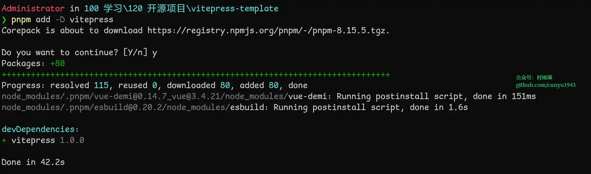
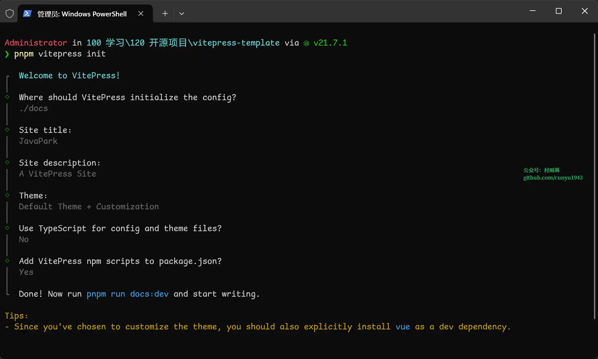
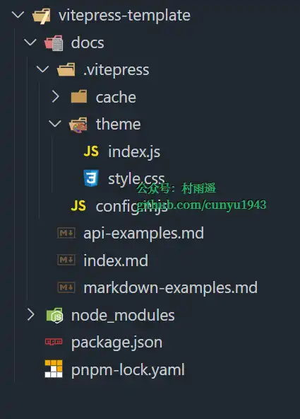

# vitpress

> 作者：[村雨遥](https://github.com/cunyu1943)
> 
> 不要哀求，学会争取，若是如此，终有所获
> 
>


## 安装

```sh
corepack enable pnpm
```


```sh
pnpm add -D vitepress
```



```sh
pnpm vitepress init
```





```sh
pnpm run docs:dev
```


