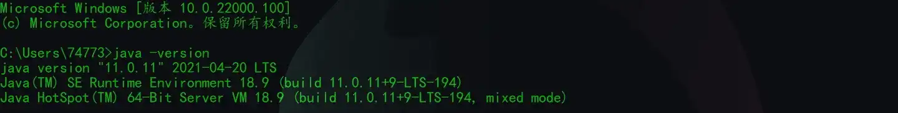
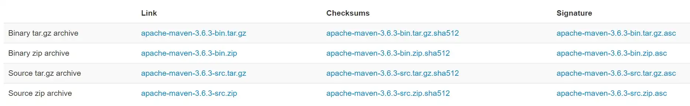
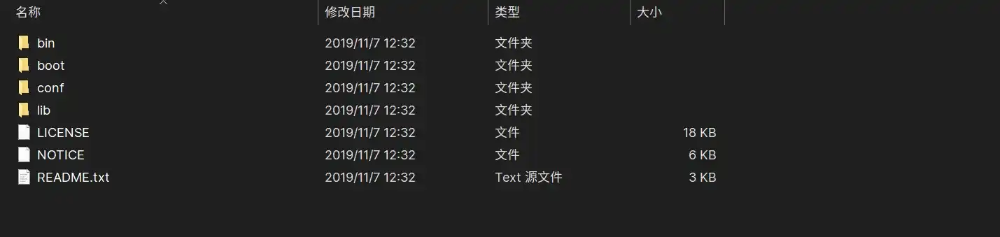
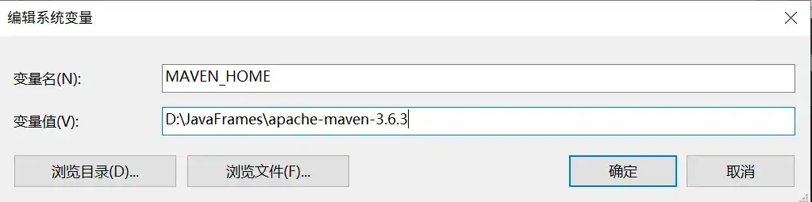
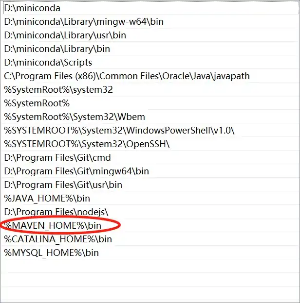
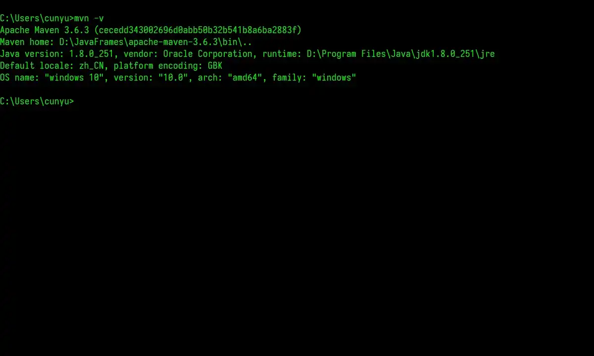
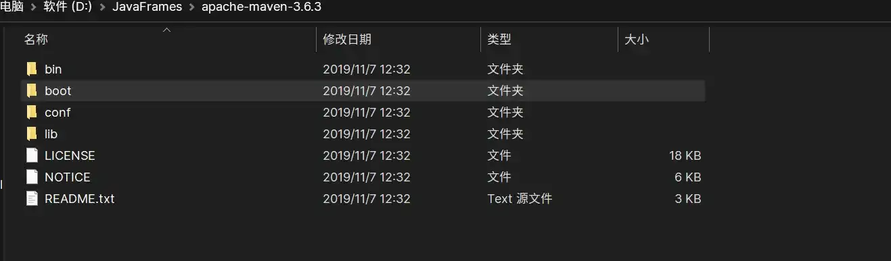
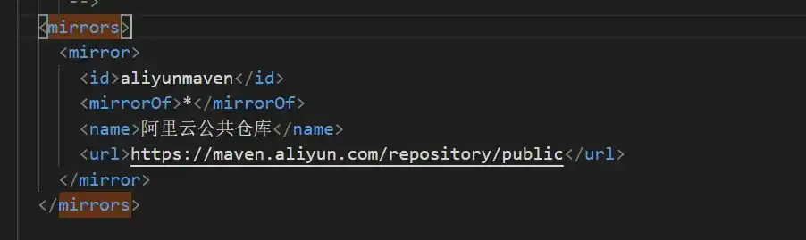
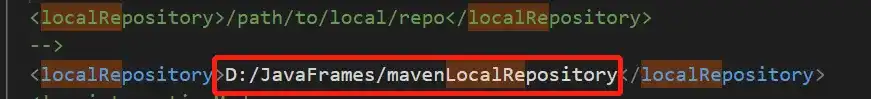

# 简介

## 前言

在我们之前的开发过程中，往往会遇到以下问题：

-   一个项目就是一个工程，当项目过大时，难以管理；
-   项目中的 jar 包（也就是我们的依赖文件），需要我们手动进行移动到 Web 项目的 `WEB-INF/lib` 目录中；
-   jar 一般是通过下载或其他人打包后获取；
-   各个 jar 包之间繁琐的依赖关系需要我们自行解决；

针对以上的问题，我们提出采用项目管理工具来对我们的项目进行管理，而这就是我们今天所要讲的 Maven。

通过使用 Maven，我们就能将一个大型的项目拆分为多个工程。此外，通过 Maven，我们可以很方便的对各个 jar 包进行统一管理，而且它也能解决各个包之间的依赖关系。

## 什么是 Maven

Maven 是一个项目管理工具，包含了一个项目对象模型（`Project Object Model`），反映在配置中就是 `pom.xml` 文件。其中包含了一个项目的生命周期、一个依赖管理系统，以及定义在项目生命周期阶段的插件（`plugin`）和目标（`goal`）。

其中 Maven 最核心的两大概念包括 **依赖管理** 和 **项目构建**。

-   **依赖管理**：提供对 `jar` 的统一管理。（Maven 提供了一个中央仓库，当我们在项目中添加完依赖后，Maven 就会自动去中央仓库中下载相关依赖）。
-   **项目构建**：Maven 提供对项目的编译、测试、打包、部署、上传到私服等。

## Maven 安装

Maven 属于 Java 项目，因此使用 Maven 必须依赖于 JDK。

首先我们要确保我们的电脑上已经安装了 JDK，可以使用如下命令来进行确认。

```bash
java -version
```

如果出现如下的提示，则说明我们的 JDK 安装成功了（当然，你可能和我安装的不是一个版本，但只要出现下面类似的提示，就代表你也成功了）。



安装好 JDK 之后，然后接下来在安装 Maven，安装过程如下：

1.  下载 Maven，下载地址：https://maven.apache.org/download.cgi。如下图，我们在 Windows 中一般选择第二项进行下载，而在 macOS 或者 Linux 系统中，则选择第一项进行下载。



2.  将下载后的压缩包进行解压



3.  配置环境变量

这里需要配置环境变量，一个是新建一个系统变量用于指向 Maven 解压缩后的路径，另一个则是修改 Path 变量环境，新加上一条指向 Maven 的 bin 目录的路径。

-   MAVEN_HOME：即刚才解压缩后 Maven 的存放路径



-   Path：`%MAVEN_HOME%\bin`



4.  校验安装是否成功

当我们配置环境变量之后，此时就可以打开一个新的 cmd 窗口，然后利用如下校验命令来测试我们的 Maven 是否安装成功，安装成功则会出现如下提示。

```bash
mvn -v
```



## Maven 目录结构

安装好 Maven 之后，其目录和内容如下，各目录内容如下：



-   **bin**

包含 mvn 运行的脚步，用于配置 Java 命令，准备好 classpath 和相关的 Java 系统属性，然后执行 Java 命令。

-   **boot**

只包含一个文件，是一个类加载器框架，相对于默认的 Java 类加载器，提供了更丰富的语法以方便配置。

-   **conf**

包含 `settings.xml` ，通过修改该文件，能在机器中全局定制 Maven 的行为。

-   **lib**

包含所有 Maven 运行时所需的 Java 类库，Maven 本身是分模块开发，所以里边有不同模块之类的类库。此外还包含了一些 Maven 用到的第三方依赖。

## Maven 配置

### 仓库镜像配置

通常安装好 Maven 之后就可以使用了，但是由于 Maven 的中央仓库服务器位于国外，国内使用网速较慢，所以我们最好将中央仓库换为国内的阿里云镜像。

打开 `apache-maven-xxx/conf/` 目录下的 `settings.xml` 文件，然后在 `mirrors` 节点下加入如下配置：

```xml
<mirror>
    <id>aliyunmaven</id>
    <mirrorOf>*</mirrorOf>
    <name>阿里云公共仓库</name>
    <url>https://maven.aliyun.com/repository/public</url>
</mirror>
```



### 本地仓库配置

安装好 Maven 后，本地仓库默认在 `当前用户名/.m2/repository` 下，但是这个位置比较隐蔽，所以建议自定义为其他路径：

还是打开 `apache-maven-xxx/conf/` 目录下的 `settings.xml` 文件，然后将如下路径修改为自己要设置的本地仓库，比如我的本地仓库路径如下图：

```xml
<localRepository>/path/to/local/repo</localRepository>
```



## 总结

好了，以上就是关于我们日常项目开发中经常使用的 Maven 的相关知识点了。文章介绍了 Maven 是干什么的，以及我们应该如何安装 Maven 和安装后常见的一些设置，最后则是对 Maven 的目录结构进行详解。而在下一篇博客中，我将讲述 Maven 中最常见的命令，看看大家都是用什么命令来进行工作的吧！
