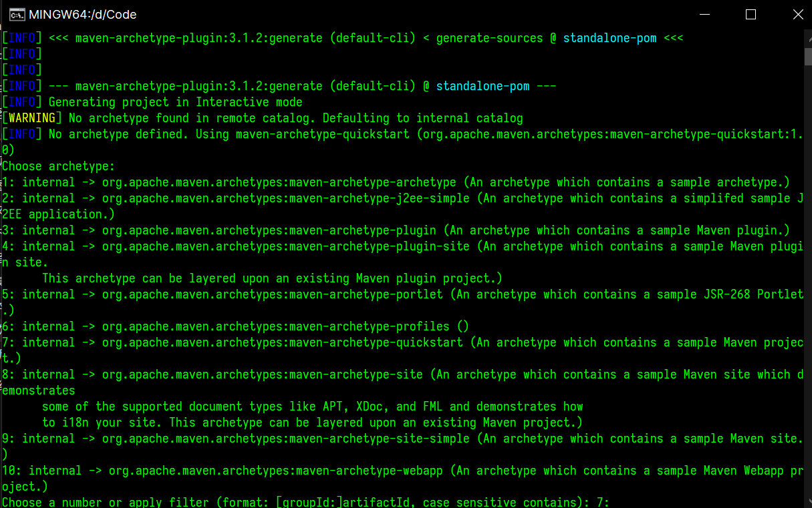
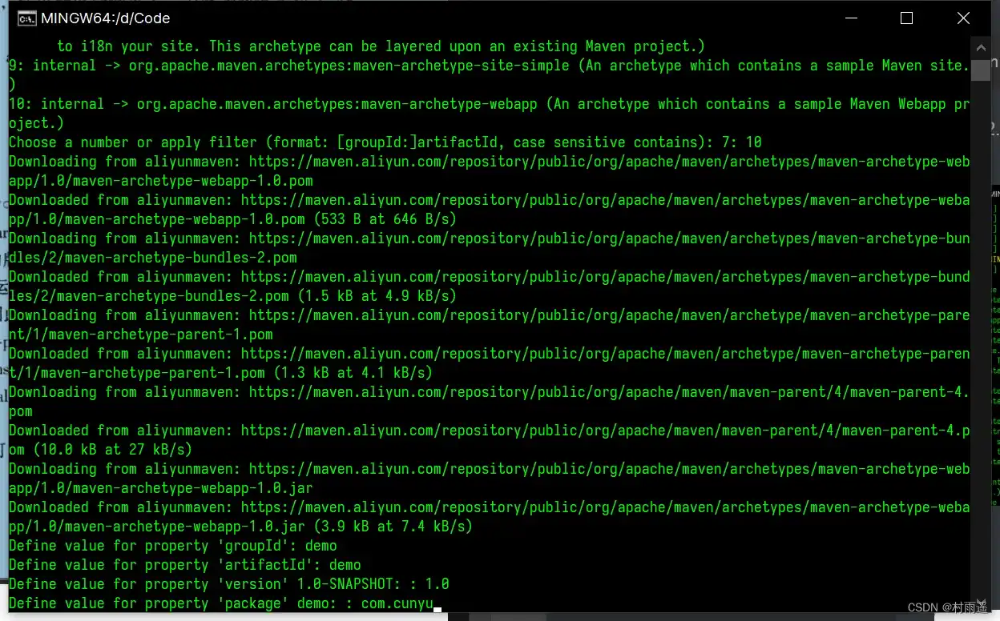
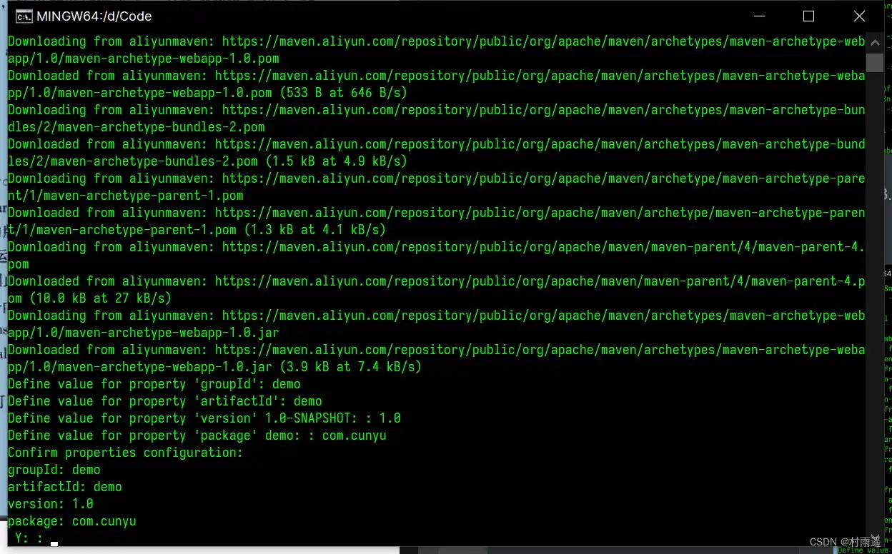
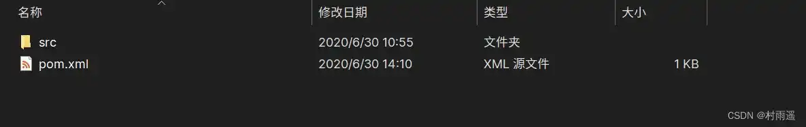
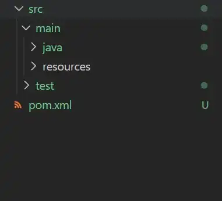
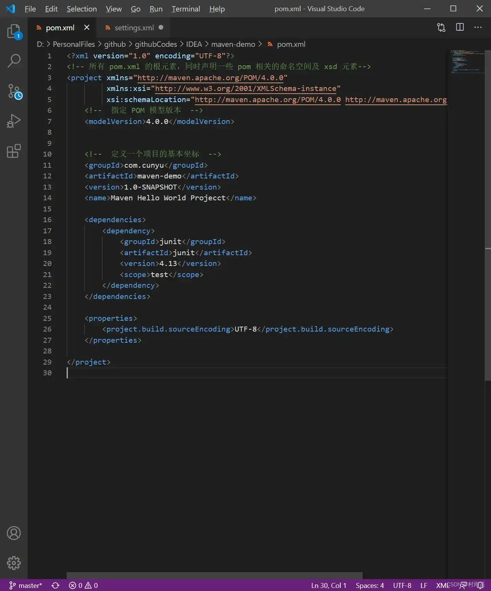

# 常用命令

## 前言

上一篇文章中我们已经介绍了什么是 Maven，以及如何进行 Maven 的安装，最后还对 Maven 安装后的简单配置进行了讲解。今天我们就主要来看看 Maven 中的核心概念以及 Maven 在日常使用中常用的命令。

## Maven 核心

## 构建

所谓构建，就是指项目的构建，它是面向过程的，是一系列步骤的总和，主要包括项目代码的编译、运行、测试、打包以及部署等等。而 Maven 所支持的构建主要有如下几种：

1.   **清理**：删除之前编译产生的文件，为新的代码编译做好准备；
2.   **编译**：将源代码编译为执行代码，支持批量编译；
3.   **测试**：通过执行测试代码，验证功能是否正常，而且它也是支持批量测试的；
4.   **报告**：通过执行测试，生成测试结果的文件；
5.   **打包**：讲项目中的 `class` 文件、配置文件打包到一个压缩文件中。对于一般程序，打包的压缩文件扩展名通常是 `.jar`，而对于 Web 应用，则起压缩文件扩展名通常是 `.war`；
6.   **安装**：把打包好的文件安装到本地仓库；
7.   **部署**：让程序跑起来。

### Maven 核心概念

1.   **pom**：项目对象模型，Maven 将项目当做一个模型，用于控制 Maven 构建项目的过程，通过它来管理 jar 依赖；
2.   **目录结构**：Maven 的目录和文件位置都是约定俗成的；
3.   **坐标**：用于表示资源的唯一标识；
4.   **依赖管理**：使用 jar 文件来管理项目；
5.   **仓库管理**：资源存放的路径；
6.   **生命周期**：Maven 工具构建项目的过程；
7.   **插件和目标**：执行 Maven 构建是的工具就是插件
8.   **继承**
9.   **聚合**

## 常用命令

Maven 中的一些常见命令如下：

| 命令          | 含义 | 功能                                           |
| ------------- | ---- | ---------------------------------------------- |
| `mvn clean`   | 清理 | 用于清理已编译好的文件                         |
| `mvn compile` | 编译 | 将 Java 源代码编译成字节码 `.class` 文件       |
| `mvn test`    | 测试 | 项目测试                                       |
| `mvn package` | 打包 | 根据用户配置，将项目打包为 `jar` 包或 `war` 包 |
| `mvn install` | 安装 | 手动向本地仓库安装一个 `jar`                   |
| `mvn deploy`  | 上传 | 将 `jar` 上传到私服                            |

## 利用 Archetype 来生成项目骨架

实际上，为了更快捷的创建 Maven 项目骨架，我们可以使用 maven archetype 来创建，创建过程如下：

1.  首先进入你要创建项目骨架的目录，然后执行如下命令：

```shell
mvn archetype:generate
```

2.  然后会有很长的输出，有多种可用的 Archetype 供你选择，选择你所需要的，然后输入对应编号即可；



3.  接着会让你输入 `groupId`、`artifactId`、`version`、`package` 等信息；




4.  再接着让你确认相关信息；




5.  最后确认无误后，回车生成即可。

## 项目结构

项目生成后的目录中主要包含如下文件：




其中 `src` 目录包含了项目的主代码和资源，同时还包括了测试相关的代码以及资源。而 `pom.xml` 则定义了项目的所有配置。

假设我们有一个 `HelloWorld` 的项目，我们利用 Maven 来进行管理时，其项目结构大致应该是如下：

```
HelloWorld/
    | ----src/ |
    | -------- || main/ |
	| ----- ||     |  | java/ |
| --- ||     | resources/ |
| --- | ---------- || test/ |
| ----- ||     | java/ |
| --- ||  |resources/
    |----pom.xml
```

其中 `HelloWorld` 是根目录，也就是我们的工程名，而 `src` 目录下主要是存放源代码，其下有主要分为 `java` 和 `resources`，`java` 目录主要用于存放程序包以及程序包中的 Java 文件，`resources` 目录则是存放程序中所要使用的配置文件。

`test` 目录结构同 `src`，只不过顾名思义，这里主要是存放用于测试的代码和配置文件，而且这不是一个必选项，我们可以根据自己的需要进行选择。

最后则是 `pom.xml`，这个每个 Maven 所管理项目的核心文件，这是必须的，后续的依赖管理等工作都基于此文件来操作。






## 总结

好了，以上就是 Maven 中的一些常用命令和如何利用 Archetype 来生成项目骨架，以及利用 Maven 所生成的项目的总体结构了。如果你觉得对你有所帮助，还请点赞关注一波哦。今天就到此为止了，下一期我们继续来看如何利用 Maven 进行依赖管理，敬请期待吧！
