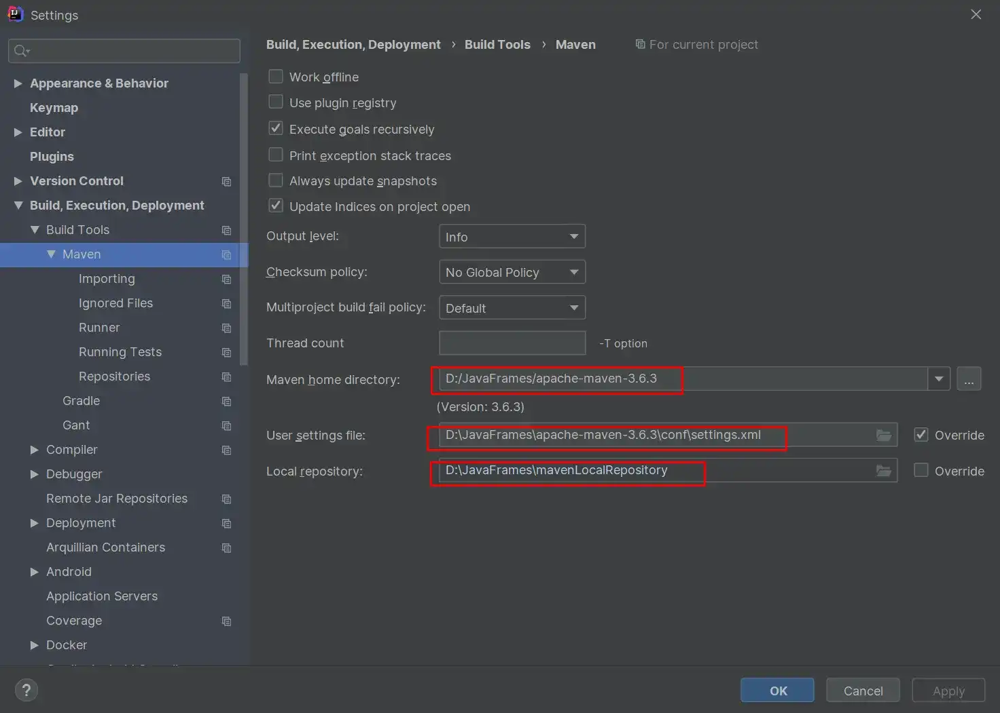
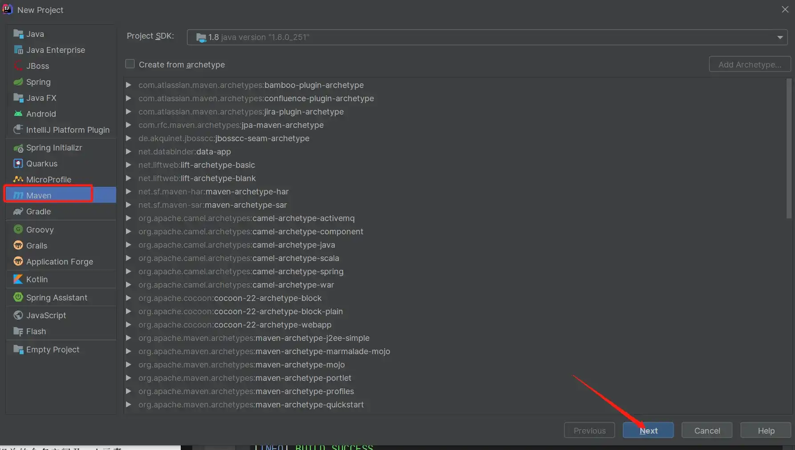
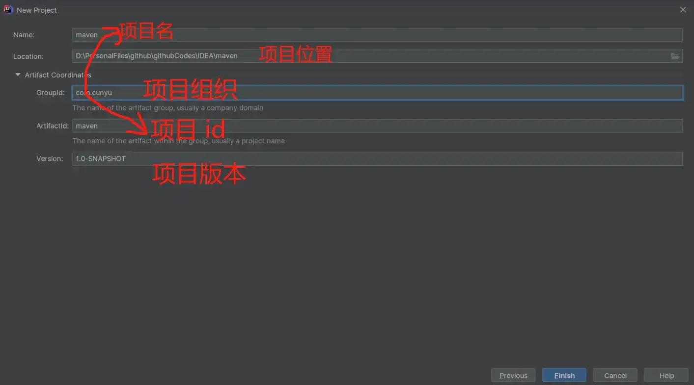
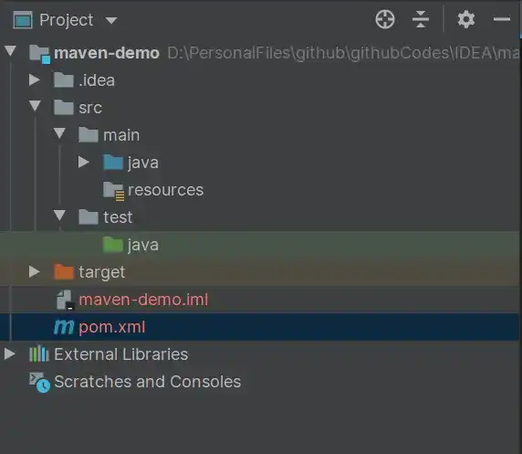

# IDEA 创建 Maven 项目

## 前言

之前我们已经学习过 Maven 是什么，我们可以用它来干什么。接着我们又介绍了如何安装和配置 Maven，再接着，我们又了解了 Maven 中常用的一些命令以及如何利用 Archetype 来生成项目骨架，并对利用 Maven 所生成项目的结构进行了描述。最后则是 Maven 中的一些核心概念和如何进行依赖管理，并说明当依赖产生冲突时，应该如何解决。但以上始终还是停留在概念的阶段，并未进入我们实际的开发中。那么今天的内容就主要来看看，我们如何利用 IDEA 搭配 Maven 来开发一个简单的 Demo。

## IDEA 中的 Maven 配置

依次进入 `File -> Settings -> Build,Execution,Deployment -> Build Tools -> Maven`，IDEA 默认使用它自带的 Maven，我们可以自定义为自己的 Maven，更加方便管理。

这里主要配置的项目有：

-   **Maven home directory**：也就是我们 Maven 安装的路径；
-   **User settings file**：Maven 安装路径下配置文件夹中的 `settings.xml` 所在路径；
-   **Local repository**：也就是我们前边文章中所配置的本地仓库位置。

比如我 IDEA 中的 Maven 相关设置就可以参照下图。



## 使用 IDEA 创建 Maven 项目

接下来我们就来看看如何使用 IDEA 创建 Maven 项目，具体可以分为如下步骤：

1.  首先一次进入 `File -> New -> Project`，然后选择 Maven，表示新建一个 Maven 项目；



2.  填写相关信息，也就是我们之前所介绍的 Maven 的坐标。这里我们只要提供 GroupId、ArtifactId 以及 Version 这三项就足够了。关于其他的配置，我们可以到后续的 `pom.xml` 中去进行配置；



3.  新建项目完成，完成后的项目目录结构如下，基本上也就是之前介绍过的项目结构；

```
ProjectName/
    | ----src/ |
    | -------- || main/ |
	| ----- ||     |  | java/ |
	| --- ||     | resources/ |
	| --- | ---------- || test/ |
	| ----- ||     | java/ |
	| --- ||  |resources/
    |----pom.xml
```




4.  默认生成的 `pom.xml` 如下。

```xml
<!-- 指定 xml 的版本和编码 -->
<?xml version="1.0" encoding="UTF-8"?>
<!-- 所有 pom.xml 的根元素，同时声明一些 pom 相关的命名空间及 xsd 元素-->
<project xmlns="http://maven.apache.org/POM/4.0.0"
         xmlns:xsi="http://www.w3.org/2001/XMLSchema-instance"
         xsi:schemaLocation="http://maven.apache.org/POM/4.0.0 http://maven.apache.org/xsd/maven-4.0.0.xsd">
    <!--  指定 POM 模型版本  -->
    <modelVersion>4.0.0</modelVersion>

    <!--  定义一个项目的基本坐标  -->
    <groupId>com.cunyu</groupId>
    <artifactId>maven-demo</artifactId>
    <version>1.0-SNAPSHOT</version>

</project>

```

5.  到上一步之后，一个新的 Maven 项目就完成了，接下来就是去编写业务代码了。

## 业务代码编写

上面已经学会了如何创建一个 Maven 项目，接下来就是编写业务代码了，我们以最经典的 `HelloWorld` 为例。

### 项目主代码

项目主代码会打包到最终构件中，默认位于 `src/main/java` 目录下，我们创建一个 `HelloWorld` 的主类；

```java
package com.cunyu.helloworld;

/**
 * @author : cunyu
 * @version : 1.0
 * @className : HelloWorld
 * @date : 2020/6/30 11:06
 * @description : HelloWorld 实例
 */

public class HelloWorld {
    public String sayHello() {
        return "Hello World";
    }

    public static void main(String[] args) {
        System.out.println(new HelloWorld().sayHello());
    }
}
```

### 项目测试代码

要对主代码进行测试，那么则需要编写测试代码，测试代码默认位于 `src/test/java` 目录，要对指定主代码进行测试，编写测试代码时要和主代码保持相同的目录结构。如上述主代码位于 `com.cunyu.helloworld` 包下，那么测试代码也应该位于 `com.cunyu.helloworld` 包下，只是根目录不同。而要进行测试，通常首选 JUnit 单元测试。所以编写测试代码对主代码进行测试主要有如下步骤。

1.  首先在 `pom.xml` 添加 JUnit 依赖；

```xml
<dependencies>
    <dependency>
        <groupId>junit</groupId>
        <artifactId>junit</artifactId>
        <version>RELEASE</version>
        <scope>test</scope>
    </dependency>
</dependencies>
```

2.  接着编写测试代码；

```java
package com.cunyu.helloworld;

import org.junit.Test;

import static org.junit.Assert.assertEquals;

/**
 * @author : cunyu
 * @version : 1.0
 * @className : HelloWorldTest
 * @date : 2020/6/30 13:32
 * @description : HelloWorld 测试
 */

public class HelloWorldTest {
    @Test
    public void testSayHello() {
        HelloWorld helloWorld = new HelloWorld();
        String result = helloWorld.sayHello();

        // Assert.assertEquals() 及其重载方法功能:
        // 1. 如果两者一致, 程序继续往下运行.
        // 2. 如果两者不一致, 则中断测试方法,同时抛出异常信息 AssertionFailedError.
        assertEquals("Hello World", result);
        System.out.println("测试通过");
    }
}
```

## 总结

经过上边的项目创建以及业务代码编写之后，一个 Maven 版的 `Hello World` 项目到此就结束了。是不是很简单呢，赶快自己动手试试吧！

创作不易，如果大家觉得我的文章对你所有帮助，那就动动你的小手，帮我点赞关注一波吧。💖💖💖