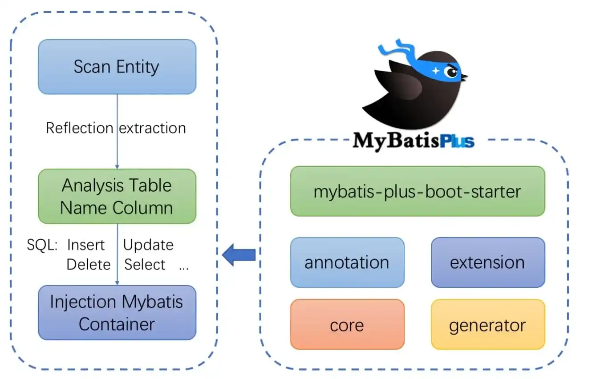
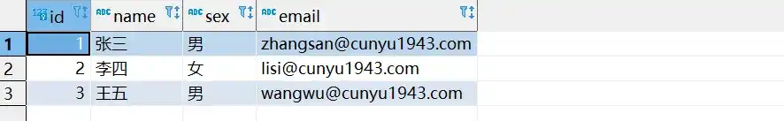
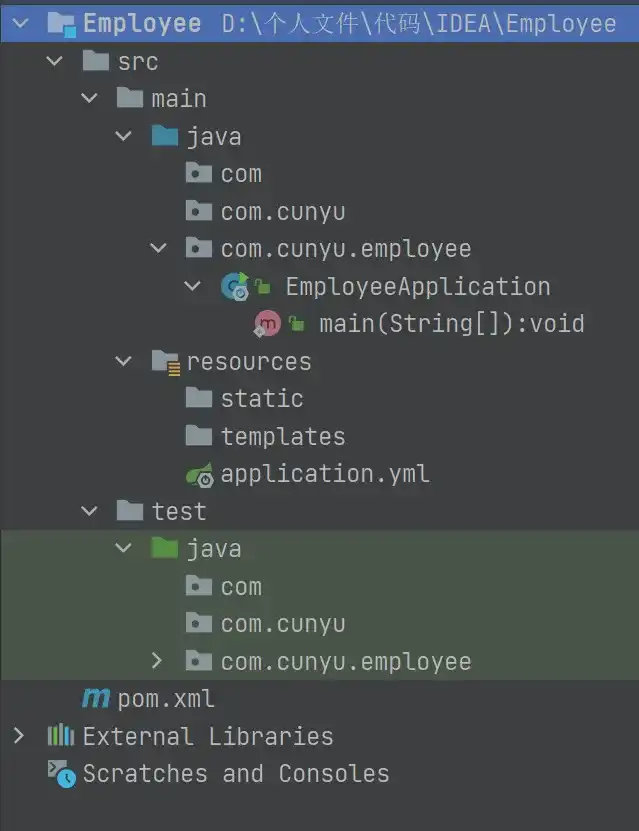
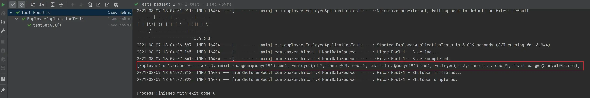

# 简介及入门实例

## 🎈 号外

最近，公众号之外，建立了微信交流群，不定期会在群里分享各种资源（影视、IT 编程、考试提升……）&知识。如果有需要，可以**扫码或者后台添加小编微信备注入群**。进群后**优先看群公告**，**呼叫群中【资源分享小助手】**，还能免费帮找资源哦～

<center>
 
</center>

## 前言


最开始，要在 Java 中使用数据库时，需要使用 JDBC，创建 `Connection`、`ResultSet` 等，然后我们又对 JDBC 的操作进行了封装，创建了许多类似于 `DBUtil` 等工具类。再慢慢的，出现了一系列持久层的框架：Hibernate、JPA，Mybatis 等。各个框架的特点如下：


-   **Hibernate**：一个全自动的 ORM 框架，实现了数据库中表和 Java 对象的映射，通过调用 Java 对象的方法，我们就可以实现数据库表中数据的操作。而且通过该框架，我们能够不用修改代码就访问到不同的数据库。
-   **JPA**：这是一种规范，定义了访问数据库的各种操作，定义了一致的方法来操作数据库。

-   **Mybatis**：需要编写 XML 配置文件，我们需要在 XML 编写 SQL 语句来访问数据库，而且一切操作都需要通过 XML 来完成。而针对单表的 CRUD，也需要使用 XML 文件才能够完成。这样一来对我们开发人员的要求就提高了，我们需要特别熟悉 SQL 语言才能够完成。


其实利用 Mybatis 来进行持久层的开发已经大大减少了工作人员的工作量了，但它的使用还是需要一定的门槛的。Mybatis-Plus 的出现，进一步降低了这道槛。那我们今天就来看看，Mybatis-Plus 到底是如何进一步实现 Mybatis 的增强的。


## Mybatis-Plus 简介


### 什么是 MyBatis-Plus


Mybatis-Plus：为简化开发而生


MyBatis-Plus（简称 MP）是一个基于 MyBatis 的增强工具，它对 Mybatis 的基础功能进行了增强，但未做任何改变。使得我们可以可以在 Mybatis 开发的项目上直接进行升级为 Mybatis-plus，正如它对自己的定位，它能够帮助我们进一步简化开发过程，提高开发效率。


Mybatis-Plus 其实可以看作是对 Mybatis 的再一次封装，升级之后，对于单表的 CRUD 操作，调用 Mybatis-Plus 所提供的 API 就能够轻松实现，此外还提供了各种查询方式、分页等行为。最最重要的，开发人员还不用去编写 XML，这就大大降低了开发难度


其官方主页为：https://mp.baomidou.com。


### Mybatis-Plus 的特点


1.  **无侵入，损耗小**
2.  **强大的 CURD 操作**

1.  **支持 Lambda 形式调用**
2.  **支持主键自动生成**

1.  **支持自定义全局通用模式**
2.  **支持 ActiveRecord 模式**

1.  **内置代码生成器、分页插件、性能分析器和全局拦截插件**
2.  ……


### Mybatis-Plus 结构





## 快速入门示例


### 数据库准备


我们依旧沿用官方文档中提供的实例来进行，那么我们首先来创建一个数据库并进入：


```sql
drop database if exists mydb;
create database mydb;
use mydb;
```


然后创建一个员工表，主要有 `id`、`name`、`sex`、`email` 四大属性。


```sql
create table employee(
	id int primary key not null,
	name varchar(100) null,
	sex varchar(10) null,
	email varchar(255) null
)
```


然后插入部分数据：


```sql
DELETE FROM employee;

INSERT INTO employee (id, name, sex, email) VALUES
(1, '张三', '男', 'zhangsan@cunyu1943.com'),
(2, '李四', '女', 'lisi@cunyu1943.com'),
(3, '王五', '男', 'wangwu@cunyu1943.com');
```





### SpringBoot 项目


这里我利用的是 IDEA 创建的一个 SpringBoot 项目，创建后，主要需要注意的有以下几点。


1.  **添加依赖**


除开创建 SpringBoot 项目所需的必要依赖之外，我们还需要引入 MP 和 MySQL 的依赖。


```xml
<dependencies>
    <dependency>
        <groupId>com.baomidou</groupId>
        <artifactId>mybatis-plus-boot-starter</artifactId>
    </dependency>

    <dependency>
        <groupId>mysql</groupId>
        <artifactId>mysql-connector-java</artifactId>
        <scope>runtime</scope>
    </dependency>
</dependencies>
```


1.  **数据库配置**


依赖添加完成之后，到配置文件 `application.yml` 中去添加数据库的相关配置（**注意**：官方创建的配置文件是 `application.properties`，我们需要手动把它的后缀名改成 `.yml`）。


```yml
spring:
  datasource:
    driver-class-name: com.mysql.cj.jdbc.Driver
    url: jdbc:mysql://localhost:3306/mydb
    password: 12345
    username: root
  application:
    name: employee
```


1.  **项目整体结构**


项目创建完成后，我们最终的项目目录结构如下图所示：





### 编码


完成数据库准备工作和建立 SpringBoot 项目之后，接下来的工作就是编码了。


1.  **实体类编写**


实体类也就对应我们刚才所建立的数据表 `employee`。因为这里使用了 Lombok 插件，所以可以看到在类上多了一个 `@Data` 的注解，但是少了 `getter、setter` 方法，实现了代码的简洁化，大家如果还不知道这个插件，可以去了解下，后续我可能也会写一篇关于这个插件的文章，可以关注一下。


```java
package com.cunyu.employee.entity;

import com.baomidou.mybatisplus.annotation.IdType;
import com.baomidou.mybatisplus.annotation.TableId;
import com.baomidou.mybatisplus.annotation.TableName;
import lombok.Data;

/**
 * Created with IntelliJ IDEA.
 *
 * @author : cunyu
 * @version : 1.0
 * @project : Employee
 * @package : com.cunyu.employee.entity
 * @className : Employee
 * @createTime : 2021/8/7 17:33
 * @description : 员工实体类
 */

@Data
@TableName("employee")
public class Employee {
    /**
     * 员工 id
     */
    @TableId("id")
    private Long id;
    /**
     * 员工姓名
     */
    private String name;
    /**
     * 员工性别
     */
    private String sex;
    /**
     * 员工邮件
     */
    private String email;
}
```


1.  **Mapper 接口编写**


这里 `EmployeeMapper` 继承自 MP 中 `BaseMapper`，它里边已经提供了许多方法，可以供我们使用。


```java
package com.cunyu.employee.mapper;

import com.baomidou.mybatisplus.core.mapper.BaseMapper;
import com.cunyu.employee.entity.Employee;

/**
 * Created with IntelliJ IDEA.
 *
 * @author : cunyu
 * @version : 1.0
 * @project : Employee
 * @package : com.cunyu.employee.mapper
 * @className : EmployeeMapper
 * @createTime : 2021/8/7 17:45
 * @description : 员工 Mapper 类
 */
public interface EmployeeMapper extends BaseMapper<Employee> {
}
```


以下是 `BaseMapper` 中所提供的一些方法，通过继承该接口，我们就可以不用编写 `mapper.xml` 也可以获得 CRUD 功能了。


```java
package com.baomidou.mybatisplus.core.mapper;

import com.baomidou.mybatisplus.core.conditions.Wrapper;
import com.baomidou.mybatisplus.core.metadata.IPage;
import com.baomidou.mybatisplus.core.toolkit.Constants;
import org.apache.ibatis.annotations.Param;

import java.io.Serializable;
import java.util.Collection;
import java.util.List;
import java.util.Map;

/**
 * Mapper 继承该接口后，无需编写 mapper.xml 文件，即可获得CRUD功能
 * <p>这个 Mapper 支持 id 泛型</p>
 *
 * @author hubin
 * @since 2016-01-23
 */
public interface BaseMapper<T> extends Mapper<T> {

    /**
     * 插入一条记录
     *
     * @param entity 实体对象
     */
    int insert(T entity);

    /**
     * 根据 ID 删除
     *
     * @param id 主键ID
     */
    int deleteById(Serializable id);

    /**
     * 根据 columnMap 条件，删除记录
     *
     * @param columnMap 表字段 map 对象
     */
    int deleteByMap(@Param(Constants.COLUMN_MAP) Map<String, Object> columnMap);

    /**
     * 根据 entity 条件，删除记录
     *
     * @param queryWrapper 实体对象封装操作类（可以为 null,里面的 entity 用于生成 where 语句）
     */
    int delete(@Param(Constants.WRAPPER) Wrapper<T> queryWrapper);

    /**
     * 删除（根据ID 批量删除）
     *
     * @param idList 主键ID列表(不能为 null 以及 empty)
     */
    int deleteBatchIds(@Param(Constants.COLLECTION) Collection<? extends Serializable> idList);

    /**
     * 根据 ID 修改
     *
     * @param entity 实体对象
     */
    int updateById(@Param(Constants.ENTITY) T entity);

    /**
     * 根据 whereEntity 条件，更新记录
     *
     * @param entity        实体对象 (set 条件值,可以为 null)
     * @param updateWrapper 实体对象封装操作类（可以为 null,里面的 entity 用于生成 where 语句）
     */
    int update(@Param(Constants.ENTITY) T entity, @Param(Constants.WRAPPER) Wrapper<T> updateWrapper);

    /**
     * 根据 ID 查询
     *
     * @param id 主键ID
     */
    T selectById(Serializable id);

    /**
     * 查询（根据ID 批量查询）
     *
     * @param idList 主键ID列表(不能为 null 以及 empty)
     */
    List<T> selectBatchIds(@Param(Constants.COLLECTION) Collection<? extends Serializable> idList);

    /**
     * 查询（根据 columnMap 条件）
     *
     * @param columnMap 表字段 map 对象
     */
    List<T> selectByMap(@Param(Constants.COLUMN_MAP) Map<String, Object> columnMap);

    /**
     * 根据 entity 条件，查询一条记录
     *
     * @param queryWrapper 实体对象封装操作类（可以为 null）
     */
    T selectOne(@Param(Constants.WRAPPER) Wrapper<T> queryWrapper);

    /**
     * 根据 Wrapper 条件，查询总记录数
     *
     * @param queryWrapper 实体对象封装操作类（可以为 null）
     */
    Integer selectCount(@Param(Constants.WRAPPER) Wrapper<T> queryWrapper);

    /**
     * 根据 entity 条件，查询全部记录
     *
     * @param queryWrapper 实体对象封装操作类（可以为 null）
     */
    List<T> selectList(@Param(Constants.WRAPPER) Wrapper<T> queryWrapper);

    /**
     * 根据 Wrapper 条件，查询全部记录
     *
     * @param queryWrapper 实体对象封装操作类（可以为 null）
     */
    List<Map<String, Object>> selectMaps(@Param(Constants.WRAPPER) Wrapper<T> queryWrapper);

    /**
     * 根据 Wrapper 条件，查询全部记录
     * <p>注意： 只返回第一个字段的值</p>
     *
     * @param queryWrapper 实体对象封装操作类（可以为 null）
     */
    List<Object> selectObjs(@Param(Constants.WRAPPER) Wrapper<T> queryWrapper);

    /**
     * 根据 entity 条件，查询全部记录（并翻页）
     *
     * @param page         分页查询条件（可以为 RowBounds.DEFAULT）
     * @param queryWrapper 实体对象封装操作类（可以为 null）
     */
    <P extends IPage<T>> P selectPage(P page, @Param(Constants.WRAPPER) Wrapper<T> queryWrapper);

    /**
     * 根据 Wrapper 条件，查询全部记录（并翻页）
     *
     * @param page         分页查询条件
     * @param queryWrapper 实体对象封装操作类
     */
    <P extends IPage<Map<String, Object>>> P selectMapsPage(P page, @Param(Constants.WRAPPER) Wrapper<T> queryWrapper);
}
```


1.  **添加包扫描**


Mapper 建立完成之后，我们需要去启动类种添加包扫描的注解 `@MapperScan()`。


```java
package com.cunyu.employee;

import org.mybatis.spring.annotation.MapperScan;
import org.springframework.boot.SpringApplication;
import org.springframework.boot.autoconfigure.SpringBootApplication;

@SpringBootApplication
@MapperScan("com.cunyu.employee.mapper")
public class EmployeeApplication {

    public static void main(String[] args) {
        SpringApplication.run(EmployeeApplication.class, args);
    }

}
```


1.  **测试**


好了，完成上面的步骤之后，我们就可以去测试接口了。去测试的主程序 `EmployeeApplicationTests` 中，添加如下代码进行接口测试。


```java
package com.cunyu.employee;

import com.cunyu.employee.entity.Employee;
import com.cunyu.employee.mapper.EmployeeMapper;
import org.junit.Assert;
import org.junit.jupiter.api.Test;
import org.springframework.beans.factory.annotation.Autowired;
import org.springframework.boot.test.context.SpringBootTest;

import java.util.List;

@SpringBootTest
class EmployeeApplicationTests {

    @Test
    void contextLoads() {
    }

    @Autowired
    private EmployeeMapper employeeMapper;

    @Test
    void testGetAll() {
        List<Employee> employees = employeeMapper.selectList(null);
        Assert.assertEquals(3, employees.size());
        System.out.println(employees);
    }
}
```





可以看到执行我们测试代码后测试成功了，说明接口是没问题的。


这里需要注意的是 `Assert.assertEquals(3, employees.size());` 这句代码，这里我们引入了 `Junit` 测试模块，所以需要记得在 `pom.xml` 中添加相关依赖，更多关于 `Junit` 测试相关的信息，可以参考我之前写的一篇文章：[抛弃传统注释测试，拥抱 Junit 单元测试](https://cunyu1943.github.io/JavaPark/java/java-se/test-with-junit)。


```xml
<dependency>
    <groupId>junit</groupId>
    <artifactId>junit</artifactId>
    <scope>test</scope>
</dependency>
```


## 总结


今天的文章到此就结束了，主要介绍了 Mybatis-Plus 的一些相关简介，然后就是利用 Mybatis-Plus 来进行我们的一个实例操作了。


最后，创作不易，如果本文对你有所帮助，还请各位小伙伴可以 **一键三连**。感谢大家的支持，我们下期文章再见！