# 日志配置及常用 CRUD

## 前言

上一篇文章中我们讲了 Mybatis-Plus 的定义以及相关特点，并从零开始编写了一个 SpringBoot + Mybatis-Plus 的实例。今天我们就来看看，如何利用 MP 来实现对数据库的增删改查。

## 日志配置

使用 MP 时，默认是不打印任何 SQL 语句的。而为了方便日常开发工作的调试，我们需要联合控制台和各种数据可视化工具进行语句的拼接检查，因此我们利用 MP 自带的日志功能，在控制台输出我们的 SQL 语句，从而方便我们调试。

在配置文件 `application.yml` （IDEA 默认生成的配置文件为 `application.properties`）中，加入一下配置，这样 MP 就会在控制台中打印完整带参数的 SQL 语句，方便我们查看。

```yml
mybatis-plus:
  configuration:
    log-impl: org.apache.ibatis.logging.stdout.StdOutImpl
```

## Mapper CRUD 使用方法

首先我们来看 `Mapper` 层 CRUD 涉及的一些方法，`Mapper` 层主要继承自 `BaseMapper` 接口，里边实现了各种用于操作数据库的增删改查的方法，以下我们就来看看日常我们常用的一些方法。

```java
package com.cunyu.employee.mapper;

import com.baomidou.mybatisplus.core.mapper.BaseMapper;
import com.cunyu.employee.entity.Employee;

/**
 * Created with IntelliJ IDEA.
 *
 * @author : cunyu
 * @version : 1.0
 * @project : Employee
 * @package : com.cunyu.employee.mapper
 * @className : EmployeeMapper
 * @createTime : 2021/8/7 17:45
 * @description : 员工 Mapper 类
 */
public interface EmployeeMapper extends BaseMapper<Employee> {
}
```


### insert 操作

首先是插入数据，`insert` 方法中，传入我们所要插入数据库的实体对象作为参数即可。

-   **方法声明**

```java
/**
     * 插入一条记录
     *
     * @param entity 实体对象
     */
int insert(T entity);
```

-   **插入实例**

```java
package com.cunyu.employee;

import com.cunyu.employee.entity.Employee;
import com.cunyu.employee.mapper.EmployeeMapper;
import org.junit.Assert;
import org.junit.jupiter.api.Test;
import org.springframework.beans.factory.annotation.Autowired;
import org.springframework.boot.test.context.SpringBootTest;


@SpringBootTest
class EmployeeApplicationTests {

    @Test
    void contextLoads() {
    }

    @Autowired
    private EmployeeMapper employeeMapper;

    @Test
    void testInsert() {
        Employee employee = new Employee();
        employee.setId(4L);
        employee.setName("赵六");
        employee.setSex("男");
        employee.setEmail("zhaoliu@cunyu1943.com");

        Assert.assertEquals(1, employeeMapper.insert(employee));
        System.out.println("插入成功");
    }

}

```

-   **测试结果**

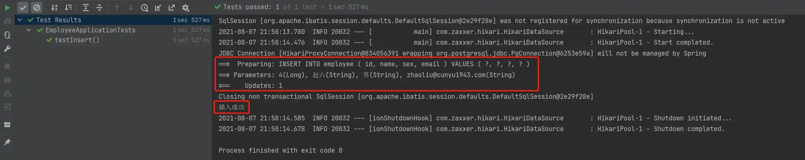

-   **数据插入后的数据库**

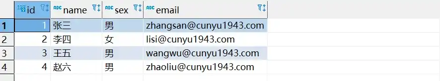

### select 操作

相比于插入数据操作，查询数据的方法就要更多，而且还能实现批量查询和条件查询。

1.   **根据主键查询**

将所要查询数据的主键作为参数传入我们的 `selectById` 方法中，即可实现。

-   **方法声明**

```java
/**
     * 根据 ID 查询
     *
     * @param id 主键ID
     */
T selectById(Serializable id);
```

-   **查询实例**

```java
package com.cunyu.employee;

import com.cunyu.employee.entity.Employee;
import com.cunyu.employee.mapper.EmployeeMapper;
import org.junit.Assert;
import org.junit.jupiter.api.Test;
import org.springframework.beans.factory.annotation.Autowired;
import org.springframework.boot.test.context.SpringBootTest;


@SpringBootTest
class EmployeeApplicationTests {

    @Test
    void contextLoads() {
    }

    @Autowired
    private EmployeeMapper employeeMapper;

    @Test
    void testSelectById() {
        Employee employee = employeeMapper.selectById(3);
        System.out.println(employee);
    }
}

```

-   **测试结果**

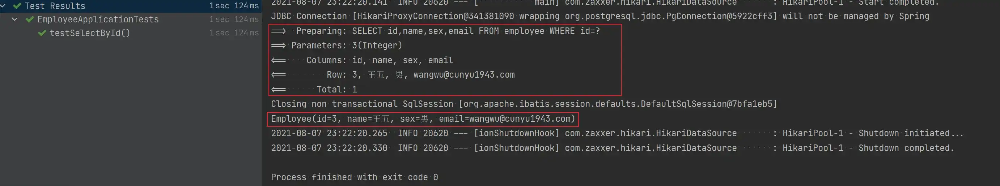

2.   **根据主键批量查询**

上一个方法每次只能查询一条记录，如果我们想要查询多条数据记录，那么就可以将要查询数据的主键列表传入 `selectBatchIds` 方法即可。

-   **方法声明**

```java
/**
     * 查询（根据ID 批量查询）
     *
     * @param idList 主键ID列表(不能为 null 以及 empty)
     */
List<T> selectBatchIds(@Param(Constants.COLLECTION) Collection<? extends Serializable> idList);
```

-   **批量查询实例**

```java
package com.cunyu.employee;

import com.cunyu.employee.entity.Employee;
import com.cunyu.employee.mapper.EmployeeMapper;
import org.junit.Assert;
import org.junit.jupiter.api.Test;
import org.springframework.beans.factory.annotation.Autowired;
import org.springframework.boot.test.context.SpringBootTest;


@SpringBootTest
class EmployeeApplicationTests {

    @Test
    void contextLoads() {
    }

    @Autowired
    private EmployeeMapper employeeMapper;

    @Test
    void testSelectBatchIds() {
        List<Integer> ids = new ArrayList<>();
        ids.add(1);
        ids.add(4);
        List<Employee> employeeList = employeeMapper.selectBatchIds(ids);
        System.out.println(employeeList);
    }
}
```

-   **测试结果**

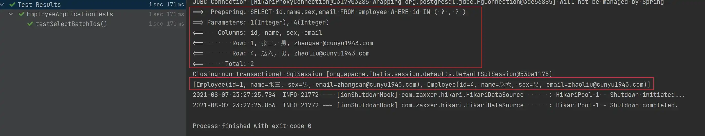

3.   **根据多条件查询**

除开支持主键查询外，MP 还支持条件查询，只要将我们的条件传入 `Map`  列表中，然后将其作为 `selectByMap` 方法的参数即可，其中传入 `Map` 的 `key` 对应我们数据库中的字段，而 `value` 则对应字段的值。

-   **方法声明**

```java
/**
     * 查询（根据 columnMap 条件）
     *
     * @param columnMap 表字段 map 对象
     */
List<T> selectByMap(@Param(Constants.COLUMN_MAP) Map<String, Object> columnMap);
```

-   **条件查询实例**

```java
package com.cunyu.employee;

import com.cunyu.employee.entity.Employee;
import com.cunyu.employee.mapper.EmployeeMapper;
import org.junit.Assert;
import org.junit.jupiter.api.Test;
import org.springframework.beans.factory.annotation.Autowired;
import org.springframework.boot.test.context.SpringBootTest;


@SpringBootTest
class EmployeeApplicationTests {

    @Test
    void contextLoads() {
    }

    @Autowired
    private EmployeeMapper employeeMapper;

    @Test
    void testSelectByMap() {
        Map<String, Object> map = new HashMap<>();
        map.put("sex", "男");
        map.put("name", "张三");
        System.out.println(employeeMapper.selectByMap(map));
    }
}
```

-   **测试结果**


### update 操作

更新操作，主要是根据我们数据库的主键进行查询，将对应主键的实体对象传入 `updateById` 方法即可。

-   **方法声明**

```java
/**
     * 根据 ID 修改
     *
     * @param entity 实体对象
     */
int updateById(@Param(Constants.ENTITY) T entity);
```

-   **更新实例**

```java
package com.cunyu.employee;

import com.cunyu.employee.entity.Employee;
import com.cunyu.employee.mapper.EmployeeMapper;
import org.junit.Assert;
import org.junit.jupiter.api.Test;
import org.springframework.beans.factory.annotation.Autowired;
import org.springframework.boot.test.context.SpringBootTest;

@SpringBootTest
class EmployeeApplicationTests {

    @Autowired
    private EmployeeMapper employeeMapper;

    @Test
    void testUpdate() {
        Employee employee = new Employee();

        employee.setEmail("zhao6@cunyu1943.com");
        employee.setName("赵 6");
        employee.setSex("女");
        employee.setId(4L);

        Assert.assertEquals(1, employeeMapper.updateById(employee));
        System.out.println("更新成功");
    }

}
```

-   **测试结果**

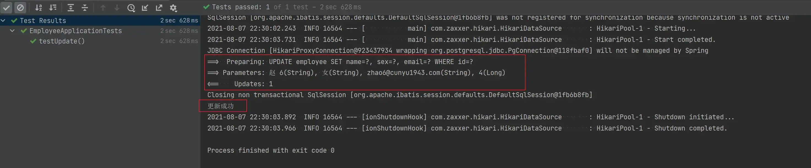

-   **数据更新后的数据库**

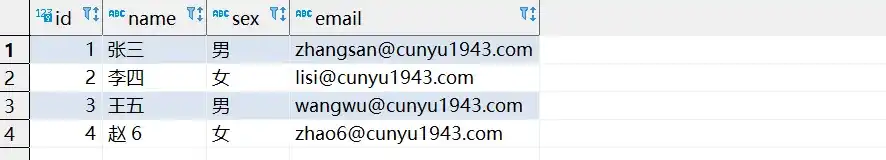

### delete 操作

删除操作，既可以根据主键删除一条记录，也能根据主键列表实现批量删除，还能根据条件来进行删除。

1.   **根据主键删除一条数据**

将所要删除记录的主键作为参数传入 `deleteById` 方法即可。

-   **方法声明**

```java
/**
     * 根据 ID 删除
     *
     * @param id 主键ID
     */
int deleteById(Serializable id);
```

-   **删除实例**

```java
package com.cunyu.employee;

import com.cunyu.employee.entity.Employee;
import com.cunyu.employee.mapper.EmployeeMapper;
import org.junit.Assert;
import org.junit.jupiter.api.Test;
import org.springframework.beans.factory.annotation.Autowired;
import org.springframework.boot.test.context.SpringBootTest;

@SpringBootTest
class EmployeeApplicationTests {

    @Autowired
    private EmployeeMapper employeeMapper;

    @Test
    void testDeleteById() {
        Assert.assertEquals(1, employeeMapper.deleteById(2L));
        System.out.println("删除成功");
    }
}
```

-   **测试结果**

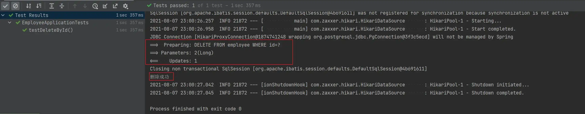

-   **删除数据后的数据库**

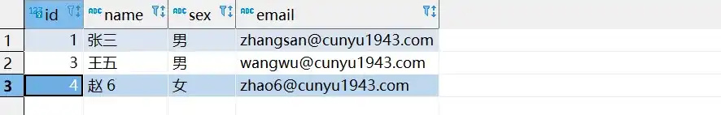

2.   **根据条件删除**

根据条件删除同样是讲条件传入 `Map` 中，然后将 `Map` 作为参数传入 `deleteByMap` 方法，其中 `key` 对应数据库中的字段，`value` 对应字段的值。

-   **方法声明**

```java
/**
     * 根据 columnMap 条件，删除记录
     *
     * @param columnMap 表字段 map 对象
     */
int deleteByMap(@Param(Constants.COLUMN_MAP) Map<String, Object> columnMap);
```

-   **删除实例**

```java
package com.cunyu.employee;

import com.cunyu.employee.entity.Employee;
import com.cunyu.employee.mapper.EmployeeMapper;
import org.junit.Assert;
import org.junit.jupiter.api.Test;
import org.springframework.beans.factory.annotation.Autowired;
import org.springframework.boot.test.context.SpringBootTest;

@SpringBootTest
class EmployeeApplicationTests {

    @Autowired
    private EmployeeMapper employeeMapper;

    @Test
    void testDeleteByMap() {
        Map<String, Object> map = new HashMap<>();
        map.put("name", "赵 6");
        Assert.assertEquals(1, employeeMapper.deleteByMap(map));
        System.out.println("删除成功");
    }
}
```

-   **测试结果**

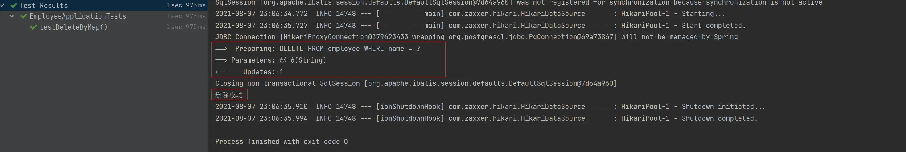

-   **删除数据后的数据库**


3.   **根据主键批量删除**

将要删除记录的主键传入集合中，然后将集合作为 `deleteBatchIds` 方法的参数即可。

-   **方法声明**

```java
/**
     * 删除（根据ID 批量删除）
     *
     * @param idList 主键ID列表(不能为 null 以及 empty)
     */
int deleteBatchIds(@Param(Constants.COLLECTION) Collection<? extends Serializable> idList);
```

-   **批量删除实例**

```java
package com.cunyu.employee;

import com.cunyu.employee.entity.Employee;
import com.cunyu.employee.mapper.EmployeeMapper;
import org.junit.Assert;
import org.junit.jupiter.api.Test;
import org.springframework.beans.factory.annotation.Autowired;
import org.springframework.boot.test.context.SpringBootTest;

@SpringBootTest
class EmployeeApplicationTests {

    @Autowired
    private EmployeeMapper employeeMapper;

    @Test
    void testDeleteBatchIds() {
        List<Integer> ids = new ArrayList<>();
        ids.add(1);
        ids.add(3);
        Assert.assertEquals(2, employeeMapper.deleteBatchIds(ids));
        System.out.println("删除成功");
    }
}
```

-   **测试结果**

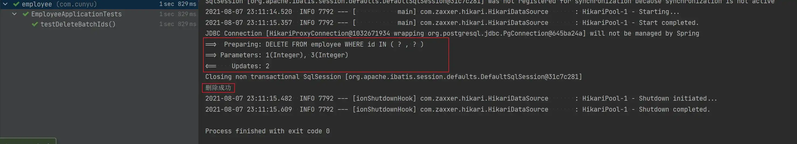

-   **删除数据后的数据库**


## Service CRUD 接口

`Service` 层继承自 `IService` 接口，其中的方法和 `Mapper` 层中所提供的方法功能是一致的，除了方法名有所不同外，其他基本类似，但 `Service` 层中提供了更为丰富的方法，两者的继承结构如下图所示。


```java
package com.cunyu.employee.service;

import com.baomidou.mybatisplus.extension.service.IService;
import com.cunyu.employee.entity.Employee;

/**
 * Created with IntelliJ IDEA.
 *
 * @author : cunyu
 * @version : 1.0
 * @project : Employee
 * @package : com.cunyu.employee.service
 * @className : EmployeeService
 * @createTime : 2021/8/8 7:52
 * @description : 员工服务接口
 */
@Service
public interface EmployeeService extends IService<Employee> {
}
```

```java
package com.cunyu.employee.service.Impl;

import com.baomidou.mybatisplus.extension.service.impl.ServiceImpl;
import com.cunyu.employee.entity.Employee;
import com.cunyu.employee.mapper.EmployeeMapper;
import com.cunyu.employee.service.EmployeeService;

/**
 * Created with IntelliJ IDEA.
 *
 * @author : cunyu
 * @version : 1.0
 * @project : Employee
 * @package : com.cunyu.employee.service.Impl
 * @className : EmployeeServiceImpl
 * @createTime : 2021/8/8 7:53
 * @description : 员工服务类实现
 */

@Service
public class EmployeeServiceImpl extends ServiceImpl<EmployeeMapper, Employee> implements EmployeeService {
}
```

### Save

1.   **插入一条记录**

功能同 `Mapper` 层中的 `insert` 方法，只不过方法名不同。

-   **方法声明**

```java
// 插入一条记录（选择字段，策略插入）
boolean save(T entity);
```

-   **插入实例**

```java
package com.cunyu.employee;

import com.cunyu.employee.entity.Employee;
import com.cunyu.employee.mapper.EmployeeMapper;
import com.cunyu.employee.service.EmployeeService;
import org.junit.Assert;
import org.junit.jupiter.api.Test;
import org.springframework.beans.factory.annotation.Autowired;
import org.springframework.boot.test.context.SpringBootTest;

@SpringBootTest
class EmployeeApplicationTests {

    @Autowired
    private EmployeeService employeeService;

    @Test
    void testSave() {
        Employee employee = new Employee();
        employee.setId(5L);
        employee.setName("周七");
        employee.setEmail("zhouqi@cunyu1943.com");
        employee.setSex("女");
        Assert.assertTrue(employeeService.save(employee));
        System.out.println("插入成功");
    }
}
```

-   **测试结果**

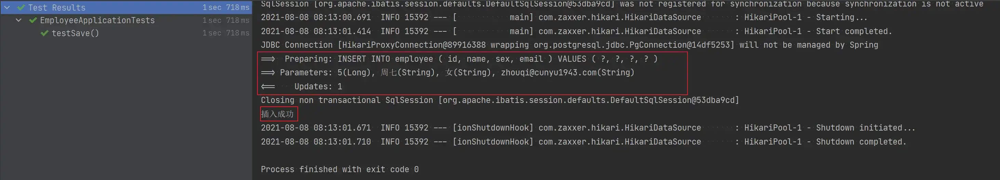

-   **插入数据后的数据库**

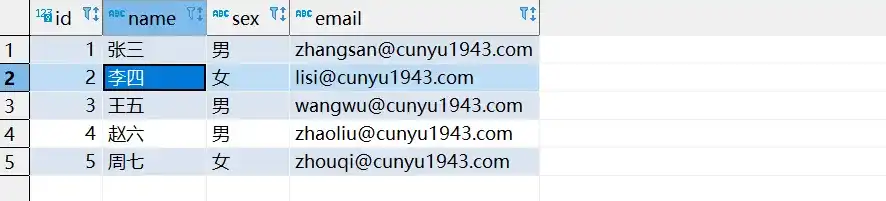

2.   **批量插入**

这里就和 `Mapper` 层中所有区别，`Mapper` 层中只支持单次插入，而 `Service` 层中支持批量插入，而传入的参数就是我们所要传入实体的集合，而且还可以分批次插入和统一插入。

2.1 **统一插入**

-   **方法声明**

```java
// 插入（批量）
boolean saveBatch(Collection<T> entityList);
```

-   **插入实例**

```java
package com.cunyu.employee;

import com.cunyu.employee.entity.Employee;
import com.cunyu.employee.mapper.EmployeeMapper;
import com.cunyu.employee.service.EmployeeService;
import org.junit.Assert;
import org.junit.jupiter.api.Test;
import org.springframework.beans.factory.annotation.Autowired;
import org.springframework.boot.test.context.SpringBootTest;

import java.util.ArrayList;
import java.util.List;

@SpringBootTest
class EmployeeApplicationTests {

    @Autowired
    private EmployeeService employeeService;

    @Test
    void testSaveBatch() {
        Employee employee1 = new Employee();
        employee1.setId(6L);
        employee1.setEmail("zhangliang@cunyu1943.com");
        employee1.setSex("男");
        employee1.setName("张良");

        Employee employee2 = new Employee();
        employee2.setId(7L);
        employee2.setEmail("zhouyu@cunyu1943.com");
        employee2.setName("周瑜");
        employee2.setSex("男");

        List<Employee> employeeList = new ArrayList<>();
        employeeList.add(employee1);
        employeeList.add(employee2);

        Assert.assertTrue(employeeService.saveBatch(employeeList));
        System.out.println("批量插入成功");
    }
}
```

-   **测试结果**

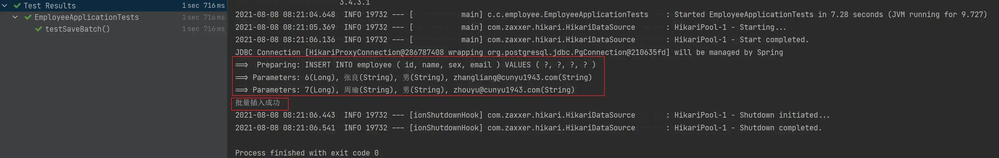

-   **统一插入后的数据库**

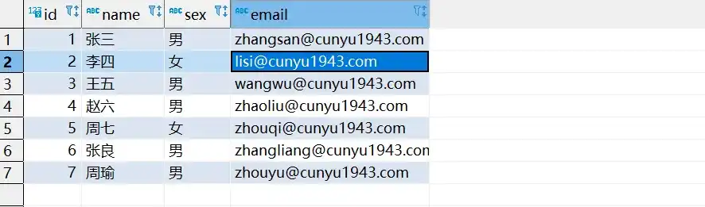

2.2 **分批次插入**

-   **方法声明**

```java
// 插入（批量）
boolean saveBatch(Collection<T> entityList, int batchSize);
```

-   **分批次插入实例**

```java
package com.cunyu.employee;

import com.cunyu.employee.entity.Employee;
import com.cunyu.employee.mapper.EmployeeMapper;
import com.cunyu.employee.service.EmployeeService;
import org.junit.Assert;
import org.junit.jupiter.api.Test;
import org.springframework.beans.factory.annotation.Autowired;
import org.springframework.boot.test.context.SpringBootTest;

import java.util.ArrayList;
import java.util.List;

@SpringBootTest
class EmployeeApplicationTests {

    @Autowired
    private EmployeeService employeeService;

    @Test
    void testSaveBatch() {
        Employee employee1 = new Employee();
        employee1.setId(8L);
        employee1.setEmail("jialuo@cunyu1943.com");
        employee1.setSex("女");
        employee1.setName("迦罗");

        Employee employee2 = new Employee();
        employee2.setId(9L);
        employee2.setEmail("zhugeliang@cunyu1943.com");
        employee2.setName("诸葛亮");
        employee2.setSex("男");

        List<Employee> employeeList = new ArrayList<>();
        employeeList.add(employee1);
        employeeList.add(employee2);

        Assert.assertTrue(employeeService.saveBatch(employeeList,2));
        System.out.println("批量插入成功");
    }
}
```

-   **测试结果**

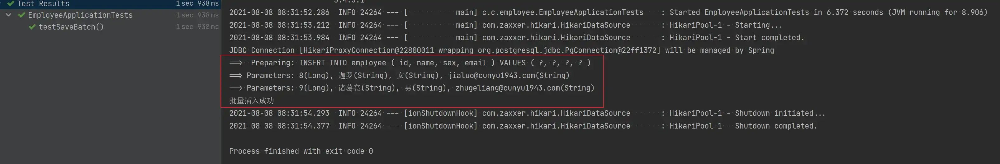

-   **分批次插入后的数据库**

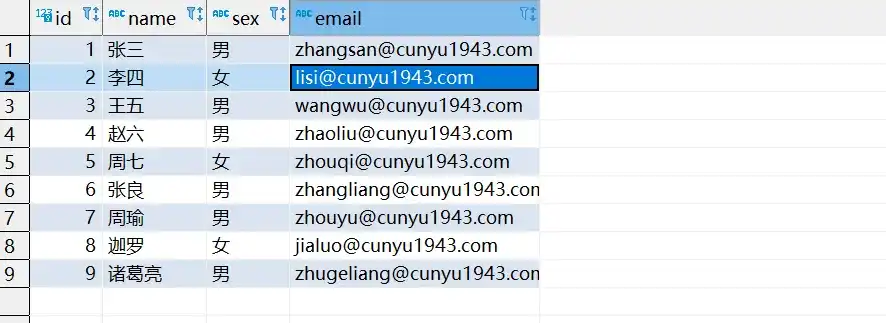

### SaveOrUpdate

1.   **单条修改插入**

-   **方法声明**

```java
// TableId 注解存在更新记录，否插入一条记录
boolean saveOrUpdate(T entity);
```

-   **单条修改插入实例**

```java
package com.cunyu.employee;

import com.cunyu.employee.entity.Employee;
import com.cunyu.employee.mapper.EmployeeMapper;
import com.cunyu.employee.service.EmployeeService;
import org.junit.Assert;
import org.junit.jupiter.api.Test;
import org.springframework.beans.factory.annotation.Autowired;
import org.springframework.boot.test.context.SpringBootTest;

import java.util.ArrayList;
import java.util.List;

@SpringBootTest
class EmployeeApplicationTests {

    @Autowired
    private EmployeeService employeeService;

    @Test
    void testSaveOrUpdate() {
        Employee employee = new Employee();
        employee.setId(5L);
        employee.setName("周武");
        employee.setEmail("zhouwu@cunyu1943.com");
        employee.setSex("男");

        Assert.assertTrue(employeeService.saveOrUpdate(employee));
        System.out.println("更新成功");
    }
}
```

-   **测试结果**

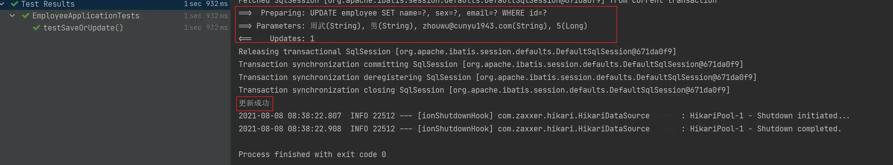

-   **修改插入后的数据库**


2.   **批量修改插入**

2.1 **统一插入**

-   **方法声明**

```java
// 批量修改插入
boolean saveOrUpdateBatch(Collection<T> entityList);
```

-   **统一插入实例**

```java
package com.cunyu.employee;

import com.cunyu.employee.entity.Employee;
import com.cunyu.employee.mapper.EmployeeMapper;
import com.cunyu.employee.service.EmployeeService;
import org.junit.Assert;
import org.junit.jupiter.api.Test;
import org.springframework.beans.factory.annotation.Autowired;
import org.springframework.boot.test.context.SpringBootTest;

import java.util.ArrayList;
import java.util.List;

@SpringBootTest
class EmployeeApplicationTests {

    @Autowired
    private EmployeeService employeeService;

    @Test
    void testSaveOrUpdateBatch() {
        Employee employee1 = new Employee();
        employee1.setId(10L);
        employee1.setEmail("zhongwuyan@cunyu1943.com");
        employee1.setSex("女");
        employee1.setName("钟无艳");

        Employee employee2 = new Employee();
        employee2.setId(11L);
        employee2.setEmail("direnjie@cunyu1943.com");
        employee2.setName("狄仁杰");
        employee2.setSex("男");

        List<Employee> employeeList = new ArrayList<>();
        employeeList.add(employee1);
        employeeList.add(employee2);

        Assert.assertTrue(employeeService.saveOrUpdateBatch(employeeList));
        System.out.println("批量修改插入成功");
    }
}
```

-   **测试结果**

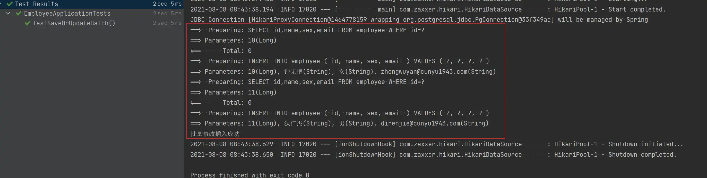

-   **统一插入数据后的数据库**

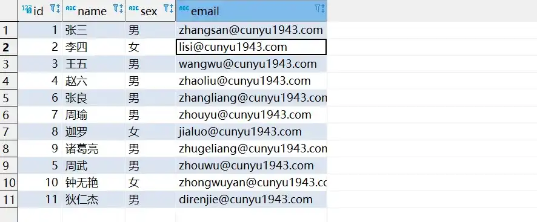

2.2 **分批次插入**

-   **方法声明**

```java
// 批量修改插入
boolean saveOrUpdateBatch(Collection<T> entityList, int batchSize);
```

-   **方法实例**

```java
package com.cunyu.employee;

import com.cunyu.employee.entity.Employee;
import com.cunyu.employee.mapper.EmployeeMapper;
import com.cunyu.employee.service.EmployeeService;
import org.junit.Assert;
import org.junit.jupiter.api.Test;
import org.springframework.beans.factory.annotation.Autowired;
import org.springframework.boot.test.context.SpringBootTest;

import java.util.ArrayList;
import java.util.List;

@SpringBootTest
class EmployeeApplicationTests {

    @Autowired
    private EmployeeService employeeService;

    @Test
    void testSaveOrUpdateBatch() {
        Employee employee1 = new Employee();
        employee1.setId(12L);
        employee1.setEmail("yuji@cunyu1943.com");
        employee1.setSex("女");
        employee1.setName("虞姬");

        Employee employee2 = new Employee();
        employee2.setId(13L);
        employee2.setEmail("sulie@cunyu1943.com");
        employee2.setName("苏烈");
        employee2.setSex("男");

        List<Employee> employeeList = new ArrayList<>();
        employeeList.add(employee1);
        employeeList.add(employee2);

        Assert.assertTrue(employeeService.saveOrUpdateBatch(employeeList, 2));
        System.out.println("批量修改插入成功");
    }
}
```

-   **测试结果**

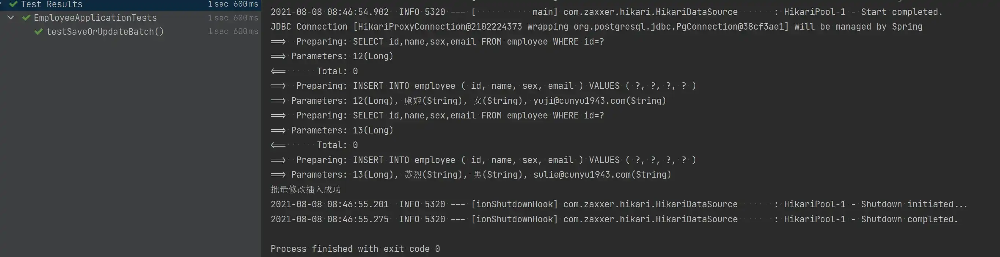

-   **分批次插入数据后的数据库**

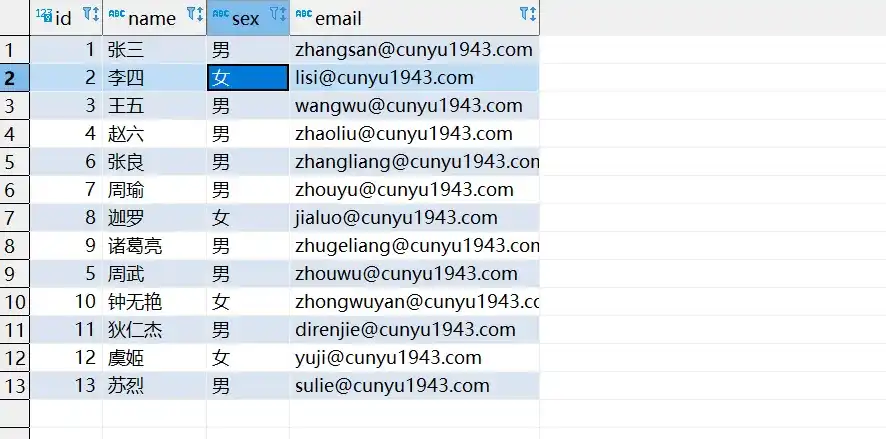

### Remove

1.   **根据 ID 删除**

-   **方法实例**

```java
// 根据 ID 删除
boolean removeById(Serializable id);
```

-   **删除实例**

```java
package com.cunyu.employee;

import com.cunyu.employee.entity.Employee;
import com.cunyu.employee.mapper.EmployeeMapper;
import com.cunyu.employee.service.EmployeeService;
import org.junit.Assert;
import org.junit.jupiter.api.Test;
import org.springframework.beans.factory.annotation.Autowired;
import org.springframework.boot.test.context.SpringBootTest;


@SpringBootTest
class EmployeeApplicationTests {

    @Autowired
    private EmployeeService employeeService;

    @Test
    void testRemoveById() {
        Assert.assertTrue(employeeService.removeById(5));
        System.out.println("删除成功");
    }
}
```

-   **测试结果**

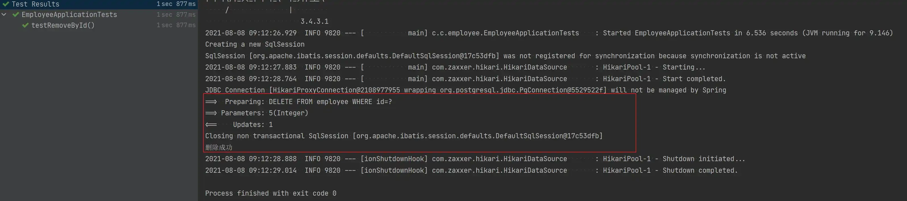

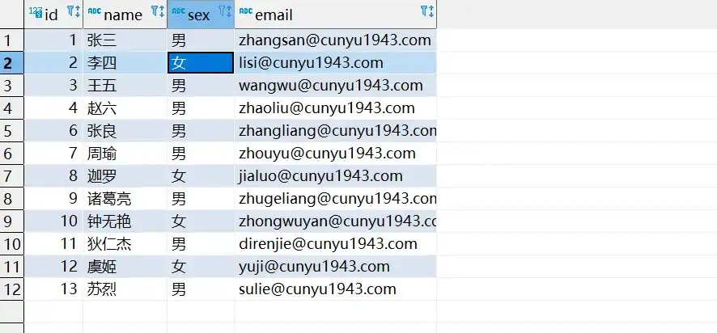

2.   **根据条件删除**

-   **方法声明**

```java
// 根据 columnMap 条件，删除记录
boolean removeByMap(Map<String, Object> columnMap);
```

-   **按条件删除实例**

```java
package com.cunyu.employee;

import com.cunyu.employee.entity.Employee;
import com.cunyu.employee.mapper.EmployeeMapper;
import com.cunyu.employee.service.EmployeeService;
import org.junit.Assert;
import org.junit.jupiter.api.Test;
import org.springframework.beans.factory.annotation.Autowired;
import org.springframework.boot.test.context.SpringBootTest;

import java.util.HashMap;
import java.util.Map;

@SpringBootTest
class EmployeeApplicationTests {

    @Autowired
    private EmployeeService employeeService;

    @Test
    void testRemoveByMap() {
        Map<String, Object> map = new HashMap<>();
        map.put("sex", "女");
        Assert.assertTrue(employeeService.removeByMap(map));
        System.out.println("删除成功");
    }
}
```

-   **测试结果**

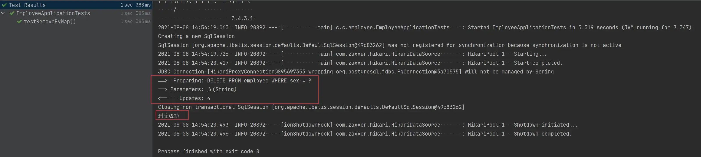

-   **按条件删除后的数据库**

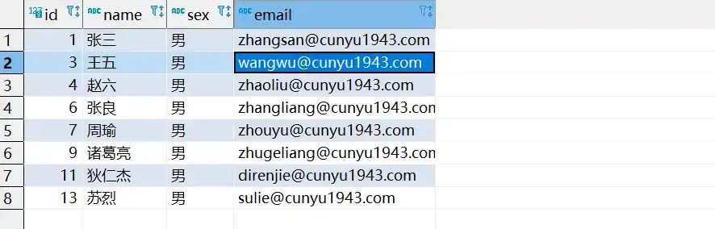

3.   **根据 ID 批量删除**

-   **方法声明**

```java
// 删除（根据ID 批量删除）
boolean removeByIds(Collection<? extends Serializable> idList);
```

-   **批量删除实例**

```java
package com.cunyu.employee;

import com.cunyu.employee.entity.Employee;
import com.cunyu.employee.mapper.EmployeeMapper;
import com.cunyu.employee.service.EmployeeService;
import org.junit.Assert;
import org.junit.jupiter.api.Test;
import org.springframework.beans.factory.annotation.Autowired;
import org.springframework.boot.test.context.SpringBootTest;

import java.util.ArrayList;
import java.util.List;

@SpringBootTest
class EmployeeApplicationTests {

    @Autowired
    private EmployeeService employeeService;

    @Test
    void testRemoveByIds() {
        List<Integer> ids = new ArrayList<>();
        ids.add(1);
        ids.add(4);
        Assert.assertTrue(employeeService.removeByIds(ids));
        System.out.println("批量删除成功");
    }
}
```

-   **测试结果**

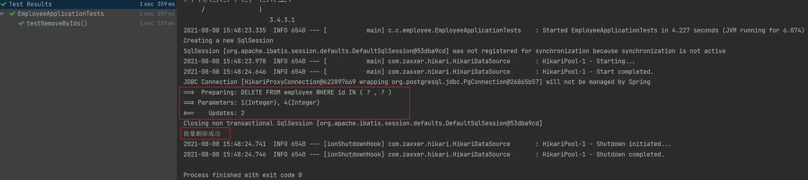

-   **批量删除后的数据库**

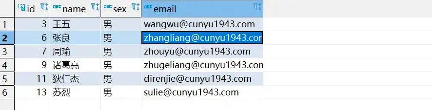

### Update

1.   **根据 ID 选择修改**

-   **方法声明**

```java
// 根据 ID 选择修改
boolean updateById(T entity);
```

-   **根据 ID 修改实例**

```java
package com.cunyu.employee;

import com.cunyu.employee.entity.Employee;
import com.cunyu.employee.mapper.EmployeeMapper;
import com.cunyu.employee.service.EmployeeService;
import org.junit.Assert;
import org.junit.jupiter.api.Test;
import org.springframework.beans.factory.annotation.Autowired;
import org.springframework.boot.test.context.SpringBootTest;


@SpringBootTest
class EmployeeApplicationTests {

    @Autowired
    private EmployeeService employeeService;

    @Test
    void testUpdateById() {
        Employee employee = new Employee();
        employee.setId(3L);
        employee.setName("程咬金");
        employee.setSex("男");
        employee.setEmail("chengyaojin@cunyu1943.com");

        Assert.assertTrue(employeeService.updateById(employee));
        System.out.println("更新成功");
    }
}
```

-   **测试结果**

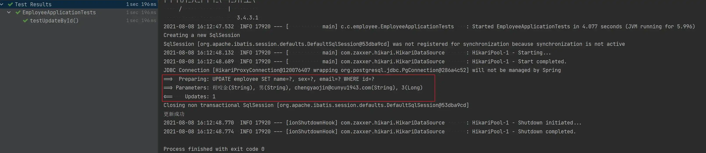

-   **更新后的数据库**

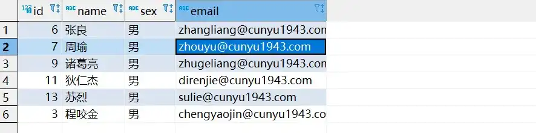

2.   **根据 ID 批量更新**

2.1 **统一更新**

-   **方法声明**

```java
// 根据ID 批量更新
boolean updateBatchById(Collection<T> entityList);
```

-   **批量更新实例**

```java
package com.cunyu.employee;

import com.cunyu.employee.entity.Employee;
import com.cunyu.employee.mapper.EmployeeMapper;
import com.cunyu.employee.service.EmployeeService;
import org.junit.Assert;
import org.junit.jupiter.api.Test;
import org.springframework.beans.factory.annotation.Autowired;
import org.springframework.boot.test.context.SpringBootTest;

import java.util.ArrayList;
import java.util.List;

@SpringBootTest
class EmployeeApplicationTests {

    @Autowired
    private EmployeeService employeeService;

    @Test
    void testUpdateBatchById() {
        Employee employee1 = new Employee();
        employee1.setId(6L);
        employee1.setName("妲己");
        employee1.setSex("女");
        employee1.setEmail("daji@cunyu1943.com");

        Employee employee2 = new Employee();
        employee2.setId(13L);
        employee2.setName("小乔");
        employee2.setSex("女");
        employee2.setEmail("xiaoqiao@cunyu1943.com");

        List<Employee> employeeList = new ArrayList<>();
        employeeList.add(employee1);
        employeeList.add(employee2);

        Assert.assertTrue(employeeService.updateBatchById(employeeList));
        System.out.println("更新成功");
    }
}
```

-   **测试结果**

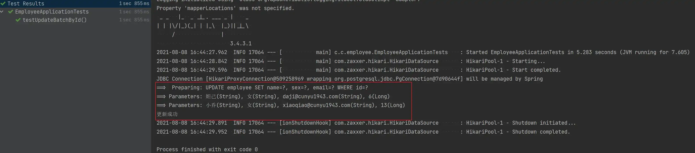

-   **批量更新后的数据库**

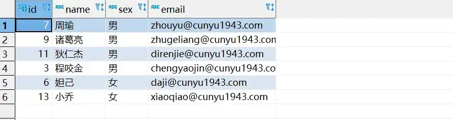

2.2 **分批次更新**

-   **方法声明**

```java
// 根据ID 批量更新
boolean updateBatchById(Collection<T> entityList, int batchSize);
```

-   **分批次更新实例**

```java
package com.cunyu.employee;

import com.cunyu.employee.entity.Employee;
import com.cunyu.employee.mapper.EmployeeMapper;
import com.cunyu.employee.service.EmployeeService;
import org.junit.Assert;
import org.junit.jupiter.api.Test;
import org.springframework.beans.factory.annotation.Autowired;
import org.springframework.boot.test.context.SpringBootTest;

import java.util.ArrayList;
import java.util.List;

@SpringBootTest
class EmployeeApplicationTests {

    @Autowired
    private EmployeeService employeeService;

    @Test
    void testUpdateBatchById() {
        Employee employee1 = new Employee();
        employee1.setId(7L);
        employee1.setName("武则天");
        employee1.setSex("女");
        employee1.setEmail("wuzetian@cunyu1943.com");

        Employee employee2 = new Employee();
        employee2.setId(3L);
        employee2.setName("李元芳");
        employee2.setSex("男");
        employee2.setEmail("liyuanfang@cunyu1943.com");

        List<Employee> employeeList = new ArrayList<>();
        employeeList.add(employee1);
        employeeList.add(employee2);

        Assert.assertTrue(employeeService.updateBatchById(employeeList, 2));
        System.out.println("更新成功");
    }
}
```

-   **测试结果**

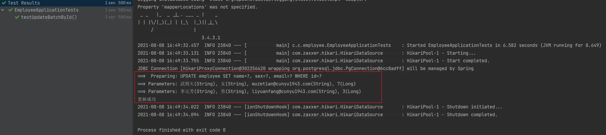

-   **分批次更新后的数据库**

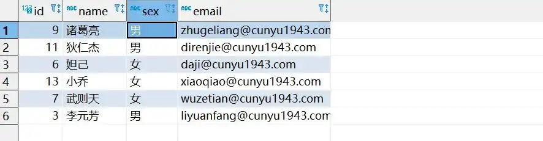

### Get

1.   **根据 ID 查询**

将所要查询记录的 `id` 作为参数，然后将查询到的实体返回。

-   **方法声明**

```java
// 根据 ID 查询
T getById(Serializable id);
```

-   **查询实例**

```java
package com.cunyu.employee;

import com.cunyu.employee.entity.Employee;
import com.cunyu.employee.mapper.EmployeeMapper;
import com.cunyu.employee.service.EmployeeService;
import org.junit.Assert;
import org.junit.jupiter.api.Test;
import org.springframework.beans.factory.annotation.Autowired;
import org.springframework.boot.test.context.SpringBootTest;

@SpringBootTest
class EmployeeApplicationTests {

    @Autowired
    private EmployeeService employeeService;

    @Test
    void testGetById() {
        Employee employee = employeeService.getById(9);
        System.out.println(employee);
    }
}
```

-   **测试结果**

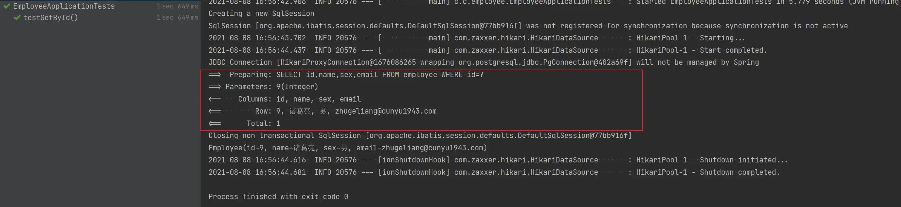

### List

1.   **查询所有**

查询所有记录，然后返回到一个集合中。

-   **方法声明**

```java
// 查询所有
List<T> list();
```

-   **查询实例**

```java
package com.cunyu.employee;

import com.cunyu.employee.entity.Employee;
import com.cunyu.employee.mapper.EmployeeMapper;
import com.cunyu.employee.service.EmployeeService;
import org.junit.Assert;
import org.junit.jupiter.api.Test;
import org.springframework.beans.factory.annotation.Autowired;
import org.springframework.boot.test.context.SpringBootTest;

import java.util.ArrayList;
import java.util.List;

@SpringBootTest
class EmployeeApplicationTests {

    @Autowired
    private EmployeeService employeeService;

    @Test
    void testList() {
        List<Employee> employeeLists = new ArrayList<>();
        employeeLists = employeeService.list();
        Assert.assertEquals(6, employeeLists.size());
        System.out.println("查询成功");
    }
}
```

-   **测试结果**

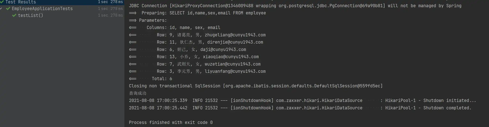

2.   **根据 ID 批量查询**

讲所要查询的记录 `id` 传入集合，然后座位方法参数，最后返回查询到的结果到一个集合中。

-   **方法声明**

```java
// 查询（根据ID 批量查询）
Collection<T> listByIds(Collection<? extends Serializable> idList);
```

-   **批量查询实例**

```java
package com.cunyu.employee;

import com.cunyu.employee.entity.Employee;
import com.cunyu.employee.mapper.EmployeeMapper;
import com.cunyu.employee.service.EmployeeService;
import org.junit.Assert;
import org.junit.jupiter.api.Test;
import org.springframework.beans.factory.annotation.Autowired;
import org.springframework.boot.test.context.SpringBootTest;

import java.util.ArrayList;
import java.util.List;

@SpringBootTest
class EmployeeApplicationTests {

    @Autowired
    private EmployeeService employeeService;

    @Test
    void testListByIds() {
        List<Long> ids = new ArrayList<>();

        ids.add(6L);
        ids.add(7L);

        Assert.assertEquals(2, employeeService.listByIds(ids).size());
        System.out.println("查询成功");

    }
}
```

-   **测试结果**

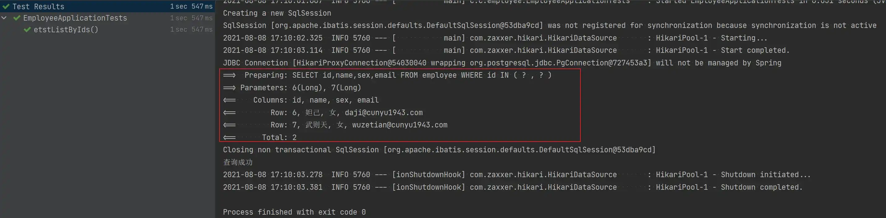

3.   **根据条件查询**

条件传入 `Map` 集合，`key` 对应字段，`value` 对应值，然后返回集合。

-   **方法声明**

```java
// 查询（根据 columnMap 条件）
Collection<T> listByMap(Map<String, Object> columnMap);
```

-   **根据条件查询实例**

```java
package com.cunyu.employee;

import com.cunyu.employee.entity.Employee;
import com.cunyu.employee.mapper.EmployeeMapper;
import com.cunyu.employee.service.EmployeeService;
import org.junit.Assert;
import org.junit.jupiter.api.Test;
import org.springframework.beans.factory.annotation.Autowired;
import org.springframework.boot.test.context.SpringBootTest;

import java.util.HashMap;
import java.util.Map;

@SpringBootTest
class EmployeeApplicationTests {

    @Autowired
    private EmployeeService employeeService;
    @Test
    void testListByMap() {
        Map<String, Object> map = new HashMap<>();

        map.put("sex", "女");

        Assert.assertEquals(3, employeeService.listByMap(map).size());
        System.out.println("查询成功");
    }
}
```

-   **测试结果**

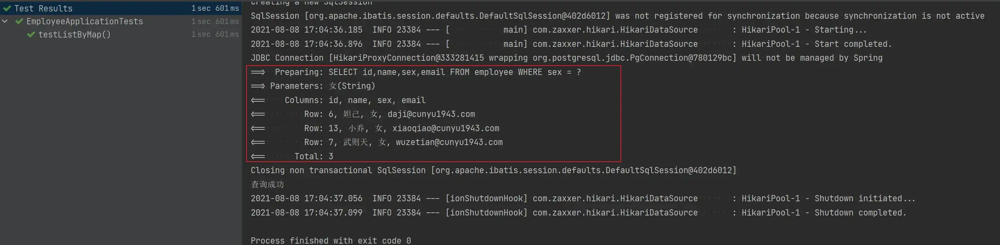

4.   **查询所有列表**

-   **方法声明**

```java
// 查询所有列表
List<Map<String, Object>> listMaps();
```

-   **查询实例**

```java
package com.cunyu.employee;

import com.cunyu.employee.entity.Employee;
import com.cunyu.employee.mapper.EmployeeMapper;
import com.cunyu.employee.service.EmployeeService;
import org.junit.Assert;
import org.junit.jupiter.api.Test;
import org.springframework.beans.factory.annotation.Autowired;
import org.springframework.boot.test.context.SpringBootTest;


@SpringBootTest
class EmployeeApplicationTests {

    @Autowired
    private EmployeeService employeeService;

    @Test
    void testListMaps() {
        Assert.assertEquals(6, employeeService.listMaps());
        System.out.println("查询成功");
    }
}
```

-   **测试结果**

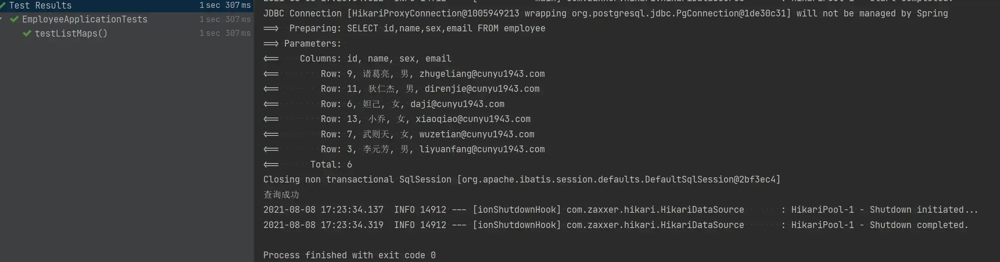

5.   **查询所有记录**

用于查询所有数据记录，并将其返回到一个集合中。

-   **方法声明**

```java
// 查询全部记录
List<Object> listObjs();
```

-   **查询实例**

```java
package com.cunyu.employee;

import com.cunyu.employee.entity.Employee;
import com.cunyu.employee.mapper.EmployeeMapper;
import com.cunyu.employee.service.EmployeeService;
import org.junit.Assert;
import org.junit.jupiter.api.Test;
import org.springframework.beans.factory.annotation.Autowired;
import org.springframework.boot.test.context.SpringBootTest;


@SpringBootTest
class EmployeeApplicationTests {

    @Autowired
    private EmployeeService employeeService;

    @Test
    void testListObjs() {
        Assert.assertEquals(6, employeeService.listObjs().size());
        System.out.println("查询成功");
    }
}
```

-   **测试结果**

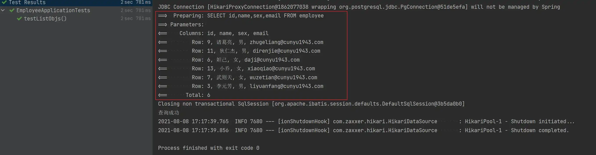

### Count

1.   **查询记录总数**

用于统计数据控中的记录总条数，方法返回记录条数。

-   **方法声明**

```java
// 查询总记录数
int count();
```

-   **查询记录总数实例**

```java
package com.cunyu.employee;

import com.cunyu.employee.entity.Employee;
import com.cunyu.employee.mapper.EmployeeMapper;
import com.cunyu.employee.service.EmployeeService;
import org.junit.Assert;
import org.junit.jupiter.api.Test;
import org.springframework.beans.factory.annotation.Autowired;
import org.springframework.boot.test.context.SpringBootTest;


@SpringBootTest
class EmployeeApplicationTests {

    @Autowired
    private EmployeeService employeeService;

    @Test
    void testCount() {
        Assert.assertEquals(6, employeeService.count());
        System.out.println("查询成功");
    }
}
```

-   **测试结果**

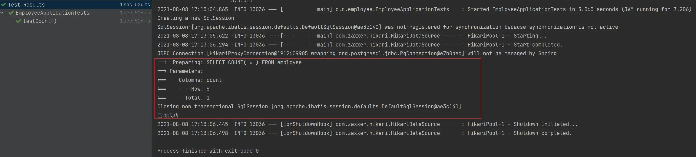

## 总结

好了，以上就是关于 Mybatis-Plus 的日志配置以及如何进行 CRUD 的相关内容了，这里 CRUD 主要又分为 Mapper 层和 Service 层，我们可以根据自己的需要进行选择。当然，在我们日常使用中，常常都是两个接口一起使用，关于更多 MP 的使用技巧，我们下期文章再见！