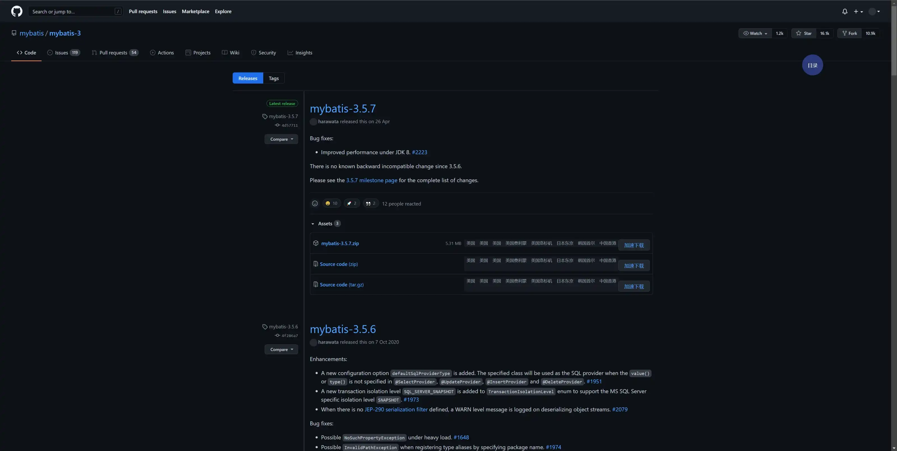
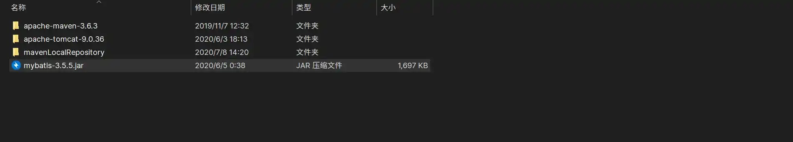

# 简介

## 前言

### 什么是持久化

持久化是**将程序数据在持久状态和瞬时状态间转换的机制**，将数据保存到可永久保存的存储设备中。最常见的就是将内存中的对象存储在数据库中，或者存在磁盘文件、`XML` 数据文件中等等。其中，文件 `IO` 属于持久化机制，而 `JDBC` 也是一种持久化机制。


### 为什么需要持久化


之所以需要持久化，是由于内存自身缺陷导致。我们知道，内存在遇到某些外界因素影响后会丢失，但是我们的一些数据是绝对不能丢失的，但我们又无法保证不受外界因素影响。同时内存成本较高，比起硬盘、光盘等外存，其价格要高上几个数量级，而且维持成本也较高。在这种情况下，我们不得不寻求另一种方案来存储数据对象，而持久化就是其中的一种选择，我们能够通过持久化将数据缓存到外存，从而降低成本。

### 什么是持久层


所谓持久层，就是用于完成持久化工作的代码块（`dao` 层【`DAO（Data Access Object）`】）。数据持久化通常都是将内存中的数据保存到磁盘中来加以固化，而实现这一过程大多是通过**关系数据库**来完成。而且比起其他部分，该层需要有一个较为清晰和严格的逻辑边界。


## 什么是 MyBatis


### 为什么不用 JDBC？


针对数据库操作，`Java` 其实已经提供了相应的解决方案 -- `JDBC`。那既然已经有了现成的工具，那为什么还会有 `MyBatis` 的出现呢？


虽然 `JDBC` 提供了对数据库操作的解决方案，但是存在着如下问题：


1.  数据库连接的频繁创建和释放造成了一定程度上的资源浪费，从而影响到系统性能，但如果使用数据库连接池就能在一定程度上缓解该问题；
2.  `SQL` 语句在代码中出现，会造成代码不易维护；

1.  使用 `preparedStatement` 向占位符传递参数时存在硬编码，也会进一步加大系统维护的难度；
2.  对结果集进行解析时存在硬编码，`SQL` 变化将导致解析代码改变，系统难以维护，但如果能将数据库记录进行封装成 `POJO` 对象，解析起来就会方便很多。


### MyBatis 介绍


MyBatis 是一个持久层框架，是一个半自动化的**ORM 框架**，不仅支持自定义 SQL、存储过程以及高级映射。还简化了 JDBC 代码以及设置参数和获取结果集的工作过程，使得我们只需要通过简单的 XML 或注解配置，就能将原始类型、接口和 Java POJO 映射为数据库中的记录。


通过对 JDBC 操作数据库的过程进行封装，我们只需要关注 SQL 而不用再去处理注册驱动、创建 `connection`、创建 `statement`、手动设置参数、结果集检索等复杂的过程代码。


不同于其他的对象关系映射框架，MyBatis 并未将 Java 对象和数据库表关联，而是将 Java 方法与 SQL 语句关联。


总的来讲，MyBatis 有如下优点：


-   **简单易学**：自身小且简单，无任何第三方依赖；
-   **灵活**：MyBatis 不会对应用程序或数据库的现有设计强加任何影响，写在 XML 中，便于统一管理和优化；

-   **解除 SQL 与代码程序的耦合**：通过提供 DAO 层，将业务逻辑与数据访问逻辑分离，使系统设计更加清晰、易维护、易于单元测试，提高了程序的可维护性；
-   **提供 XML 标签，支持编写动态 SQL**；

-   …

### 其他持久层技术

除开 JDBC 之外，大家可能还了解到了 Hibernate 和 JPA 等持久层技术。相较于 JDBC 这种原始的方式，它们操作起来显得十分方便，开发效率也很高。但是对于程序中较长和较难的复杂 SQL 需求，就需要绕过框架。此外，由于其 SQL 是内部自动生成的，所以如果要对其做特殊优化则不太容易。Hibernate 和 JPA 都是基于全映射的全自动框架，如果 POJO 中存在大量字段，要进行部分映射时就显得比较困难。最后，由于框架内部反射操作过多，导致数据库性能下降，在当前大数据的背景下，显然不能满足我们的要求。

## MyBatis 安装


1.  首先[下载](https://github.com/mybatis/mybatis-3/releases)最新版本 MyBatis；



2.  解压下载好的安装包，将 `mybatis-xxx.jar` 放到你项目的类路径下（classpath）；



3.  如果是 Maven 项目，在 `pom.xml` 中添加如下依赖即可；

```xml
<dependency>
  <groupId>org.mybatis</groupId>
  <artifactId>mybatis</artifactId>
  <version>x.x.x</version>
</dependency>
```

## 总结

以上就是今天的所有内容了，主要讲了持久化相关的知识，然后对 Mybatis 做了简单的介绍以及我们为什么要用 Mybatis，最后则是如何安装 Mybatis。原创不易，如果你觉得我写的内容对你有所帮助，那就点赞关注吧。