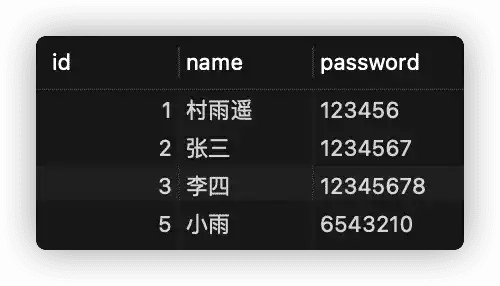
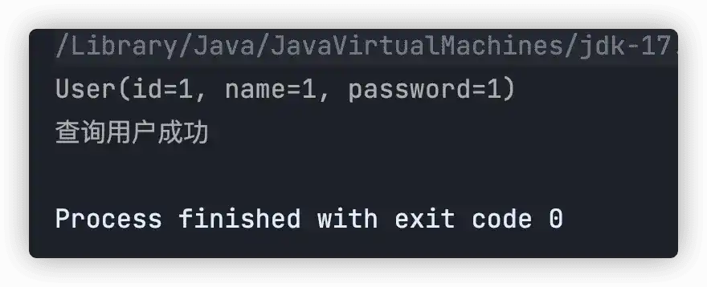
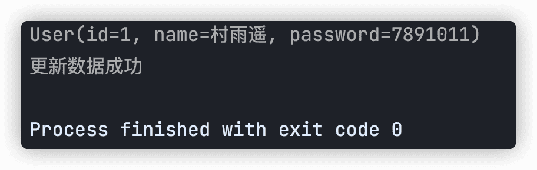
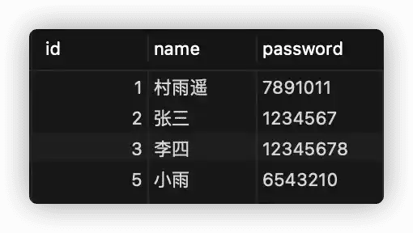
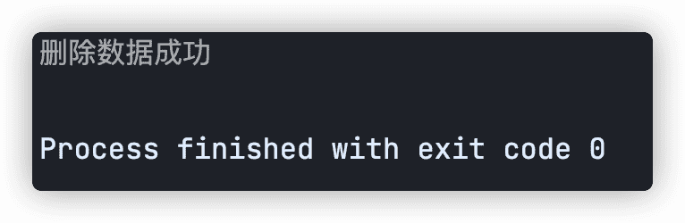
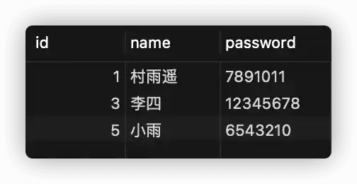

# 入门实例

## 前言


上一篇文章中我们讲了什么是持久化以及 Mybatis 的相关简介，今天就来看看如何创建一个 Mybatis 入门实例以及如何利用 Mybatis 进行 CRUD。


## 数据库准备


1.  首先，我们来创建一个数据库，用于后序步骤的使用；


```sql
CREATE DATABASE test;
USE test;
```

2.   接着创建一个表，用于存放数据；

```sql
CREATE TABLE user (
	id int(20) NOT NULL AUTO_INCREMENT,
    name varchar(30) DEFAULT NULL,
    password varchar(30) DEFAULT NULL,
    PRIMARY KEY (id)
);
```

3.   向数据库中插入数据

```sql
INSERT INTO user (id, name, password) VALUES (1, '村雨遥', '123456'),(2, '张三', '1234567'),(3, '李四', '12345678');
```


## 创建 Maven 工程


1.  对于如何创建 Maven 工程，可以参照我之前写的一篇文章：[利用 IDEA 搭建一个 Maven 项目 ](http://cunyu1943.github.io/posts/8ced8971/)
2.  接着在项目的 `pom.xml` 中添加 MyBatis、MySQL、Junit 以及 Lombok 的依赖，关于更多 Lombok 的使用，可以参考我的另一篇文章：[Lombok 安装及使用指南](https://cunyu1943.github.io/posts/f7032e71)

```xml
<dependency>
    <groupId>org.mybatis</groupId>
    <artifactId>mybatis</artifactId>
    <version>3.5.9</version>
</dependency>
<dependency>
    <groupId>mysql</groupId>
    <artifactId>mysql-connector-java</artifactId>
    <version>8.0.25</version>
</dependency>
<dependency>
    <groupId>junit</groupId>
    <artifactId>junit</artifactId>
    <version>4.13</version>
    <scope>test</scope>
</dependency>
<dependency>
    <groupId>org.projectlombok</groupId>
    <artifactId>lombok</artifactId>
    <version>1.18.22</version>
    <scope>provided</scope>
</dependency>
```


## 准备工作


1.  编写 MyBatis 核心配置文件，在 `main/resources` 文件下新建 `mybatis-config.xml` ，配置数据库。这里主要是配置连接的数据库，数据库连接用户名以及密码。

```xml
<?xml version="1.0" encoding="UTF-8" ?>
<!DOCTYPE configuration
        PUBLIC "-//mybatis.org//DTD Config 3.0//EN"
        "http://mybatis.org/dtd/mybatis-3-config.dtd">
<configuration>
    <!--  配置连接数据库的环境  -->
    <environments default="development">
        <environment id="development">
            <transactionManager type="JDBC"/>
            <dataSource type="POOLED">
                <property name="driver" value="com.mysql.cj.jdbc.Driver"/>
                <property name="url"
                          value="jdbc:mysql://localhost:3306/learndb?characterEncoding=utf8"/>
                <property name="username" value="root"/>
                <property name="password" value="cunyu1943"/>
            </dataSource>
        </environment>
    </environments>

    <!--  引入映射文件  -->
    <mappers>
        <mapper resource="mappers/UserMapper.xml"/>
    </mappers>
</configuration>
```

2.   编写 MyBatis 工具类；

```java
package com.cunyu.util;

import org.apache.ibatis.io.Resources;
import org.apache.ibatis.session.SqlSession;
import org.apache.ibatis.session.SqlSessionFactory;
import org.apache.ibatis.session.SqlSessionFactoryBuilder;

import java.io.IOException;
import java.io.InputStream;

/**
 * Created with IntelliJ IDEA.
 *
 * @Package : com.cunyu.util
 * @ClassName : MybatisUtil.java
 * @CreateTime : 2022/2/26 22:06
 * @Version : 1.0
 * @Author : 村雨
 * @Email : 747731461@qq.com
 * @公众号 : 村雨遥
 * @Website : https://cunyu1943.github.io
 * @Description : MyBatis 工具类
 */
public class MybatisUtil {
    private static SqlSessionFactory sqlSessionFactory;

    static {
        try {
            String resourceName = "mybatis-config.xml";
            InputStream inputStream = Resources.getResourceAsStream(resourceName);
            sqlSessionFactory = new SqlSessionFactoryBuilder().build(inputStream);
        } catch (IOException e) {
            e.printStackTrace();
        }
    }

    /**
     * @Author 村雨遥
     * @Version 1.0
     * @Description
     * @Date 22:21 2022/2/26
     * @param
     * @return
     */
    public static SqlSession getSqlSession(){
        return sqlSessionFactory.openSession();
    }
}
```

3.   接下来创建实体类，用于映射数据库中的 `user` 表。

```java
package com.cunyu.entity;

import lombok.AllArgsConstructor;
import lombok.Data;
import lombok.NoArgsConstructor;

/**
 * Created with IntelliJ IDEA.
 *
 * @Author : 村雨遥
 * @Version : 1.0
 * @Package : com.cunyu.entity
 * @ClassName : User.java
 * @CreateTime : 2022/2/26 18:09
 * @Email : 747731461@qq.com
 * @公众号 : 村雨遥
 * @Website : https://cunyu1943.github.io
 * @Description :
 */

@AllArgsConstructor
@NoArgsConstructor
@Data
public class User {
    private Integer id;
    private String name;
    private String password;
}
```

## 插入操作 `insert`


1.   首先在 `UserMapper` 接口中添加对应方法

```java
/**
     * @param user
     * @return
     * @Author 村雨遥
     * @Version 1.0
     * @Description
     * @Date 21:50 2022/2/26
     */
int insert(User user);
```

2.   在映射文件 `UserMapper.xml` 中添加 `Insert` 语句；

```xml
<?xml version="1.0" encoding="UTF-8" ?>
<!DOCTYPE mapper
        PUBLIC "-//mybatis.org//DTD Mapper 3.0//EN"
        "http://mybatis.org/dtd/mybatis-3-mapper.dtd">
<!--绑定对应Dao/Mapper接口-->
<mapper namespace="com.cunyu.mapper.UserMapper">
    <insert id="insert" parameterType="com.cunyu.entity.User">
        INSERT INTO user(id, name, password)
        VALUES (#{id}, #{name}, #{password})
    </insert>
</mapper>
```

3.   测试方法中测试；

```java
package com.cunyu.test;

import com.cunyu.entity.User;
import com.cunyu.mapper.UserMapper;
import com.cunyu.util.MybatisUtil;
import org.apache.ibatis.session.SqlSession;
import org.junit.Test;

/**
 * Created with IntelliJ IDEA.
 *
 * @Package : com.cunyu.test
 * @ClassName : InsertTest.java
 * @CreateTime : 2022/2/26 22:03
 * @Version : 1.0
 * @Author : 村雨
 * @Email : 747731461@qq.com
 * @公众号 : 村雨遥
 * @Website : https://cunyu1943.github.io
 * @Description :
 */
public class InsertTest {

    @Test
    public void testInsert() {
// 获取 SqlSession 对象
        SqlSession sqlSession = MybatisUtil.getSqlSession();

        UserMapper mapper = sqlSession.getMapper(UserMapper.class);
        User user = new User(5, "小雨", "6543210");
        int i = mapper.insert(user);
        System.out.println(i);

        // 提交事务到数据库
        sqlSession.commit();
        System.out.println("添加用户成功");

        // 关闭 SqlSession
        sqlSession.close();
    }
}
```



## 查询操作 `select`


1.  在 `UserMapper` 中添加对应方法：

```java
/**
     * @param
     * @return 对应 id 的用户
     * @Author 村雨遥
     * @Version 1.0
     * @Description
     * @Date 22:42 2022/2/26
     */
User query(Integer id);
```

2.   接着在 `UserMapper.xml` 中添加 `Select` 语句。其中各属性含义如下：

-   **id**：对应接口中的 **方法名**；
-   **resultType**：SQL 语句执行的返回值；

```xml
<select id="query" resultType="com.cunyu.entity.User">
    SELECT *
    FROM user
    WHERE id = #{id}
</select>
```

3.   在测试类中测试即可；

```java
package com.cunyu.test;

import com.cunyu.entity.User;
import com.cunyu.mapper.UserMapper;
import com.cunyu.util.MybatisUtil;
import org.apache.ibatis.session.SqlSession;
import org.junit.Test;

/**
 * Created with IntelliJ IDEA.
 *
 * @Package : com.cunyu.test
 * @ClassName : QueryTest.java
 * @CreateTime : 2022/2/26 22:39
 * @Version : 1.0
 * @Author : 村雨
 * @Email : 747731461@qq.com
 * @公众号 : 村雨遥
 * @Website : https://cunyu1943.github.io
 * @Description :
 */
public class QueryTest {
    @Test
    public void testQuery() {
        // 获取 SqlSession 对象
        SqlSession sqlSession = MybatisUtil.getSqlSession();

        UserMapper mapper = sqlSession.getMapper(UserMapper.class);

        User user = mapper.query(1);
        System.out.println(user);
        System.out.println("查询用户成功");

        // 关闭 SqlSession
        sqlSession.close();
    }
}
```



## 修改操作 `update`

1.  在 `UserMapper` 添加对应接口；

```java
/**
     * @param 
     * @return
     * @Author 村雨遥
     * @Version 1.0
     * @Description
     * @Date 22:52 2022/2/26
     */
int update(User user);
```

3.   在 `UserMapper.xml` 中添加 `update` 语句；

```xml
<update id="update">
    UPDATE user
    SET name    =#{name},
    password=#{password}
    WHERE id = #{id}
</update>
```

4.   测试类中测试；

```java
package com.cunyu.test;

import com.cunyu.entity.User;
import com.cunyu.mapper.UserMapper;
import com.cunyu.util.MybatisUtil;
import org.apache.ibatis.session.SqlSession;
import org.junit.Test;

/**
 * Created with IntelliJ IDEA.
 *
 * @Package : com.cunyu.test
 * @ClassName : UpdateTest.java
 * @CreateTime : 2022/2/26 22:45
 * @Version : 1.0
 * @Author : 村雨
 * @Email : 747731461@qq.com
 * @公众号 : 村雨遥
 * @Website : https://cunyu1943.github.io
 * @Description :
 */
public class UpdateTest {
    @Test
    public void testUpdate() {
        // 获取 SqlSession 对象
        SqlSession sqlSession = MybatisUtil.getSqlSession();
        UserMapper mapper = sqlSession.getMapper(UserMapper.class);
        User user = mapper.query(1);
        user.setPassword("7891011");
        int i = mapper.update(user.getId());
        System.out.println(user.toString());
        sqlSession.commit();
        System.out.println("更新数据成功");

        // 关闭 SqlSession
        sqlSession.close();
    }
}
```





## 删除操作 `delete`


1.  在 `UserMapper` 中添加接口；


```java
/**
     * @param id 用户 id
     * @return
     * @Author 村雨遥
     * @Version 1.0
     * @Description
     * @Date 22:53 2022/2/26
     */
int delete(Integer id);
```

2.   在 `UserMapper.xml` 中添加 `delete` 语句；

```xml
<delete id="delete">
    DELETE
    FROM user
    WHERE id = #{id}
</delete>
```

3.   在测试类中测试；

```java
package com.cunyu.test;

import com.cunyu.mapper.UserMapper;
import com.cunyu.util.MybatisUtil;
import org.apache.ibatis.session.SqlSession;
import org.junit.Test;

/**
 * Created with IntelliJ IDEA.
 *
 * @Package : com.cunyu.test
 * @ClassName : DeleteTest.java
 * @CreateTime : 2022/2/26 22:55
 * @Version : 1.0
 * @Author : 村雨
 * @Email : 747731461@qq.com
 * @公众号 : 村雨遥
 * @Website : https://cunyu1943.github.io
 * @Description :
 */
public class DeleteTest {
    @Test
    public void testDelete() {
        // 获取 SqlSession 对象
        SqlSession sqlSession = MybatisUtil.getSqlSession();
        UserMapper mapper = sqlSession.getMapper(UserMapper.class);

        int i = mapper.delete(2);
        sqlSession.commit();
        System.out.println("删除数据成功");

        // 关闭 SqlSession
        sqlSession.close();
    }
}
```






## 最后


以上就是我们今天的所有内容了，原创不易，如果你觉得我的文章对你有所帮助，那就帮忙点赞关注吧，我们就下篇文章再见吧 ~

而关于文章中的示例代码，我已经上传到了 Github，如果有需要的朋友，可以自取。

>   传送门：https://github.com/cunyu1943/java-learning-demos