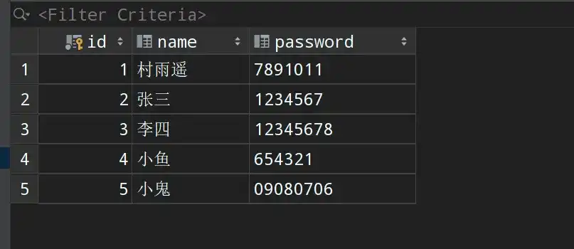
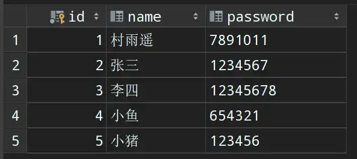
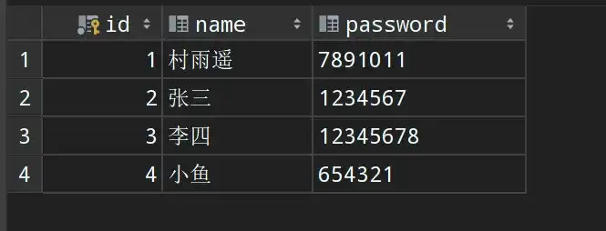

# 注解开发

## 🎈 号外

最近，公众号之外，建立了微信交流群，不定期会在群里分享各种资源（影视、IT 编程、考试提升……）&知识。如果有需要，可以**扫码或者后台添加小编微信备注入群**。进群后**优先看群公告**，**呼叫群中【资源分享小助手】**，还能免费帮找资源哦～

<center>
 
</center>

## 1. MyBatis 注解

之前的实例中，利用 MyBatis 进行开发时，一旦添加新的方法，则每次都需要在 XML 配置文件中进行映射。而现在随着注解开发的大肆流行，MyBatis 3 也提供了基于注解的配置。但是通过注解的方式表达力和灵活性有限，必要时要是需要通过 `mapper` 配置文件来进行构建，常用的注解主要用如下几个：

| 注解        | 功能 |
| ----------- | ---- |
| `@Select()` | 查询 |
| `@Update()` | 更新 |
| `@Insert()` | 插入 |
| `@Delete()` | 删除 |

## 2. 基于注解开发

### 2.1 查询

1.  接口中声明方法同时添加注解；

```java
package com.cunyu.dao;

import com.cunyu.pojo.User;
import org.apache.ibatis.annotations.Select;

import java.util.List;

/**
 * @InterfaceName : UserDao
 * @Author : cunyu
 * @Date : 2020/7/15 8:00
 * @Version : 1.0
 * @Description : UserDao 接口
 **/

public interface UserDao {
    @Select("select * from user")
    public List<User> getAllUser();
}
```

2.  然后在 MyBatis 的核心配置文件 `mybatis-config.xml` 中进行类注入，要注意 `resource` 属性和 `class` 属性的区别；

-   `resource`：指定的是 `mapper.xml` 的路径；
-   `class`：指定的是类的全限名；

```xml
<mappers>
    <mapper class="com.cunyu.dao.UserDao"/>
</mappers>
```

3.  不同于基于 XML 配置的方式，此时不需要再去配置 XML，直接进行测试即可；

```java
package com.cunyu.dao;

import com.cunyu.pojo.User;
import com.cunyu.utils.MybatisUtil;
import org.apache.ibatis.session.SqlSession;
import org.junit.Test;

import java.util.List;

/**
 * @author : cunyu
 * @version : 1.0
 * @className : UserDaoTest
 * @date : 2020/7/15 8:07
 * @description : 测试类
 */

public class UserDaoTest {
    @Test
    public void testGetAllUser() {
        SqlSession sqlSession = MybatisUtil.getSqlSession();

        UserDao mapper = sqlSession.getMapper(UserDao.class);
        List<User> userList = mapper.getAllUser();
        for (User user : userList
        ) {
            System.out.println(user);
        }
        
        sqlSession.close();
    }
}
```

### 2.2 新增

1.  接口中声明方法并注解；

```java
@Insert("insert into user (id, name, password) values (#{id},#{name},#{password})")
boolean addUser(User user);
```

2.  在 MyBatis 的核心配置中进行注入，由于已经在查询操作时注入过，所以不需要再次注入；
3.  直接进行测试；

```java
@Test
public void testAddUser() {
    SqlSession sqlSession = MybatisUtil.getSqlSession();

    UserDao mapper = sqlSession.getMapper(UserDao.class);
    boolean flag = mapper.addUser(new User(5, "小鬼", "09080706"));
    System.out.println("插入成功：" + flag);
    sqlSession.close();
}
```



### 2.3 更新

1.  接口中声明方法并注解；

```java
@Update("update user set password=#{password},name=#{name} where id=#{id}")
boolean updateUserById(User user);
```

2.  测试

```java
@Test
public void testUpdateUser() {
    SqlSession sqlSession = MybatisUtil.getSqlSession();

    UserDao mapper = sqlSession.getMapper(UserDao.class);

    boolean flag = mapper.updateUserById(new User(5, "小猪", "123456"));
    System.out.println("更新成功：" + flag);

    sqlSession.close();
}
```



### 2.4 删除

1.  接口中声明方法并注解；

```java
@Delete("delete from user where id=#{id}")
boolean deleteUser(int id);
```

2.  测试

```java
@Test
public void testDeleteUser() {
    SqlSession sqlsession = MybatisUtil.getSqlSession();

    UserDao mapper = sqlsession.getMapper(UserDao.class);
    boolean flag = mapper.deleteUser(5);
    System.out.println("删除成功：" + flag);
    sqlsession.close();
}
```



## 3. 注意事项

### 3.1 @Param

在接口中添加方法时，可以利用 `@Param` 注解给方法的参数进行取名。

-   当方法只接收一个参数时，可以不用该注解，如下两种方式等价：

```java
@Delete("delete from user where id=#{id}")
boolean deleteUser(int id);
```

```java
@Delete("delete from user where id=#{id}")
boolean deleteUser(@Param("id")int id);
```

-   当方法接收多个参数时，建议使用该注解；

```java
@Delete("delete from user where id=#{id},name=#{name}")
boolean deleteUser(@Param("id")int id, @Param(name)String name);
```

-   若方法接收的参数是 `JavaBean` 时，不可以使用该注解；

### 3.2 #{} 和 ${} 对比

MyBatis 中可以将参数传到 XML 文件中，然后由 MyBatis 对 SQL 及其语法进行解析，支持 `${}` 和 `#{}` 两种方式，两者的区别如下：

1.  `#{}` 传入的参数，MyBatis 默认会将其解析为 **字符串**，而 `${}` 传入的参数，MyBatis 不会对其做任何特殊处理。假如我们传入数据库表名 `test`：

| 对比项目 | 传参语句                  | 解析后的语句            |
| -------- | ------------------------- | ----------------------- |
| `#{}`    | `select * from #{table};` | `select * from "test";` |
| `${}`    | `select * from #{table};` | `select * from test;`   |

2.  `#{}` 和 `${}` 在预编译处理时不一样，`#{}` 类似于 JDBC 中的 `PreparedStatement`，对于传入的参数，会在预处理阶段用 `?` 进行替代，然后在真正需要执行语句时才带入参数；而 `${}` 则会直接进行简单的替换；

| 对比项目 | 传参语句                             | 解析后的语句                     |
| -------- | ------------------------------------ | -------------------------------- |
| `#{}`    | `select * from user where id=#{id};` | `select * from user where id=?;` |
| `${}`    | `select * from user where id=#{id};` | `select * from user where id=2;` |

3.  `#{}` 能够有效防止 SQL 注入，而 `${}` 则可能导致 SQL 注入；

