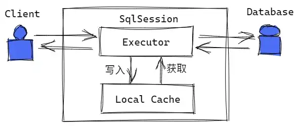
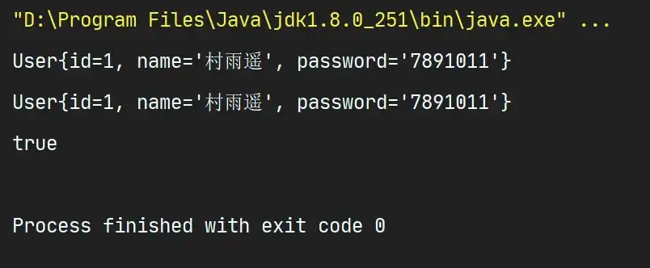
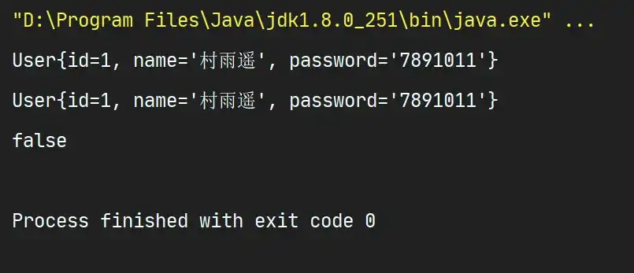
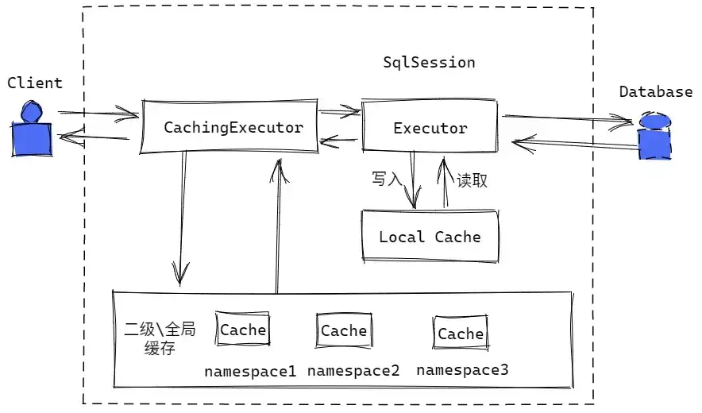
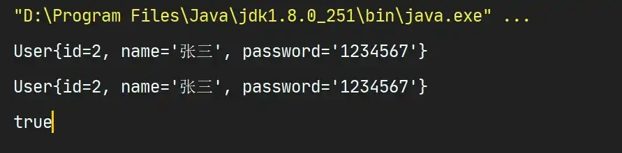

# 一二级缓存

## 1. 前言

### 1.1 什么是缓存

缓存是存在内存中的临时数据，通过将我们 **经常查询但不常变的数据** 放在内存中，当我们查询数据时就不在需要从磁盘读取，而只需要从缓存中查询即可，大大提升了查询的效率，解决了高并发系统的性能问题。

### 1.2 为什么需要缓存

既然我们可以直接从数据库中查询数据，那为什么还要需要缓存呢？通过使用缓存，我们能够减少和数据库之间的交互频率，减少系统开销，从而提高系统的效率。

## 2. MyBatis 缓存

MyBatis 内置了一个强大的事务性查询缓存机制，通过它能够十分方便的配置和定制。默认情况下，MyBatis 默认定义了两级缓存，而且为了提高扩展性，定义了缓存接口 `Cache`，我们能十分方便的实现 `Cache` 接口来自定义二级缓存。 

-   **一级缓存**：也叫 **本地缓存**，默认情况下开启的缓存（`SqlSession` 级别的缓存）；
-   **二级缓存**：基于 `namespace` 级别的缓存，需要我们手动进行开启和配置；

## 3. 一级缓存

也叫 **本地缓存**，在与数据库同一次会话期间查询到的数据放在本地缓存，当要再次获取相同数据时，直接从缓存获取即可，不用再次和数据库交互。

### 3.1 一级缓存原理



每个 `SqlSession` 中都有一个 `Executor`，每个 `Executor` 中又有一个 `LocalCache`，当我们进行查询操作时，MyBatis 根据当前执行的语句生成 `MapperdStatement`，然后在 `Local Cache` 中进行查询，如果存在（命中），直接返回给用户。若缓存中不存在（未命中），则和数据库交互查询数据，将结果写入 `Local Cache`，同时返回给用户。

### 3.2 如何使用一级缓存

一级缓存即 `SqlSession` 级别的缓存，和我们之前的 CURD 操作差不多；

1.  首先在接口中添加方法；

```java
@Select("select * from user where id=#{id}")
User queryUserById(@Param("id") int id);
```

2.  测试

```java
@Test
public void testQueryUserById() {
    SqlSession sqlSession = MybatisUtil.getSqlSession();
    UserDao mapper = sqlSession.getMapper(UserDao.class);

    User user1 = mapper.queryUserById(1);
    System.out.println(user1);

    User user2 = mapper.queryUserById(1);
    System.out.println(user2);

    System.out.println(user1 == user2);

    sqlSession.close();
}
```

3.  结果



通过结果可以看出，由于是在一次会话期间内（`SqlSession` 级别），所以此时的 SQL 语句只查询了一次，当第二次获取相同结果时，直接从缓存中取结果即可，也就解释了为什么 `user1` 和 `user2` 指向的是同一个对象；

### 3.3 一级缓存失效的情况

一级缓存是默认一直开启的，我们是关闭不了的。但是有时候一级缓存会出现失效的情况，主要可能是如下几种原因导致；

1.  **每个 `SqlSession` 中缓存独立**

当我们使用不同的 `SqlSession` 时，有多少个 `SqlSession` 就需要向数据库发起多少次查询请求。

```java
@Test
public void testQueryUserById() {
    SqlSession sqlSession1 = MybatisUtil.getSqlSession();
    UserDao mapper1 = sqlSession1.getMapper(UserDao.class);

    SqlSession sqlSession2 = MybatisUtil.getSqlSession();
    UserDao mapper2 = sqlSession2.getMapper(UserDao.class);

    User user1 = mapper1.queryUserById(1);
    System.out.println(user1);

    User user2 = mapper2.queryUserById(1);
    System.out.println(user2);

    System.out.println(user1 == user2);

    sqlSession1.close();
    sqlSession2.close();
}
```



2.  **当前缓存中不存在该数据时**

当位于同一个 `SqlSession`，但查询条件不同时，也会导致缓存失效；

```java
@Test
    public void testQueryUserById1() {
        SqlSession sqlSession = MybatisUtil.getSqlSession();
        UserDao mapper = sqlSession.getMapper(UserDao.class);

        User user = mapper.queryUserById(1);
        System.out.println(user);

        User user2 = mapper.queryUserById(2);
        System.out.println(user2);

        System.out.println(user == user2);

        sqlSession.close();
    }
```


3.  **其他 CURD 操作对当前数据造成影响**

假如在同一 `SqlSession` 中，在两次查询之间进行了其他的增删改等操作，当第二次查询进行时，就会重新执行 SQL 语句，导致缓存失效；

```java
@Test
public void testQueryUserById() {
    SqlSession sqlSession = MybatisUtil.getSqlSession();
    UserDao mapper = sqlSession.getMapper(UserDao.class);

    User user = mapper.queryUserById(1);
    System.out.println(user);

    mapper.updateUser(new User(2,"小玉","8349823"));

    User user2 = mapper.queryUserById(1);
    System.out.println(user2);

    System.out.println(user == user2);

    sqlSession.close();
}
```


4.  **手动清除**

当 `SqlSession` 相同时，如果我们手动清除了缓存，那么也会导致缓存失效的情况出现。

```java
@Test
public void testQueryUserById1() {
    SqlSession sqlSession = MybatisUtil.getSqlSession();
    UserDao mapper = sqlSession.getMapper(UserDao.class);

    User user = mapper.queryUserById(1);
    System.out.println(user);

    // 手动清除缓存
    sqlSession.clearCache();

    User user2 = mapper.queryUserById(1);
    System.out.println(user2);

    System.out.println(user == user2);

    sqlSession.close();
}
```


## 4. 二级缓存

也叫 **全局缓存**，基于 `namespace` 的缓存，一个 `namespace` 对应一个二级缓存。

### 4.1 二级缓存原理



一级缓存的最大共享范围是一个 `SqlSession` 内部，若多个 `SqlSession` 之间要共享缓存，则需要用二级缓存。二级缓存一旦开启，将会有多个 `CachingExecutor` 来装饰 `Executor`，进入一级缓存的查询流程之前，先在 `CachingExecutor` 中进行二级缓存的查询，如上图。此时数据的查询流程是：

>   二级缓存 -> 一级缓存 -> 数据库

### 4.2 如何使用二级缓存

要使用二级缓存，通常需要有如下步骤：

1.  首先在 MyBatis 配置文件（一般是 `mybatis-config.xml`）中开启二级缓存；

```xml
<setting name="cacheEnabled" value="true"/>
```

2.  然后到对应的 `xxxMapper.xml` 中配置二级缓存；

```xml
<cache/>
```

配置之后，`xxxMapper.xml` 文件中的 `select` 语句将会被缓存，而 `insert、update、delete` 则会刷新缓存。此外还可以设置自定义属性值来修改默认属性；

| 属性            | 说明                  |
| --------------- | --------------------- |
| `eviction`      | 清除策略              |
| `flushInterval` | 刷新间隔，单位是 `ms` |
| `size`          | 引用数目，默认为 1024 |
| `readOnly`      | 默认为 `false`        |

而清除策略也主要有如下 4 种：

| 清除策略 | 说明                                                       |
| -------- | ---------------------------------------------------------- |
| `LRU`    | **最近最少使用**：移除最长时间不被使用的对象               |
| `FIFO`   | **先进先出**：按对象进入缓存的顺序来移除                   |
| `SOFT`   | **软引用**：基于垃圾回收器状态和软引用规则移除对象         |
| `WEAK`   | **弱引用**：更积极地基于垃圾回收器状态和若引用规则移除对象 |

3.  测试

```java
@Test
public void testGetUserByPassword() {
    SqlSession sqlSession = MybatisUtils.getSqlSession();
    SqlSession sqlSession2 = MybatisUtils.getSqlSession();

    UserDao mapper = sqlSession.getMapper(UserDao.class);
    UserDao mapper2 = sqlSession.getMapper(UserDao.class);

    User user = mapper.getUserByPassword("1234567");
    System.out.println(user);


    User user2 = mapper2.getUserByPassword("1234567");
    System.out.println(user2);
    System.out.println(user==user2);

    sqlSession.close();
    sqlSession2.close();
}
```

4.  结果



根据结果可以看出，此时的二级缓存已经生效。若是未生效，则会和一级缓存中的结果一致，两者指向不同的对象，但此时两个引用指向同一对象，说明二级缓存成功。