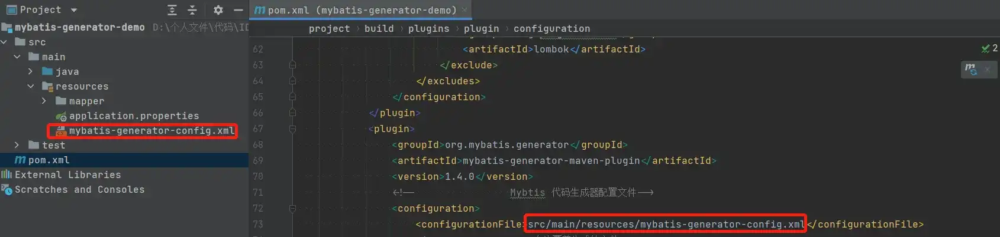
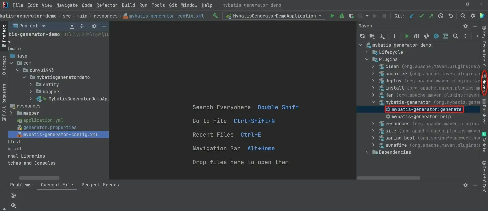

# 代码自动生成器

## 前言

在日常开发工作中，我们往往需要自己去构建各种数据表所对应的持久化对象（PO）、用于操作数据库的接口（DAO）以及跟 DAO 所绑定的对应 XML。这都是一些重复性的操作，不需要多大技术含量，这时候我们不禁会去想，有没有一种工具，能够帮助我们去自动生成这些文件呢？答案是：有的！

本文接下来的内容主要适用于使用 MyBatis 来做持久层框架开发的工作，如果不是使用 MyBatis，那么可能本文不太适合你的开发场景。

## MyBatis Generator 简介

作为一个基于 MyBatis 的独立工具，MyBatis Generator 能够满足我们以上的要求，能够通过简单的配置去帮我们生成数据表所对应的 PO、DAO、XML 等文件，减去我们手动去生成这些文件的时间，有效提高开发效率。MyBatis Generator 运行方式多样，主要可以通过以下几种方式来运行：

1.   命令行
2.   Ant
3.   Maven
4.   Java
5.   Eclipse

而我平时主要在 Maven 中配置并使用，所以本文主要基于 Maven 环境来进行讲解。

## 准备工作

### 引入插件

既然要使用 MyBatis Generator，那么肯定我们的项目中已经配置了数据库和 MyBatis 的相关依赖，如果还没有配置，那么可以在 `pom.xml` 文件中进行配置，这里主要以 MySQL 数据库为例。

```xml
<dependencies>
    <dependency>
        <groupId>mysql</groupId>
        <artifactId>mysql-connector-java</artifactId>
    </dependency>
    <dependency>
        <groupId>org.mybatis.spring.boot</groupId>
        <artifactId>mybatis-spring-boot-starter</artifactId>
    </dependency>
</dependencies>
```

接着我们继续引入 MyBatis Generator 的相关配置。

```xml
<build>
    <plugins>
        <plugin>
            <groupId>org.mybatis.generator</groupId>
            <artifactId>mybatis-generator-maven-plugin</artifactId>
            <version>1.4.0</version>
        </plugin>
    </plugins>
</build>
```

### 插件配置

完成上述步骤后，我们只是完成了 MyBatis Generator 的引入工作，要想让它正常工作，我们还需要对它进行配置，而 MyBatis Generator 在 `pom.xml` 中的主要配置主要有以下几点。

1.   **代码生成器的配置文件所在路径**

这里主要配置 MyBatis Generator 配置文件所在路径，一般我们将其放在 `resources` 路径中，而配置文件的名字则可以自定义，这里我以 `mybatis-generator-config.xml` 为例，此时需要将如下配置加入到 `pom.xml` 文件中。

```xml
<configuration>
    <configurationFile>src/main/resources/mybatis-generator-config.xml</configurationFile>
</configuration>
```



2. **是否每次新生成后覆盖已生成的文件**

由于项目需求，假设我们的数据库表中有需要新增新的字段，而我们之前已经使用过 MyBatis Generator 生成过相关文件。此时，如果我们想要将新加的字段加入原来生成的文件中，第一种可以采取手动的方式，将旧文件删除，然后重新生成。第二种则是在 MyBatis Generator 中配置，让每次新生成的文件都直接覆盖掉旧文件。具体配置如下，`true` 则代表覆盖，`false` 则代表不覆盖。

```xml
<configuration>
    <overwrite>true</overwrite>
</configuration>
```

不过有一点需要注意，就算我们设置了覆盖旧文件，MyBatis Generator 也只会覆盖原来的 PO、DAO 文件，此时 Mapper 不会被覆盖，而是采取追加的方式，从而保证我们自己添加的 sql 语句不会被覆盖掉。

3.   **数据库驱动依赖**

虽然在项目的 `pom.xml` 文件中我们已经配置了数据库的相关依赖，但是在 MyBatis Generator 配置中仍然需要对其进行再次配置。此时，这里有两种方式供我们选择。

第一种是再次在引入数据库依赖，具体配置方式如下：

```xml
<build>
    <plugins>
        <plugin>
            <groupId>org.mybatis.generator</groupId>
            <artifactId>mybatis-generator-maven-plugin</artifactId>
            <version>1.4.0</version>
            <dependencies>
                <dependency>
                    <groupId>mysql</groupId>
                    <artifactId>mysql-connector-java</artifactId>
                    <version>8.0.17</version>
                </dependency>
            </dependencies>
        </plugin>
    </plugins>
</build>
```

第二种则是利用 Maven 的 `includeCompileDependencies` 属性。一般来讲，我们的项目中肯定已经引入过数据库的相关依赖了，那我们此时配置 `includeCompileDependencies` 就好了，具体配置方式如下：

```xml
<configuration>
    <includeCompileDependencies>true</includeCompileDependencies>
</configuration>
```

### MyBatis Generator 配置

我们在上述步骤中已经引入了 MyBatis Generator，而且也在项目配置文件 `pom.xml` 中配置了 MyBatis Generator 配置文件所在的路径、是否进行文件覆盖以及数据库依赖配置，接下来就该具体来看看，如何对 MyBatis Generator 进行具体配置，配置我们生成代码中的各种细节。

1.   **外部配置文件**

一般我们需要引入外部文件，主要用于配置项目数据库，方便我们后续的设置，而引入外部配置文件的方式也很简单，具体配置如下：

```xml
<generatorConfiguration>
    <!-- 引入配置文件 -->
    <properties resource="generator.properties"/>
</generatorConfiguration>
```

2.   **context 配置**

除开外部配置外，`context` 无疑是 MyBatis Generator 中最重要的配置了。一个 `context` 配置的具体示例如下：

```xml
<context id="myContext" targetRuntime="MyBatis3" defaultModelType="flat">
</context>
```

其中的各个属性含义如下：

-   **id**：唯一标识，不可重复，可以根据我们自己的喜好进行自定义。
-   **defaultModelType**：非必填项，有两个值可选，一个是 `conditional`，也是默认值，另一个值是 `flat`，也就是我们常用的一个配置，表示数据库中的一张表对应生成一个 PO。
-   **targetRuntime**：非必填项，这里同样有两个值可选，一个是 `MyBatis3`，一个是 `MyBatis3Simple`，两者的最主要区别在于不同配置下所生成的 DAO 和 Mapper 会有所不同，后者生成的 DAO 和 Mapper 会少很多，只含有日常最常用的。

`context` 除了上面配置的之外，还有许多子元素需要配置，而且这些子元素的配置的个数以及顺序都是规定好的，如果不按照给定的规则进行配置，则会导致错误，常见子元素及个数配置如下（按照规定的顺序进行从上到下排序）：

| 子元素                | 最少个数 | 最多个数 |
| --------------------- | -------- | -------- |
| `property`            | 0        | N        |
| `plugin`              | 0        | N        |
| `commentGenerator`    | 0        | 1        |
| `jdbcConnection`      |          |          |
| `javaTypeResolver`    | 0        | 1        |
| `javaModelGenerator`  | 1        | N        |
| `sqlMapGenerator`     | 0        | 1        |
| `javaClientGenerator` | 0        | 1        |
| `table`               | 1        | N        |

接下来依次对各个子元素进行简单的配置讲解。

### context 子元素配置

1.   **property**

如果我们要给我们的所生成文件的编码类型进行设置，则可以在此处进行配置，具体配置如下：

```xml
<property name="javaFileEncoding" value="UTF-8"/>
```


2.   **plugin**

默认生成的 PO 中，只包含了各个各个属性声明以及各个属性所对应的 `setter/getter`，如果我们想要生成对应 PO 的 `equals` 和 `hashCode` 方法，则可以通过配置如下插件来实现。

```xml
<plugin type="org.mybatis.generator.plugins.EqualsHashCodePlugin"/>
```

要生成 `toString` 方法，则可以使用如下插件：

```xml
<plugin type="org.mybatis.generator.plugins.ToStringPlugin"/>
```

为模型生成序列化方法，则使用如下插件：

```xml
<plugin type="org.mybatis.generator.plugins.SerializablePlugin"/>
```

3.   **commentGenerator**

该配置主要用于配置生成的注释，默认情况下是会生成注释的，而且会带上时间戳，如果我们不需要这些配置，则可以通过如下配置来清除：

```xml
<commentGenerator>
    <!-- 是否去除自动生成的注释 true：是 ： false:否 -->
    <property name="suppressAllComments" value="true"/>
    <!-- 是否去除自动生成的时间戳 true：是 ： false:否 -->
    <property name="suppressDate" value="true"/>
    <!-- 是否添加数据库表中字段的注释 true：是 ： false:否，只有当suppressAllComments 为 false 时才能生效 -->   
    <property name="addRemarkComments" value="true"/>
</commentGenerator>
```

4.   **jdbcConnection**

既然要自动生成对应文件，那肯定得链接数据库，所以我们需要对数据库进行配置，上面我们讲过导入外部配置文件，我们可以通过这种方式将数据库的配置定义在外部文件中，然后通过导入该文件进行配置即可，具体可以通过如下具体步骤进行：

```xml
<jdbcConnection driverClass="${jdbc.driver-class-name}"
                connectionURL="${jdbc.url}"
                userId="${jdbc.username}"
                password="${jdbc.password}">
    <!--高版本的 mysql-connector-java 需要设置 nullCatalogMeansCurrent=true-->
    <property name="nullCatalogMeansCurrent" value="true"/>
</jdbcConnection>
```

5.   **javaTypeResolver**

主要用于配置 JDBC 和 Java 中的类型转换规则，如果我们不配置，会采用默认的一套转换规则，而如果我们需要自定义，也只能配置 `bigDecimal`、`NUMERIC` 和时间类型，不能去配置其他类型，否则会导致出错，具体配置规则如下：

```xml
<javaTypeResolver>
    <property name="forceBigDecimals" value="true"/>
    <property name="useJSR310Types" value="false"/>
</javaTypeResolver>
```

-   forceBigDecimals

该属性默认为 `false`，此时它会将 JDBC `DECIMAL` 和 `NUMERIC` 类型解析为 `Integer`，若该属性为 `true`，此时将会把 JDBC `DECIMAL` 和 `NUMERIC` 类型解析为 `java.math.BigDecimal`。

-   useJSR310Types

该属性默认为 `false`，它会将 JDBC 所有的时间类型都解析为 `java.util.Date`，若该属性为 `true`，则会按照如下规则进行解析：

| 转换前                    | 转换后                     |
| ------------------------- | -------------------------- |
| `DATE`                    | `java.time.LocalDate`      |
| `TIME`                    | `java.time.LocalTime`      |
| `TIMESTAMP`               | `java.time.LocalDateTime`  |
| `TIME_WITH_TIMEZONE`      | `java.time.OffsetTime`     |
| `TIMESTAMP_WITH_TIMEZONE` | `java.time.OffsetDateTime` |

6.   **javaModelGenerator**

这里主要用于配置自动生成的 PO 所在的包路径和项目路径，这里需要根据自己的需求进行配置，这里以我自己的配置为例，比如我的 PO 所在包为 `com.cunyu1943.mybatisgeneratordemo.entity`，项目路径为 `src/main/java`。

```xml
<javaModelGenerator targetPackage="com.cunyu1943.mybatisgeneratordemo.entity" targetProject="src/main/java">
    <!-- 是否让 schema 作为包的后缀，默认为 false -->
    <property name="enableSubPackages" value="false"/>
    <!-- 是否针对 String 类型的字段在 set 方法中进行修剪，默认 false -->
    <property name="trimStrings" value="true"/>
</javaModelGenerator>
```

7.   **sqlMapGenerator**

配置生成的 `Mapper.xml` 所存放的路径，比如我们要放在 `src/main/resources/mapper` 路径下，则配置如下：

```xml
<sqlMapGenerator targetPackage="mapper" targetProject="src/main/resources">
</sqlMapGenerator>
```

8.   **javaClientGenerator**

配置 `Mapper` 接口所存放的路径，一般我们都是存放在项目的 `mapper` 包下，如我的配置为：

```xml
<javaClientGenerator targetPackage="com.cunyu1943.mybatisgeneratordemo.mapper" targetProject="src/main/java"
                     type="XMLMAPPER">
</javaClientGenerator>
```

9.   **table**

配置所要自动生成代码的数据库表，这里一张表对应一个 `table`，如果要生成多张表，则需要配置多个 `table`，以下为一个具体实例：

```xml
<table schema="" tableName="user" domainObjectName="User"
       enableCountByExample="false" enableDeleteByExample="false" enableSelectByExample="false"
       enableUpdateByExample="false" selectByExampleQueryId="false">
    <!--是否使用实际列名,默认为false-->
    <property name="useActualColumnNames" value="false" />
</table>
```

其中，`schema` 是数据库名，有的数据库需要配置，有的数据库不需要配置，这里需要具体根据你自己所用的数据库来填写，不过建议都填上，方便不同数据库也可以适用。`tableName` 则对应数据库表名；`domainObjectName` 对应生成的实体类名，默认可以不用配置，不配置时它将按照帕斯卡命名法将表明转换为类名；而 `enableXXXByExample` 默认为 `true`，默认会生成一个 `Example` 帮助类，不过该配置只有在 `targetRuntime="MyBatis3"` 时才能生效，当 `targetRuntime="MyBatis3Simple"` 时，`enableXXXByExample` 无论如何配置都不起作用。

## 执行生成

经过上边的配置之后，我们就得到了整体的 MyBatis Generator 配置，完整的配置如下，可以根据自己的需求对其中的配置进行修改后即可使用。

```xml
<?xml version="1.0" encoding="UTF-8" ?>
<!--mybatis的代码生成器相关配置-->
<!DOCTYPE generatorConfiguration
        PUBLIC "-//mybatis.org//DTD MyBatis Generator Configuration 1.0//EN"
        "http://mybatis.org/dtd/mybatis-generator-config_1_0.dtd">

<generatorConfiguration>
    <!-- 引入配置文件 -->
    <properties resource="generator.properties"/>

    <!-- 一个数据库一个context,context的子元素必须按照它给出的顺序
        property*,plugin*,commentGenerator?,jdbcConnection,javaTypeResolver?,
        javaModelGenerator,sqlMapGenerator?,javaClientGenerator?,table+
    -->
    <context id="myContext" targetRuntime="MyBatis3Simple" defaultModelType="flat">
        <!--        设置生成文件的编码-->
        <property name="javaFileEncoding" value="UTF-8"/>

        <!-- 这个插件给生成的Java模型对象增加了equals和hashCode方法 -->
        <plugin type="org.mybatis.generator.plugins.EqualsHashCodePlugin"/>
        <!--        增加 toString 方法-->
        <plugin type="org.mybatis.generator.plugins.ToStringPlugin"/>
        <!--        生成序列化方法-->
        <plugin type="org.mybatis.generator.plugins.SerializablePlugin"/>

        <!-- 注释 -->
        <commentGenerator>
            <!-- 是否生成注释 true： 否： false: 是 -->
            <property name="suppressAllComments" value="true"/>
            <!-- 是否去除时间戳 true：是 ： false:否 -->
            <property name="suppressDate" value="true"/>
            <!-- 是否添加数据库表中字段的注释 true：是 ： false:否，只有当suppressAllComments 为 false 时才能生效 -->
            <property name="addRemarkComments" value="true"/>
        </commentGenerator>


        <!-- jdbc连接 -->
        <jdbcConnection driverClass="${jdbc.driver-class-name}"
                        connectionURL="${jdbc.url}"
                        userId="${jdbc.username}"
                        password="${jdbc.password}">
            <!--高版本的 mysql-connector-java 需要设置 nullCatalogMeansCurrent=true-->
            <property name="nullCatalogMeansCurrent" value="true"/>
        </jdbcConnection>

        <!-- 类型转换 -->
        <javaTypeResolver>
            <!--是否使用bigDecimal，默认false。
                false，把JDBC DECIMAL 和 NUMERIC 类型解析为 Integer
                true，把JDBC DECIMAL 和 NUMERIC 类型解析为java.math.BigDecimal-->
            <property name="forceBigDecimals" value="true"/>
            <!--默认 false
                false，将所有 JDBC 的时间类型解析为 java.util.Date
                true，将 JDBC 的时间类型按如下规则解析
                    DATE	                -> java.time.LocalDate
                    TIME	                -> java.time.LocalTime
                    TIMESTAMP               -> java.time.LocalDateTime
                    TIME_WITH_TIMEZONE  	-> java.time.OffsetTime
                    TIMESTAMP_WITH_TIMEZONE	-> java.time.OffsetDateTime
                -->
            <property name="useJSR310Types" value="false"/>
        </javaTypeResolver>

        <!-- 生成实体类地址 -->
        <javaModelGenerator targetPackage="com.cunyu1943.mybatisgeneratordemo.entity" targetProject="src/main/java">
            <!-- 是否让 schema 作为包的后缀，默认为false -->
            <property name="enableSubPackages" value="false"/>
            <!-- 是否针对string类型的字段在set方法中进行修剪，默认false -->
            <property name="trimStrings" value="true"/>
        </javaModelGenerator>


        <!-- 生成Mapper.xml文件 -->
        <sqlMapGenerator targetPackage="mapper" targetProject="src/main/resources">
        </sqlMapGenerator>

        <!-- 生成 XxxMapper.java 接口-->
        <javaClientGenerator targetPackage="com.cunyu1943.mybatisgeneratordemo.mapper" targetProject="src/main/java"
                             type="XMLMAPPER">
        </javaClientGenerator>


        <!-- schema为数据库名，oracle需要配置，mysql不需要配置。
             tableName为对应的数据库表名
             domainObjectName 是要生成的实体类名(可以不指定，默认按帕斯卡命名法将表名转换成类名)
             enableXXXByExample 默认为 true， 为 true 会生成一个对应Example帮助类，帮助你进行条件查询，不想要可以设为false
             -->
        <table schema="" tableName="user" domainObjectName="User"
               enableCountByExample="false" enableDeleteByExample="false" enableSelectByExample="false"
               enableUpdateByExample="false" selectByExampleQueryId="false">
            <!--是否使用实际列名,默认为false-->
            <property name="useActualColumnNames" value="false"/>
        </table>
    </context>
</generatorConfiguration>
```

其中，关于外部文件 `generator.properties` 的配置具体如下，主要对数据库的相关属性进行配置。

```properties
jdbc.username=root
jdbc.password=123456
jdbc.url=jdbc:mysql://localhost:3306/community?characterEncoding=UTF-8&serverTimezone=Asia/Shanghai
jdbc.driver-class-name=com.mysql.cj.jdbc.Driver
```

最后，当完成所有配置后，就可以利用 Maven 工具来进行代码生成了。具体操作方法如下，点击项目 Maven 配置中的 MyBatis Generator 生成即可。



## 总结

以上就是利用 Maven 搭配 MyBatis Generator 来配置生成项目 PO、Mapper、XXXMapper.xml 的具体搭建过程了。如果你也刚好有这个需求，那赶紧去试试吧。搭建过程中如果遇到什么问题，欢迎评论区留言交流，我会在看到的第一时间回复。

最后，关于本示例的相关代码，我已经传到了 GitCode，如果有需要的兄弟，可以自取。

>   🎉🎉🎉 传送门 -> [mybatis-generator-demo](https://gitcode.net/github_39655029/java-learning-demos)