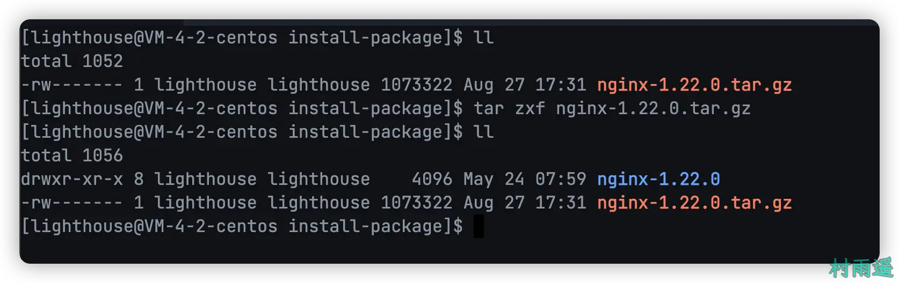
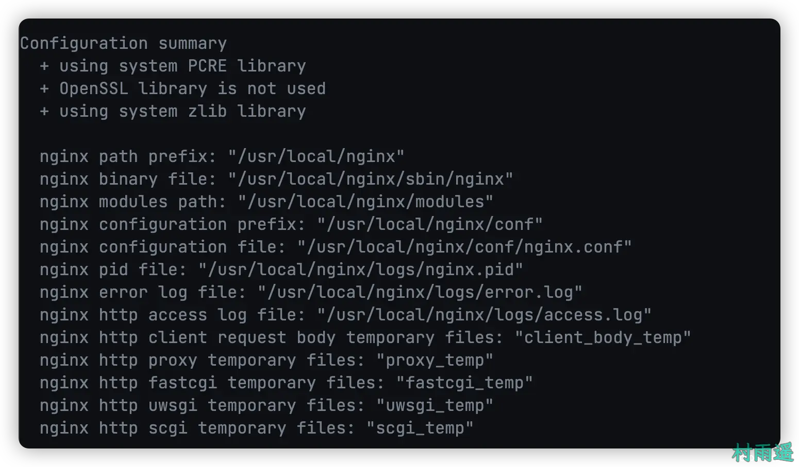
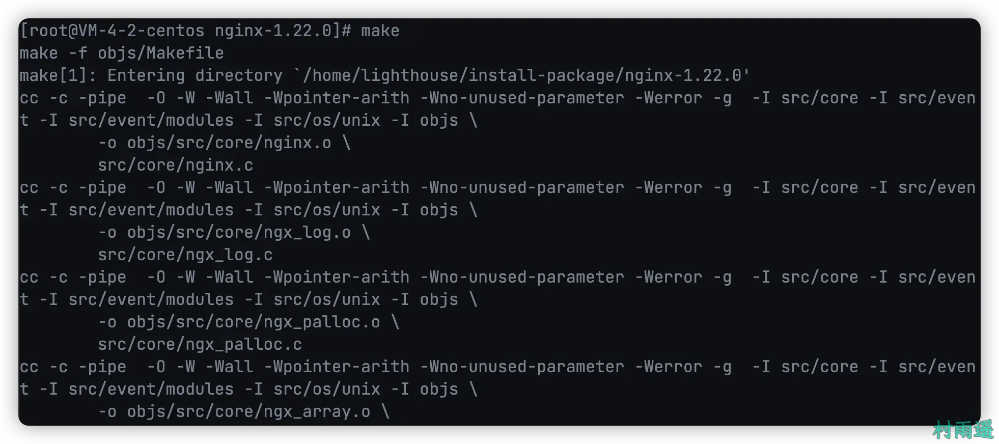
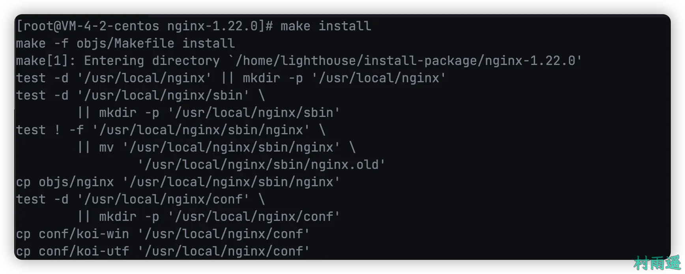
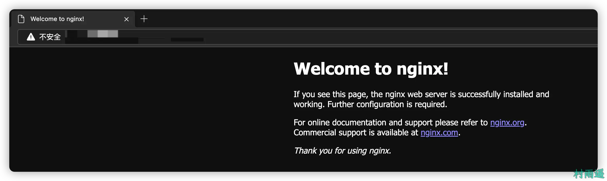

# 简介与环境搭建

::: info 共勉
不要哀求，学会争取。若是如此，终有所获。
:::
::: tip 原文
https://mp.weixin.qq.com/s/Fx4AAS5pUqSGtui4Z-LYXA
:::

## 一、简介

### 1. 什么是 Nginx

`Nginx` 是一个跨平台、轻量级、高性能的 `HTTP` 和反向代理 `web` 服务器，而且同时也提供了 `IMAP/POP3/SMTP` 服务。`Nginx` 最高能够支持搞到 50000 哥并发连接数的相应，在最高并发连接的情况下，可以作为 `Apache` 服务的一个替代品。

`Nginx` 作为负载均衡服务，既可以在内部直接支持 `Redis` 和 `PHP` 程序对外进行服务，也可以作为支持 `HTTP` 代理服务对外进行支持。`Nginx` 是基于 C 语言来进行开发的，所以无论是系统资源开销还是 CPU 使用率都较低，也因此 `Nginx` 性能较强。
### 2. Nginx 的版本

常用版本主要分为四大阵营：

1.   `Nginx` 开源版
2.   `Nginx plus` 商业版
3.   `Openresty`
4.   `Tengine`

## 二、下载

上一节中我们讲了 `Nginx` 的一些简单知识，接下来就来看看，如何在我们的服务器中安装 `Nginx`。下文中，我们均以 `Nginx` 开源版做示范。

前往 `Nginx` 官方地址下载对应的版本，因为这里主要是在服务器中安装，所以是以 `Linux（Centos）` 版本来演示。

>   http://nginx.org/en/download.html


## 三、编译安装与依赖检查

将下载后的 `Nginx` 压缩包进行解压，解压命令如下。

```shell
tar -zxf 压缩包名
```

进入解压缩后的 `Nginx` 所在文件夹，然后执行 `configure` 脚本，这时候就会检查安装 `Nginx` 所需的依赖，这里可能会因为你的服务器中没有事先安装所需依赖而导致报错。

```shell
cd nginx-1.22.0
sh configure
```


这里例举几个安装时可能会遇到的错误：

1. **C 编译器缺失**

```shell
error: C compiler cc is not found.
```

要解决这个错误，只需要安装 `gcc` 编译器即可。

```shell
yum install -y gcc
```

2. **PCRE Library 缺失**

```shell
error: the HTTP rewrite module requires the PCRE library.
```
同样，为了解决这个这个问题，需要安装 `pcre-devel`。

```shell
yum install -y pcre pcre-devel
```

3. **zlib Library 缺失**

```shell
error: the HTTP gzip module requires zlib library.
```
解决方法，安装 `zlib` 库。

```shell
yum install -y zlib zlib-devel
```


如果出现以上的提示信息，则说明可以进行下一步，此时直接执行编译安装命令。

```shell
make

make install
```



## 四、Nginx 启停


如果顺利执行完 `configure` 脚本，则会在服务器终端打印出以上 `Nginx` 相关的配置。

进入 `Nginx` 安装后的目录 `/usr/local/nginx/sbin`，然后利用以下命令来进行 `Nginx` 的启动。

### 1. 启动

```shell
./nginx
```

然后在浏览器中访问服务器的 `IP` 地址，如果出现以下界面，则说明我们的 `Nginx` 安装并启动成功了！



### 2. 快速停止

```shell
./nginx -s stop
```
停止后，再到浏览器中去访问服务器地址，就会出现以下情况。


### 3. 关闭前完成已接受的连接请求

```shell
./nginx -s quit
```

### 4. 重新加载配置

```shell
./nginx -s reload
```

通过这种方式，可以实现 `Nginx` 的无感重启。也就是说，当我们需要修改 `Nginx` 的配置时，不希望通过停止 `Nginx` 然后在启动的方式，此时就可以通过这个命令来实现。

## 五、防火墙

### 1. 关闭防火墙

```shell
systemctl stop firewall.service
```

### 2. 禁止防火墙开机启动

```shell
systemctl disable firewall.service
```
### 3. 放行端口

```shell
firewall-cmd --zone=public --add-port=80/tcp --permanent
```

### 4. 重启防火墙

```shell
firewall-cmd reload
```

## 五、安装为系统服务

### 1. 添加系统服务

在 `/usr/lib/systemd/system` 目录下新增一个文件，命名为 `nginx.service`，然后将以下内容添加到该文件中。

```shell
[Unit]
Description=nginx - high performance web server
Documentation=http://nginx.org/en/docs/
After=network.target remote-fs.target nss-lookup.target
 
[Service]
Type=forking
PIDFile=/usr/local/nginx/logs/nginx.pid
ExecStartPre=/usr/local/nginx/sbin/nginx -t -c /usr/local/nginx/conf/nginx.conf
ExecStart=/usr/local/nginx/sbin/nginx -c /usr/local/nginx/conf/nginx.conf
ExecReload=/bin/kill -s HUP $MAINPID
ExecStop=/bin/kill -s QUIT $MAINPID
PrivateTmp=true
 
[Install]
WantedBy=multi-user.target
```

### 2. 重载系统服务

接着执行以下命令重新加载系统服务。

```shell
systemctl daemon-reload
```

### 3. 启停 Nginx

接着就可以分别利用下面的命令来启动和关停 `Nginx` 服务了。

- 启动

```shell
systemctl start nginx
```
- 关停

```shell
systemctl stop nginx
```
- 查看当前状态

```shell
systemctl status nginx
```


## 六、总结

以上就是 `Nginx` 的简介和如何在 Linux 中安装 `Nginx` 的相关内容了，如果您觉得本文对您有所帮助，还请来个一键三连支持把！

## ⏳ 联系

想解锁更多知识？不妨关注我的微信公众号：**村雨遥（id：JavaPark）**。

扫一扫，探索另一个全新的世界。


<Share colorful />