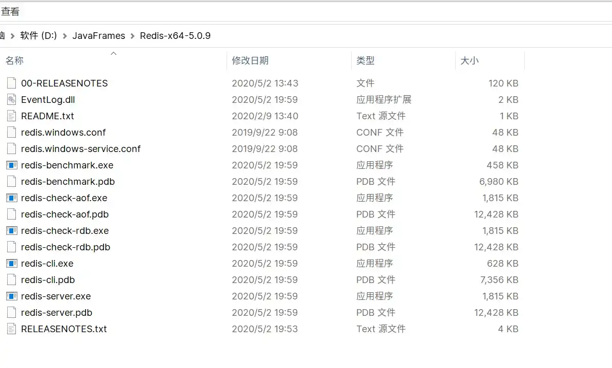
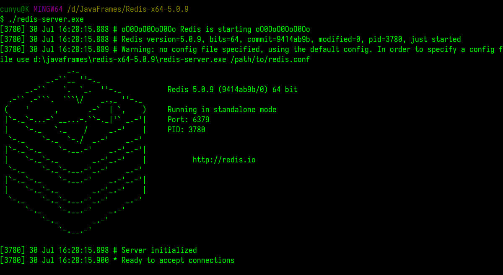
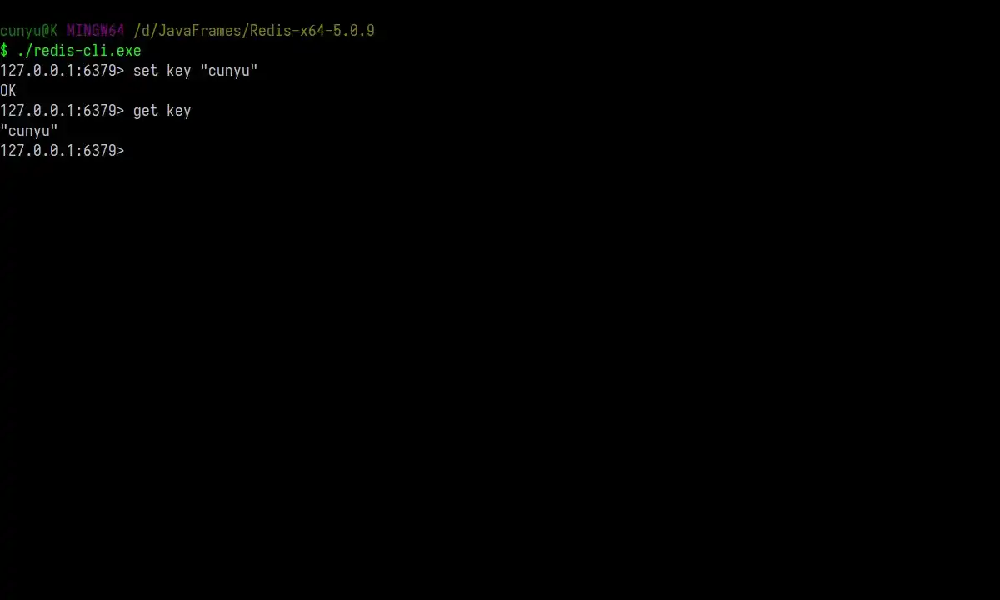
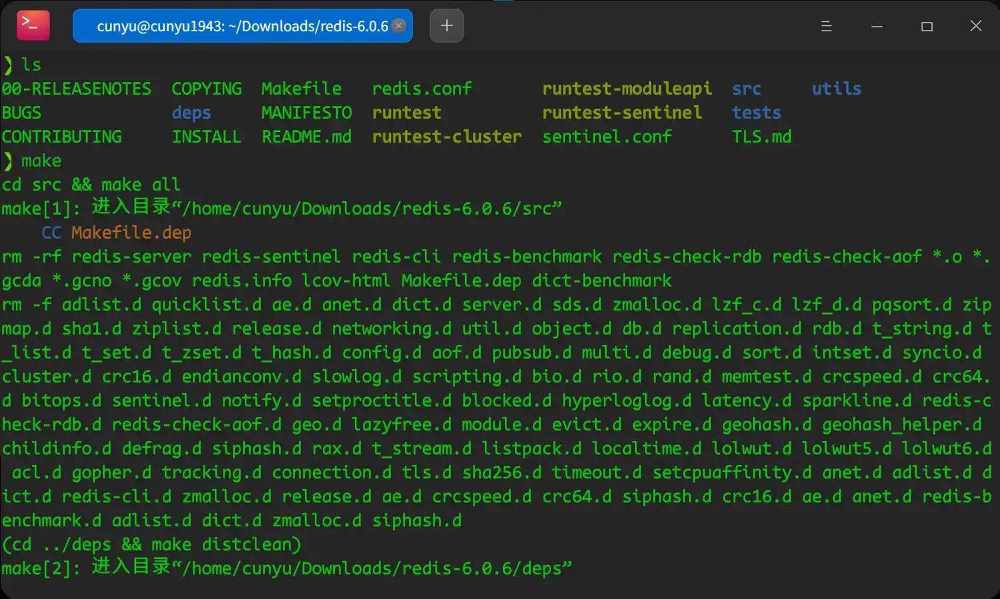
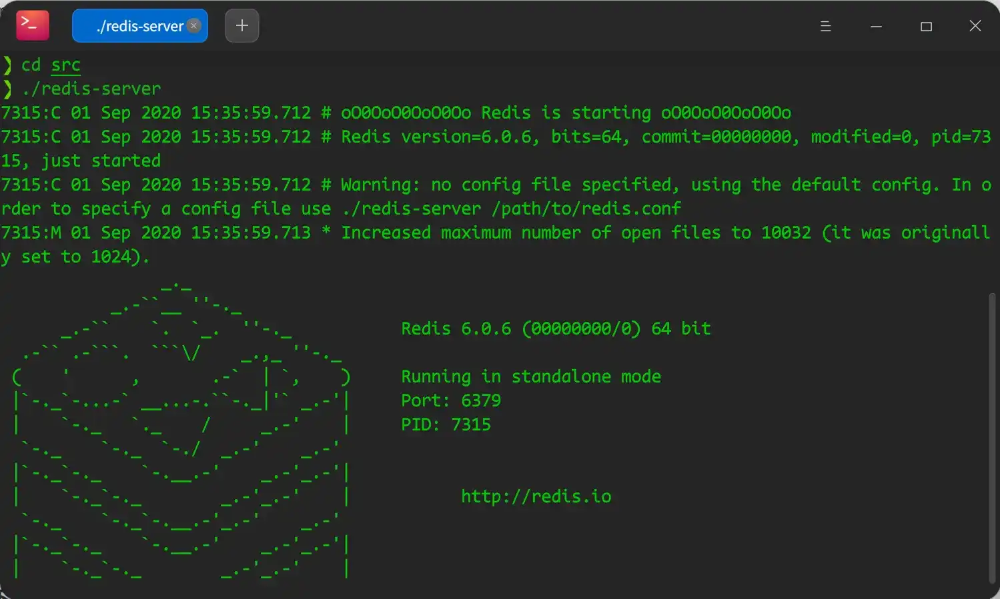
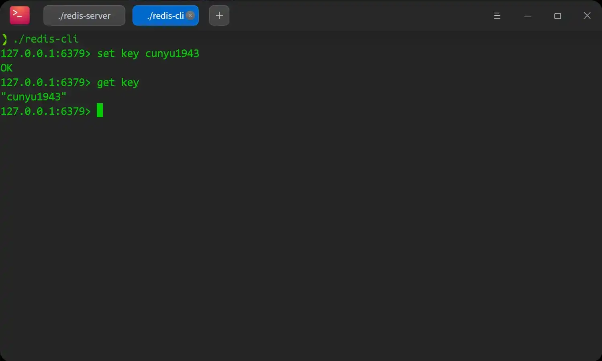

# 简介

## 前言

说到 Redis，大家可能第一反应就是它是当前最受欢迎的 NoSQL 数据库之一。那么在正式介绍 Redis 之前，我们先来看看关于 NoSQL 的一些相关信息，比如它是什么，又比如它的一些特点以及它的一些分类。那么我们接下来就从以上三个方面来对 NoSQL 的相关历史做一个简单介绍，然后再去看看 Redis 的相关知识。

### 什么是 NoSQL

>   **NoSQL = Not Only SQL**

**泛指非关系型数据库**，随 Web2.0 的诞生，传统关系型数据库难以应对 Web2.0，尤其是超大规模的高并发社区。NoSQL 在当今大数据程序下较为流行。

### NoSQL 特点

1.  **高扩展性**（数据间无关系，容易扩展）
2.  **大数据量高性能**（官方给定数据，写操作 8w次/s，读操作 11w次/s）
3.  **数据类型多样**（无需事先设计数据库，随取随用）
4.  **高可用**
5.  传统 RDBMS 和 NoSQL
    -   传统 RDBMS
        -   结构化组织
        -   SQL
        -   数据和关系均存在单独的表中
        -   操作数据定义语言
        -   严格的一致性
        -   基础的事务
        -   ……
    -   NoSQL
        -   不仅仅是数据
        -   无固定查询语言
        -   键值对存储，列存储、文档存储、图形数据库
        -   最终一直性
        -   CAP 定理和 BASE
        -   高性能，高可用，高可拓
        -   ……

### NoSQL 的四大分类

NoSQL 主要可以分为如下四大类，然后关于各类的实例、应用场景、数据模型以及各个类型的一些优缺点，可以参见下面的表。

1.  **KV 键值对**
2.  **文档型数据库（bson & json）**
3.  **列存储数据库**
4.  **图关系数据库**

| 分类                    | 实例             | 应用场景                                                   | 数据模型                                           | 优点                                                         | 缺点                                                         |
| ----------------------- | ---------------- | ---------------------------------------------------------- | -------------------------------------------------- | ------------------------------------------------------------ | ------------------------------------------------------------ |
| **键值对（key-value）** | Redis、Voldemort | 内存缓存，用于处理大量数据的高访问负载，也可用于日志系统等 | key 指向 value 的键值对，通常是用 HashTable 来实现 | 查找速度快                                                   | 数据无结构化，通常只被当做字符串或二进制数据                 |
| **列存储数据库**        | HBase            | 分布式文件系统                                             | 以列簇式存储，讲同一列数据存储在一起               | 1. 查找速度快<br />2. 扩展性强<br />3. 更容易进行分布式扩展  | 功能相对局限                                                 |
| **文档型数据库**        | MongoDb          | Web 应用，类似于 Key-Value                                 | key-value 对应的键值对，value 为结构化的数据       | 1. 数据结构要求宽松<br />2. 表结构可变，无需像关系型数据库一样预先定义表结构 | 查询性能低，且查询语法不统一                                 |
| **图形数据库（Graph）** | Neo4j、InfoGrid  | 社交网络、推荐系统等                                       | 图结构                                             | 可以利用图结构相关算法，如最短路径寻址、N度关系查找等        | 许多时候需要对整个图进行计算才能得到最终结果，效率不高；而且做分布式集群较困难 |

## 什么是 Redis

以上对 NoSQL 做了一个简介之后，接下来就轮到我们今天的主角 - Redis 了。接下来，我将从相关简介，如何安装以及常用基本操作几个方面来对 Redis 进行介绍。

### Redis 特点

Redis 是一个高性能的开源的 `key-value` 数据库，底层由 C 语言实现，相比于其他同类型产品，有如下特点。

-   支持数据持久化，可以将内存中的数据保存在磁盘中，重启时再次加载使用即可；
-   不仅支持 `key-value` 类型的数据，同时还支持 `list、set、hash、zset` 等数据结构的存储；
-   支持 `master-slave` 模式的数据备份；

### Redis 优势

-   高性能；
-   支持的数据类型丰富；
-   原子性，要么成功执行，要么失败完全不执行。单个操作时原子性的，多个操作也支持事务，通过 `MULTI` 和 `EXEC` 指令封装；
-   支持其他丰富的特性，如 `publish/subscribe`，通知，`key` 过期等；

### Redis 的应用场景

1.  内存存储、持久化
2.  高效率，可以用于高速缓存
3.  发布订阅系统
4.  地图信息分析
5.  计时器、计数器
6.  任务队列
7.  数据过期处理
8.  应用排行榜
9.  ……

### Redis 和其他 key - value 数据库的不同

1.  Redis 的数据结构更加复杂且提供对他们的原子性操作，而且基于基本数据结构的同时也对程序员透明，无需进行额外抽象；
2.  Redis 运行在内存中但是可以持久化到硬盘，所以在对不同数据集进行高速读写是需要权衡内存大小，数据量不能大于硬件内存；

## Redis 安装

### Windows 下安装

1.  去下载安装包，https://github.com/tporadowski/redis/releases，支持 32 和 64 位，按需下载即可；
2.  解压缩下载后的压缩包，并存在你自己指定的目录；



3.  打开终端，然后切换到 Redis 目录，运行如下命令即可：

```shell
./redis-server.exe
```



4.  打开另一个窗口，在 Redis 目录下运行另一个 Redis，然后进行设置和取出键值对测试；

```shell
./redis-cli.exe
# 设置键值对
set key "cunyu"
# 取出键值对
get
```



### Linux 下安装

1.  下载最新版本安装包，http://redis.cn/download
2.  使用如下命令解压安装包到你需要存储的位置，然后进行编译

```bash
＃　解压
tar -zxvf redis-6.0.6.tar.gz
＃　进入文件夹
cd redis-6.0.6
＃　编译
make
```



3.  在一个终端中启动服务端



4.  在另一个终端中启动客户端进行测试



### 注意

当在控制台中获取中文键值时，可能会出现乱码的情况，此时，可以通过在启动客户端时加入 `--raw` 参数即可解决；

```bash
# 可能乱码的启动方式
./redis-cli
# 解决乱码的启动方式
./redis-cli --raw
```

## 基本操作及常识

1.  选择对应数据库

```shell
# redis 默认提供 16 个数据库，默认使用 0 号数据库
select num(数据库编号)
```

2.  获取数据库名

```shell
get name
```

3.  查看数据库大小

```shell
DBSIZE
```

4.  查看数据库所有 key

```shell
keys *
```

5.  清空数据库

```shell
# 清空所有数据库
FLUSHALL

# 清空当前数据库
flush db
```

6.  查看某 key 是否存在

```shell
EXISTS key
```

7.  移除当前 key

```shell
move key value
```

8.  设置 key 过期时间

```shell
# time 时间单位为秒
EXPIRE key time
```

9.  查看当前 key 的类型

```time
type key
```

## 总结

OK，以上就是今天的所有内容了。主要介绍了 NoSQL 的相关知识，接着引入 Redis 的特点、优点、应用场景、和其他同类型数据库的区别、然后介绍 Redis 的安装以及安装过程中需要注意的事项，最后则是对 Redis 在日常使用时使用最频繁的一些命令进行了说明。

最后，原创不宜，如果你觉得本文对你有所帮助，还请各位点赞关注一波，也算是对我的一种鼓励吧，让我能够继续坚持！