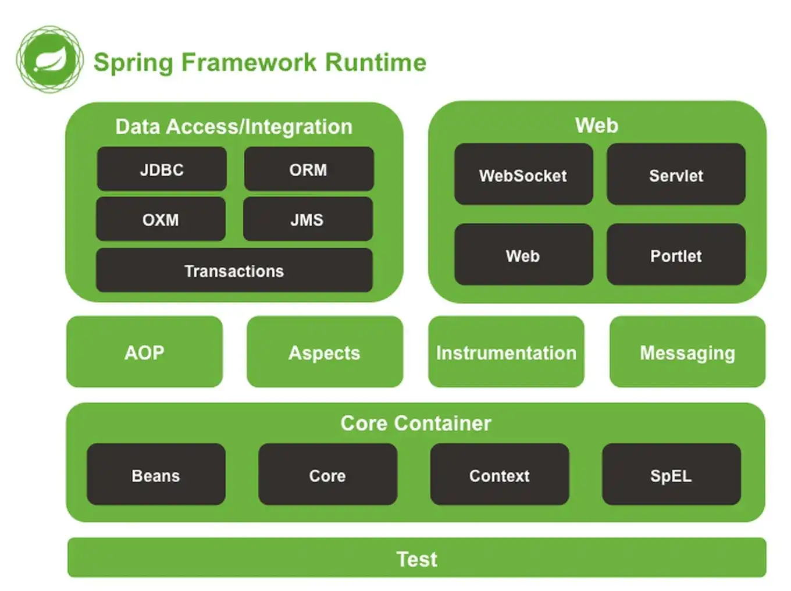

# 简介

## 前言


为了解决我们开发者在 J2EE 开发时所遇到的众多问题，Rob Johnson 等人发起了 Spring 框架项目。Spring 是一个开源的 J2EE 应用程序框架，是针对 Bean 的生命周期进行管理的轻量级容器。它既可以单独用于构建程序，也能和当前众多的 Web 框架进行组合使用，能够十分方便的降低当前企业应用开发的复杂性。既然 Spring 如此强大，那我们今天就来探究一下 Spring 的内容。


## Spring 概览


Spring 其实是一个很大的范围概称，包含着许多分支，在正式了解 Spring 之前，我们先来看看 Spring 家族中的主要分支。


### Spring FrameWok


Spring 领域中其他一切的基础，提供了 **核心容器和依赖注入框架**，还提供了一些基本数据持久性支持，特别是基于模板的 JDBC 文件。


### Spring Boot


Spring Boot 不仅提供了 **启动依赖和自动配置**，还提供了如下的其他特性：


1.  Actuator 提供了对应用程序内部工作方式的运行时监控，包括端点、线程 dump 信息、应用程序健康状况和应用程序可用的环境属性。
2.  灵活的环境属性规范。

1.  核心框架的辅助测试之外的额外测试支持。


### Spring Data


将应用程序的数据存储库抽象为简单的 Java 接口，同时当定义方法用于驱动数据进行存储和检索的问题时，对方法使用了命名约定。此外还能处理几种不同类型的数据库，包括包括关系型（JPA）、文档型（Mongo）、图型（Neo4j）等。


### Spring Security


Spring Security 解决了广泛的应用程序安全性需求，包括身份验证、授权和 API 安全性等一系列工作。


### Spring Integration 和 Spring Batch


Spring Integration 解决了实时集成，即数据在可用时进行处理。相反，Spring Batch 解决了批量集成的问题，允许在一段时间内收集数据，直到某个触发器（可能是一个时间触发器）发出信号，表示该处理一批数据。


### Spring Cloud


Spring Cloud 是一组用 Spring 开发云本地应用程序的项目。


Spring 是为了减少 EJB 的复杂性而创建的一套解决方案，而 EJB 过于臃肿，使用 Spring 能够让 Java Bean 之间进行有效的解耦。而且 Spring 不仅仅局限于服务端的开发，在测试性和松耦合方面均有较好表现。


## 什么是 Spring


### Spring 简介


我们日常所说的 Spring，实际上指的是 Spring Framework，属于 Spring 家族的一个分支。


Spring 的核心是一个 **容器**，常称为 **Spring 应用程序上下文**，用于创建和管理应用程序组件。组件（或 Bean）在 Spring 应用程序上下文中连接在一起互相构成一个完整的应用程序。


那么是如何将各种 Bean 连接在一起呢？这就是 Spring 中最重要的特性之一：**依赖注入（DI）**。


**依赖注入（DI）**：通过依赖注入的应用程序 **不是** 由组件自身创建和维护其所依赖的其他 Bean 的生命周期，**而是依赖于单独的实体（容器）来创建和维护所有组件，并将这些组件注入需要他们的 Bean，通常是通过构造函数或属性访问器方法来完成**。


### Spring 的特点


-   方便解耦，简化开发过程；
-   支持面向切面编程（Aop），方便我们不用修改源码就能对功能进行增强；

-   整合支持 Junit，方便程序的测试；
-   既可以独立构建程序，也支持各种框架，而且大大降低各种框架使用难度；

-   支持事务管理，方便进行事物操作；
-   降低了各种 API 的开发难度；


### Spring 的组成





Spring 是一个分层架构，主要由如下 7 大模块所构成。Spring 模块位于核心容器，定义了创建、配置和管理 Bean 的方式。


1.  **Spring Core**：提供 Spring 框架基本功能，主要组件是 BeanFactory，是工厂模式的实现，通过 IOC 机制将应用程序的配置和依赖性规范与实际的应用程序代码分开。
2.  **Spring Context**：一个配置文件，给 Spring 框架提供上下文信息，上下文包括 JNDI、EJB、电子邮件、国际化、校验和调度等企业服务。

1.  **Spring AOP** ：通过配置管理特性，Spring AOP 直接将 AOP（面向切面）功能集成到 Spring 框架。从而我们能够十分方便的使用 Spring 框架来管理任何支持 AOP 的对象。模块为基于 Spring 的应用程序中的对象提供了事务管理服务。通过使用该组件，可以不依赖其他组件九江声明性事务管理集成到应用程序中。
2.  **Spring DAO**：JDBC DAO 抽象层提供了有意义的异常层次结构，可以用来管理异常处理和不同数据库供应商抛出的错误信息。异常层次结构简化了错误处理，而且极大降低了需要编写的异常代码数量。Spring DAO 面向 JDBC 的异常遵从通用的 DAO 异常层次结构。

1.  **Spring ORM**：Spring 框架中插入了若干个 ORM 框架，从而提供了 ORM 的对象关系工具，其中包括 JDO、Hibernate 和 iBatis SQL Map，这些都遵从 Spring 的通用事务和 DAO 异常层次结构；
2.  **Spring Web**：Web 上下文模块建立在应用程序上下文模块之上，为基于 Web 的应用程序提供了上下文，所以 Spring 框架支持与 Jakarta Structs 的集成。同时该模块还简化了处理多部分请求以及请求参数绑定到域对象的工作。

1.  **Spring Web MVC**：MVC 是一个全功能的构建 Web 应用的 MVC 实现，可以通过策略接口对 MVC 框架实现高度可配置。而且 MVC 还容纳了 JSP、Velocity、Tiles 等视图技术。


### XML 配置 VS Java 配置


对于之前的版本，Spring 容器将各个组件连接起来的方式是通过 XML 配置，但现在的版本中更多的是使用基于 Java 的配置，如下面基于 XML 的配置等效于基于 Java 的配置。


-   基于 XML 配置


```xml
<bean id="productService" calss="com.cunyu.ProductService"></bean>
<bean id="consumerService" class="com.cunyu.ConsumerService">
	<constructor-arg ref="productService" />
</bean>
```


-   基于 Java 配置


```java
@Configuration
public class ServiceConfig{
    @Bean
    public ProductService productService(){
        return new ProductService();
    }
    
    @Bean
    public ConsumerService consumerService(){
        return new ConsumerService(productService());
    }
}
```


在基于 Java 的配置中，`@Configuration` 向 Spring 表明该类是一个配置类，为 Spring  应用程序上下文提供 Bean。而 `@Bean` 注解则指示类方法返回的对象应作为 Beans 添加到应用程序上下文中。


那你可能想，既然之前有了 XML 配置的方式，那么为什么后来的版本中又加入了基于 Java 的配置方式呢？基于 Java 的配置方式相比于 XML 的配置方式，**包含了更高的类型安全性和更高的可重构性**。而且仅当 Spring 无法自动配置组件时，才需要通过 **XML的配置方式** 或者 **基于 Java 的配置方式** 来进行显式配置。


**自动配置** 即 **自动装配 + 组件扫描**。有赖于 **组件扫描**，Spring 能 **自动从应用程序的类路径中发现组件，同时将其创建为 Spring 应用程序上下文中的 Bean**。而通过 **自动装配，Spring 将自动将组件与其所依赖的其他 Bean 一起注入**。


最近随着 Spring Boot 的推出，自动配置的优势进一步加强，在这种配置中，Spring Boot 将根据 **类路径中的条目、环境变量和其他因素，合理猜测所需配置的组件，将其连接在一起**。Spring Boot 中的自动配置大大减少了构建应用程序所需的显式配置的数量，增强了 Spring 开发的能力。


## 初始化 Spring 应用程序


### 项目结构


对于一个 Spring 项目而言，其结构主要包括以下部分：


1.  `src/main/java`：该目录主要包含应用程序的源码，主要可分为如下几类： 

-   -   `build` ：工程启动类；
    -   `entity` ：实体类；

-   -   `mapper` ：数据访问层；
    -   `service` ：数据服务层，业务类代码；

-   -   `controller` ：前端访问控制器；
    -   `config` ：配置信息类；

-   -   `dto`：数据传输层；
    -   `utils` ：工具类；

-   -   `constant` ：常用接口类；
    -   `vo` ：数据传输类；

-   -   `Application.java`：项目的启动类；

1.  `src/main/resources`：相关资源文件；
2.  `src/test/java`：测试相关代码；

1.  `src/test/resources`：测试相关资源；
2.  `pom.xml`：Maven 构建规范，包含一些项目及依赖方面的配置。


### 项目启动类


项目启动类，即运行 jar 文件时用来引导应用程序执行的类，也就是项目结构中的 `Application.java`，下面是一个项目启动类的实例：


```java
import org.springframework.boot.SpringApplication;
import org.springframework.boot.autoconfigure.SpringBootApplication;

@SpringBootApplication
public class TacoCloudApplication {
    public static void main(String[] args) {
        SpringApplication.run(TacoCloudApplication.class, args);
    }
}
```


其中 `@SpringBootApplication` 注解说明该类是一个 Spring 引导应用程序，但实际上它是组合了下列三个注解的复合应用注解：


-   `@SpringBootConfiguration`：**指定该类为配置类**。
-   `@EnableAutoConfiguration`：**启用 Spring 自动配置**。

-   `@ComponentScan`：**启用组件扫描**。允许声明其他带有 `@Component`、`@Controller`、`@Service` 等注解的类，以便让Spring 自动发现他们并将他们注册为 Spring 应用程序上下文中的组件。


## 总结


OK，总结一下今天的内容，主要讲了：


1.  Spring 家族成员的内容；
2.  Spring 的概念

1.  Spring 的特点
2.  Spring 的组成

1.  配置 Spring 的两种方式
2.  一个 Spring 项目常见的项目结构


好了，以上就是今天的所有内容了。原创不易，如果你觉得我的内容对你有所帮助，那就帮忙点赞关注吧！