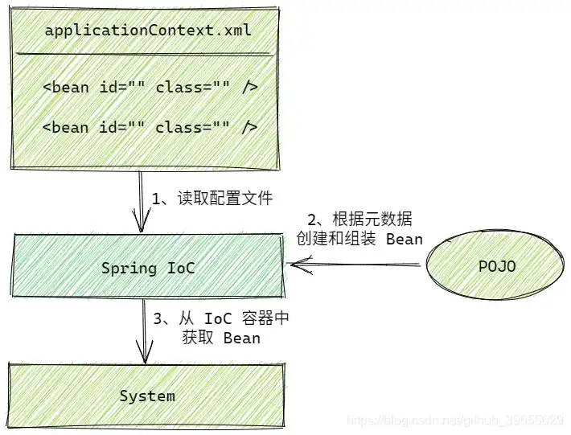

# IoC 大揭秘

> 作者：[村雨遥](https://github.com/cunyu1943)
> 
> 不要哀求，学会争取，若是如此，终有所获
>

## 🎈 号外

最近，公众号之外，建立了微信交流群，不定期会在群里分享各种资源（影视、IT 编程、考试提升……）&知识。如果有需要，可以**扫码或者后台添加小编微信备注入群**。进群后**优先看群公告**，**呼叫群中【资源分享小助手】**，还能免费帮找资源哦～

<center>
 
</center>

## 1. 什么是 Ioc

### 1.1 Ioc 定义

Ioc（Inversion of Control），即 **控制反转**，是 Spring 框架的核心内容，实际上指的是 **对一个对象的控制权的反转**，和 OOP 一样，属于一种设计思想。Ioc 表示将我们 **设计好的对象交由容器控制**，而 **不再使用在对象内部直接控制** 这种传统方式，而 **DI（依赖注入）则是实现 Ioc 的一种方法**。

### 1.2 Ioc 工作流程

Spring Ioc 容器在初始化时先读取配置文件，然后根据配置或元数据来创建与组织对象存入容器中，当程序要使用时再从 Ioc 容器中读取出需要的对象。




## 2. Ioc 实例

### 2.1 项目创建

1.  创建一个 Maven 项目，然后在 `pom.xml` 中引入 `spring-context` 以及 `Junit` 的依赖；

```xml
<dependencies>
    <dependency>
        <groupId>org.springframework</groupId>
        <artifactId>spring-context</artifactId>
        <version>5.2.7.RELEASE</version>
    </dependency>

    <dependency>
        <groupId>junit</groupId>
        <artifactId>junit</artifactId>
        <version>4.13</version>
        <scope>test</scope>
    </dependency>
</dependencies>
```

2.  在 `resourcees` 目录下创建一个 Spring 的配置文件，然后会生成如下包含内容的模板；

```xml
<?xml version="1.0" encoding="UTF-8"?>
<beans xmlns="http://www.springframework.org/schema/beans"
       xmlns:xsi="http://www.w3.org/2001/XMLSchema-instance"
       xsi:schemaLocation="http://www.springframework.org/schema/beans http://www.springframework.org/schema/beans/spring-beans.xsd">

</beans>
```

3.  Spring 配置文件创建好之后，就可以在其中配置我们需要注册到 Spring 容器中的 Bean，其中 `class` 属性用于表示要注册的 Bean 的全路径，而 `id` 则是 Bean 的唯一标识。

```xml
<?xml version="1.0" encoding="UTF-8"?>
<beans xmlns="http://www.springframework.org/schema/beans"
       xmlns:xsi="http://www.w3.org/2001/XMLSchema-instance"
       xsi:schemaLocation="http://www.springframework.org/schema/beans http://www.springframework.org/schema/beans/spring-beans.xsd">

    <bean class="com.cunyu.domain.Book" id="book"/>
</beans>
```

此处配置的是 `com.cunyu.domain` 包下的 `Book` 类，所以需要对应源文件存在，我的 `Book` 类定义如下：

```java
package com.cunyu.domain;

/**
 * @author : cunyu
 * @version : 1.0
 * @className : Book
 * @date : 2020/7/7 14:10
 * @description : Book 类
 */

public class Book {
    private Integer id;
    private String name;
    private Double price;

    public Integer getId() {
        return id;
    }

    public void setId(Integer id) {
        this.id = id;
    }

    public String getName() {
        return name;
    }

    public void setName(String name) {
        this.name = name;
    }

    public Double getPrice() {
        return price;
    }

    public void setPrice(Double price) {
        this.price = price;
    }
}
```

4.  好了，完成上面的配置之后，我们的 Bean 就已经被注册到 Spring 容器中了，接下来只需要加载这个配置文件，然后利用 `getBean()` 方法从容器中获取对象即可；

```java
import com.cunyu.domain.Book;
import org.springframework.context.support.ClassPathXmlApplicationContext;

/**
 * @author : cunyu
 * @version : 1.0
 * @className : Main
 * @date : 2020/7/7 14:12
 * @description : 加载 Spring 配置文件
 */

public class TestBook {
    @Test
    public void test(){
        ClassPathXmlApplicationContext applicationContext = new ClassPathXmlApplicationContext("applicationContext.xml");
        Book book = (Book) applicationContext.getBean("book");
        System.out.println(book);
    }
}

```

### 2.2 注意事项

除开上述 `ClassPathXmlApplicationContext` 的方式加载配置文件之外，还可以利用 `FileSystemXmlApplicationContext` 的方式，这样的话项目将会从给定的路径中去加载配置文件。

```java
public class Main {
    public static void main(String[] args) {
        FileSystemXmlApplicationContext ctx = new FileSystemXmlApplicationContext("/home/cunyu/IDEA/spring-ioc/src/main/resources/applicationContext.xml");
        Book book = (Book) ctx.getBean("book");
        System.out.println(book);
    }
}
```

此外，不仅可以用 `getBean()` 方法来获取 Bean，还可以直接通过 `Class` 来获取 Bean，但此时要求 Bean 只存在一个实例，否则就会导致报错。比如下面的情况就会导致报错：

```xml
<?xml version="1.0" encoding="UTF-8"?>
<beans xmlns="http://www.springframework.org/schema/beans"
       xmlns:xsi="http://www.w3.org/2001/XMLSchema-instance"
       xsi:schemaLocation="http://www.springframework.org/schema/beans http://www.springframework.org/schema/beans/spring-beans.xsd">

    <bean class="com.cunyu.domain.Book" id="book1"/>
    <bean class="com.cunyu.domain.Book" id="book2"/>
</beans>
```