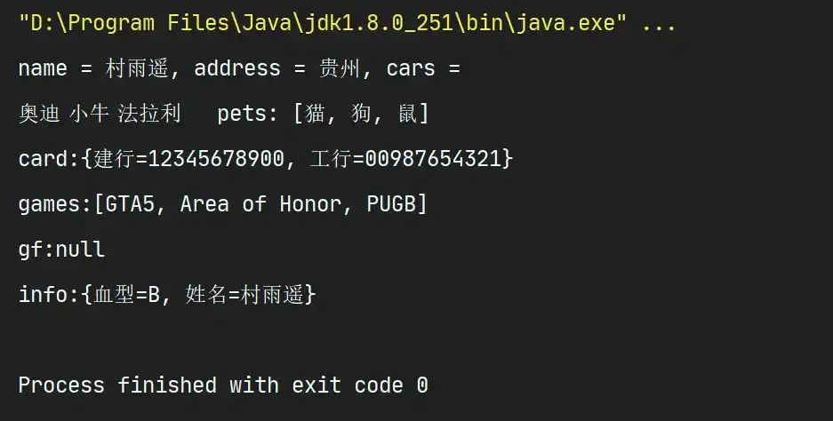

# 依赖注入知多少

## 🎈 号外

最近，公众号之外，建立了微信交流群，不定期会在群里分享各种资源（影视、IT 编程、考试提升……）&知识。如果有需要，可以**扫码或者后台添加小编微信备注入群**。进群后**优先看群公告**，**呼叫群中【资源分享小助手】**，还能免费帮找资源哦～

<center>
 
</center>

## 0. 前言

Spring 中，用来组成应用程序的主体以及由 Spring IoC 容器所管理的对象叫做 Bean。简而言之，Bean 就是由 IoC 容器来进行初始化、装配和管理的对象。

Bean 的作用域主要有如下几种：

### 0.1 Singleton

作用域为 `Singleton`，表明 IoC 容器中只会存在一个共享 Bean 实例，而且所有对 Bean 的请求，主要 `id` 和该 Bean 定义相匹配，那么就会返回 Bean 的同一实例。`Singleton` 是单例模型，即在从创建容器的同时就会自动创建一个 Bean 的对象，无论是否使用，而且每次获取到的对象都是同一对象。

### 0.2 Prototype

作用域为 `Prototype`，表明一个 Bean 定义对应多个实例，该作用域中的 Bean 会导致在每次对该 Bean 请求时均创建一个新的 Bean 实例。`Prototype` 是一个原型类型，在我们创建容器时并未实例化，而是当我们获取 Bean 时才去创建一个对象，而且每次获取到的对象都不一样。

### 0.3 Request

作用域为 `Request`，表明在一次 `HTTP` 请求中，一个 Bean 对应一个实例，即每个 `HTTP` 请求均有各自的 Bean 实例，依据某个 Bean 定义创建而成，只在基于 Web 的 Spring ApplicationContext 情形下有效。当一次 `HTTP` 请求处理结束时，该作用域中的 Bean 实例均被销毁。

### 0.4 Session

作用域为 `Session` ，表明在一个 `HTTP Session` 中，一个 Bean 对应一个实例，只在基于 Web 的 Spring ApplicationContext 情形下有效。当一个 `HTTP Session` 被废弃时，在该作用域内的 Bean 也将失效。

| 作用域类别  | 说明                                                         |
| ----------- | ------------------------------------------------------------ |
| `Singleton` | Spring IoC 容器中仅存在一个 Bean 实例，以单例方式存在，是 Spring 中的默认值 |
| `Prototype` | 每次从容器中调用 Bean 时，均返回一个新的实例，即每次调用 `getBean()` 方法，相当于 `new` 一个新的对象 |
| `Request`   | 每次 HTTP 请求均创建一个新的 Bean，仅适用于 WebApplicationContext 环境 |
| `Session`   | 每次 HTTP Session 共享一个 Bean，不同 Session 使用不同的 Bean，仅适用于 WebApplicationContext 环境 |

## 1. 什么是 DI

DI（Dependency Injection），即依赖注入。其中 **依赖指的是 Bean 对象的创建依赖于容器，是 Bean 对象的依赖资源；而注入则指的是 Bean 对象所以来的资源由容器来设置和装配** 。

## 2. 实现 DI 的方式

要实现依赖注入，通常有如下几种方法：

1.  **构造器注入**
2.  **Set 注入**
3.  **p 命名和 c 命名注入**

### 2.1 构造器注入

由于构造器可以分为无参和有参构造器，所有又可以分为 **有参构造器注入** 和 **无参构造器注入**。

#### 2.1.1 无参构造器注入

1.  首先创建实体类 `User`

```java
package com.cunyu.pojo;

/**
 * @author : cunyu
 * @version : 1.0
 * @className : User
 * @date : 2020/7/17 14:51
 * @description : TODO
 */

public class User {
    private String name;

    public User() {
    }

    public String getName() {
        return name;
    }

    public void setName(String name) {
        this.name = name;
    }

    public void sayHello() {
        System.out.println("hello," + name);
    }
}

```

2.  接着配置 Spring 配置文件，在 `resources` 目录下新建 `applicationContext.xml`

```xml
<?xml version="1.0" encoding="UTF-8"?>
<beans xmlns="http://www.springframework.org/schema/beans"
       xmlns:xsi="http://www.w3.org/2001/XMLSchema-instance"
       xsi:schemaLocation="http://www.springframework.org/schema/beans http://www.springframework.org/schema/beans/spring-beans.xsd">

    <!--  bean 即为 Java 对象，由 Spring 创建和管理  -->
    <bean id="user" class="com.cunyu.pojo.User">
        <property name="name" value="村雨遥"/>
    </bean>
</beans>
```

3.  利用 Junit 进行单元测试

```java
package com.cunyu.pojo;

import org.junit.Test;
import org.springframework.context.ApplicationContext;
import org.springframework.context.support.ClassPathXmlApplicationContext;

/**
 * @author : cunyu
 * @version : 1.0
 * @className : HelloTest
 * @date : 2020/7/17 14:56
 * @description : Hello 测试类
 */

public class HelloTest {
    @Test
    public void testSayHello() {
//        解析 Spring 配置文件，生成管理相应的 Bean 对象
        ApplicationContext applicationContext = new ClassPathXmlApplicationContext("applicationContext.xml");
//      getBean() 方法的参数即为 Spring 配置文件中 bean 的 id
        User user = (User) applicationContext.getBean("user");
        user.sayHello();
    }
}
```

#### 2.1.2 有参构造器注入

1.  同样先创建一个实体类，同时添加有参构造器方法

```java
package com.cunyu.pojo;

/**
 * @author : cunyu
 * @version : 1.0
 * @className : User
 * @date : 2020/7/17 14:51
 * @description : TODO
 */

public class User {
    private String name;

    public User(String name) {
        this.name = name;
    }

    public String getName() {
        return name;
    }

    public void setName(String name) {
        this.name = name;
    }

    public void sayHello() {
        System.out.println("hello," + name);
    }
}

```

2.  配置 Spring 配置文件

此时配置 Spring 配置文件有 3 种不同的方法：

- 通过 `index` 下标属性设置

```xml
<bean id="user" class="com.cunyu.pojo.User">
    <constructor-arg index="0" value="村雨遥"/>
</bean>
```

- 通过参数名设置

```xml
<bean id="user" class="com.cunyu.pojo.User">
    <constructor-arg name="name" value="村雨遥"/>
</bean>
```

- 通过参数类型设置

```xml
<bean id="user" class="com.cunyu.pojo.User">
    <constructor-arg type="java.lang.String" value="村雨遥"/>
</bean>
```

3.  通过 Junit 测试

```java
package com.cunyu.pojo;

import org.junit.Test;
import org.springframework.context.ApplicationContext;
import org.springframework.context.support.ClassPathXmlApplicationContext;

/**
 * @author : cunyu
 * @version : 1.0
 * @className : HelloTest
 * @date : 2020/7/17 14:56
 * @description : Hello 测试类
 */

public class HelloTest {
    @Test
    public void testSayHello() {
//        解析 Spring 配置文件，生成管理相应的 Bean 对象
        ApplicationContext applicationContext = new ClassPathXmlApplicationContext("applicationContext.xml");
//      getBean() 方法的参数即为 Spring 配置文件中 bean 的 id
        User user = (User) applicationContext.getBean("user");
        user.sayHello();
    }
}
```

### 2.2 Set 注入

要注入某属性，则该属性必须有 `set()` 方法；

#### 2.2.1 创建实体类

```java
package com.cunyu.pojo;

/**
 * @author : cunyu
 * @version : 1.0
 * @className : Address
 * @date : 2020/7/17 16:10
 * @description : 地址类
 */

public class Address {
    private String address;

    public String getAddress() {
        return address;
    }

    public void setAddress(String address) {
        this.address = address;
    }
}
```

```java
package com.cunyu.pojo;

import java.util.List;
import java.util.Properties;
import java.util.Set;
import java.util.Map;

/**
 * @author : cunyu
 * @version : 1.0
 * @className : User
 * @date : 2020/7/17 14:51
 * @description : TODO
 */

public class User {
    private String name;
    private Address address;
    private String[] cars;
    private List<String> pets;
    private Map<String, String> cards;
    private Set<String> games;
    private String girlFriend;
    private Properties info;

    public String getName() {
        return name;
    }

    public Address getAddress() {
        return address;
    }

    public String[] getCars() {
        return cars;
    }

    public List<String> getPets() {
        return pets;
    }

    public Map<String, String> getCards() {
        return cards;
    }

    public Set<String> getGames() {
        return games;
    }

    public String getGirlFriend() {
        return girlFriend;
    }

    public Properties getInfo() {
        return info;
    }

    public void setName(String name) {
        this.name = name;
    }

    public void setAddress(Address address) {
        this.address = address;
    }

    public void setCars(String[] cars) {
        this.cars = cars;
    }

    public void setPets(List<String> pets) {
        this.pets = pets;
    }

    public void setCards(Map<String, String> cards) {
        this.cards = cards;
    }

    public void setGames(Set<String> games) {
        this.games = games;
    }

    public void setGirlFriend(String girlFriend) {
        this.girlFriend = girlFriend;
    }

    public void setInfo(Properties info) {
        this.info = info;
    }

    public void display() {
        System.out.println("name = " + name + ", address = " + address.getAddress() + ", cars = ");

        for (String car : cars
        ) {
            System.out.print(car + "\t");
        }

        System.out.println("pets: " + pets);
        System.out.println("card:" + cards);
        System.out.println("games:" + games);
        System.out.println("gf:" + girlFriend);
        System.out.println("info:" + info);
    }
}
```

#### 2.2.2 各类型属性注入

1.  常量注入

```xml
<bean id="user" class="com.cunyu.pojo.User">
    <property name="name" value="村雨遥"/>
</bean>
```

2.  Bean 注入

```xml
<bean id="addr" class="com.cunyu.pojo.Address">
    <property name="address" value="贵州"/>
</bean>

<bean id="user" class="com.cunyu.pojo.User">
    <property name="name" value="村雨遥"/>
    <property name="address" ref="addr"/>
</bean>
```

3.  数组注入

```xml
<bean id="user" class="com.cunyu.pojo.User">
    <property name="cars">
    	<array>
            <value>奥迪</value>
            <value>小牛</value>
            <value>法拉利</value>
    	</array>
    </property>
</bean>
```

4.  List 注入

```xml
<bean id="user" class="com.cunyu.pojo.User">
    <property name="pets">
    	<list>
            <value>猫</value>
            <value>狗</value>
            <value>鼠</value>
    	</list>
    </property>
</bean>
```

5.  Map 注入

```xml
<bean id="user" class="com.cunyu.pojo.User">
    <property name="cards">
    	<map>
            <entry key="建行" value="12345678900"/>
            <entry key="工行" value="00987654321"/>
    	</map>
    </property>
</bean>
```

6.  set 注入

```xml
<bean id="user" class="com.cunyu.pojo.User">
    <property name="games">
    	<set>
            <value>GTA5</value>
            <value>Area of Honor</value>
            <value>PUGB</value>
    	</set>
    </property>
</bean>
```

7.  Null 注入

```xml
<bean id="user" class="com.cunyu.pojo.User">
    <property name="girlFriend">
        <null/>
    </property>
</bean>
```

8.  Properties 注入

```xml
<bean id="user" class="com.cunyu.pojo.User">
    <property name="info">
        <props>
            <prop key="姓名">村雨遥</prop>
            <prop key="血型">B</prop>
        </props>
    </property>
</bean>
```

测试：

```java
package com.cunyu.pojo;

import org.junit.Test;
import org.springframework.context.ApplicationContext;
import org.springframework.context.support.ClassPathXmlApplicationContext;

/**
 * @author : cunyu
 * @version : 1.0
 * @className : HelloTest
 * @date : 2020/7/17 14:56
 * @description : Hello 测试类
 */

public class HelloTest {
    @Test
    public void test() {
//        解析 Spring 配置文件，生成管理相应的 Bean 对象
        ApplicationContext applicationContext = new ClassPathXmlApplicationContext("applicationContext.xml");
//      getBean() 方法的参数即为 Spring 配置文件中 bean 的 id
        User user = (User) applicationContext.getBean("user");

        user.display();
    }
}
```



### 2.3 p 命名和 c 命名注入

#### 2.3.1 p 命名注入

1.  创建实体类和其他注入方式相同
2.  配置 Spring 配置文件

首先需要在配置文件的头文件中加入约束条件：

```xml
xmlns:p="http://www.springframework.org/schema/p"
```

接着在配置文件中配置即可：

```xml
<bean id="user" class="com.cunyu.pojo.User" p:name="村雨遥" p:address="贵州"/>
```

3.  测试方法同其他注入方式

#### 2.3.2 c 命名注入

1.  创建实体类和其他注入方式相同
2.  配置 Spring 配置文件

首先需要在配置文件的头文件中加入约束条件：

```xml
xmlns:c="http://www.springframework.org/schema/c"
```

接着在配置文件中配置即可：

```xml
<bean id="user" class="com.cunyu.pojo.User" c:name="村雨遥" c:address="贵州"/>
```

3.  测试方法同其他注入方式