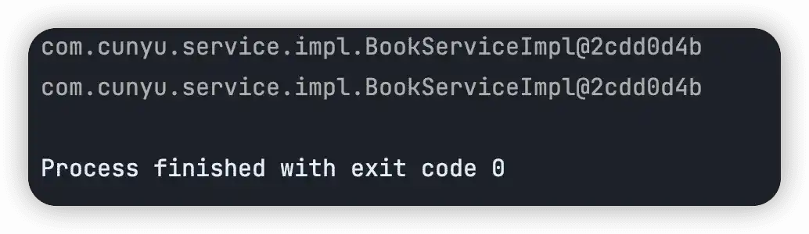

# Bean 详解

##  Bean 的别名配置

接着上一篇文章中的 `<bean>` 配置，其中配置了 `id` 属性，通过 `id` 属性我们就可以获取到对象。其实 `<bean>` 配置也提供了 `name` 属性，它是用于定义 Bean 的别名，一个 Bean 的别名是可以有多个的，各个别名之间可以通过逗号（`,`）、分号（`;`）、空格（` `）分隔。

```xml
<!--  配置 bean  -->
<bean id="bookDao" name="dao bookDaoImpl" class="com.cunyu.dao.impl.BookDaoImpl"/>
<bean id="bookService" name="service,bookServiceImpl" class="com.cunyu.service.impl.BookServiceImpl">
    <!-- property 表示配置当前 Bean 的属性
             name 表示配置哪一个具体的属性
             ref 表示参照的 Bean
             -->
    <property name="bookDao" ref="bookDao"/>
</bean>
```

当我们要获取 Bean 时，既可以通过 `id`，也可以通过 `name` 获取。两者的区别在于 `id` 属性是惟一的，而 `name` 不是，因此在配置时，更加推荐使用 `id` 而非 `name` 防止因为重名而导致在获取 Bean 时混淆。

通过 `id` 或者 `name` 获取 Bean 时，如果获取不到，此时程序将抛出异常 `NoSuchBeanDefinitionException`。

```sh
NoSuchBeanDefinitionException: No bean named 'xxx' available
```

一旦遇到以上错误，那么第一反应应该是是去 Spring 配置文件 `applicationContext.xml` 中查看对应 Bean 是否配置，或者在代码和配置中的 Bean 名是否匹配一致。

## Bean 的作用范围

Bean 既然是一个对象，那么它也是有作用范围的。在 `<bean>` 配置时我们可以利用 `scope` 属性。

| 值          | 说明                           |
| ----------- | ------------------------------ |
| `singleton` | 单例，也是 Bean 磨人的作用范围 |
| `prototype` | 非单例                         |

```xml
<bean id="bookService" class="com.cunyu.service.impl.BookServiceImpl" />
```

```xml
<bean id="bookService" class="com.cunyu.service.impl.BookServiceImpl" scope="singleton"/>
```

以上两种配置的效果是一致的，因为 Bean 默认的作用范围是 `singleton`。接着我们创建两个 `BookService` 对象，然后打印出来，可以看到它们指向的是同一块内存。

```java
public class AppIoC {
    public static void main(String[] args) {
        //    加载配置文件，获取 IoC 容器
        ApplicationContext app = new ClassPathXmlApplicationContext("applicationContext.xml");

        BookService bookService1 = (BookService) app.getBean("bookService");
        BookService bookService2 = (BookService) app.getBean("bookService");
        System.out.println(bookService1);
        System.out.println(bookService2);
    }
}
```




而如果我们将 Bean 的 `scope` 配置为 `prototype`，那么此时再创建两个 `BookService` 对象，然后对比它们的内存地址，会发现两者指向的并非指向同一块内存。

```xml
<bean id="bookService" class="com.cunyu.service.impl.BookServiceImpl" scope="prototype"/>
```


```java
public class AppIoC {
    public static void main(String[] args) {
        //    加载配置文件，获取 IoC 容器
        ApplicationContext app = new ClassPathXmlApplicationContext("applicationContext.xml");

        BookService bookService1 = (BookService) app.getBean("bookService");
        BookService bookService2 = (BookService) app.getBean("bookService");
        System.out.println(bookService1);
        System.out.println(bookService2);
    }
}
```


## Bean 实例化

### 构造方法

Bean 的本质是对象，所以可以使用构造方法完成。

同样基于上一篇文章中的实例，配置好 `<bean>` 之后，然后在 `BookDao` 接口的实现中用构造方法来创建 Bean，最后在主程序入口中获取 Bean 之后调用方法，可以发现调用了构造方法。

```xml
<bean id="bookDao" class="com.cunyu.dao.impl.BookDaoImpl"/>
```

```java
public class BookDaoImpl implements BookDao {
    private BookDaoImpl() {
        System.out.println("构造方法");
    }

    @Override
    public void save() {
        System.out.println("book dao save ……");
    }
}
```


```java
public class AppIoC {
    public static void main(String[] args) {
        //    加载配置文件，获取 IoC 容器
        ApplicationContext app = new ClassPathXmlApplicationContext("applicationContext.xml");
        //    获取 Bean
        BookDao bookDao = (BookDao) app.getBean("bookDao");
        bookDao.save();
    }
}


```


### 静态工厂方法

利用静态工厂方法对 Bean 进行实例化时，首先需要创建一个工厂类，并在工厂类中创建一个静态方法用于创建对象。然后在 Spring 的配置文件 `applicationContext.xml` 中配置静态工厂类并指定其中的方法，最后在主程序入口中获取 Bean 并调用方法即可。

```java
public class BookDaoFactory {
    public static BookDao getBookDao() {
        return new BookDaoImpl();
    }
}
```

```xml
<bean id="bookDao" factory-method="getBookDao" class="com.cunyu.factory.BookDaoFactory"/>
```

```java
public class AppIoC {
    public static void main(String[] args) {
        //    加载配置文件，获取 IoC 容器
        ApplicationContext app = new ClassPathXmlApplicationContext("applicationContext.xml");
        //    获取 Bean
        BookDao bookDao = (BookDao) app.getBean("bookDao");
        bookDao.save();
    }
}

```


### 实例工厂对象方法 

假设有一个接口和它的实现如下：

```java
public interface PersonDao {
    public void query();
}
```

```java
public class PersonDaoImpl implements PersonDao {
    @Override
    public void query() {
        System.out.println("Person Dao query……");
    }
}
```

我们创建一个实例工厂方法，注意此时我们是继承了 `FactoryBean` 接口，然后实现了其中的 `getObject()` 和 `getObjectType()` 两个方法。

```java
public class PersonDaoFactoryBean implements FactoryBean<PersonDao> {
    @Override
    public PersonDao getObject() throws Exception {
        return new PersonDaoImpl();
    }

    @Override
    public Class<?> getObjectType() {
        return PersonDao.class;
    }
}
```

接着在 Spring 的配置文件中进行配置，需要注意此时的类应该是我们的工厂类 `PersonDaoFactoryBean`，而不是 `PersonDaoImpl`。

```xml
<bean id="personDao" class="com.cunyu.factory.PersonDaoFactoryBean"/>
```

最后在程序主入口中获取 Bean，然后调用方法即可。

```java
public class AppIoC {
    public static void main(String[] args) {
        //    加载配置文件，获取 IoC 容器
        ApplicationContext app = new ClassPathXmlApplicationContext("applicationContext.xml");
        //    获取 Bean
        PersonDao personDao = (PersonDao) app.getBean("personDao");
        personDao.query();
    }
}
```


## Bean 的生命周期

先来看看生命周期的定义，所谓生命周期就是指从创建到消亡的完整过程，类比到我们人身上，生命周期就是从我们出生到死亡的这个过程。而 Bean 的生命周期就指的是 Bean 从创建到销毁的整体过程。

Bean 的生命周期主要分为三个阶段：

-   **初始化容器**
-   **使用 Bean**
-   **销毁容器**

初始化容器阶段，主要执行的操作有：创建对象（内存分配）、执行构造方法、执行属性注入（`set` 操作）、执行 Bean 初始化方法。

使用 Bean 阶段，主要是去执行业务操作。

销毁容器阶段，主要是执行 Bean 的销毁方法。

## 总结

以上就是今天关于 Bean 的内容了，主要从 Bean 的别名配置、作用范围、如何进行实例化以及声明周期 4 个方面着手，学习了 Bean 的相关操作。
