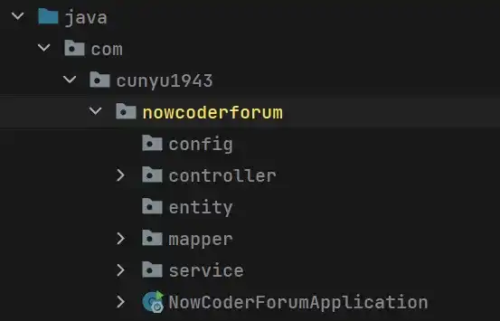

# 简介

## 前言

`Spring` 是重量级企业开发框架 `EJB（Enterprise JavaBean）` 的替代品，是为了解决企业级应用开发的复杂性而创建的，简化开发。通过 **依赖注入（DI）** 和 **面向切面编程**，用简单的 **`Java` 对象（`POJO`，`Plain Old Java Object`）** 实现 `EJB` 的功能，**其组件代码轻量，但是配置很繁琐（需要大量 `XML` 配置）**。`Spring 2.5` 引入基于注解的组件扫描，`Spring 3.0` 引入基于 `Java` 的配置，可以代替 `XML`，虽然引入的特性大大提高了配置的效率，但是也无法避免，针对这一问题，`Spring Boot` 应运而生。

Spring Boot 是为简化 Spring 应用初始搭建和开发过程，我们只要基于特定方式来进行配置即可。

今天我们就来看看，关于 Spring Boot 的相关介绍吧！

## Spring Boot

### 定义

> Spring Boot makes it easy to create stand-alone, production-grade Spring based Applications that you can “just run”...Most Spring Boot applications need very little Spring configuration.

上面的一段话来自 `Spring` 官方，即“`Spring Boot` 能够轻松创建基于 `Spring` 的独立的生产级别的应用程序，而只需要通过 “`just run` （可能是 `java -jar、tomcat、maven、shell、'Application'` 等）”就可以让项目跑起来，大多 `Spring Boot` 项目仅需少量配置即可运行”。

Spring Boot 基于 Spring 开发，Spirng Boot 本身并不提供 Spring 框架的核心特性以及扩展功能，只是用于快速、敏捷地开发新一代基于 Spring 框架的应用程序。也就是说，它并不是用来替代 Spring 的解决方案，而是和 Spring 框架紧密结合用于提升 Spring 开发者体验的工具。Spring Boot 以**约定大于配置的核心思想**，默认帮我们进行了很多设置，多数 Spring Boot 应用只需要很少的 Spring 配置。同时它集成了大量常用的第三方库配置（例如 Redis、MongoDB、Jpa、RabbitMQ、Quartz 等等）。

### 为什么需要 Spring Boot

`Spring` 框架能够让 `J2EE`企业应用程序开发更加简化，但是还是需要配置大量文件，针对这一问题，`Spring Boot` 能够进一步简化 `Spring` 框架，使得开发更为高效；

### 特点

-   可以创建独立 `Spring` 应用程序，并且基于 `Maven` 或 `Gradle` 插件，可以创建可执行的 `JARs` 和 `WARs`；
-   内嵌 `Tomcat` 或 `Jetty` 等 `Servlet` 容器；
-   提供自动配置的 `started` 项目对象模型（`POMS`）以简化 `Maven` 配置；
-   尽可能自动配置 `Spring` 容器；
-   提供准备好的特性，如指标、健康检查和外部化配置；
-   没有冗余代码生成，不需要 `XML` 配置；

### 重要策略

-   **开箱即用**：`Outofbox`，指在开发过程中，通过在 `Maven` 项目的 `pom` 文件中添加相关依赖包，然后使用对应注解来代替繁琐的 `XML` 配置文件以管理对象的生命周期。这一特点使得开发人员摆脱了复杂的配置工作以及相关依赖的管理工作，更加专注于业务逻辑；
-   **约定优于配置**：`Convention over configuration`，一种由 `SpringBoot` 本身来配置目标结构，由开发者在结构中添加信息的软件设计范式。这一特点虽然降低了部分灵活性，增加了 `BUG` 定位的复杂性，但减少了开发人员需要做出决定的数量，同时减少了大量 `XML` 配置，而且可以将代码编译、测试和打包等工作自动化；

### Spring Boot 项目约定

-   约定项目中有且只有一个入口类，其类名推荐使用：`xxxApplication.java`。而且该入口类必须位于所有的子包之外，其中必须存在一个用于启动项目的 `main` 函数。

-   此外， Spring Boot 项目约定必须在项目根目录中存在一个名为 `application.yml` 或者 `yml.prpperties` 的配置文件，一般是位于 `resources` 目录下。

### Spring Boot 的优缺点

#### 优点

1. 使得开发基于 `Spring` 的应用程序变得简单；
2. `Spring Boot` 项目开发所需时间明显减少，提高整体生产力；
3. 无需编写大量样板代码、`XML` 配置和注释；
4. 与 `Spring` 生态系统更加容易集成，如 `Spring JDBC、Spring ORM、Spring Data、Spring Security`；
5. 遵循默认配置，我们通过修改默认配置能够减少开发工作；
6. 提供嵌入式 `http` 服务器，方便开发测试 `web` 应用程序；
7. 提供命令行接口（`CLI`）工具，用于开发测试 `Spring Boot` 应用程序；
8. 提供多种插件，能使用内置工具（`Maven & Gradle`）开发测试 `Spring Boot` 应用程序；

#### 缺点

1. 相关文档资料较少；
2. 版本迭代快，导致各版本间的模块改动可能很大；

总体来讲，采用 Spring Boot 的优点是绝对的，而且其缺点看似是缺点，但如果保持学习，还是很容易就能掌握的。而之所以迭代，不就是为了像 SSM -> Spring Boot 这样简化我们的开发，提高开发效率么？有了更高的效率，那是不是就意味着我们能有更多的时间摸鱼或者早点下班跑路？🤪

## 总结

以上就是今天的所有内容了，主要讲了 Spring Boot 的定义、特点、项目约定以及其优缺点。而关于 Spring Boot 项目的具体事例的搭建，我们就下期文章再见吧！

>   传送门：[创建 SpringBoot 项目的 3 种方式](https://blog.csdn.net/github_39655029/article/details/119618308)

最后，如果本文对你有所帮助，那就点个赞再走鸭 ~