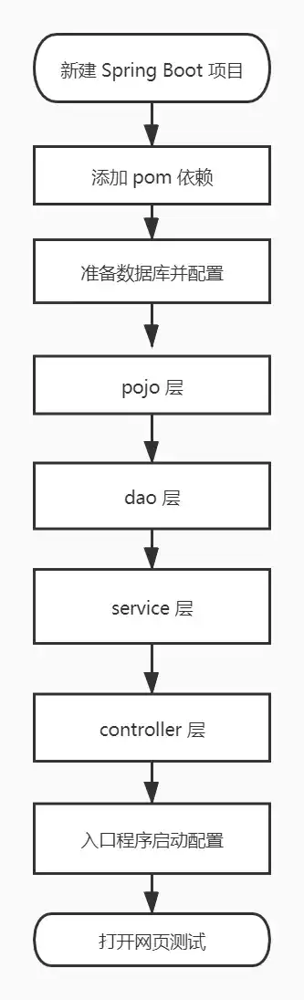
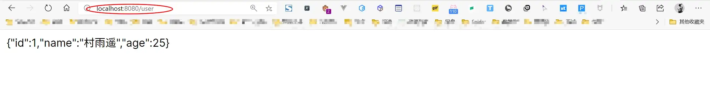

# XML 方式整合 MyBatis 实例

## 前言

上一篇文章中我们已经[利用注解的方式将 Spring Boot 和 MyBatis 整合起来](https://blog.csdn.net/github_39655029/article/details/107602438)，今天我们就来看看，如何利用 XML 文件的方式来将两者整合起来！

下图是整个整合过程，接下来开始整合。



## 整合过程

最终项目结构如下图所示：


### 新建 Spring Boot 项目

新建一个 Spring Boot 项目，添加 Web 组件，具体过程可以参照我的另一篇博客 [创建 Spring Boot 项目的三种方式](https://cunyu1943.github.io/#/docs/Java/SpringBoot/2.创建SpringBoot项目的方式)。

### 添加 pom 依赖

由于要整合 MyBatis，所以我们需要在项目的配置文件 `pom.xml` 中添加 MySQL 驱动和 SpringBoot MyBatis 整合包；

```xml
<!--     springboot mybatis 整合包   -->
<dependency>
    <groupId>org.mybatis.spring.boot</groupId>
    <artifactId>mybatis-spring-boot-starter</artifactId>
    <version>2.1.3</version>
</dependency>
<!--    mysql 驱动    -->
<dependency>
    <groupId>mysql</groupId>
    <artifactId>mysql-connector-java</artifactId>
    <scope>runtime</scope>
</dependency>
```

###  准备数据库

1.  数据库创建及输入插入

准备一张 `user` 表，有 `id`、`name`、`age` 三个属性，其中 `id` 为主键且自增，然后插入三条数据；

```sql
CREATE TABLE `user` (
  `id` int(11) NOT NULL AUTO_INCREMENT COMMENT '主键',
  `name` varchar(50) DEFAULT NULL COMMENT '姓名',
  `age` int(11) DEFAULT NULL COMMENT '年龄',
  PRIMARY KEY (`id`)
) ENGINE=InnoDB AUTO_INCREMENT=1 DEFAULT CHARSET=utf8;

INSERT INTO  user values (1,"村雨遥",25);
INSERT INTO  user values (2,"张三",26);
INSERT INTO  user values (3,"李四",27);
```

2.  数据源配置

在项目配置文件 `application.properties` 中配置数据源；

```properties
# 数据库配置
spring.datasource.username=root
spring.datasource.password=1112233
spring.datasource.url=jdbc:mysql://localhost:3306/springboot?useUnicode=true&characterEncoding=UTF-8&serverTimezone=UTC
spring.datasource.driver-class-name=com.mysql.cj.jdbc.Driver
```

### pojo 层

根据数据库创建实体类，为了精简代码，后面过程中都或多或少用了 Lombok 插件，所以需要事先在 `pom.xml` 引入；

```xml
<dependency>
    <groupId>org.projectlombok</groupId>
    <artifactId>lombok</artifactId>
    <optional>true</optional>
</dependency>
```

```java
package com.cunyu.pojo;

import lombok.AllArgsConstructor;
import lombok.Data;
import lombok.NoArgsConstructor;

/**
 * @author : cunyu
 * @version : 1.0
 * @className : User
 * @date : 2020/7/26 20:44
 * @description : User 实体类
 */

@Data
@NoArgsConstructor
@AllArgsConstructor
public class User {
    private Long id;
    private String name;
    private Integer age;
}

```

###  dao 层

1.  接口编写

实体类创建完成后，编写实体类对应接口；

```java
package com.cunyu.dao;

import com.cunyu.pojo.User;
import org.apache.ibatis.annotations.Mapper;

/**
 * @InterfaceName : UserDao
 * @Author : cunyu
 * @Date : 2020/7/26 20:47
 * @Version : 1.0
 * @Description : User 类对应接口
 **/

@Mapper
public interface UserDao {
    /**
     * @param id 用户 id
     * @return 对应 id 的用户
     * @description 根据用户 id 查询用户
     * @date 2020/7/26 20:48
     * @author cunyu1943
     * @version 1.0
     */
    User getUserById(Long id);
}
```

2.  配置 MyBatis

在项目配置文件 `application.properties` 中添加 MyBatis 配置；

```properties
# MyBatis 配置
mybatis.type-aliases-package=com.cunyu.pojo.User
mybatis.mapper-locations=classpath:mapper/*.xml
```

3.  mapper 编写

在 `src/main/resources/mapper` 下新建 `UserDao.xml`；

```xml
<?xml version="1.0" encoding="UTF-8" ?>
<!DOCTYPE mapper
        PUBLIC "-//mybatis.org//DTD Mapper 3.0//EN"
        "http://mybatis.org/dtd/mybatis-3-mapper.dtd">
<mapper namespace="com.cunyu.dao.UserDao">
    <select id="getUserById" resultType="com.cunyu.pojo.User">
        SELECT id, name, age
        FROM user
        WHERE id = #{id}
    </select>
</mapper>
```

### service 层

1.  service 接口

```java
package com.cunyu.service;

import com.cunyu.pojo.User;

/**
 * @author : cunyu
 * @version : 1.0
 * @className : UserService
 * @date : 2020/7/26 20:57
 * @description : User service 接口
 */

public interface UserService {
    /**
     * @param id 用户 iD
     * @return 对应 id 的用户
     * @description 根据 id 查找用户
     * @date 2020/7/26 20:58
     * @author cunyu1943
     * @version 1.0
     */
    User getUserById(Long id);
}

```

2.  service 接口实现类

```java
package com.cunyu.service.impl;

import com.cunyu.dao.UserDao;
import com.cunyu.pojo.User;
import com.cunyu.service.UserService;
import org.springframework.beans.factory.annotation.Autowired;
import org.springframework.stereotype.Service;

/**
 * @author : cunyu
 * @version : 1.0
 * @className : UserServiceImpl
 * @date : 2020/7/26 20:59
 * @description : service 接口实现类
 */

@Service
public class UserServiceImpl implements UserService {

    @Autowired
    private UserDao userDao;

    @Override
    public User getUserById(Long id) {
        return userDao.getUserById(id);
    }
}
```

### controller 层

```java
package com.cunyu.controller;

import com.cunyu.pojo.User;
import com.cunyu.service.UserService;
import org.springframework.beans.factory.annotation.Autowired;
import org.springframework.web.bind.annotation.GetMapping;
import org.springframework.web.bind.annotation.RestController;

/**
 * @author : cunyu
 * @version : 1.0
 * @className : UserController
 * @date : 2020/7/26 21:01
 * @description : User controller
 */

@RestController
public class UserController {
    /**
     * 自动注入
     */
    @Autowired
    private UserService userService;

    @GetMapping("/user")
    public User getUserById() {
        User user = userService.getUserById(1L);
        return user;
    }
}
```

###  入口程序配置

在入口程序中配置 mapper 自动扫描；

```java
package com.cunyu;

import org.mybatis.spring.annotation.MapperScan;
import org.springframework.boot.SpringApplication;
import org.springframework.boot.autoconfigure.SpringBootApplication;

@MapperScan(basePackages = "com.cunyu.dao")
@SpringBootApplication
public class MybatisXmlApplication {

    public static void main(String[] args) {
        SpringApplication.run(MybatisXmlApplication.class, args);
    }
}
```

### 网页测试

完成上述所有步骤之后，在浏览器中访问 `http://localhost:8080/user`，就可以在网页中显示对应 `id` 的 `User` 对象的所有信息；



## 总结

以上就是通过 XMl 文件来整合 Spring Boot 和 MyBatis 的具体过程了，是不是很简单呢？

对比 XML 文件和注解的方式，最大的不同就在于 DAO 层。前者是通过 XML 配置文件的方式，而后者则是使用 MyBatis 中所提供的注解来实现。两种方式各有优劣，而且大家也都有使用，不过貌似大家使用的更多的还是 XML 配置的方式。

那么如果是你的话，你会使用哪种方式呢？