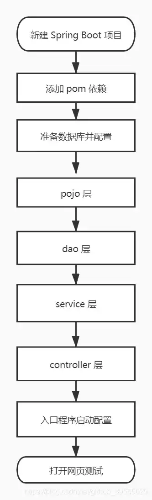

# 注解方式整合 MyBatis 实例

## 🎈 号外

最近，公众号之外，建立了微信交流群，不定期会在群里分享各种资源（影视、IT 编程、考试提升……）&知识。如果有需要，可以**扫码或者后台添加小编微信备注入群**。进群后**优先看群公告**，**呼叫群中【资源分享小助手】**，还能免费帮找资源哦～

<center>
 
</center>

## 前言
目前而言，国内大家使用最多的持久层框架可能还是 MyBatis 吧，那既然如此，更强大的 Spring Boot 遇上炽手可热的 MyBatis，又会擦出什么样的火花呢？

那本文就来看看，如何利用 SpringBoot 来整合 Mybatis。

如下图是总结的整合过程的大概流程，那接下来我们就来开始具体的整合操作！




## 整合过程

最终项目结构如下图所示：


### 新建 Spring Boot 项目

新建一个 Spring Boot 项目，添加 Web 组件，具体过程可以参照我的另一篇博客 [创建 Spring Boot 项目的方式](https://blog.csdn.net/github_39655029/article/details/119618308)。

### 添加 pom 依赖

由于要整合 MyBatis，所以我们需要在项目的配置文件 `pom.xml` 中添加 mysql 驱动和 SpringBoot MyBatis 整合包；

```xml
<!--     springboot mybatis 整合包   -->
<dependency>
    <groupId>org.mybatis.spring.boot</groupId>
    <artifactId>mybatis-spring-boot-starter</artifactId>
    <version>2.1.3</version>
</dependency>
<!--    mysql 驱动    -->
<dependency>
    <groupId>mysql</groupId>
    <artifactId>mysql-connector-java</artifactId>
    <scope>runtime</scope>
</dependency>
```


### 准备数据库

1.  数据库创建及输入插入

准备一张 `user` 表，有 `id`、`name`、`age` 三个属性，其中 `id` 为主键且自增，然后插入三条数据；

```sql
CREATE TABLE `user` (
  `id` int(11) NOT NULL AUTO_INCREMENT COMMENT '主键',
  `name` varchar(50) DEFAULT NULL COMMENT '姓名',
  `age` int(11) DEFAULT NULL COMMENT '年龄',
  PRIMARY KEY (`id`)
) ENGINE=InnoDB AUTO_INCREMENT=1 DEFAULT CHARSET=utf8;

INSERT INTO  user values (1,"村雨遥",25);
INSERT INTO  user values (2,"张三",26);
INSERT INTO  user values (3,"李四",27);
```

2.  数据源配置

在项目配置文件 `application.properties` 中配置数据源；

```properties
# 数据库配置
spring.datasource.username=root
spring.datasource.password=0908
spring.datasource.url=jdbc:mysql://localhost:3306/springboot?useUnicode=true&characterEncoding=UTF-8&serverTimezone=UTC
spring.datasource.driver-class-name=com.mysql.cj.jdbc.Driver
```

### pojo 层

根据数据库创建实体类，为了精简代码，后面过程中都或多或少用了 Lombok 插件，所以需要事先在 `pom.xml` 引入；

```xml
<dependency>
    <groupId>org.projectlombok</groupId>
    <artifactId>lombok</artifactId>
    <optional>true</optional>
</dependency>
```

```java
package com.cunyu.pojo;

import lombok.AllArgsConstructor;
import lombok.Data;
import lombok.NoArgsConstructor;

/**
 * @author : cunyu
 * @version : 1.0
 * @className : User
 * @date : 2020/7/26 20:44
 * @description : User 实体类
 */

@Data
@NoArgsConstructor
@AllArgsConstructor
public class User {
    private Long id;
    private String name;
    private Integer age;
}

```

### dao 层

实体类创建完成后，编写实体类对应接口；

```java
package com.cunyu.dao;

import com.cunyu.pojo.User;
import org.apache.ibatis.annotations.Mapper;
import org.apache.ibatis.annotations.Select;

/**
 * @InterfaceName : UserDao
 * @Author : cunyu
 * @Date : 2020/7/26 20:47
 * @Version : 1.0
 * @Description : User 类对应接口
 **/

@Mapper
public interface UserDao {
    /**
     * @param id 用户 id
     * @return 对应 id 的用户
     * @description 根据用户 id 查询用户
     * @date 2020/7/26 20:48
     * @author cunyu1943
     * @version 1.0
     */
    
    @Select("SELECT id,name,age FROM user where id = #{id}")
    User getUserById(Long id);
}
```

### service 层

1.  service 接口

```java
package com.cunyu.service;

import com.cunyu.pojo.User;

/**
 * @author : cunyu
 * @version : 1.0
 * @className : UserService
 * @date : 2020/7/26 20:57
 * @description : User service 接口
 */

public interface UserService {
    /**
     * @param id 用户 iD
     * @return 对应 id 的用户
     * @description 根据 id 查找用户
     * @date 2020/7/26 20:58
     * @author cunyu1943
     * @version 1.0
     */
    User getUserById(Long id);
}

```

2.  service 接口实现类

```java
package com.cunyu.service.impl;

import com.cunyu.dao.UserDao;
import com.cunyu.pojo.User;
import com.cunyu.service.UserService;
import org.springframework.beans.factory.annotation.Autowired;
import org.springframework.stereotype.Service;

/**
 * @author : cunyu
 * @version : 1.0
 * @className : UserServiceImpl
 * @date : 2020/7/26 20:59
 * @description : service 接口实现类
 */

@Service
public class UserServiceImpl implements UserService {

    @Autowired
    private UserDao userDao;

    @Override
    public User getUserById(Long id) {
        return userDao.getUserById(id);
    }
}
```

### controller 层

```java
package com.cunyu.controller;

import com.cunyu.pojo.User;
import com.cunyu.service.UserService;
import org.springframework.beans.factory.annotation.Autowired;
import org.springframework.web.bind.annotation.GetMapping;
import org.springframework.web.bind.annotation.RestController;

/**
 * @author : cunyu
 * @version : 1.0
 * @className : UserController
 * @date : 2020/7/26 21:01
 * @description : User controller
 */

@RestController
public class UserController {
    /**
     * 自动注入
     */
    @Autowired
    private UserService userService;

    @GetMapping("/user")
    public User getUserById() {
        User user = userService.getUserById(1L);
        return user;
    }
}
```

### 入口程序配置

在入口程序中配置 mapper 自动扫描；

```java
package com.cunyu;

import org.mybatis.spring.annotation.MapperScan;
import org.springframework.boot.SpringApplication;
import org.springframework.boot.autoconfigure.SpringBootApplication;

@MapperScan(basePackages = "com.cunyu.dao")
@SpringBootApplication
public class MybatisXmlApplication {

    public static void main(String[] args) {
        SpringApplication.run(MybatisXmlApplication.class, args);
    }
}
```

### 网页测试

完成上述所有步骤之后，在浏览器中访问 `http://localhost:8080/user`，就可以在网页中显示对应 `id` 的 `User` 对象的所有信息；


## 总结
以上就是 Spring Boot 整合 MyBatis 的具体过程了，不过你可能也发现了，我们在 DAO 层未使用任何 XML 文件，取而代之的是各种不同的注解。那我们下一篇文章就来看看，[Spring Boot 如何通过 XML 的方式来整合  MyBatis](https://blog.csdn.net/github_39655029/article/details/107602406)！