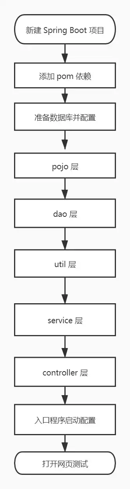
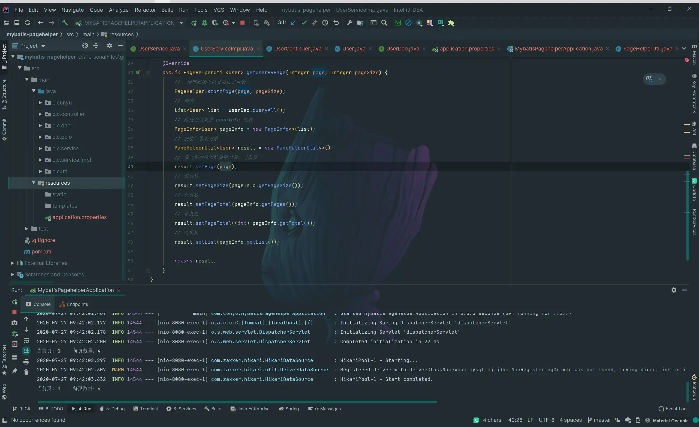
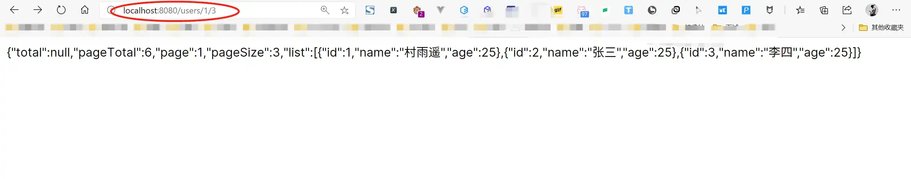
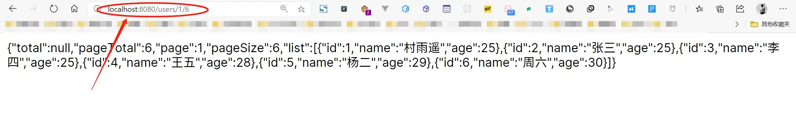

# 注解方式整合 Mybatis + PageHelper 分页实例

## 1. 前言

本篇博客主要利用 SpringBoot 通过注解的方式整合 Mybatis 同时利用 PageHelper 对结果分页。下面是整个整合过程，接下来开始整合：



## 2.  整合过程

最终项目结构如下图所示：



### 2.1 新建 Spring Boot 项目

新建一个 Spring Boot 项目，添加 Web 组件，具体过程可以参照我的另一篇博客 [创建 Spring Boot 项目的三种方式](https://cunyu1943.github.io/#/docs/Java/SpringBoot/2.创建SpringBoot项目的方式)。

### 2.2 添加 pom 依赖

由于要整合 MyBatis，所以我们需要在项目的配置文件 `pom.xml` 中添加 mysql 驱动、SpringBoot MyBatis 整合包、SpringBoot mapper 整合包和 pagehelper；

```xml
<!--     springboot mybatis 整合包   -->
<dependency>
    <groupId>org.mybatis.spring.boot</groupId>
    <artifactId>mybatis-spring-boot-starter</artifactId>
    <version>2.1.3</version>
</dependency>
<!--    mysql 驱动    -->
<dependency>
    <groupId>mysql</groupId>
    <artifactId>mysql-connector-java</artifactId>
    <scope>runtime</scope>
</dependency>

<!--mapper-->
<dependency>
    <groupId>tk.mybatis</groupId>
    <artifactId>mapper-spring-boot-starter</artifactId>
    <version>2.1.5</version>
</dependency>
<!--    pagehelper   -->
<dependency>
    <groupId>com.github.pagehelper</groupId>
    <artifactId>pagehelper-spring-boot-starter</artifactId>
    <version>1.2.13</version>
</dependency>
```

### 2.3 准备数据库

1.  数据库创建及输入插入

准备一张 `user` 表，有 `id`、`name`、`age` 三个属性，其中 `id` 为主键且自增，然后插入三条数据；

```sql
CREATE TABLE `user` (
  `id` int(11) NOT NULL AUTO_INCREMENT COMMENT '主键',
  `name` varchar(50) DEFAULT NULL COMMENT '姓名',
  `age` int(11) DEFAULT NULL COMMENT '年龄',
  PRIMARY KEY (`id`)
) ENGINE=InnoDB AUTO_INCREMENT=1 DEFAULT CHARSET=utf8;

INSERT INTO  user values (1,"村雨遥",25);
INSERT INTO  user values (2,"张三",26);
INSERT INTO  user values (3,"李四",27);
```

2.  数据源配置

在项目配置文件 `application.properties` 中配置数据源；

```properties
# 数据库配置
spring.datasource.username=root
spring.datasource.password=****
spring.datasource.url=jdbc:mysql://localhost:3306/springboot?useUnicode=true&characterEncoding=UTF-8&serverTimezone=UTC
spring.datasource.driver-class-name=com.mysql.cj.jdbc.Driver
```

### 2.4 pojo 层

根据数据库创建实体类，为了精简代码，后面过程中都或多或少用了 Lombok 插件，所以需要事先在 `pom.xml` 引入；

```xml
<dependency>
    <groupId>org.projectlombok</groupId>
    <artifactId>lombok</artifactId>
    <optional>true</optional>
</dependency>
```

```java
package com.cunyu.pojo;

import lombok.AllArgsConstructor;
import lombok.Data;
import lombok.NoArgsConstructor;

/**
 * @author : cunyu
 * @version : 1.0
 * @className : User
 * @date : 2020/7/26 20:44
 * @description : User 实体类
 */

@Data
@NoArgsConstructor
@AllArgsConstructor
public class User {
    private Long id;
    private String name;
    private Integer age;
}

```

### 2.5 dao 层

实体类创建完成后，编写实体类对应接口；

```java
package com.cunyu.dao;

import com.cunyu.pojo.User;
import org.apache.ibatis.annotations.Mapper;
import org.apache.ibatis.annotations.Param;
import org.apache.ibatis.annotations.Select;

import java.util.List;

/**
 * @author : cunyu
 * @version : 1.0
 * @className : UserDao
 * @date : 2020/7/27 0:39
 * @description : User 接口
 */

@Mapper
public interface UserDao {

    /**
     * @param
     * @return 用户列表
     * @description 查找所有用户
     * @date 2020/7/27 8:13
     * @author cunyu1943
     * @version 1.0
     */
    @Select("SELECT id,name,age FROM user")
    List<User> queryAll();
}
```

### 2.6 util 层

```java
package com.cunyu.util;

import lombok.AllArgsConstructor;
import lombok.Data;
import lombok.NoArgsConstructor;

import java.util.List;

/**
 * @author : cunyu
 * @version : 1.0
 * @className : PageHelperUtil
 * @date : 2020/7/27 8:16
 * @description : PageHelper 分页结果集
 */

@Data
public class PageHelperUtil<T> {
    /*共有数据*/
    private Long total;
    /*共有页数*/
    private Integer pageTotal;
    /*当前页*/
    private Integer page;
    /*每页显示条数*/
    private Integer pageSize;
    /*结果集*/
    private List<T> list;


}
```

### 2.7 service 层

1.  service 接口

```java
package com.cunyu.service;

import com.cunyu.pojo.User;
import com.cunyu.util.PageHelperUtil;

/**
 * @author : cunyu
 * @version : 1.0
 * @className : UserService
 * @date : 2020/7/27 0:38
 * @description : userService 接口
 */

public interface UserService {
    PageHelperUtil<User> getUserByPage(Integer page, Integer pageSize);
}
```

2.  service 接口实现类

```java
package com.cunyu.service.impl;

import com.cunyu.dao.UserDao;
import com.cunyu.pojo.User;
import com.cunyu.service.UserService;
import com.cunyu.util.PageHelperUtil;
import com.github.pagehelper.PageHelper;
import com.github.pagehelper.PageInfo;
import org.springframework.beans.factory.annotation.Autowired;
import org.springframework.stereotype.Service;

import java.util.List;

/**
 * @author : cunyu
 * @version : 1.0
 * @className : UserServiceImpl
 * @date : 2020/7/27 0:38
 * @description : userService 接口实现类
 */

@Service
public class UserServiceImpl implements UserService {

    @Autowired
    private UserDao userDao;


    @Override
    public PageHelperUtil<User> getUserByPage(Integer page, Integer pageSize) {
        //  设置起始页以及每页显示数
        PageHelper.startPage(page, pageSize);
        // 查询
        List<User> list = userDao.queryAll();
        // 将查询结果给 pageInfo 处理
        PageInfo<User> pageInfo = new PageInfo<>(list);
        // 创建结果集对象
        PageHelperUtil<User> result = new PageHelperUtil<>();
        // 将结果封装到结果集对象，当前页
        result.setPage(page);
        // 每页数
        result.setPageSize(pageInfo.getPageSize());
        // 总页数
        result.setPageTotal(pageInfo.getPages());
        // 总条数
        result.setPageTotal((int) pageInfo.getTotal());
        // 结果集
        result.setList(pageInfo.getList());

        return result;
    }
}
```

### 2.8 controller 层

```java
package com.cunyu.controller;

import com.cunyu.pojo.User;
import com.cunyu.service.UserService;
import com.cunyu.util.PageHelperUtil;
import org.springframework.beans.factory.annotation.Autowired;
import org.springframework.web.bind.annotation.GetMapping;
import org.springframework.web.bind.annotation.PathVariable;
import org.springframework.web.bind.annotation.RestController;

/**
 * @author : cunyu
 * @version : 1.0
 * @className : UserController
 * @date : 2020/7/27 0:38
 * @description : UserController
 */

@RestController
public class UserController {
    @Autowired
    UserService userService;

    @GetMapping("/users/{page}/{pageSize}")
    public PageHelperUtil<User> getUserByPage(@PathVariable Integer page, @PathVariable Integer pageSize) {
        System.out.println("当前页: " + page + "\t每页数量：" + pageSize);
        PageHelperUtil<User> users = userService.getUserByPage(page, pageSize);
        return users;
    }
}
```

### 2.9 入口程序配置

在入口程序中配置 mapper 自动扫描；

```java
package com.cunyu;

import org.mybatis.spring.annotation.MapperScan;
import org.springframework.boot.SpringApplication;
import org.springframework.boot.autoconfigure.SpringBootApplication;

@MapperScan(basePackages = "com.cunyu.dao")
@SpringBootApplication
public class MybatisXmlApplication {

    public static void main(String[] args) {
        SpringApplication.run(MybatisXmlApplication.class, args);
    }
}
```

### 2.10 网页测试

完成上述所有步骤之后，在浏览器中访问 `http://localhost:8080/user/{page}/{pageSize}`，就可以在网页中显示对应 `id` 的 `User` 对象的所有信息；




