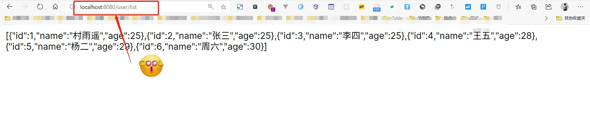

# 整合 JDBC Template 实例

> 作者：[村雨遥](https://github.com/cunyu1943)
> 
> 不要哀求，学会争取，若是如此，终有所获
>

## 🎈 号外

最近，公众号之外，建立了微信交流群，不定期会在群里分享各种资源（影视、IT 编程、考试提升……）&知识。如果有需要，可以**扫码或者后台添加小编微信备注入群**。进群后**优先看群公告**，**呼叫群中【资源分享小助手】**，还能免费帮找资源哦～

<center>
 
</center>

## 前言

在 Spring Boot 中，对于数据访问层，无论是关系型数据库（SQL）还是非关系型数据库（No

SQL），其底层均采用 Spring Data 的方式进行处理。

Spring 框架对数据库的操作在 JDBC 上做了深层次的封装，通过 **依赖注入** 将 DataSource 注册到 `JdbcTemplate` 中，使得我们能够轻易的完成对象关系映射。而且 JDBC 有着如下的特点：

1.  相较于其他 ORM 框架，JDBC 的速度无疑是最快的；
2.  配置简单，几乎用不额外配置；
3.  学习成本低；

## 整合 JDBC

### 依赖配置

创建一个 Spring Boot 项目，在 `pom.xml` 引入 Web 模块、 SQL 模块以及 Jdbc Template 的依赖； 

```xml
<!--    Web 模块依赖    -->
<dependency>
    <groupId>org.springframework.boot</groupId>
    <artifactId>spring-boot-starter-web</artifactId>
</dependency>
<!--    SQL 模块依赖    -->
<dependency>
    <groupId>mysql</groupId>
    <artifactId>mysql-connector-java</artifactId>
    <scope>runtime</scope>
</dependency>
<!--    Jdbc Template 模块依赖    -->
<dependency>
    <groupId>org.springframework.boot</groupId>
    <artifactId>spring-boot-starter-jdbc</artifactId>
</dependency>
```

###  数据库准备

1.  数据库创建及输入插入

准备一张 `user` 表，有 `id`、`name`、`age` 三个属性，其中 `id` 为主键且自增，然后插入三条数据；

```sql
CREATE DATABASE springboot;
USE springboot;
CREATE TABLE `user` (
  `id` int(11) NOT NULL AUTO_INCREMENT COMMENT '主键',
  `name` varchar(50) DEFAULT NULL COMMENT '姓名',
  `age` int(11) DEFAULT NULL COMMENT '年龄',
  PRIMARY KEY (`id`)
) ENGINE=InnoDB AUTO_INCREMENT=1 DEFAULT CHARSET=utf8;

INSERT INTO  user values (1,"村雨遥",25);
INSERT INTO  user values (2,"张三",26);
INSERT INTO  user values (3,"李四",27);
```

2.  数据源配置

在 `application.properties` 中加入如下配置用于连接数据库（Spring Boot 默认自动配置 `DataSource`，且优先采用 `HikariCP` 连接池 ）；

```properties
# 数据库配置
spring.datasource.url=jdbc:mysql://localhost:3306/springboot?serverTimezone=UTC&userUnicode=true&characterEncoding=utf-8
spring.datasource.driver-class-name=com.mysql.cj.jdbc.Driver
spring.datasource.username=root
spring.datasource.password=123456
# 连接池
# spring.datasource.type = HikariCP
```

###  实体类

```java
package com.cunyu.pojo;

import lombok.AllArgsConstructor;
import lombok.Data;
import lombok.NoArgsConstructor;
import org.springframework.stereotype.Component;

/**
 * @author : cunyu
 * @version : 1.0
 * @className : Author
 * @date : 2020/7/29 16:20
 * @description : User 实体类
 */

@Component
@Data
@AllArgsConstructor
@NoArgsConstructor
public class User {
    private Long id;
    private String name;
    private Integer age;
}
```

### service 层

```java
package com.cunyu.service;

import com.cunyu.pojo.User;

import java.util.List;

/**
 * @author : cunyu
 * @version : 1.0
 * @className : UserService
 * @date : 2020/7/29 21:12
 * @description : TODO
 */

public interface UserService {
    /**
     * @param
     * @return
     * @description 获取所有数据列表
     * @date 2020/7/29 21:57
     * @author cunyu1943
     * @version 1.0
     */
    public List<User> getList();
}

```

```java
package com.cunyu.service.Impl;

import com.cunyu.pojo.User;
import com.cunyu.service.UserService;
import org.springframework.beans.factory.annotation.Autowired;
import org.springframework.jdbc.core.JdbcTemplate;
import org.springframework.jdbc.core.RowMapper;
import org.springframework.stereotype.Service;

import java.sql.ResultSet;
import java.sql.SQLException;
import java.util.List;

/**
 * @author : cunyu
 * @version : 1.0
 * @className : UserServiceImpl
 * @date : 2020/7/29 21:13
 * @description : TODO
 */

@Service
public class UserServiceImpl implements UserService {

    private final JdbcTemplate jdbcTemplate;

    public UserServiceImpl(JdbcTemplate jdbcTemplate) {
        this.jdbcTemplate = jdbcTemplate;
    }

    @Override
    public List<User> getList() {
        String sql = "SELECT id, name, age FROM user";
        return (List<User>) jdbcTemplate.query(sql, new RowMapper<User>() {

            @Override
            public User mapRow(ResultSet resultSet, int i) throws SQLException {
                User user = new User();
                user.setId(resultSet.getLong("id"));
                user.setName(resultSet.getString("name"));
                user.setAge(resultSet.getInt("age"));
                return user;
            }
        });
    }
}
```

### controller 层

```java
package com.cunyu.controller;

import com.cunyu.pojo.User;
import com.cunyu.service.UserService;
import org.slf4j.Logger;
import org.slf4j.LoggerFactory;
import org.springframework.beans.factory.annotation.Autowired;
import org.springframework.stereotype.Controller;
import org.springframework.web.bind.annotation.GetMapping;
import org.springframework.web.bind.annotation.RequestMapping;
import org.springframework.web.bind.annotation.RestController;
import org.springframework.web.servlet.ModelAndView;

import java.util.List;

/**
 * @author : cunyu
 * @version : 1.0
 * @className : UserController
 * @date : 2020/7/29 16:22
 * @description : UserController
 */


@RequestMapping("/user")
@RestController
public class UserController {
    private static final Logger logger = LoggerFactory.getLogger(UserController.class);

    private final UserService userService;

    public UserController(UserService userService) {
        this.userService = userService;
    }

    @GetMapping("/list")
    public List<User> getUsers() {
        logger.info("从数据库读取数据");
        return userService.getList();
    }
}
```

###  结果

启动 Spring Boot，然后访问 `http://localhost:8080/user/list`，如果出现下面的内容，则说明整合 JDBC 成功；




## 总结

以上就是 Spring Boot 整合 JDBC 的具体过程了，如果本文对你有所帮助，还请帮忙点个赞再走呀！