# 创建项目的几种方式

> 作者：[村雨遥](https://github.com/cunyu1943)
> 
> 不要哀求，学会争取，若是如此，终有所获
>

## 🎈 号外

最近，公众号之外，建立了微信交流群，不定期会在群里分享各种资源（影视、IT 编程、考试提升……）&知识。如果有需要，可以**扫码或者后台添加小编微信备注入群**。进群后**优先看群公告**，**呼叫群中【资源分享小助手】**，还能免费帮找资源哦～

<center>
 
</center>

## 前言

如果你是一个浸淫 `Spring Boot` 已久的老手，那么可能下面的内容可能不那么适合你，写得很简单。但如果是
对于一个刚学习 `Spring Boot` 的新手而言，我想多少还是有些用的。本文就来手把手教你如何创建一个 `Spring Boot` 项目，并对其中的一些关键信息进行简单分析，让你更加快速的掌握如何创建一个 `Spring Boot` 项目。

## Spring Boot 简介

使用 `Servlet/JSP` 开发 `JavaWeb` 时，一个接口对应一个 `Servlet`，配置很繁琐。未尽量减少这种麻烦，`Spring Boot` 应用而生。它是由 `Pivotal` 团队提供的全新框架，目的适用于简化 `Spring` 应用的初始搭建即开发过程。该框架使用特定方式进行配置，从而使开发人员无需定义样板化的配置。

## 如何创建 Spring Boot 项目

`Sping Boot` 项目的本质其实还是一个 `Maven` 项目，主要有如下几种创建 `Spring Boot` 项目的方式；

### 在线创建

1.  打开 https://start.spring.io/  来生成 `Spring Boot` 项目；

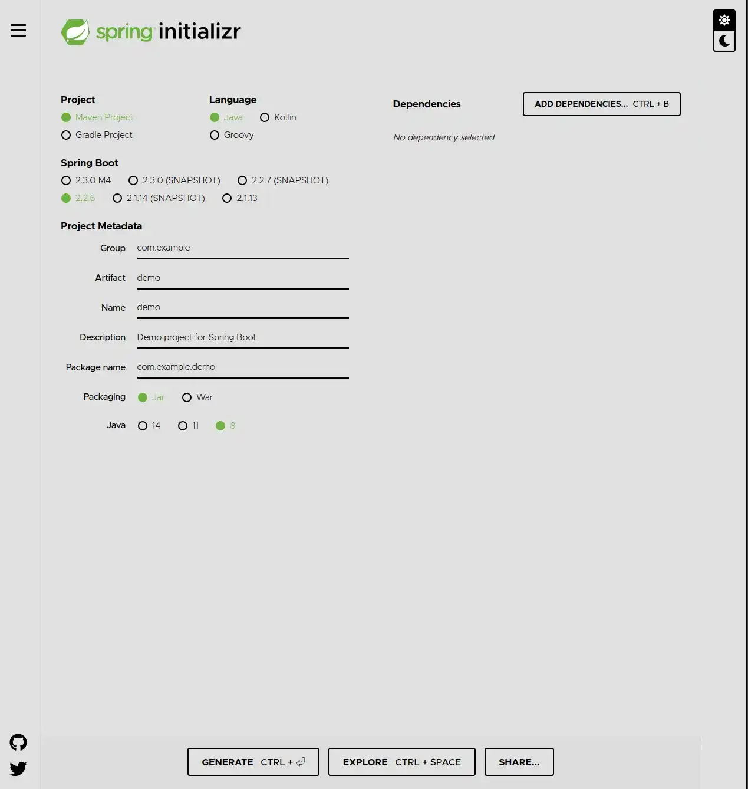

2.  然后选择和填写相关配置；

-   **Project**：表示使用什么构建工具，Maven or Gradle；
-   **Language**：表示使用什么编程语言， Java 、Kotlin or Groovy；
-   **Spring Boot**：Spring Boot 的版本；
-   **Project Metadata**：项目元数据，即 Maven项目基本元素，根据自己的实际情况填写；
-   **Dependencies**：要加入的 Spring Boot 组件；

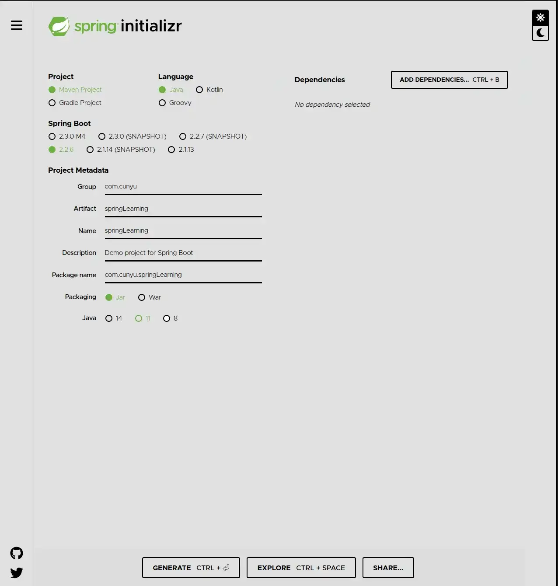

3.  然后点击生成或 `Ctrl + Enter` 即可；

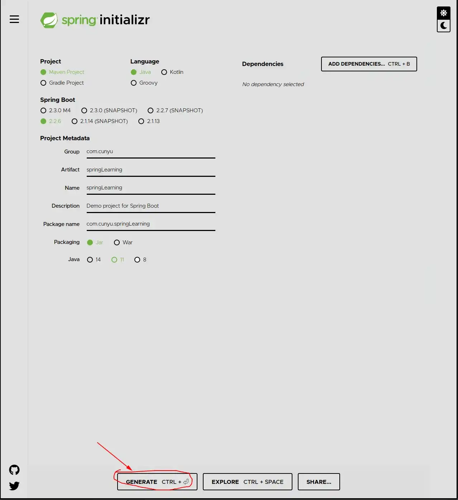

4.  将压缩包下载后，解压缩后用自己喜欢的 IDE 开发即可；

### IntelliJ IDEA 创建

1.  新建项目时选择 `Spring Initializr` ；

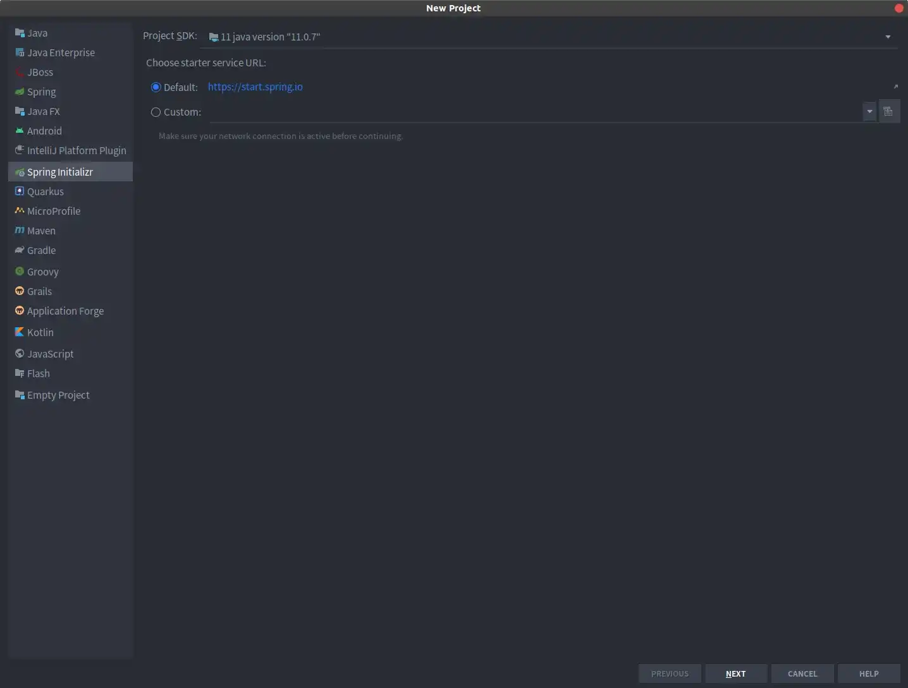

2.  点击下一步，填写相关配置；

-   `Group`：组织 ID，一般分为多个段，一般第一段为**域**，而第二段则是 **公司名称**；
-   `Artifact`：唯一标识符，一般是项目名；

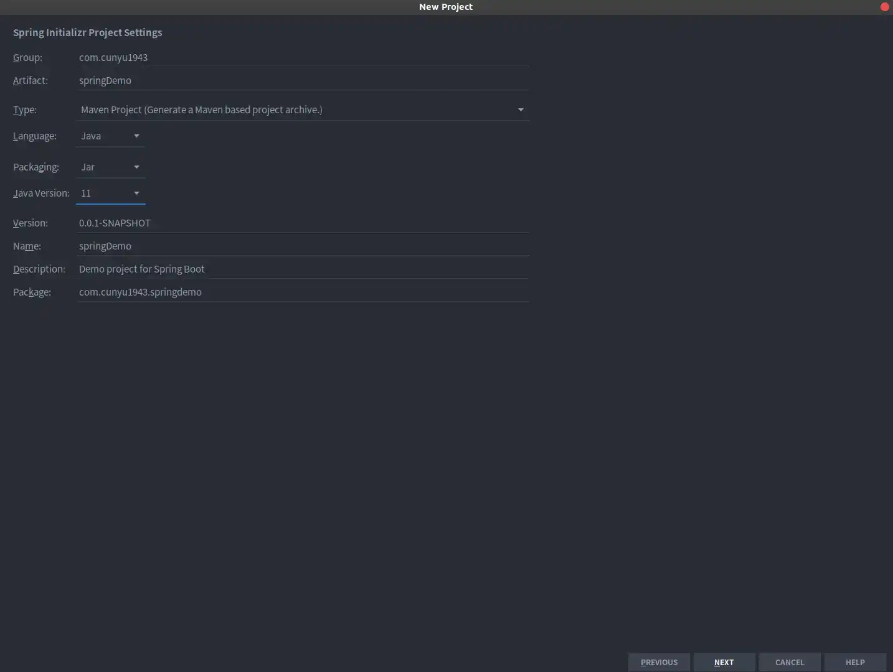

3.  选择包，添加相关依赖；

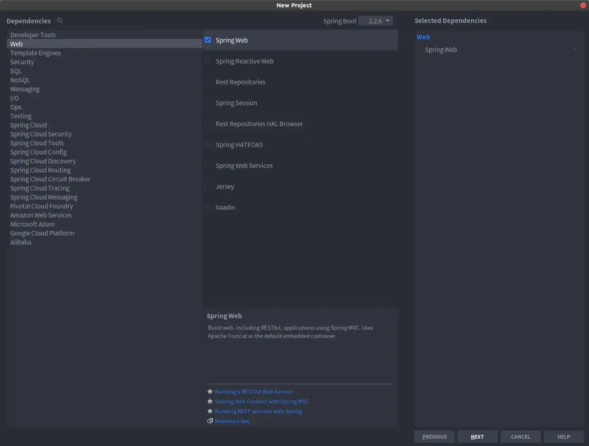

4.  配置项目名，点击完成即可；

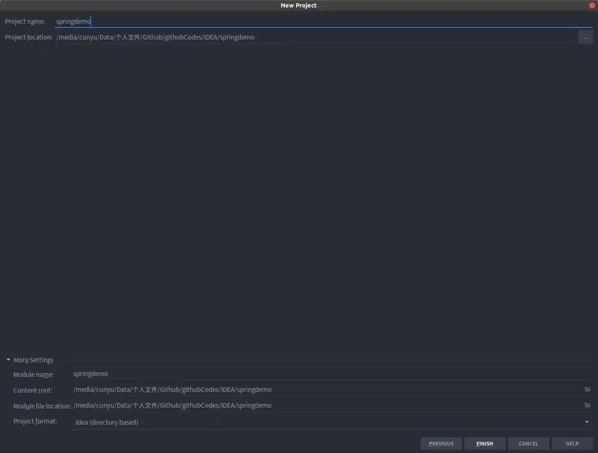

### Maven 创建

1.  新建 Maven 项目；

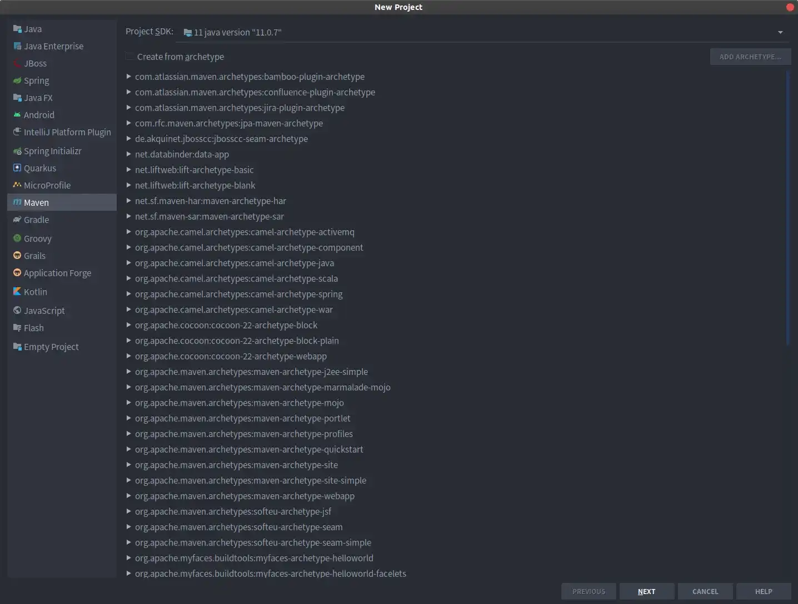

2.  填写项目名和相关配置；

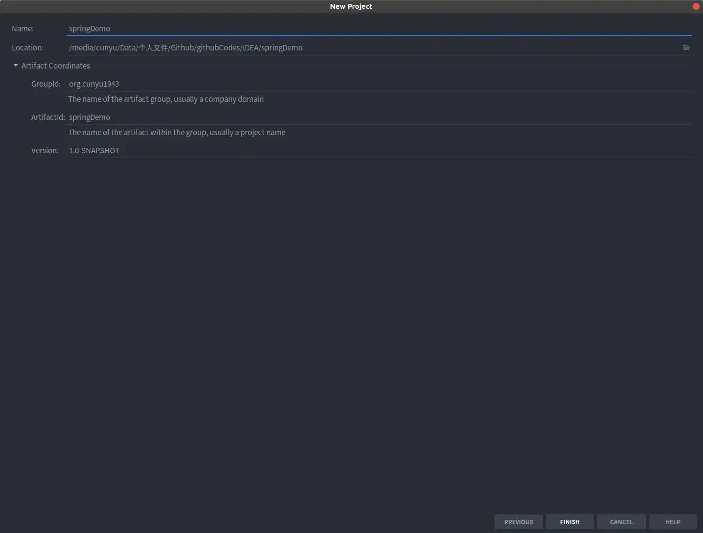

3.  点击完成即可；

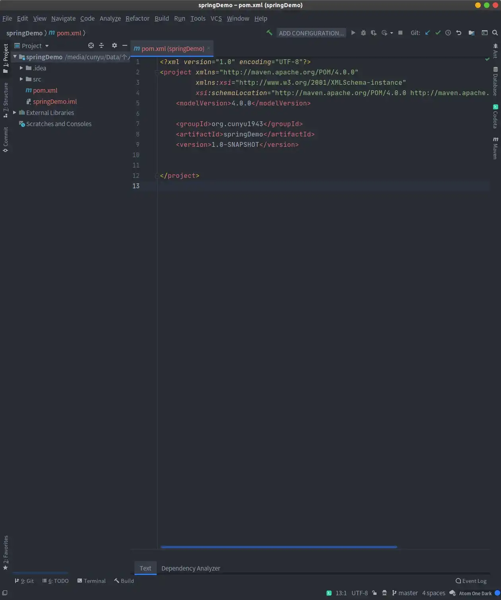

4.  配置 `pom.xml` 添加依赖；

```xml
<?xml version="1.0" encoding="UTF-8"?>
<project xmlns="http://maven.apache.org/POM/4.0.0"
         xmlns:xsi="http://www.w3.org/2001/XMLSchema-instance"
         xsi:schemaLocation="http://maven.apache.org/POM/4.0.0 http://maven.apache.org/xsd/maven-4.0.0.xsd">
    <modelVersion>4.0.0</modelVersion>

    <groupId>org.cunyu1943</groupId>
    <artifactId>springDemo</artifactId>
    <version>1.0-SNAPSHOT</version>

    <parent>
        <groupId>org.springframework.boot</groupId>
        <artifactId>spring-boot-starter-parent</artifactId>
        <version>2.2.6.RELEASE</version>
    </parent>
    <dependencies>
        <dependency>
            <groupId>org.springframework.boot</groupId>
            <artifactId>spring-boot-starter-web</artifactId>
            <version>2.2.6.RELEASE</version>
        </dependency>
    </dependencies>

</project>

```

5.  在 `main/java` 目录下创建一个包，然后新建一个类，比如我的如下；

```java
package controller;

import org.springframework.boot.SpringApplication;
import org.springframework.boot.autoconfigure.EnableAutoConfiguration;
import org.springframework.web.bind.annotation.GetMapping;
import org.springframework.web.bind.annotation.RestController;

/**
 * Created with IntelliJ IDEA.
 * Version : 1.0
 * Author  : cunyu
 * Email   : cunyu1024@foxmail.com
 * Website : https://cunyu1943.github.io
 * 公众号   : 村雨遥
 * Date    : 2020/4/23 下午2:50
 * Project : springDemo
 * Package : controller
 * Class   : App
 * Desc    :
 */

@EnableAutoConfiguration
@RestController

public class App {
    public static void main(String[] args) throws Exception {
        SpringApplication.run(App.class, args);
    }

    @GetMapping("/index")
    public String index() {
        return "Hello World!";
    }
}
```

6.  运行上一步中的 `main` 方法即可；

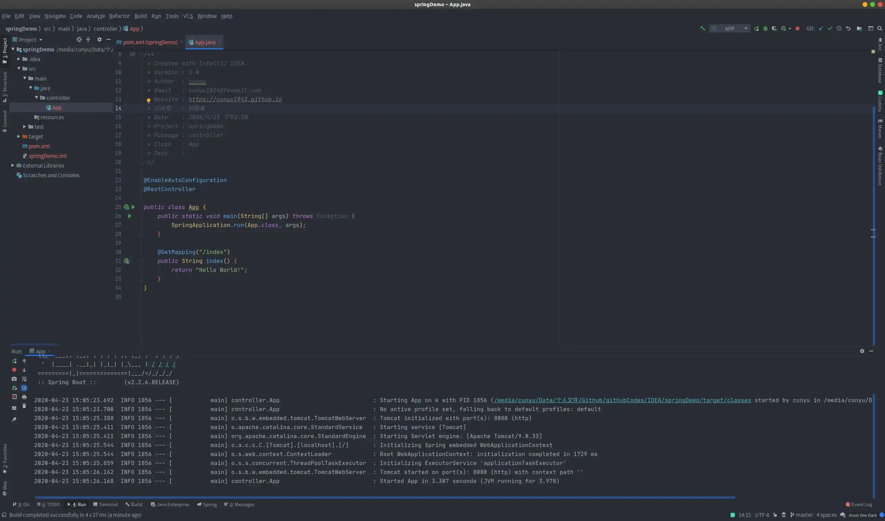

## 常见项目结构

### 代码层

根目录：`com.springboot`：

-   `build` ：工程启动类；
-   `entity` ：实体类；
-   `dao` ：数据访问层；
-   `service` ：数据服务层，业务类代码；
-   `controller` ：前端访问控制器；
-   `config` ：配置信息类；
-   `util` ：工具类；
-   `constant` ：常用接口类；
-   `vo` ：数据传输类；
-   `Application.java`：项目的启动类；

###  资源文件结构

根目录 `src/main/resources`：

-   `config` ：`.properties、.json` 等配置文件；
-   `i18n` ：国际化相关；
-   `META-INF/spring` ：`spring.xml` ；
-   `static` ：页面以及 `js、css、image` 等分别放在各自文件夹下；

## @SpringBootApplication 注解分析

###  相关代码

```java
package org.springframework.boot.autoconfigure;
@Target(ElementType.TYPE)
@Retention(RetentionPolicy.RUNTIME)
@Documented
@Inherited
@SpringBootConfiguration
@EnableAutoConfiguration
@ComponentScan(excludeFilters = {
        @Filter(type = FilterType.CUSTOM, classes = TypeExcludeFilter.class),
        @Filter(type = FilterType.CUSTOM, classes = AutoConfigurationExcludeFilter.class) })
public @interface SpringBootApplication {
   ......
}
```

### 说明

`@SpringBootApplication` 标注该类是一个启动类，可以看做是 `@Configuration、@EnableAutoConfiguration、@ComponentScan` 的集合；

- `@Configuration` ：允许在上下文中注册额外的 `Bean` 或导入其他配置；
- `@EnableAutoConfiguration`：启动 `Spring Boot` 的自动配置机制；
- `@ComponentScan`：扫描被 `@ComponentScan（@Service、@Controller、@Repository）` 注解的 `Bean`，默认扫描该类所在包下所有类，将这些 `Bean` 定义加载到 IOC 容器中；

##  pom.xml 分析

```xml
<?xml version="1.0" encoding="UTF-8"?>
<project xmlns="http://maven.apache.org/POM/4.0.0" xmlns:xsi="http://www.w3.org/2001/XMLSchema-instance"
         xsi:schemaLocation="http://maven.apache.org/POM/4.0.0 https://maven.apache.org/xsd/maven-4.0.0.xsd">
    <modelVersion>4.0.0</modelVersion>
    <parent>
        <groupId>org.springframework.boot</groupId>
        <artifactId>spring-boot-starter-parent</artifactId>
        <version>2.3.2.RELEASE</version>
        <relativePath/> <!-- lookup parent from repository -->
    </parent>
    <groupId>com.cunyu</groupId>
    <artifactId>springboot-03</artifactId>
    <version>0.0.1-SNAPSHOT</version>
    <name>springboot-03</name>
    <description>spring boot - 03</description>

    <properties>
        <java.version>1.8</java.version>
    </properties>

    <dependencies>
        
        <dependency>
            <groupId>org.springframework.boot</groupId>
            <artifactId>spring-boot-starter-web</artifactId>
        </dependency>

        <dependency>
            <groupId>org.springframework.boot</groupId>
            <artifactId>spring-boot-starter-test</artifactId>
            <scope>test</scope>
            <exclusions>
                <exclusion>
                    <groupId>org.junit.vintage</groupId>
                    <artifactId>junit-vintage-engine</artifactId>
                </exclusion>
            </exclusions>
        </dependency>
    </dependencies>

    <build>
        <plugins>
            <plugin>
                <groupId>org.springframework.boot</groupId>
                <artifactId>spring-boot-maven-plugin</artifactId>
            </plugin>
        </plugins>
    </build>

</project>
```

创建好项目后，如果没有选其他组件，会生成如上的 Spring Boot 项目依赖，主要有四个部分：

-   **项目元数据**

创建时输入的 Project Metadata 部分，即 Maven 项目的基本元素，包括 `groupId、artifactId、version、name、description` 等；

-   **parent**

继承 `spring-boot-starter-parent` 的依赖管理，控制版本与打包等等内容；

-   **dependencies**

项目具体依赖，默认包含 `spring-boot-starter-web`，用于实现HTTP接口（该依赖中包含了Spring MVC）；`spring-boot-starter-test`用于编写单元测试的依赖包。后续开发中，主要就是在这里添加各种依赖。

-   **build**

构建配置部分，默认使用 `spring-boot-maven-plugin`，配合 `spring-boot-starter-parent` 可以把 Spring Boot 应用打包成 jar 来直接运行。

## 总结

以上就是今天的全部内容了，文章主要介绍了两种创建 SpringBoot 的方式，一种是通过 Spring 官网在线创建的方式，另一种则是通过 IDEA 创建的方式，两个方式其实效果都是一样的，只不过形式不同而已。

最后，创作不易，如果觉得我的文章对你有所帮助，那就帮忙点赞关注吧，感谢支持！