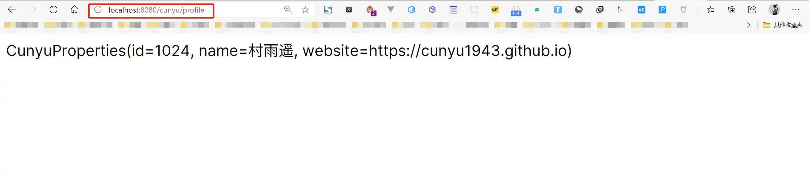
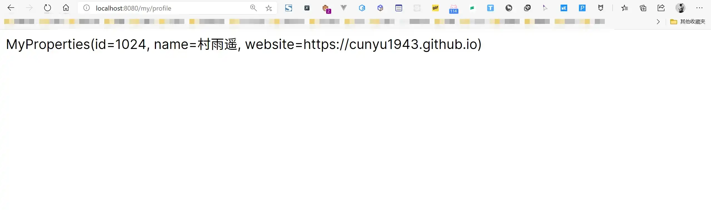

# 配置详解

## 🎈 号外

最近，公众号之外，建立了微信交流群，不定期会在群里分享各种资源（影视、IT 编程、考试提升……）&知识。如果有需要，可以**扫码或者后台添加小编微信备注入群**。进群后**优先看群公告**，**呼叫群中【资源分享小助手】**，还能免费帮找资源哦～

<center>
 
</center>

##  前言

为了 Spring Boot 能够更好地生成配置元数据文件，我们可以在创建项目时添加 `Spring Configuartion Processor` 依赖，或者在创建好项目后的 `pom.xml` 文件中手动添加。添加该依赖后，我们在编写配置时就会有属性提示，大大降低编写错误。

```xml
<dependency>
    <groupId>org.springframework.boot</groupId>
    <artifactId>spring-boot-configuration-processor</artifactId>
    <optional>true</optional>
</dependency>
```

##  application.properties


### 自定义属性

`application.properties` 配置文件是创建项目后就自带的，如果我们要自定义属性，可以在其中直接配置，配置过程如下：

1.  在 `application.properties` 中添加我们要自定义的配置；

```properties
cunyu.id=1024
cunyu.name=村雨遥
cunyu.website=https://cunyu1943.github.io
```

2.  创建实体类来映射我们配置的属性；

```java
package com.cunyu.pojo;

import lombok.AllArgsConstructor;
import lombok.Data;
import lombok.NoArgsConstructor;
import org.springframework.boot.context.properties.ConfigurationProperties;
import org.springframework.stereotype.Component;

/**
 * @author : cunyu
 * @version : 1.0
 * @className : CunyuProperties
 * @date : 2020/7/29 13:34
 * @description : TODO
 */

@Component
@ConfigurationProperties(prefix = "cunyu")
@Data
@NoArgsConstructor
@AllArgsConstructor
public class CunyuProperties {
    private int id;
    private String name;
    private String website;
}
```

3.  定义 Controller 来注入测试；

```java
package com.cunyu.controller;

import com.cunyu.pojo.CunyuProperties;
import org.slf4j.Logger;
import org.slf4j.LoggerFactory;
import org.springframework.beans.factory.annotation.Autowired;
import org.springframework.web.bind.annotation.GetMapping;
import org.springframework.web.bind.annotation.RequestMapping;
import org.springframework.web.bind.annotation.RestController;

/**
 * @author : cunyu
 * @version : 1.0
 * @className : CunyuPropertiesController
 * @date : 2020/7/29 13:37
 * @description : TODO
 */

@RestController
@RequestMapping("/cunyu")
public class CunyuPropertiesController {
    private static final Logger logger = LoggerFactory.getLogger(CunyuPropertiesController.class);

    @Autowired
    CunyuProperties cunyuProperties;

    @GetMapping("/profile")
    public String cunyuProfile(){
        logger.info("---------------");
        logger.info(cunyuProperties.toString());
        logger.info("---------------");
        return cunyuProperties.toString();
    }
}
```

4.  打开网页测试，打开 1，同时观察控制台，显示如下内容则说明属性注入成功；




### 多环境配置

实际开发过程中，常常需要多个环境（如 **开发、测试、生产**等），而不同环境的配置都不一样，此时配置方法如下；

1.  创建不同环境对应的配置文件，配置文件名为 `application-{profile}.properties`，`{profile}` 为我们自定义环境，如下：

>   开发环境：application-dev.properties

```properties
server.servlet.context-path=/dev
```

>   测试环境：application-test.properties

```properties
server.servlet.context-path=/test
```

>   生产环境：application-prod.properties

```properties
server.servlet.context-path=/prod
```

2.  然后在 `application.properties` 中加入激活的环境，此时就会激活对应环境的配置；

```properties
# {profile} 对应上述的 dev、test、prod
spring.profiles.active={profile}
```

之所以要分为多个环境的配置，主要是方便在不同环境中开发的需求，比如我们要开发新功能，那此时就可以激活开发配置文件的相关设置，等待我们开发完成之后，然后再切换到测试环境进行测试。而经过严格的测试之后，我们就可以将新推出的功能上线到生产环境中。纵观整个开发流程，我们既完成了新功能的开发，也没有影响到用户对现有系统的使用，所以现在大家基本都是基于这种模式来进行业务开发。

## 自定义配置文件

假如我们不想用项目自带的 `application.properties` 配置环境，那我们也可以自定义我们需要的配置。但该如何配置呢？接下来我们就来看看 ~

1.  首先创建一个自定义配置文件 `my.properties`，文件名可以自定义，但是后缀要保持一致，然后在其中加入我们自定义配置的属性；

```properties
my.id=1024
my.name=村雨遥
my.website=https://cunyu1943.github.io
```

2.  定义实体类，用于映射自定义配置文件中的内容；

```java
package com.cunyu.pojo;

import lombok.AllArgsConstructor;
import lombok.Data;
import lombok.NoArgsConstructor;
import org.springframework.boot.context.properties.ConfigurationProperties;
import org.springframework.context.annotation.PropertySource;
import org.springframework.stereotype.Component;

/**
 * @author : cunyu
 * @version : 1.0
 * @className : MyProperties
 * @date : 2020/7/29 14:05
 * @description : TODO
 */

@Component
@PropertySource("classpath:my.properties")
@ConfigurationProperties(prefix = "my")
@Data
@NoArgsConstructor
@AllArgsConstructor
public class MyProperties {
    private int id;
    private String name;
    private String website;
}
```

3.  定义 Controller 来注入测试

```java
package com.cunyu.controller;

import com.cunyu.pojo.MyProperties;
import org.slf4j.Logger;
import org.slf4j.LoggerFactory;
import org.springframework.beans.factory.annotation.Autowired;
import org.springframework.web.bind.annotation.GetMapping;
import org.springframework.web.bind.annotation.RequestMapping;
import org.springframework.web.bind.annotation.RestController;

/**
 * @author : cunyu
 * @version : 1.0
 * @className : MyPropertiesController
 * @date : 2020/7/29 14:07
 * @description : TODO
 */

@RestController
@RequestMapping("/my")
public class MyPropertiesController {
    private static final Logger logger = LoggerFactory.getLogger(MyPropertiesController.class);

    @Autowired
    MyProperties myProperties;

    @GetMapping("/profile")
    public String myProfile() {
        logger.info("=============");
        logger.info(myProperties.toString());
        logger.info("=============");
        
        return myProperties.toString();
    }
}
```

4.  打开网页测试，打开 `http://localhost:8080/my/profile`，同时观察控制台，显示如下内容则说明属性注入成功；




##  注意

`application.properties` 和 `my.properties` 会优先加载 `application.properties`。

## .yml 和 .properties

一般来说，使用 IDEA 创建一个 Spring Boot 项目时，默认都会生成一个 `application.properties` 的配置文件。该配置文件是用来 **修改 Spring Boot 自动配置的默认值**。 但有的朋友会更倾向于使用 `application.yml`，那么问题来了，这两种格式到底有啥区别呢？

开始比较之前，我们先来看看各自的实例：

- **.properties 格式** 

```properties
server.port=8081
spring.datasource.type=org.apache.tomcat.jdbc.pool.DataSource
spring.datasource.url=jdbc:mysql://aliyuncs.com:3306/database?useUnicode=true&zeroDateTimeBehavior=convertToNull&autoReconnect=true
spring.datasource.username=root
spring.datasource.password=******
spring.datasource.driver-class-name=com.mysql.jdbc.Driver
```

- **.yml 格式**

```yml
server:
  port: 8082
spring:
    datasource:
        name: test
        url: jdbc:mysql://127.0.0.1:3306/database
        username: root
        password: ******
        type: com.alibaba.druid.pool.DruidDataSource
        driver-class-name: com.mysql.jdbc.Driver
```

从上面的实例我们可以发现，两者的区别主要有以下几点：

1.  **语法结构**

-   `.properties` 格式使用的是 **键值对形式（key=value）**，而 `.yml` 格式则使用的是 **树状结构（key: value）**；

-   `.properties` 格式通过 `.` 来连接，`=` 来赋值，结构上比较直接，而 `.yml` 格式则使用 `:` 来分层，结构上呈现树状结构，层次感明显，而且赋值时 `:` 的后边必须 **接着一个空格再赋值**

2.   **执行先后顺序**

如果一个工程中同时存在两种格式的文件，那么会 **优先加载 `.yml`  文件，然后再加载 `.properties`，而且后加载的 `.properties` 会覆盖之前加载的 `.yml` 文件**。

此外，`.yml` 配置时需要注意以下几点：

1. **缩进必须用空格，不能用 Tab**
2. `@PropertySource` 注解不能加载 `yml` 文件

## 总结

以上就是关于 Spring Boot 中的配置相关内容了。本文主要介绍了 Spring Boot 项目自带的配置文件的相关信息，同时也介绍了如果我们想要满足自己需求如何进行自定义配置。最后，则是对 `.yml` 和 `.properties` 不同格式的配置文件的区别进行解释。
