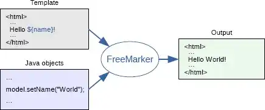
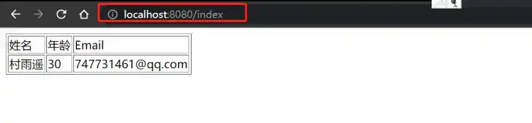

# 整合 FreeMarker 实例

## 前言

在之前的文章[Spring Boot 整合 Thymeleaf](https://cunyu1943.blog.csdn.net/article/details/107671467)中，我们学习了如何将模板 `Thymeleaf` 整合到 `Spring Boot` 中，那今天我们就来看看，另一个老牌的开源免费模板引擎 - `FreeMarker`！

## FreeMarker 简介

>   FreeMarker 是一款模板引擎：即一种基于模板和要改变的数据，并用来生成输出文本(HTML网页，电子邮件，配置文件，源代码等)的通用工具。 它不是面向最终用户的，而是一个Java类库，是一款程序员可以嵌入他们所开发产品的组件。

以上就是出自 FreeMarker 的官方定义，我们通过使用 FreeMarker，可以将我们所需的模板何数据渲染成 HTML，从而实现我们想要的效果。通过将模板与数据分开，让分工更加明确，模板方面则专注于如何将数据进行展现，而在数据方面，我们就可以专注于展示何种数据，下图就是我们以上所描述的 FreeMarker 的功能。



那接下来，我们就来看看，如何将 FreeMarker 像 Thymeleaf 一样整合到我们的 Spring Boot 中，让我们的开发更加简单。

## 准备工作

### 环境准备

正式开始之前，依然给出本文所基于的环境，避免环境问题可能给大家带来的影响。

-   JDK 17（理论上推荐不低于 1.8 版本）
-   IDEA
-   SpringBoot 2.x

### 添加 FreeMarker 依赖

开始之前，我们需要添加 FreeMarker 的相关依赖，同样这里我们可以选择两种方式。一种是在创建项目时就添加上，另一种则是创建项目后在项目  `pom.xml` 文件中手动添加，接下来我们分别来看看两种不同的方式应该如何添加。如果还不清楚如何创建 Spring Boot 项目，可以参照我之前的一篇文章：[创建 Spring Boot 项目的 3 种方式](https://cunyu1943.blog.csdn.net/article/details/119618308)。

1.   **第一种**

在使用 IDEA 创建 Spring Boot 新项目时，添加依赖时将模板引擎中的 `Apache FreeMarker` 勾选上。


2.**第二种**

如果在创建时未添加 FreeMarker 模板引擎依赖，或者在项目开始创建之初并未有此需求，但后续过程中又增加了该需求，则此时可以直接在项目 `pom.xml` 中手动添加 FreeMarker 依赖即可。

```xml
<dependency>
    <groupId>org.springframework.boot</groupId>
    <artifactId>spring-boot-starter-freemarker</artifactId>
</dependency>
```

### 添加 FreeMarker 相关配置

添加依赖后，我们需要在项目配置文件 `application.yml` 中添加 FreeMarker 的相关配置。

```yml
spring:
  freemarker:
    # 模板后缀名
    suffix: .ftl
    # 文档类型
    content-type: text/html
    # 页面编码
    charset: UTF-8
    # 页面缓存
    cache: false
    # 模板路径
    template-loader-path: classpath:/templates/
```

## 编写实体类和 Controller

### 编写实体类

创建一个 `User` 类，并将其各种 `setter`、`getter`、构造方法等完成，这里我依然使用了 Lombok 插件，以便简化我们的代码。关于该插件的更多用法，可以参照我之前的文章：[Lombok 的安装及使用指南](https://blog.csdn.net/github_39655029/article/details/119992626)。

```java
package com.cunyu.springbootfreemarkerdemo.entity;

import lombok.AllArgsConstructor;
import lombok.Data;
import lombok.NoArgsConstructor;
import org.springframework.stereotype.Component;

/**
 * Created with IntelliJ IDEA.
 *
 * @author : zhangliang
 * @version : 1.0
 * @project : java-learning
 * @package : com.cunyu.springbootfreemarkerdemo.entity
 * @className : User
 * @createTime : 2021/11/30 21:55
 * @email : 747731461@qq.com
 * @公众号 : 村雨遥
 * @website : https://cunyu1943.github.io
 * @description :
 */

@Component
@Data
@AllArgsConstructor
@NoArgsConstructor
public class User {
    private int age;
    private String name;
    private String email;
}
```

### 编写 Controller

这里我们创建一个 `User` 对象，然后设置其年龄、Email、姓名等相关信息，然后将其加到属性中，方便传输到前端进行展示。

```java
package com.cunyu.springbootfreemarkerdemo.controller;

import com.cunyu.springbootfreemarkerdemo.entity.User;
import org.springframework.stereotype.Controller;
import org.springframework.ui.Model;
import org.springframework.web.bind.annotation.GetMapping;

/**
 * Created with IntelliJ IDEA.
 *
 * @author : zhangliang
 * @version : 1.0
 * @project : java-learning
 * @package : com.cunyu.springbootfreemarkerdemo.controller
 * @className : UserController
 * @createTime : 2021/11/30 22:04
 * @email : 747731461@qq.com
 * @公众号 : 村雨遥
 * @website : https://cunyu1943.github.io
 * @description :
 */
@Controller
public class UserController {
    @GetMapping("/index")
    public String index(Model model) {
        User user = new User();
        user.setAge(26);
        user.setEmail("747731461@qq.com");
        user.setName("村雨遥");
        model.addAttribute("user", user);
        return "index";
    }
}
```

### 数据渲染

当完成实体类和 Controller 编写后，我们就可以利用模板来进行展示了。我们在项目的 `resources/templates` 路进行新建一个 `index.ftl` 文件，注意这里文件名要保持和 Controller 中 `index` 方法所返回的字符串一致。

```html
<!DOCTYPE html>
<html lang="en">
<head>
    <meta charset="UTF-8">
    <title>FreeMarker 实验</title>
</head>
<body>
    <table>
        <tr>
            <td>姓名</td>
            <td>年龄</td>
            <td>Email</td>
        </tr>
        <tr>
            <td>${user.name}</td>
            <td>${user.age}</td>
            <td>${user.email}</td>
        </tr>
    </table>
</body>
</html>
```

### 测试

将我们的项目启动起来，然后在浏览器中访问如下路径：

>   http://localhost:8080/index

如果显示如下图中的信息，那么就说明我们此次的整合工作顺利完成！




## 总结

以上就是 Spring Boot 整合 FreeMarker 的具体过程了，可以结合之前的文章：[Spring Boot 整合 Thymeleaf 实例](https://cunyu1943.blog.csdn.net/article/details/107671467)共同阅读，对比 Thymeleaf 和 FreeMarker 在整合过程中的一些共同点和不同点，相信你会有更多的收获。

最后，关于本文案例代码，我已经上传到 GitCode，有需要的小伙伴可以自取：[传送门](https://gitcode.net/github_39655029/java-learning-demos)。