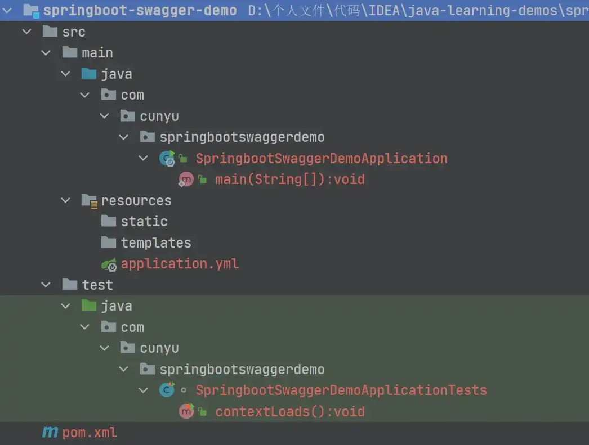
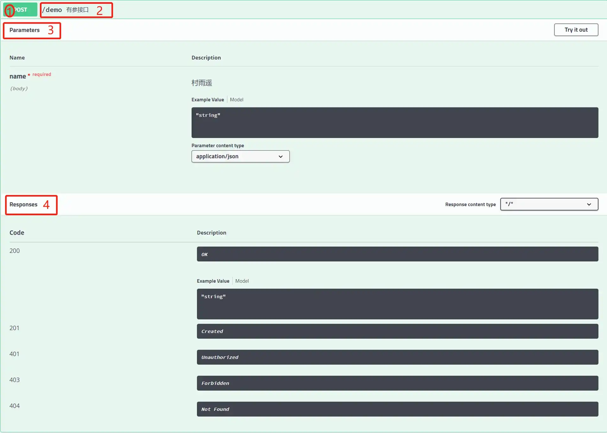
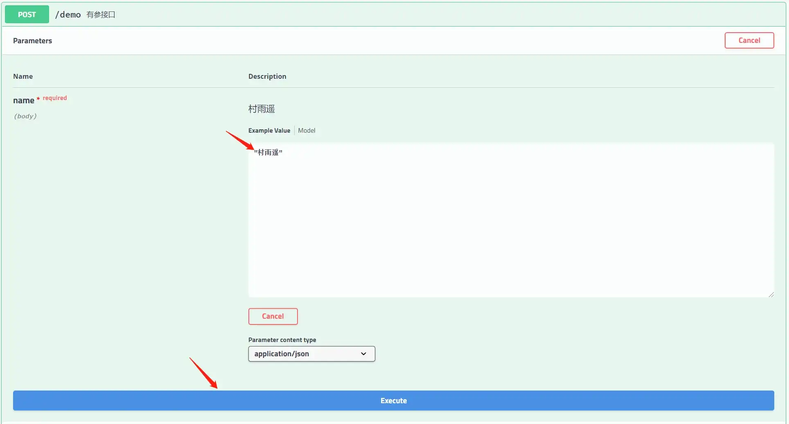
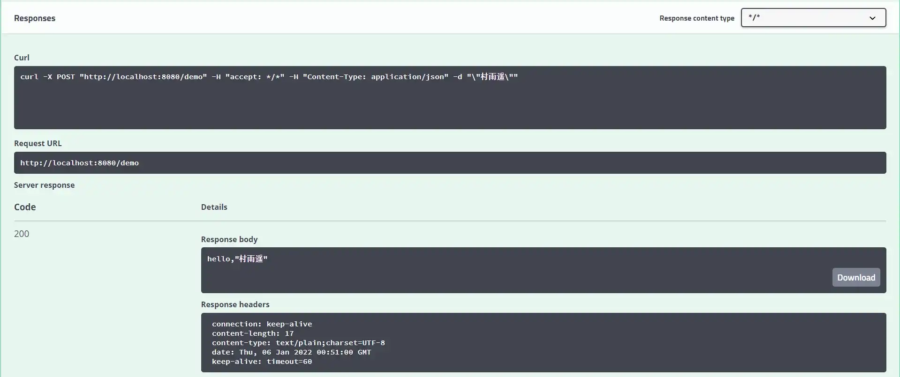

# Swagger2 构建强大的 API 文档

## 前言

不管你是从事前端还是后端开发，相信都难免被接口文档折磨过。如果你是一个前端开发者，可能你会经常发现后端给的接口文档跟实际代码有所出入。而假设你是一个后端开发者，你可能又会觉得自己开发后端接口已经够烦的了，还要花费大量精力去编写和维护接口文档，所以难免有时候会更新不及时。这就可能造成了前后端相互不理解，最后甚至吵起来，哈哈哈 🤪。

这时候我们就会想，有没有一款工具，能让我们快速实现编写接口文档。这个工具既能保证我们的接口文档实时更新，也能保证我们不用花过多时间去维护，就像写注释那么简单。

既然这是大多数前后端程序员的一大痛点，那必须得有一个解决方案吧。而这个方案使用的人多了，慢慢就成了一种规范，大家都默认使用这个方案，从而解决前后端接口文档不同步的问题，而这就是我们今天的主角 - Swagger 的由来。

通过使用 Swagger，我们只需要按照它所给定的一系列规范去定义接口以及接口的相关信息，然后它就能帮我们自动生成各种格式的接口文档，方便前后端开发者进行前后端联调。同时，如果我们的代码接口有所变动，只需要更新 Swagger 的描述，它就能进行实时更新，做到实际代码和接口文档的一致性。

## Swagger 简介

### Swagger 是什么

Swagger 是一种接口描述语言，主要用于生成、描述、调用以及可视化 RESTful 风格的 Web 服务接口文档。以前的项目可能更多的是前后端未分开同时进行开发，所以接口文档可能不是那么重要。但现在主流的项目基本都是前后端分离，如果前后端没有沟通好，就有可能导致接口文档更新不及时，造成一些不必要的麻烦。而通俗地讲，Swagger 就是帮我们写接口文档的。它不仅能自动生成实时接口文档，还能生成测试用例，方便我们进行测试。

Swagger 主要提供了如下几种开源工具：


1.   **Swagger Editor**

Swagger 所提供的的编辑器，主要用于编辑 Swagger 描述文件，支持实时预览描述文件更新后的效果，类似于我们的 Markdown 编辑器，左边编写源码，右边就可以进行实时预览。该编辑器不仅提供在线使用，还支持本地部署。

2.   **Swagger UI**

提供可视化的 UI 页面，用于展示 Swagger 的描述文件。接口的调用方、测试等都可以通过该页面查阅接口的相关信息，并且进行简单的接口请求测试。

3.   **Swagger Codegen**

通过使用该工具，可以将 Swagger 的描述文件生成 HTML 和 CWIKI 形式的接口文档，而且还能生成针对多种不同语言的服务端和客户端的代码。

### Swagger UI

平时和我们打交道最多的，可能就是 Swagger UI 这个工具了，它主要用于显示接口文档。根据我们代码中按照 Swagger 规范所设置的描述，自动生成接口说明文档。一个简单的示例如下：


## Spring Boot 集成 Swagger

### 创建 Spring Boot 项目

通过以上对 Swagger 简单的介绍之后，我们来看看如何在 Spring Boot 项目中使用 Swagger。

首先需要创建一个简单的 Spring Boot 项目，如果你还不知道如何创建，可以参考我之前的一篇文章 [创建 Spring Boot 项目的 3 种方式](https://cunyu1943.blog.csdn.net/article/details/119618308)。

创建好之后的项目接口如下：



### 引入依赖

创建好 Spring Boot 项目之后，需要配置项目 `pom.xml` 文件，在其中引入 Swagger 的相关依赖。

```xml
<dependency>
    <groupId>io.springfox</groupId>
    <artifactId>springfox-swagger2</artifactId>
    <version>2.9.2</version>
</dependency>

<dependency>
    <groupId>io.springfox</groupId>
    <artifactId>springfox-swagger-ui</artifactId>
    <version>2.9.2</version>
</dependency>
```

### 构建 Swagger 配置类

引入依赖后，接下来就是构建 Swagger 的配置类了。

```java
package com.cunyu.springbootswaggerdemo.config;

import org.springframework.context.annotation.Bean;
import org.springframework.context.annotation.Configuration;
import springfox.documentation.builders.RequestHandlerSelectors;
import springfox.documentation.service.ApiInfo;
import springfox.documentation.service.Contact;
import springfox.documentation.spi.DocumentationType;
import springfox.documentation.spring.web.plugins.Docket;
import springfox.documentation.swagger2.annotations.EnableSwagger2;

import java.util.ArrayList;

/**
 * Created with IntelliJ IDEA.
 *
 * @author : 村雨遥
 * @version : 1.0
 * @project : springboot-swagger-demo
 * @package : com.cunyu.springbootswaggerdemo.config
 * @className : Swagger2Configuration
 * @createTime : 2022/1/5 22:21
 * @email : 747731461@qq.com
 * @微信 : cunyu1024
 * @公众号 : 村雨遥
 * @网站 : https://cunyu1943.github.io
 * @description :
 */
@Configuration
@EnableSwagger2
public class Swagger2Configuration {

    /**
     * 配置 Swagger 2
     * 注册一个 Bean 属性
     * enable()：是否启用 Swagger，启用后才能在浏览器中进行访问
     * groupName()：用于配置 API 文档的分组
     */
    @Bean
    public Docket docket() {
        return new Docket(DocumentationType.SWAGGER_2)
                .apiInfo(apiInfo())
                .enable(true)
                .groupName("v1")
                .select()
                // 过滤路径
                //.paths(PathSelectors.ant())
                // 指定扫描的包
                .apis(RequestHandlerSelectors.basePackage("com.cunyu.springbootswaggerdemo.controller"))
                .build();
    }

    private ApiInfo apiInfo() {
        /*作者信息*/
        Contact contact = new Contact("村雨遥", "https://cunyu1943.github.io", "747731461@qq.com");
        return new ApiInfo(
                "Swagger 测试接口文档",
                "Spring Boot 集成 Swagger 测试接口文档",
                "v1.0",
                "https://cunyu1943.github.io",
                contact,
                "Apache 2.0",
                "http://www.apache.org/licenses/LICENSE-2.0",
                new ArrayList()
        );
    }
}
```

### 编写接口

配置好 Swagger 后，在我们的项目中添加一个简单的接口，这里以一个简单的有参和无参接口为例。

```java
package com.cunyu.springbootswaggerdemo.controller;

import io.swagger.annotations.Api;
import io.swagger.annotations.ApiOperation;
import io.swagger.annotations.ApiParam;
import org.springframework.web.bind.annotation.GetMapping;
import org.springframework.web.bind.annotation.PostMapping;
import org.springframework.web.bind.annotation.RestController;

/**
 * Created with IntelliJ IDEA.
 *
 * @author : 村雨遥
 * @version : 1.0
 * @project : springboot-swagger-demo
 * @package : com.cunyu.springbootswaggerdemo.controller
 * @className : SwaggerDemoController
 * @createTime : 2022/1/5 22:21
 * @email : 747731461@qq.com
 * @微信 : cunyu1024
 * @公众号 : 村雨遥
 * @网站 : https://cunyu1943.github.io
 * @description :
 */

@Api
@RestController
public class SwaggerDemoController {
    @ApiOperation(value = "hello world 接口")
    @GetMapping("hello")
    public String hello() {
        return "hello world";
    }

    @ApiOperation(value = "有参接口")
    @PostMapping("demo")
    public String demo(@ApiParam(name = "name", value = "村雨遥", required = true) String name) {
        return "hello," + name;
    }
}
```

### 查看并测试接口

完成上述步骤后，我们启动项目，然后在浏览器中访问如下地址，就可以访问我们项目的接口文档了。

>   http://localhost:8080/swagger-ui.html

访问如上地址后，如果出现下面的界面，说明我们 Spring Boot 集成 Swagger2 就到此成功了。


点开具体的接口，就会有这个接口的一些详细信息，如下图所示，一般包括：

1.   **接口请求方式**
2.   **接口请求路径及描述**
3.   **接口请求参数**
4.   **接口响应**



如果我们要进行简单的测试，则点击上图中右上方的 `Try it out`，然后我们就可以编辑请求参数的值，编辑完成之后点击下方的 `Execute` 即可查看接口返回值。



以我给的接口为例，我传入了一个参数 `name`，然后执行 `demo` 接口，最后会给我返回 `hello,name` 的结果，其中 `name` 是我传入的参数值，这里我传入了村雨遥，所以结果应该会得到 `hello,村雨遥`，可以看到 Swagger 测试中也给我返回了对应的结果，说明我们的接口测试成功！



### 注意

如果在整合过程中出现如下错误：
```shell
org.springframework.context.ApplicationContextException:Failed to start bean 'documentationPluginsBootstrapper'; nested exception is java.lang.NullPointerException
```

这里可能是由于 Spring Boot  版本过高导致，我写作本文时，一开始使用的 `SpringBoot 2.6.2` 版本，所以出现了该错误，而当我将 `SpringBoot` 降级为 `2.5.6` 时，该错误就不再出现。所以如果你也出现了这个问题，也可以尝试降低 `SpringBoot` 版本来解决。 

## 总结

以上就是本文的所有内容了，主要对 Swagger 进行了简单介绍，并用 Spring Boot 集成 Swagger，同时还进行简单的测试。而关于文章中的示例代码，我已经上传到了 GitCode，如果有需要的朋友，可以自取。

>   [🎉🎉🎉传送门](https://gitcode.net/github_39655029/java-learning-demos)