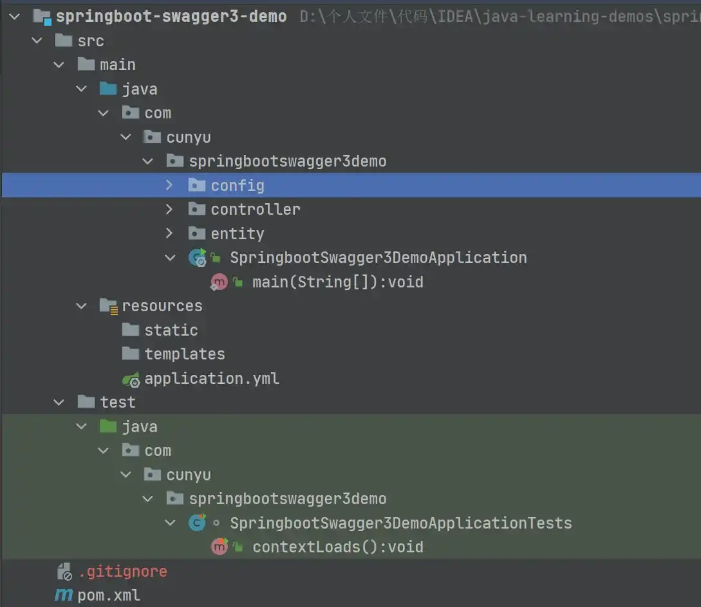
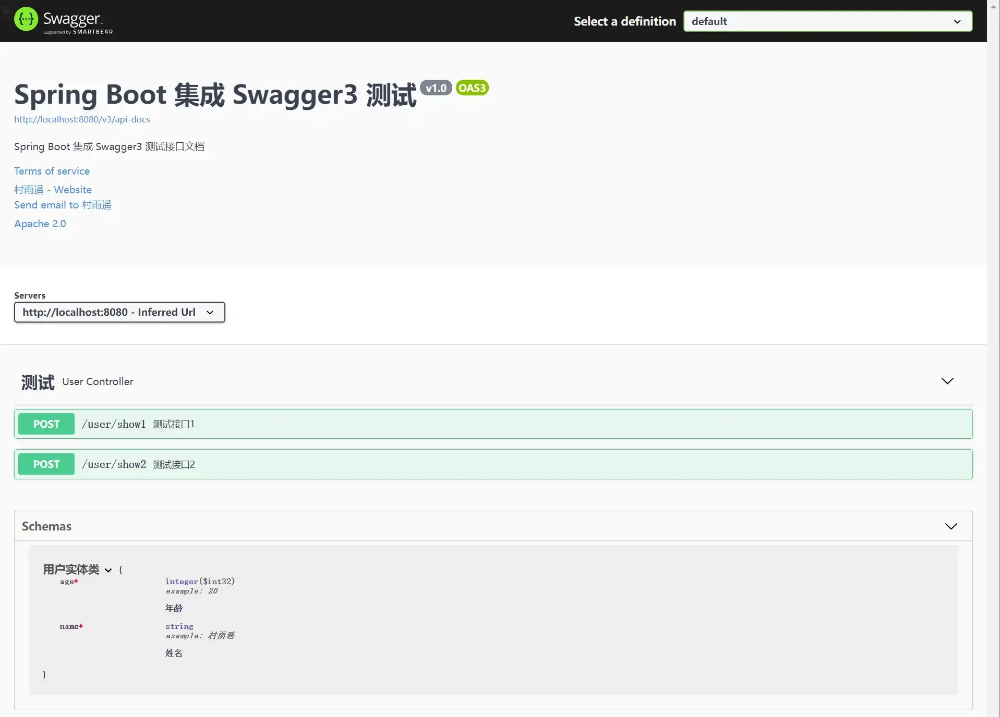
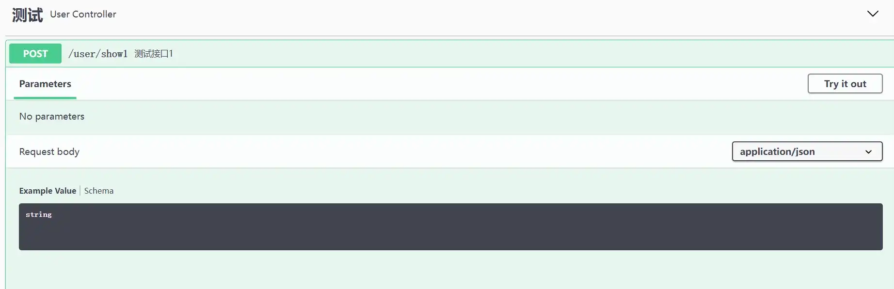
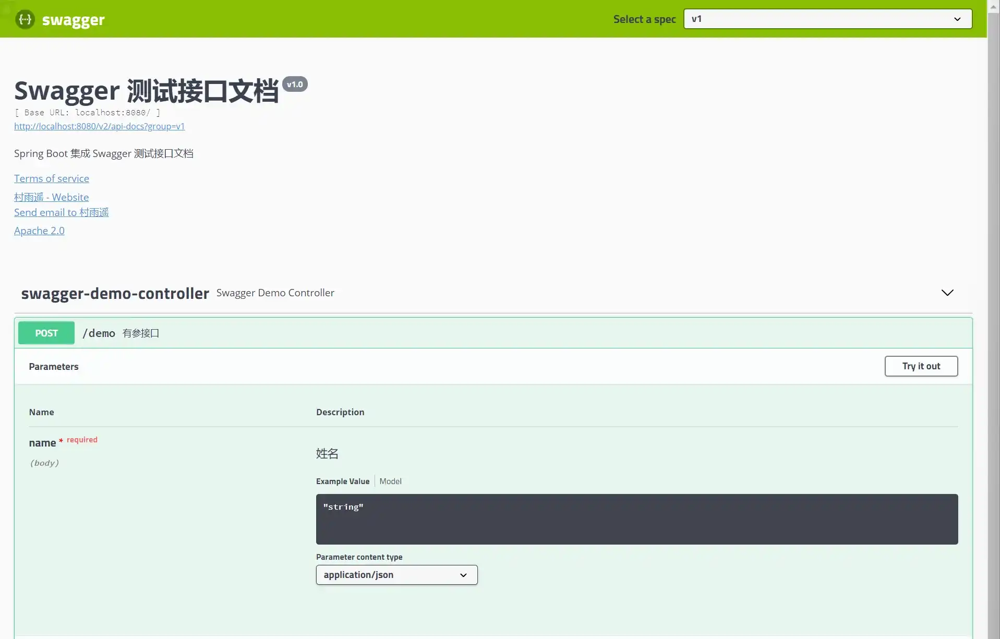
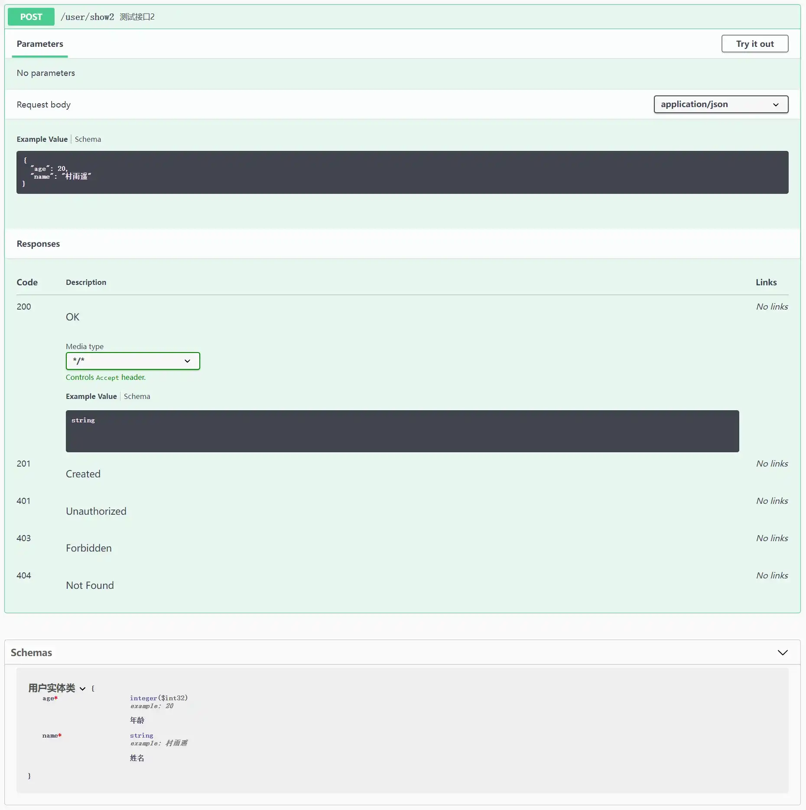
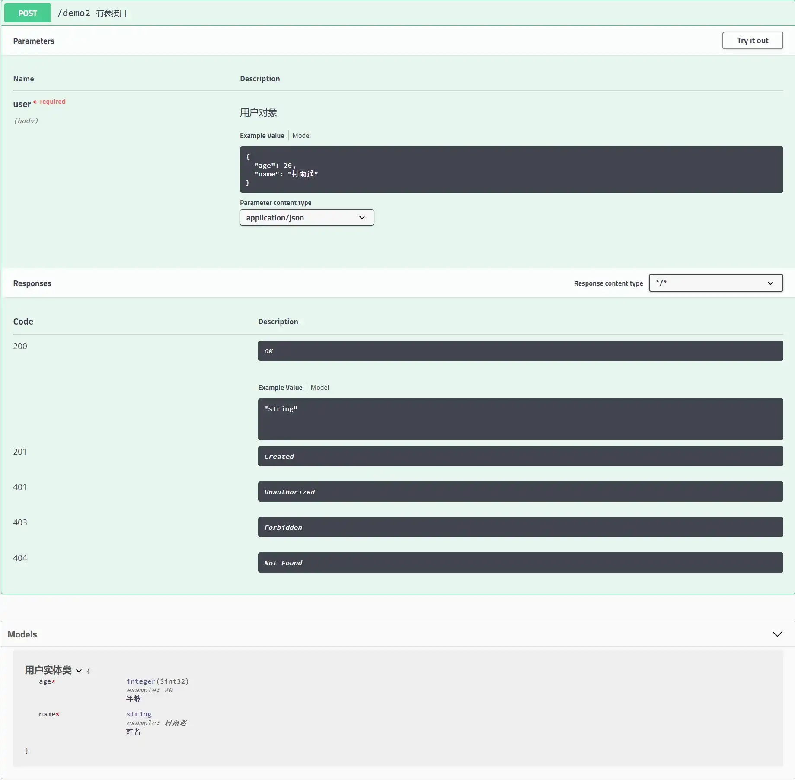
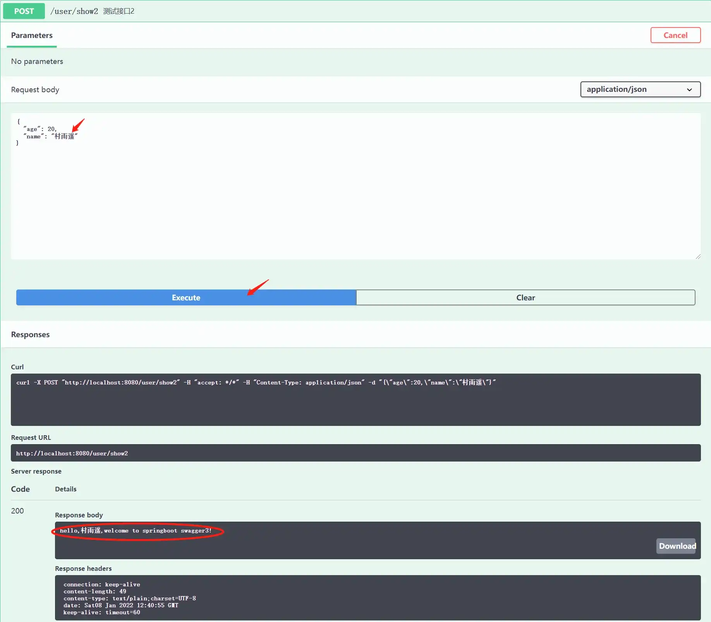

# Swagger3 生成 API 接口文档

## 前言

在之前的文章中，我们已经讲了如何利用 Spring Boot 来集成 Swagger2，详情可戳：[Spring Boot 集成 Swagger2，构建强大的 API 文档](https://blog.csdn.net/github_39655029/article/details/122336225 "Spring Boot 集成 Swagger2，构建强大的 API 文档")。但其实 Swagger2 中主流的 `2.9.2` 自 2018 年发布后就已经好久没更新了，而在时隔两年之后的 2020 年，Swagger3 终于发布了。

相比于之前的 Swagger2，Swagger3 无疑新添了更多的特点，而相对集中地，主要集中在如下几点。

- 支持 OpenApi 3.0.3
- 兼容 Swagger2 的注释，而且进一步丰富了 open API 3.0 的规范
- 支持 Webflux

既然 Swagger3 有了这么多的改变，那用法是不是还和 Swagger2 一样呢？答案是：不一样。

不过虽然两者的使用方式不一样，但是总体流程还是差不多了，只不过有些步骤有所小变动而已，只要你掌握了 Swagger2 的使用方法，那使用 Swagger3 起来就是需要注意小改动就行了。那接下来，我们就来看看，如何利用 Spring Boot 来集成 Swagger3，对我们的 Swagger2 进行一次升级！

## Spring Boot 集成 Swagger

### 创建 Spring Boot 项目

同样的，开始之前，我们需要创建一个简单的 Spring Boot 项目，这里不展开讲了，如果你对此还有所疑惑，可以先去熟悉下，这里建议参考我之前写过的一篇文章：[创建 Spring Boot 项目的 3 种方式](https://cunyu1943.blog.csdn.net/article/details/119618308 "创建 Spring Boot 项目的 3 种方式")。

项目创建成功之后，总体结构如下：



这里的 `config`、`controller`、`entity` 模块是我后续加入的，所以不用理会，也就是说你创建好之后的项目是不包含这三个部分的，关于他们的用途，文章后续内容我会讲到。

### 引入依赖

创建项目后，在 `pom.xml` 文件中引入 Swagger3 的相关依赖。回忆一下，我们集成 Swagger2 时，引入的依赖如下：

```xml
<dependency>
    <groupId>io.springfox</groupId>
    <artifactId>springfox-swagger2</artifactId>
    <version>2.9.2</version>
</dependency>

<dependency>
    <groupId>io.springfox</groupId>
    <artifactId>springfox-swagger-ui</artifactId>
    <version>2.9.2</version>
</dependency>
```

而在 Swagger3 中，我们不需要再引入两个不同的依赖了，我们只需要引入一个依赖就足够，具体引入的依赖如下：

```xml
<dependency>
    <groupId>io.springfox</groupId>
    <artifactId>springfox-boot-starter</artifactId>
    <version>3.0.0</version>
</dependency>
```

而这部分，Swagger2 和 Swagger3 就有所不同了，Swagger2 需要添加两项不同依赖，而 Swagger3 只用添加一项依赖就可以了。

### 构建 Swagger 配置类

为了统一管理 Swagger，这里还是推荐给 Swagger3 添加一个配置类。当然这里也可以根据自己的需求，可要可不要，但总体来说还是建议配置。

另外，在之前集成 Swagger2 的文章中，忘记了给大家说一点。平常在工作中，Swagger 的使用仅限于在开发环境，而在生产环境中，我们是要将其移除的。这里为了灵活管理，推荐大家在项目配置文件 `application.yml` 中添加关于 Swagger 开关的配置，比如这里我添加的配置如下，`true` 则代表开启 Swagger，`false` 则表示关闭 Swagger。

```yml
swagger:
  enabled: true
```

配置完成之后，我们就需要在 Swagger 配置类中获取 Swagger 开关的值了，关于具体用法就可以看下边配置代码。

```java
package com.cunyu.springbootswagger3demo.config;

import org.springframework.beans.factory.annotation.Value;
import org.springframework.context.annotation.Bean;
import org.springframework.context.annotation.Configuration;
import springfox.documentation.builders.ApiInfoBuilder;
import springfox.documentation.builders.PathSelectors;
import springfox.documentation.builders.RequestHandlerSelectors;
import springfox.documentation.oas.annotations.EnableOpenApi;
import springfox.documentation.service.ApiInfo;
import springfox.documentation.service.Contact;
import springfox.documentation.spi.DocumentationType;
import springfox.documentation.spring.web.plugins.Docket;

import java.util.ArrayList;

/**
 * Created with IntelliJ IDEA.
 *
 * @author : 村雨遥
 * @version : 1.0
 * @project : springboot-swagger3-demo
 * @package : com.cunyu.springbootswagger3demo.config
 * @className : SwaggerConfig
 * @createTime : 2022/1/6 14:19
 * @email : 747731461@qq.com
 * @微信 : cunyu1024
 * @公众号 : 村雨遥
 * @网站 : https://cunyu1943.github.io
 * @description :
 */

@Configuration
@EnableOpenApi
public class SwaggerConfig {
    /**
     * 用于读取配置文件 application.properties 中 swagger 属性是否开启
     */
    @Value("${swagger.enabled}")
    Boolean swaggerEnabled;

    @Bean
    public Docket docket() {
        return new Docket(DocumentationType.OAS_30)
                .apiInfo(apiInfo())
                // 是否开启swagger
                .enable(swaggerEnabled)
                .select()
                // 过滤条件，扫描指定路径下的文件
                .apis(RequestHandlerSelectors.basePackage("com.cunyu.springbootswagger3demo.controller"))
                // 指定路径处理，PathSelectors.any()代表不过滤任何路径
                //.paths(PathSelectors.any())
                .build();
    }

    private ApiInfo apiInfo() {
        /*作者信息*/
        Contact contact = new Contact("村雨遥", "https://cunyu1943.github.io", "747731461@qq.com");
        return new ApiInfo(
                "Spring Boot 集成 Swagger3 测试",
                "Spring Boot 集成 Swagger3 测试接口文档",
                "v1.0",
                "https://cunyu1943.github.io",
                contact,
                "Apache 2.0",
                "http://www.apache.org/licenses/LICENSE-2.0",
                new ArrayList()
        );
    }
}
```

这里的配置和 Swagger2 大同小异，这里最大的区别在于加入了从配置文件中获取 Swagger 开关的属性。这里也可以选择添加到 Swagger2 的配置类中，同样通过配置文件来控制是否开启 Swagger2。此外，还有就是 `DocumentationType` 属性的不同了，Swagger2 中我们使用的是 `SWAGGER_2`，而在 Swagger3 中，我们使用的则是 `OAS_30`。其实点进去 `DocumentationType` 的源码我们就可以发现，Swagger 已经是给我们定义好的，你用的是哪一个版本的 Swagger，那我们使用的属性值应该选择对应版本。三个版本的属性值对应如下：

```java
public static final DocumentationType SWAGGER_12 = new DocumentationType("swagger", "1.2");
public static final DocumentationType SWAGGER_2 = new DocumentationType("swagger", "2.0");
public static final DocumentationType OAS_30 = new DocumentationType("openApi", "3.0");
```

### 编写实体类

完成上面的步骤之后，我们的 Swagger 就配置好了，接下来我们就添加一个接口来看看 Swagger3 和 Swagger2 的不同。

1.  **新建实体类**

这里我以一个用户类为实例，带有 `name`、`age` 两个属性，也就是本文一开始项目结构截图中 `entity` 包下的内容。

```java
package com.cunyu.springbootswagger3demo.entity;

import io.swagger.annotations.ApiModel;
import io.swagger.annotations.ApiModelProperty;
import lombok.AllArgsConstructor;
import lombok.Data;
import lombok.NoArgsConstructor;

/**
 * Created with IntelliJ IDEA.
 *
 * @author : 村雨遥
 * @version : 1.0
 * @project : springboot-swagger3-demo
 * @package : com.cunyu.springbootswagger3demo.entity
 * @className : User
 * @createTime : 2022/1/6 11:17
 * @email : 747731461@qq.com
 * @微信 : cunyu1024
 * @公众号 : 村雨遥
 * @网站 : https://cunyu1943.github.io
 * @description :
 */

@Data
@AllArgsConstructor
@NoArgsConstructor
@ApiModel("用户实体类")
public class User {
    @ApiModelProperty(value = "姓名", required = true, example = "村雨遥")
    private String name;

    @ApiModelProperty(value = "年龄", required = true, example = "20")
    private Integer age;
}
```

2.  **新建接口**

这里写了两个接口，一个是直接传参，另一种是通过利用创建的 `User` 实体类来传输，也就是项目结构中 `controller` 包中的内容。

```java
package com.cunyu.springbootswagger3demo.controller;

import com.cunyu.springbootswagger3demo.entity.User;
import io.swagger.annotations.Api;
import io.swagger.annotations.ApiOperation;
import io.swagger.annotations.ApiParam;
import org.springframework.web.bind.annotation.PostMapping;
import org.springframework.web.bind.annotation.RequestBody;
import org.springframework.web.bind.annotation.RequestMapping;
import org.springframework.web.bind.annotation.RestController;

/**
 * Created with IntelliJ IDEA.
 *
 * @author : 村雨遥
 * @version : 1.0
 * @project : springboot-swagger3-demo
 * @package : com.cunyu.springbootswagger3demo.controller
 * @className : UserController
 * @createTime : 2022/1/6 11:02
 * @email : 747731461@qq.com
 * @微信 : cunyu1024
 * @公众号 : 村雨遥
 * @网站 : https://cunyu1943.github.io
 * @description :
 */

@Api(tags = "测试")
@RestController
@RequestMapping("/user")
public class UserController {

    @ApiOperation("测试接口1")
    @PostMapping("/show1")
    public String show1(@ApiParam(value = "姓名", required = true, example = "村雨遥") @RequestBody String name) {
        return "hello," + name + ",welcome to springboot swagger3！";
    }

    @ApiOperation("测试接口2")
    @PostMapping("/show2")
    public String show2(@ApiParam(value = "用户对象", required = true) @RequestBody User user) {
        return "hello," + user.getName() + ",welcome to springboot swagger3！";
    }
}
```

### 查看并测试接口

启动我们的项目，然后在浏览器中访问如下地址，就可以访问项目的接口文档了。

> http://localhost:8080/swagger-ui/index.html

访问上面的地址后，如果出现下面的界面，则说明集成 Swagger3 就成功了。

这里也要注意一点，Swagger2 中的接口访问地址是：

> http://localhost:8080/swagger-ui.html

这里 Swagger2 和 Swagger3 是不同的，这里大家一定要注意，否则可能你继续拿着 Swagger2 接口访问地址来放到 Swagger3 项目中不适用。



点开具体接口，我们以直接传参的接口来对比 Swagger3 和 Swagger2 的区别。第一张图是在 Swagger3 中，第二张图是在 Swagger2 中。这里可以发现，我们都是传的一个 `name` 属性，Swagger2 中会把我们接口中参数部分 `Parameters` 直接标识出来，而 Swagger3 中则不会，这里需要注意。

- Swagger2 中接口代码

```java
@ApiOperation(value = "有参接口")
@PostMapping("demo")
public String demo(@ApiParam(value = "姓名", required = true, example = "村雨遥") @RequestBody String name) {
    return "hello," + name;
}
```

- Swagger3 中接口代码

```java
@ApiOperation("测试接口1")
@PostMapping("/show1")
public String show1(@ApiParam(value = "姓名", required = true, example = "村雨遥") @RequestBody String name) {
    return "hello," + name + ",welcome to springboot swagger3！";
}
```





此外，我们来看 Swagger3 中的另一个接口，这里我们传递的是一个用户对象，接口中它将我们设置的默认值给传了过来。下图中第一张图为 Swagger3 中的截图，第二张图为 Swagger2 中的截图。同样的，Swagger2 中的参数会在 `Parameters` 模块标识出来，而 Swagger3 则不会标识。

还有一点值得注意的是，Swagger 中如果传递的部分是对象，那么 Swagger2 会在 `Models` 部分进行标识，而 Swagger3 中则是变成了 `Schemas` 部分，这也算是一个小变动吧。





最后，我们同样来进行测试，测试方法同 Swagger2，点击接口右上方的 `Try it out`，然后编辑参数的值，编辑完成后点击下方的 `Execute` 即可查看接口调用结果。



## Swagger2 VS Swagger3

经过上面的步骤，我们就完成了 Spring Boot 集成 Swagger3 的实例测试了，而经过对比，也总结出了 Swagger2 和 Swagger3 的区别主要体现在如下几个方面：

1.  **所需依赖不同**，Swagger2 需要添加两个依赖，而 Swagger3 则只需要添加一个依赖；
2.  **启用 Swagger 的注解不同**，不知道大家有没有发现，无论是 Swagger2 还是 Swagger3 中的配置类，其实都是有一个注解用来启用 Swagger 的，不同之处在于 Swagger2 中用的是 `@EnableSwagger2`，而 Swagger3 中则用的是 `@EnableOpenApi`；
3.  **文档摘要信息（Docket）文件类型不同**，可以发现在 Swagger 的配置类中，Swagger2 用的是 `SWAGGER_2`，而 Swagger3 中则用的是 `OAS_3`；
4.  **Swagger UI 访问地址不同**，在 Swagger2 中，如果我们要访问文档地址，需要访问 `http://localhost:8080/swagger-ui.html`，而在 Swagger3 中，则是访问 `http://localhost:8080/swagger-ui/index.html`；

## 总结

以上就是本文的所有内容了，主要介绍了如何使用 Spring Boot 集成 Swagger3，并在此过程中对比了 Swagger2 和 Swagger3 的一些区别。总体来讲，Swagger2 向 Swagger3 的升级还是比较平滑的。如果你已经掌握熟练使用 Swagger2，那么向 Swagger3 过度也很简单，只需要注意上一部分中的一些主要区别就可以了。其他的用于描述接口的注解，还是可以按照 Swagger2 的方式使用，毕竟 Swagger3 向下兼容了 Swagger2。

## 代码示例

最后，关于本文示例的代码，我已经上传至 GitCode，需要的小伙伴可以自取：

> 🎉 传送门：https://gitcode.net/github_39655029/java-learning-demos

**如果您觉得本文不错，欢迎 `Star` 支持，您的关注就是我坚持不断更新的动力！**