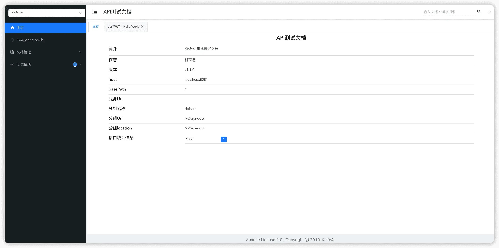
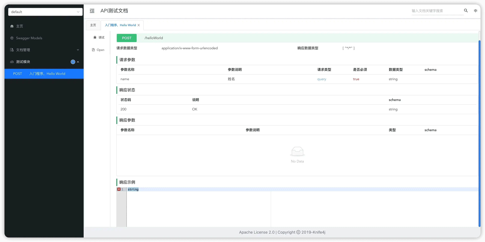
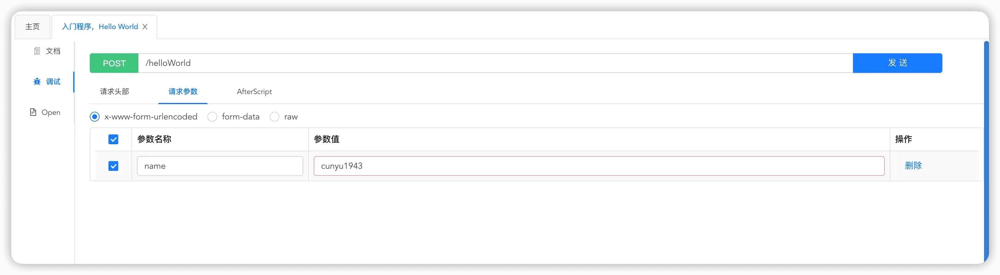

# 集成 Knife4j

## 前言

之前介绍了如何在 `Spring Boot` 中集成 `Swagger2` 和 `Swagger3`，对于我们日常的接口管理已经够用了。但是作为一个颜值党，无论是 `Swagger2` 还是 `Swagger3`，都难以满足我们的审美。而且 `Swagger2` 和 `Swagger3` 都已经好久没更新了，更新还是比较慢的。

偶然之间发现了一个国产的接口文档管理工具 [Knife4j](https://doc.xiaominfo.com/knife4j/)，它基于 `Swagger` 而来，但是又对 `Swagger` 进行了增强，增加两个越来越多的个性化需求，可以说兼具颜值与实力了。今天我们就来看看，如何在 `Spring Boot` 中集成 `Knife4j` 这个接口文档管理工具。

## 集成过程

### 创建 Spring Boot 项目

既然要在 `Spring Boot` 中使用 `Knife4j`，那首先就得创建一个 `Spring Boot` 项目。当然，我在之前已经写过文章介绍如何创建 `Spring Boot` 项目了，所以这里不再赘述。如果你还对 `Spring` Boot 创建方式不太熟悉，可以参考我之前的文章：[Spring Boot 基础教程：创建项目的 3 种方式 | JavaPark](https://cunyu1943.github.io/JavaPark/java/spring-boot/the-methods-to-create-springboot-project.html)

### 添加依赖

既然是用 `Maven` 来管理项目依赖，那我们在项目 `pom.xml` 中引入 `Knife4j` 的相关依赖包，引入代码如下。

```xml
<dependency>
    <groupId>com.github.xiaoymin</groupId>
    <artifactId>knife4j-spring-boot-starter</artifactId>
    <version>3.0.3</version>
</dependency>
```

### 配置添加

接着在项目中创建一个配置包 `config`，用于配置 `Swagger` 的配置依赖。在这里可以配置扫描的 `controller` 所在的包，设置接口文档的标题、描述、作者信息等。

这里其实和 `Swagger2` 和 `Swagger3` 很相似，`Swagger` 也是可以通过配置类来指定这些信息。

```java
package com.cunyu.springbootknife4jdemo.config;

import com.github.xiaoymin.knife4j.spring.annotations.EnableKnife4j;
import org.springframework.context.annotation.Bean;
import org.springframework.context.annotation.Configuration;
import springfox.documentation.builders.ApiInfoBuilder;
import springfox.documentation.builders.PathSelectors;
import springfox.documentation.builders.RequestHandlerSelectors;
import springfox.documentation.service.ApiInfo;
import springfox.documentation.service.Contact;
import springfox.documentation.spi.DocumentationType;
import springfox.documentation.spring.web.plugins.Docket;
import springfox.documentation.swagger2.annotations.EnableSwagger2;

@Configuration
@EnableSwagger2
@EnableKnife4j
public class Knife4jConfiguration {

    @Bean
    public Docket createRestApi() {
        return new Docket(DocumentationType.SWAGGER_2)
                .useDefaultResponseMessages(false)
                .apiInfo(apiInfo())
                .select()                .apis(RequestHandlerSelectors.basePackage("com.cunyu.springbootknife4jdemo.controller"))
                .paths(PathSelectors.any())
                .build();

    }

    private ApiInfo apiInfo() {
        return new ApiInfoBuilder()
                .description("Kinfe4j 集成测试文档")
                .contact(new Contact("村雨遥", "https://cunyu.gitub.io/JavaPark", "747731461@qq.com"))
                .version("v1.1.0")
                .title("API测试文档")
                .build();
    }

}

```

### 编写 Controller 层

接着我们编写一个测试的 `controller`，用于在 `Knife4j` 中展示用，代码如下。

```java
@Api(tags = "测试模块")
@RestController
public class DemoController {
    @ApiImplicitParam(name = "name", value = "姓名", required = true)
    @ApiOperation(value = "入门程序，Hello World")
    @PostMapping("/helloWorld")
    public ResponseEntity<String> helloWorld(@RequestParam(value = "name") String name) {
        return ResponseEntity.ok("Hello World，" + name);
    }
}
```

### 启动测试

然后将项目启动起来，接着到浏览器中去打开 `http://localhost:8080/doc.html`，就会出现以下的主界面。这里有我们之前在配置类中所设置的一些接口信息，此外，还对接口进行了统计。因为我们代码中只写了一个 `POST` 的请求，所以这里统计出只有一个 `POST` 请求。



打开具体接口，这里就有我们接口的请求和响应的一些情况说明。



点击左侧 `调试` 按钮，我们就可以在 `Knife4j` 中测试我们的接口。




## 踩过的坑

当然，如果你按照以上步骤顺利打开了 `Knife4j` 的文档管理页面，那接下来的内容你大可不必了解。但如果你按照上边步骤搭建过程中也出现了问题，那不妨看看以下是否有你遇到的 `Bug`。

### 空指针异常

首先是报空指针异常，报错信息如下。

```sh
Failed to start bean 'documentationPluginsBootstrapper'; nested exception is java.lang.NullPointerException
```

经过查询资料可知，这是因为 `Springfox` 使用的路径匹配是基于 `AntPathMatcher` 的，但是由于我使用的是 `Spring Boot 2.6.x` 版本，正好这个版本使用的是 `PathPatternMatcher`，所以才会出现这个问题。所以这里主要可以通过两种方式来解决。

第一种，无可厚非，就是将我们的 `Spring Boot` 的版本降低，从 `2.6.x` 降到 `2.5.x`，此时就应该是可以了，这里可以自己去试一下。

第二种，既然我们都已经用上 `2.6.x` 版本了，那我们就是不想降低版本咋整。此时，我们只需要在主程序启动类中加上 `@EnableWebMvc` 这个注解。然后再次启动程序，你就会发现启动成功了！

```java
@EnableWebMvc
@SpringBootApplication
public class SpringbootKnife4jDemoApplication {

    public static void main(String[] args) {
        SpringApplication.run(SpringbootKnife4jDemoApplication.class, args);
    }
}
```

### 请求路径未找到

一山放过一山拦，以为翻过了上面的山，就能成功了。没想到出师不利，这不又遇到了报错请求路径未找到。

当我们成功启动项目后，在浏览器中打开 `http://localhost:8080/doc.html`，却没想到迎接我们的不是成功界面，而是下面的 `Whitelabel Error Page`。

然后到 `IDEA` 中一看日志，程序照常运行，也没报错，但是给我们抛出了一个 `WARN`，警告信息如下：

```sh
No mapping for GET /doc.html
```

这是因为我们为了解决上面的 `Bug` 而使用到了 `@EnableWebMvc`，由于它实现了 `WebMvcConfigurer` 接口，所以会导致我们访问识别。

这时候问题就来了，上面又需要这个注解，但是下面这个问题又不需要，那该怎么办呢？

其实很简单，既然我们要保留 `@EnableWebMvc`，那我们去配置个规则不就好了。

在项目的 `config` 包下，我们新建一个配置类 `WebMvcConfigurer` 记成 `WebMvcConfigurationSupport` 类，接着将 `dom.html` 过滤掉即可。

```java
@Configuration
public class WebMvcConfigurer extends WebMvcConfigurationSupport {

    @Override
    public void addResourceHandlers(ResourceHandlerRegistry registry) {
        registry.addResourceHandler("/**").addResourceLocations("classpath:/static/");
        registry.addResourceHandler("doc.html").addResourceLocations("classpath:/META-INF/resources/");
        registry.addResourceHandler("/webjars/**").addResourceLocations("classpath:/META-INF/resources/webjars/");
        super.addResourceHandlers(registry);
    }
}
```

完成上述配置后，再去运行项目，再到浏览器中去访问 `http://localhost:8080/doc.html` 应该就能正常访问 Knife4j 文档管理页面了。

## 总结

以上就是 `Spring Boot` 中集成 `Knife4j` 文档管理工具的内容了，这里主要讲了下如何集成并且进行一个最简单的接口调试，关于更多 `Knife4j` 的个性化功能，可以去它的官网了解下。

此外，对于文中集成是所遇到的 `Bug`，如果你没有遇到，那么你应该顺利集成了，如果你也有遇到，那么不妨跟着我去试一下解决的办法。

最后的最后，关于本文中所涉及的代码，我已经开源了，有需要到小伙伴可以去自取哦。

>   [springboot-knife4j-demo](https://github.com/cunyu1943/java-learning-demos/tree/main/springboot-knife4j-demo)