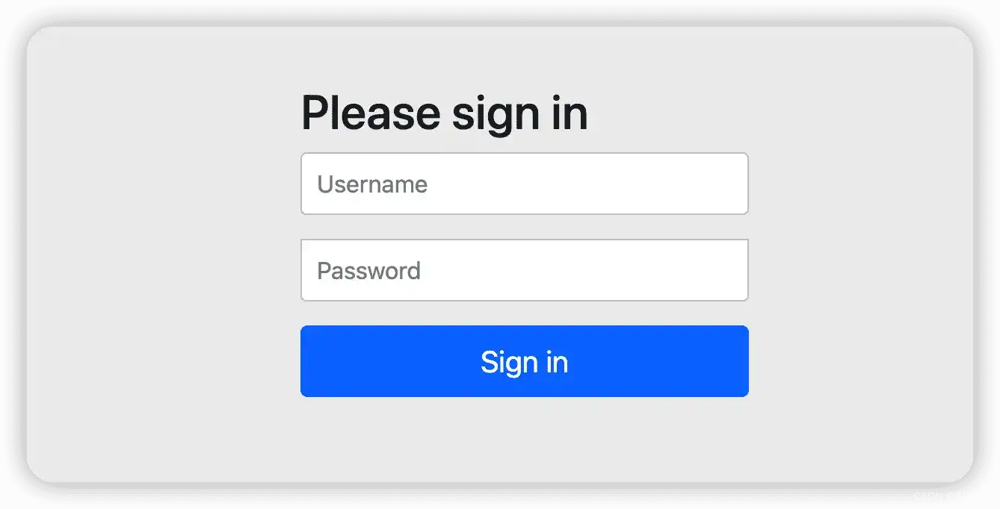
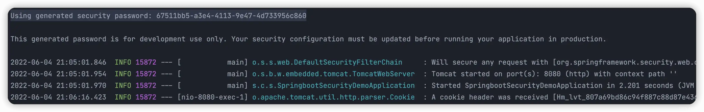

# 集成 Security 入门小实例

## 前言

`Spring Security` 是 `Spring` 家族中一个强大可定制的身份验证和访问控制框架，和 `Shiro` 一样，它们都具有认证、授权、加密等用于权限管理的功能。但相比于 `Shiro`，`Spring Security` 的功能无疑更加强大。而且作为 `Spring` 家族中的一份子，配合家族中的其它兄弟 - `Spring Boot`、`Spring Cloud` 使用起来更加丝滑。

今天就来看看，如何在 `Spring Boot` 集成 `Spring Security`，实现最简单的认证授权功能。

## 集成过程

要在 `Spring Boot` 集成 `Security`，其实很简单，可以总结为如下几个步骤：

1.   首先是创建一个 `Spring Boot` 项目。
2.   添加 `Spring Security` 相关依赖。


### 创建 Spring Boot 项目

这个过程只要你学习过 Spring Boot，那么你肯定是已经很熟悉了，所以在这里我也就不再赘述了。当然，如果你对这个过程还是不太熟悉，那么可以参考我之前的文章。

### 添加相关依赖

项目创建好之后，一般默认是已经添加了 `Web` 依赖，这个时候，我们只需要在项目的 `pom.xml` 文件中添加 `Spring Security` 的相关依赖即可。

```xml
<dependency>
    <groupId>org.springframework.boot</groupId>
    <artifactId>spring-boot-starter-security</artifactId>
</dependency>
```

### 启动项目

完成上面步骤的操作后，接下来我们直接启动项目，然后在浏览器中访问以下地址：

>   `http://localhost:8080`

不出意外应该会跳出以下的界面，让我们登录。此时你可能会很纳闷，为什么我们只加了个 `Spring Security` 的依赖，怎么就需要登陆了呢？而且，登录的话，用户名和密码又是多少呢？

再仔细观察浏览器的地址栏，此时我们访问的地址也变了，变成了：

>   `http://localhost:8080/login`

这又是怎么一回事呢？

原来这就是 `Spring Security` 为我们的项目所提供的保护机制。在添加 `Spring Security` 之后，此时再去访问项目，它就会自动重定向到 `Security` 所提供的登录页面，也就是下面的界面。





同样的 `Spring Security` 也为我们所提供了一个默认的用户名，也就是 `user`，至于密码，这就谁都说不准了。因为它会随着我们项目的每次启动而自动生成，所以每次的登录密码都是不一样的。至于要如何获取，那就得去我们的 `IDEA` 查看控制台查看日志了。

查看日志我们可以发现如下的一行，其实这就是 `Spring Security` 所提供的登录密码了。这是一个 `UUID` 字符串，是 `Spring Security` 为默认的 `user` 用户所生成的临时密码。

```
Using generated security password: 67511bb5-a3e4-4113-9e47-4d733956c860
```




### 修改默认登录用户密码

虽然 `Security` 提供了默认的 `user` 用户，但是大家都知道这是默认的，而且需要每次去日志中找登录密码，那有没有方法可以自定义我们的用户和密码呢？答案是，有的。

`Security` 为我们提供了配置，我们可以在项目的配置文件 `application.yml` 中去定义自己的用户名和密码，然后它就会覆盖掉 `Security` 为我们提供的默认用户和密码。

在项目的配置文件中配置用户和密码，当然，项目生成的默认配置文件是位于 `resources` 目录下的 `application.properties`，所以需要将其后缀改成 `.yml`。

```yml
spring:
  security:
    user:
      name: cunyu1943
      password: cunyu1943@
```

然后重启我们的项目，就可以用我们配置的用户和密码来进行登陆了。

### 创建页面

新建一个 `Controller` 页面，用于打印最经典的 `Hello World!`。

```java
@RestController
public class HelloController {
    @GetMapping("/hello")
    public String hello() {
        return "Hello World！";
    }
}
```

重新启动项目后，在浏览器中访问以下地址：

>   `http://localhost:8080/hello`

然后 Spring Security 就会重定向到 `http://localhost:8080/login` 页面，此时我们用上面配置的用户名和密码进行登录，登录成功后就会跳转到我们的 `/hello` 页面了，页面中会打印 `Hello  World!`


## 总结

以上就是 `Spring Boot` 集成 `Spring Security` 的实例了，主要演示了最经典的 `Hello World` 程序。关于更多 `Spring Security` 的知识，我们后续的文章再见吧！

最后，关于本文的中的代码，我已经上传到云端，有需要的小伙伴可以自取。

>   [➛ 传送门](https://github.com/cunyu1943/java-learning-demos)