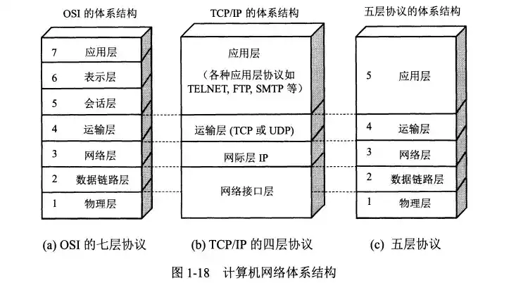
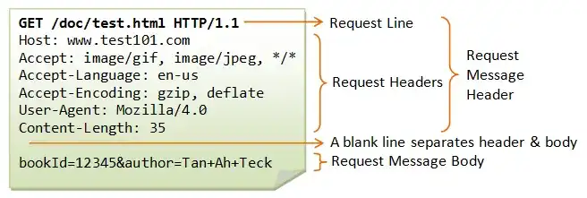
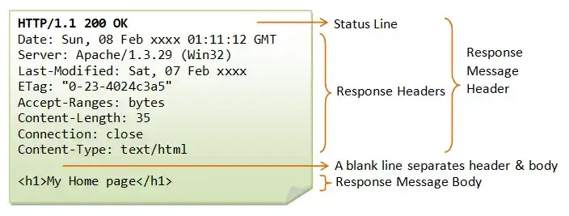
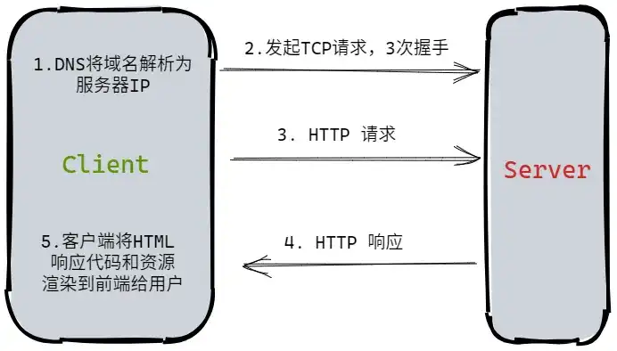
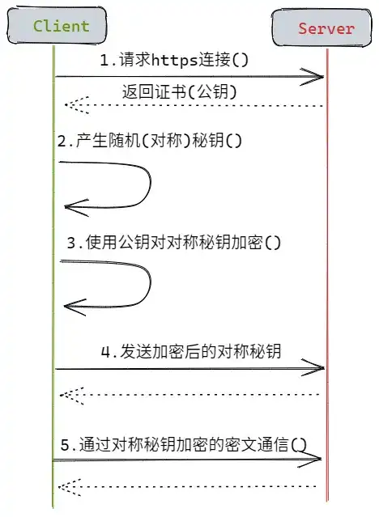
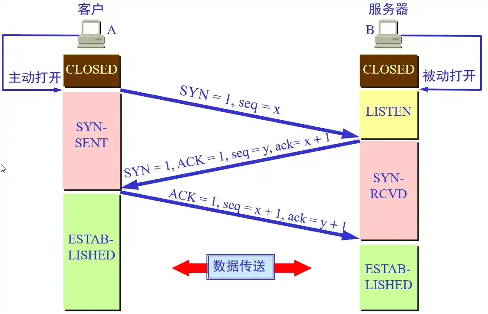
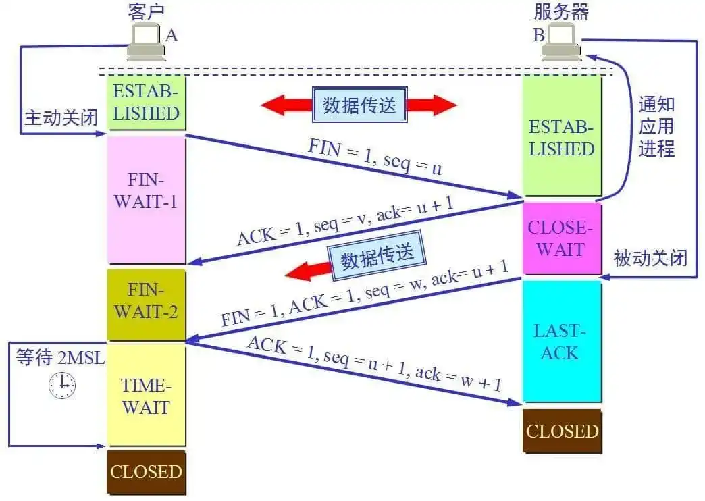

# 计算机网络面试知识点

## 1. 计算机网络基础

### 1.1 主机间的通信方式

1.  **客户端-服务器（C/S）**

客户端是服务的请求放，服务器是服务的提供方。

2.  **对等（P2P）**

不用区分谁是客户端，谁是服务器，双方都能够向对方请求与提供服务。

### 1.2 电路 & 分组交换

1.  **分组交换**

每个分组由首部和尾部组成，包含源地址和目的地址等控制信息，在同一个传输线路上同时传输多个分组互不影响，因此在同一条传输线路上允许同时传输多个分组，即分组交换不会占用传输线路。

2.  **电路交换**

电路交换用于电话通讯系统，两个用户之间建立通信前需要有一条专用的物理链路，而且在通信过程中始终占用该链路。由于通信过程中不可能一直在使用传输线路，因此电路交换对线路利用率很低，通常不到 10%.

### 1.3 时延

1.  **排队时延**

分组在路由器的输入和输出队列中排队等待所需时间，取决于当前网络的通信量；

2.  **处理时延**

主机或路由器接收到分组时进行处理所需时间，一般这些处理包括分析首部、从分组中提取数据、进行差错校验或查找适当路由等；

3.  **传输时延**

主机或路由器传输数据帧所需时间：

$$delay = length(bit)/v(bit/s)$$

其中 `length` 表示数据帧的长度，`v` 表示传输速率；

4.  **传播时延**

电磁波在信道中传输所需时间，电磁波传播速度无限接近于光速：

$$delay = length(m)/v(m/s)$$

其中 `length` 表示信道的长度，`v` 表示电磁波在信道中的传播速度；

### 1.4 体系结构

| 体系结构 | 协议                                                         |
| -------- | ------------------------------------------------------------ |
| 物理层   | RJ45、CLOCK、IEEE802.3（中继器、集线器）                     |
| 数据链路 | PPP、FR、HDLC、VLAN、MAC（网桥、交换机）                     |
| 网络层   | IP、ICMP、ARP、RARP、OSPF、IPX、RIP、IGRP（路由器）          |
| 传输层   | TCP（HTTP/S、FTP、POP3、SMTP、TENET、SSH）、UDP（BOOTP、NTP、DHCP）、SPX |
| 会话层   | NFS、SQL、NETBIOS、RPC                                       |
| 表示层   | JPEG、MPEG、ASII                                             |
| 应用层   | FTP、DNS、Telenet、SMTP、HTTP、WWW、NFS                      |

1.  **OSI 七层体系结构**

为把在一个网络结构下开发的系统与在另一个网络结构下开发的系统互联起来，以实现更高一级的应用，使异种机之间的通信成为可能，便于网络结构标准化，国际标准化组织（ISO）于1984年形成了开放系统互连参考模型OSI/RM（Open Systems Interconnection Reference Model，简称OSI）的正式文件。

- **物理层（Physical，PH）：** 传递信息需要利用一些物理传输媒体，如双绞线、同轴电缆、光纤等。物理层的任务就是为上层提供一个物理的连接，以及该物理连接表现出来的机械、电气、功能和过程特性，实现透明的比特流传输。在这一层，数据还没有组织，仅作为原始的比特流提交给上层——数据链路层。

-   **数据链路层（Data-link，D）**：数据链路层负责在2个相邻的结点之间的链路上实现无差错的数据帧传输。每一帧包括一定的数据和必要的控制信息，在接收方接收到数据出错时要通知发送方重发，直到这一帧无差错地到达接收结点，数据链路层就是把一条有可能出错的实际链路变成让网络层看起来像不会出错的数据链路。实现的主要功能有：帧的同步、差错控制、流量控制、寻址、帧内定界、透明比特组合传输等。
-   **网络层（Network，N）**：网络中通信的2个计算机之间可能要经过许多结点和链路，还可能经过几个通信子网。网络层数据传输的单位是分组（Packet）。网络层的主要任务是为要传输的分组选择一条合适的路径，使发送分组能够正确无误地按照给定的目的地址找到目的主机，交付给目的主机的传输层。

- **传输层（Transport，T）**：传输层的主要任务是通过通信子网的特性，最佳地利用网络资源，并以可靠与经济的方式为2个端系统的会话层之间建立一条连接通道，以透明地传输报文。传输层向上一层提供一个可靠的端到端的服务，使会话层不知道传输层以下的数据通信的细节。传输层只存在端系统中，传输层以上各层就不再考虑信息传输的问题了。

-   **会话层（Session，S）**：在会话层以及以上各层中，数据的传输都以报文为单位，会话层不参与具体的传输，它提供包括访问验证和会话管理在内的建立以及维护应用之间的通信机制。如服务器验证用户登录便是由会话层完成的。
-   **表示层（Presentation，P）**：这一层主要解决用户信息的语法表示问题。它将要交换的数据从适合某一用户的抽象语法，转换为适合OSI内部表示使用的传送语法。即提供格式化的表示和转换数据服务。数据的压缩和解压缩、加密和解密等工作都由表示层负责。

-   **应用层（Application，A）**：这是OSI参考模型的最高层。应用层确定进程之间通信的性质以满足用户的需求，以及提供网络与用户软件之间的接口服务。

2.  **五层协议**

我们日常网络中使用的体系结构，总共可以分为 5 层，分别是：

-   **应用层** ：为特定应用程序提供数据传输服务，例如 HTTP、DNS 等协议。数据单位为报文。
-   **传输层** ：为进程提供通用数据传输服务。由于应用层协议很多，定义通用的传输层协议就可以支持不断增多的应用层协议。运输层包括两种协议：传输控制协议 TCP，提供面向连接、可靠的数据传输服务，数据单位为报文段；用户数据报协议 UDP，提供无连接、尽最大努力的数据传输服务，数据单位为用户数据报。TCP 主要提供完整性服务，UDP 主要提供及时性服务。
-   **网络层** ：为主机提供数据传输服务。而传输层协议是为主机中的进程提供数据传输服务。网络层把传输层传递下来的报文段或者用户数据报封装成分组。
-   **数据链路层** ：网络层针对的还是主机之间的数据传输服务，而主机之间可以有很多链路，链路层协议就是为同一链路的主机提供数据传输服务。数据链路层把网络层传下来的分组封装成帧。
-   **物理层** ：考虑的是怎样在传输媒体上传输数据比特流，而不是指具体的传输媒体。物理层的作用是尽可能屏蔽传输媒体和通信手段的差异，使数据链路层感觉不到这些差异。

3.  **TCP/IP** 

不严格遵循 OSI 分层概念，只有四层，相当于将五层协议中的数据链路层和物理层合并为网络结构层。

## 2. 五层协议详解

### 2.1 物理层

物理层上传送的数据单位是比特，其作用是实现相邻计算机节点间比特流的透明传送，尽可能屏蔽调具体传输介质和屋里设备的差异。根据信息在传输线上的传输方向，可以分为如下三种通信方式：

-   单工通信：单向传输
-   半双工通信：双向交替传输
-   全双工通信：双向同时传输

### 2.2 链路层

两台主机之间的数据传输，总是在一段一段的链路上进行传送的，此时就需要使用专门的链路层协议。在两个相邻节点间传输数据时，数据链路层将网络层交下来的 IP 数据包组装成帧，在两个相邻节点间的链路上传送帧，每帧包括数据和必要的控制信息（如同步信息，地址信息，差错控制等）。

### 2.3 网络层

互联网的核心，向上提供数据报服务，通过 IP 协议将异构的物理网络连接起来。其任务是选择合适的网间路由和交换节点，从而确保计算机通信的数据及时传送，配套使用的有如下三个协议：

-   **地址解析协议 ARP**
-   **网际控制报文协议 ICMP**
-   **网际组管理协议 IGMP**

### 2.4 传输层

传输层提供了进程间的逻辑通信，负责向两台主机进程之间的通信提供通用的 **数据传输服务**，向高层用户屏蔽网络层的核心细节，这一层中主要涉及 UDP 和 TCP 两个协议。

### 2.5 应用层

应用层的任务是通过应用进程之间的交互来完成特定网络应用，应用层协议定义的是应用进程间的通信和交互的规则。

对于不同的网络应用需要不同的应用层协议，常见的有 DNS、HTTP、SMTP 协议等；

## 3. HTTP

### 3.1 HTTP 基础

1.  **URI（统一资源标识符）**

>   URI = URL + URN

URL：统一资源 **定位** 符，标示一个具体的资源位置

URN：统一资源名称

2.  **请求报文**

主要由以下三部分构成：

-   **请求行**：包括请求方法、URL、协议/版本
-   **请求头**：`Request Header`
-   **请求正文**

3.  **响应报文**

主要由以下三部分构成：

-   **状态行**
-   **响应头**
-   **响应正文**

### 3.2 HTTP 方法

| 方法      | 说明                                                         |
| --------- | ------------------------------------------------------------ |
| `GET`     | 请求指定页面信息，并返回实体主体                             |
| `POST`    | 传输实体主体，向指定资源提交数据进行处理请求，数据被包含在请求体中，可能会导致新资源的建立和/或已有资源的修改 |
| `PUT`     | 从客户端向服务器传送的数据取代指定文档的内容，上传文件 ，不带验证机制，存在安全性问题 |
| `DELETE`  | 请求服务器删除指定页面，一般是删除文件                       |
| `HEAD`    | 获取报文首部，类似于 `GET`，但不返回报文实体主体部分，主要用于确认 URL 的有效性以及资源更新时间等 |
| `PATCH`   | 对资源进行部分修改                                           |
| `OPTIONS` | 查询支持的方法，查询指定的 URL 能支持的方法，返回 `Allow: GET,POST,HEAD,OPTIONS` 等内容 |
| `CONNECT` | 要求在于代理服务器通信时建立隧道，使用 SSL 和 TLS 协议将通信内容加密后经网络隧道传输 |
| `TRACE`   | 追踪路径，服务器将通信路径返回给客户端                       |

### 3.3 HTTP 状态码

服务器返回的响应报文中的第一行是状态行，包含状态码以及原因短语，用于告知客户端请求的结果，主要分为如下类型，常见的状态码如下：

-   **1xx - 信息型**：服务器收到请求，需要请求者继续操作；
-   **2xx - 成功型**：请求成功收到，理解并处理；
-   **3xx - 重定向**：需要进一步操作以完成请求；
-   **4xx - 客户端错误**：请求包含语法错误或无法完成请求；
-   **5xx - 服务器错误**：服务器在处理请求的过程中发生了错误；

| 状态码 | 状态                    | 说明                                                         |
| ------ | ----------------------- | ------------------------------------------------------------ |
| 100    | `Continue`              | 到目前为止很正常，客户端能继续发送请求或忽略该响应           |
| 200    | `OK`                    | 表示请求成功                                                 |
| 204    | `No Content`            | 请求已经成功处理，但返回的响应报文不含实体的主体部分，一般只需要从客户端向服务器发送信息，而无需返回数据时使用 |
| 206    | `Partial Content`       | 表示客户端进行范围请求，响应报文包含由 `Content-Range` 指定范围的实体内容 |
| 301    | `Moved Permanently`     | 永久性重定向                                                 |
| 302    | `Found`                 | 临时性重定向                                                 |
| 303    | `See Other`             | 和 302 功能相同，但 303 明确要求客户端应该采用 `GET` 方法获取资源 |
| 304    | `Not Modified`          | 若请求报文首部包含一些条件，如 `If-Match、If-Modified-Since、If-None-Match、If-Range、If-Unmodified-Since`，若不满足条件，则服务器返回 304 |
| 307    | `Temporary Redirect`    | 临时重定向，类似于 302，但 307 要求浏览器不会把重定向请求的 POST 方法改成 GET 方法 |
| 400    | `Bad Request`           | 请求报文中存在语法错误                                       |
| 401    | `Unauthorized`          | 该状态码表示发送的请求需要有认证信息                         |
| 403    | `Forbidden`             | 请求被拒绝                                                   |
| 404    | `Not Found`             | 请求的页面不存在                                             |
| 500    | `Internal Server Error` | 服务器正在执行请求时发生错误                                 |
| 503    | `Service Unavailable`   | 服务器暂时处于超负载或正进行停机维护，现在无法处理请求       |

### 3.4 HTTP 首部

有 4 中类型的首部字段：

-   **通用首部字段**
-   **请求首部字段**
-   **响应首部字段**
-   **实体首部字段**

### 3.5 GET vs POST

1.  **作用不同**

`GET` 用于获取资源，一般是查询，而 `POST` 用于传输实体主体，一般是提交；

2.  **参数不同**

`GET` 和 `POST` 的请求都能使用额外参数，但 `GET` 的参数以查询字符串出现在 URL 中，不会对服务器中的内容产生作用，但 `POST` 的参数存储在实体主体中。但是 `POST` 的安全性也不能说很高，我们仍然可以用抓包工具来进行查看。另一方面，URL 只支持 ASCII，因此 GET 的参数中若有中文等字符时需要先进行编码，但是 POST 的参数支持标准字符集；

3.  **安全性**

GET 方法是安全的，因为它不会改变服务器的状态。但是 POST  非安全，因为 POST 的目的是传送实体主体内容，内容可能是用户上传的表单数据，一旦上传成功，服务器就可能把该数据存入数据库，此时状态也就发生了改变。

安全的方法：`GET、HEAD、OPTIONS`；

不安全的方法：`POST、PUT、DELETE`；

4.  **幂等性**

幂等的 HTTP 方法，同样的请求被执行一次和被连续执行多次的效果是一样的，服务器的状态也一样，即幂等的方法不具有副作用，因此所有安全的方法也都是幂等的。

一般来说，`GET、HEAD、PUT、DELETE` 等方法都是幂等的，但 `POST` 不是。

5.  **可缓存**

若要对响应进行缓存，则应该满足一下条件：

-   请求报文的 HTTP 方法本身是可缓存的，包括 `GET、HEAD`，但是 `PUT、DELETE` 不可缓存，`POST` 在大多数情况下是不可缓存的；
-   响应报文的状态码是可缓存的，包括：200、203、204、206、300、301、404、405、410、411、501；
-   响应报文的 `Cache-Control` 首部字段未指定则不进行缓存； 

## 4. HTTP 和 HTTPS

### 4.1 什么是 HTTP/S 协议？

1.  **HTTP**

HTTP（Hyper Text Transfer Protocol），**超文本传输协议**，它是从 Web 服务器传输超文本标记语言（HTML）到本地浏览器的传送协议。

HTTP 最初的目的是为了提供一种发布和接收 HTML 页面的方法；

2.  **HTTPS**

HTTPS（Hyper Text Transfer Protocol over Secure Socket Layer），以安全为目标的 HTTP 通道，通俗来讲就是 HTTP 的安全版，加入了 SSL/TLS 层，通过 SSL 证书来验证服务器的身份，并为浏览器和服务器之间的通信进行加密。HTTPS 的安全基础是 SSL，其主要作用有如下两种：

-   建立一个信息安全通道，来保证数据传输的安全；
-   确认网站真实性；

###  4.2 HTTP/S 特点

1.  **HTTP**

-   HTTP 支持 C/S 模式，是一种 **请求/响应模式** 的协议；
-   **简单快速**：客户向服务器请求服务时，只需要传送请求方法和路径，常用方法有 `GET、POST、HEAD`；
-   **灵活**：HTTP 允许传输任意类型的数据对象，传输数据的类型由 `Content - Type` 来标记；
-   **无连接**：限制每次连接只处理一个请求，服务器处理完请求并受到客户的应答后，会断开连接，但是不利于客户端和服务器保持会话连接；
-   **无状态**：值协议对于事务处理没有回忆，后续处理如果需要前面的信息，则必须重传；

### 4.2 HTTP/S 原理

1.  **HTTP**

HTTP 是 **基于 TCP/IP 通信协议来传递数据的协议**，传输的数据类型有 HTML 文件、图片文件、查询结果等。此外，HTTP 协议一般用于 `B/S` 架构，浏览器作为 HTTP 客户端通过 URL 向 HTTP 服务器即 Web 服务器发送所有请求；

2.  **HTTPS**

如上图，使用 HTTPS 传输数据的流程如下：

1.  首先客户端通过 URL 访问服务器建立 SSL 连接；
2.  服务器收到客户端请求后，将网站支持的证书信息（其中包含公钥）传送一份给客户端；
3.  客户端的服务器开始协商 SSL 连接的安全等级，即信息加密的等级；
4.  客户端的浏览器根据双方同意的安全等级，建立会话秘钥，然后利用网站的公钥将会话秘钥加密，并传送给网站；
5.  服务器利用自己的秘钥解密出会话秘钥；
6.  服务器利用会话秘钥加密与客户端之间的通信；

### 4.3 HTTP 和 HTTPS 的区别

HTTP 协议传输的数据都是未经加密的，即明文的，因此使用 HTTP 协议传输隐私信息不安全。为了保证隐私数据能够加密传输，于是使用 SSL 协议用于对 HTTP 协议传输的数据进行加密，即 HTTPS；

HTTPS 协议是 HTTP + SSL 协议构建的可进行加密传输、身份认证的网络协议，比 HTTP 更加安全，两者的区别主要有：

1.  HTTPS 需要到 CA 申请证书，一般免费证书较少，因此需要一定费用；
2.  HTTP 是超文本传输信息，信息是明文传输；HTTPS 是具有安全性的 SSL 加密传输协议；
3.  HTTP 和 HTTPS 使用的是完全不同的连接方式，HTTP 默认使用 `80` 端口，而 HTTPS 默认使用 `443` 端口；
4.  HTTP 的连接简单，是无状态的；而 HTTPS 是 SSL + HTTP 协议构建的可进行加密传输、身份认证的网络协议，比 HTTP 协议安全；

| 区别     | HTTP                                                       | HTTPS                                                        |
| -------- | ---------------------------------------------------------- | ------------------------------------------------------------ |
| 协议     | 基于 TCP，明文传输，**客户端与服务器端均无法验证对方身份** | HTTP + SSL，运行于 TCP 之上，**添加了加密和认证机制的 HTTP** |
| 端口     | 80                                                         | 443                                                          |
| 资源消耗 | 较少                                                       | 由于加解密操作，将消耗更多的 CPU 和内存资源                  |
| 开销     | 无需证书                                                   | 需要证书，一般是向认证机构购买                               |
| 加密机制 | 无                                                         | 共享秘钥加密和公开秘钥加密并用的混合加密机制                 |
| 安全性   | 弱                                                         | 强                                                           |

## 5. TCP VS UDP

### 5.1 TCP 和 UDP 的特点

1.  **TCP**

TCP（传输控制协议，Transmission Control Protocol）是面向连接的，提供可靠交付，有流量控制，拥塞控制，提供 **全双工通信，面向字节流** （将应用层传下来的报文当做字节流，将字节流组织为大小不等的数据块），每条 TCP 连接只能是 **点对点（一对一）**，总结起来有如下特点：

-   **面向连接**
-   **仅支持单播**
-   **面向字节流**
-   **可靠性**
-   **提供拥塞控制以及全双工通信**

2.  **UDP**

UDP（用户数据表协议，User Datagram Protocol）是面向无连接的，尽最大可能交付，无拥塞控制，**面向报文**（对应用层中传下来的报文不合并也不拆分，只添加 UDP 首部），支持 **一对一、一对多、多对一和对多点的交互通信**，总结起来有如下特点：

-   **面向无连接**
-   **有单播、多播、广播的功能**
-   **面向报文**
-   **不可靠性**
-   **头部开销小，传输数据时高效**

### 5.2 TCP VS UDP

|              | TCP                              | UDP                                  |
| ------------ | -------------------------------- | ------------------------------------ |
| 是否连接     | 面向连接                         | 无连接                               |
| 是否可靠     | 可靠传输，使用流量控制和拥塞控制 | 不可靠传输，不使用流量控制和拥塞控制 |
| 连接对象个数 | 只能一对一                       | 支持一对一、一对多、多对一和多对多   |
| 传输方式     | 面向字节流                       | 面向报文                             |
| 首部开销     | 首部最小 20 字节，最大 60 字节   | 首部开销小，仅 8 字节                |
| 场景         | 传输可靠，比如文件传输等         | 实时应用，比如视频会议、直播等       |

### 5.3 三次握手以及四次挥手

1.  **三次握手**

-   **第一次握手**：客户端向服务端发送连接请求报文段，报文段中含有自身的数据通讯初始序号。请求发送后，客户端进入 `SYN-SENT` 状态；
-   **第二次握手**：服务端接收到来自客户端的连接请求报文，如果同意就会发送一个响应，响应中也会包含自身的数据通讯初始序号，发送完成后进入 `SYN-RECEIVED` 状态；
-   **第三次握手**：客户端收到来自服务端同意连接的响应后，再次向服务端发送一个确认报文。客户端发送完该报文后进行 `ESTABLISHED` 状态，服务端收到该应答后也进入 `ESTABLISHED` 状态，此时连接就建立成功了。

2.  **四次挥手**

-   **第一次挥手：** 一旦客户端 A 认为数据发送完成，则向服务端 B 发送请求释放请求；
-   **第二次挥手：** 服务端 B 收到连接释放请求后，将告知应用层释放 TCP 连接，接着发送 ACK 包并进入 `CLOST_WAIT` 状态，此时表明 A 到 B 的连接已经释放，不再接收 A 发的数据。但是 TCP 是双向通信的，所以 B 此时仍可以向 A 发送数据；
-   **第三次挥手：** 若 B 此时还有未发送完的数据，就会继续发送直到完毕，然后向 A 发送连接释放请求，接着 B 进入 `LAST-ACK` 状态；
-   **第四次挥手：** A 收到释放请求后，向 B 发送确认应答，此时 A 进入 `TIME-WAIT` 状态并持续一段时间（一般是 2MSL），若在该时间段内没有来自 B 的重发请求，就进入 `CLOSED` 状态。当 B 收到确认应答后，也进入 `CLOSE` 状态。

## 6. Session vs Cookie

### 6.1 Session 和 Cookie 的定义

#### 6.1.1 什么是 cookie

`cookie` 是由 Web 服务器保存在用户浏览器上的小文件（`key-value` 格式），包含用户相关信息。客户端向服务器发起请求，若服务器需要记录该用户状态，则使用 `response` 向客户端浏览器颁发一个 `cookie`。客户端浏览器将 `cookie` 保存起来，当浏览器再请求该网站时，浏览器将请求的网址连同该 `cookie` 一起提交给服务器，服务器检查该 `cookie`，以此来确认用户身份。

#### 6.1.2 什么是 session

`session` 依赖于 `cookie` 实现，`session` 是服务端对象。`session` 浏览器和服务器会话过程中，服务器分配的一块存储空间。服务器默认为浏览器在 `cookie` 中设置 `sessionid`，浏览器在向服务器请求过程中传输 `cookie` 包含 `sessionid`，服务器将根据 `sessionid` 获取出会话中存储的信息，然后确认会话的身份信息。

### 6.2 Session 和 Cookie 的区别

1.  **存储空间**：单个 `cookie` 所保存的数据不能超过 4k，许多浏览器都会限制一个站点最多能保存的 `cookie` 数（一般是 20），但是 `session` 没有该限制；
2.  **占用服务器资源**：`session` 一定时间保存在服务器上，当访问增多时，占用服务器性能，考虑到服务器性能方面，应当使用 `cookie`；
3.  **存储位置与安全性**：`cookie` 数据放在客户端，安全性较差，`session` 数据放在服务器上，安全性相对较高；

## 7. 常见面试题

### 7.1 TCP 连接为什么不是 2 次，而是 3 次？

因为考虑到连接时丢包的问题，如果是 2 次，那么第二次握手时如果服务器响应给客户端的确认报文段丢失，但此时服务器端已经准备好接收数据，而客户端一直没收到服务端的确认报文，客户端就不清楚服务端是否已经准备好了。这样一来，客户端既不会向服务端发送数据，也会忽略服务端所发送过来的数据。

### 7.2 发出 4 次挥手的确认报文后为什么要等 2MSL 的时间才能释放 TCP 连接？

同样是出于考虑丢包问题，若第四次挥手的报文丢失，服务器未确认 Ack 报文就会重发第三次挥手的报文，若报文一来一去的最常时间就是 2 MSL，所以需要等这么长时间来确认服务端确实已经收到。