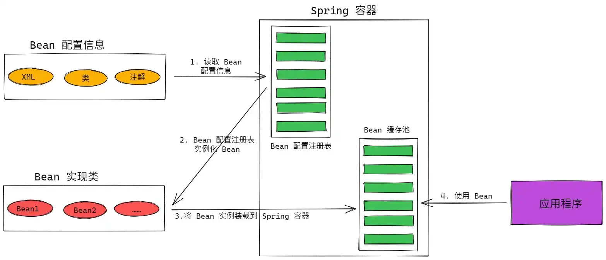

# Spring 面试知识点

## 1. Spring 特点

Spring 主要有如下特点：

1.  **轻量级**：Spring 是非侵入式，其中的对象不依赖 Spring 的特定类；
2.  **控制反转（IoC）**：通过 IoC，促进了低耦合，一个对象依赖的其他对象通过被动的方式传递进来，而不用该对象主动创建或查找；
3.  **面向切面（AOP）**：支持面向切面编程，将应用业务逻辑层和系统服务层分开；
4.  **容器**：包含并管理应用对象的配置以及生命周期，此时 Spring 就相当于一个容器；
5.  **框架集合**：能将简单的组件进行配置，组合成为更为复杂的应用；在 Spring 中，应用对象被声明式地组合在一个 XML 文件中；此外，Spring 也提供了事务管理、 持久化框架集成等基础功能，将应用逻辑的开发留给开发者；

## 2. Spring 核心组件


Spring 是一个分层架构，主要由如下 7 大模块所构成。Spring 模块位于核心容器，定义了创建、配置和管理 Bean 的方式。

1.  **Spring Core**：提供 Spring 框架基本功能，主要组件是 BeanFactory，是工厂模式的实现，通过 IOC 机制将应用程序的配置和依赖性规范与实际的应用程序代码分开。
2.  **Spring Context**：一个配置文件，给 Spring 框架提供上下文信息，上下文包括 JNDI、EJB、电子邮件、国际化、校验和调度等企业服务。
3.  **Spring AOP** ：通过配置管理特性，Spring AOP 直接将 AOP（面向切面）功能集成到 Spring 框架。从而我们能够十分方便的使用 Spring 框架来管理任何支持 AOP 的对象。模块为基于 Spring 的应用程序中的对象提供了事务管理服务。通过使用该组件，可以不依赖其他组件九江声明性事务管理集成到应用程序中。
4.  **Spring DAO**：JDBC DAO 抽象层提供了有意义的异常层次结构，可以用来管理异常处理和不同数据库供应商抛出的错误信息。异常层次结构简化了错误处理，而且极大降低了需要编写的异常代码数量。Spring DAO 面向 JDBC 的异常遵从通用的 DAO 异常层次结构。
5.  **Spring ORM**：Spring 框架中插入了若干个 ORM 框架，从而提供了 ORM 的对象关系工具，其中包括 JDO、Hibernate 和 iBatis SQL Map，这些都遵从 Spring 的通用事务和 DAO 异常层次结构；
6.  **Spring Web**：Web 上下文模块建立在应用程序上下文模块之上，为基于 Web 的应用程序提供了上下文，所以 Spring 框架支持与 Jakarta Structs 的集成。同时该模块还简化了处理多部分请求以及请求参数绑定到域对象的工作。
7.  **Spring MVC**：MVC 是一个全功能的构建 Web 应用的 MVC 实现，可以通过策略接口对 MVC 框架实现高度可配置。而且 MVC 还容纳了 JSP、Velocity、Tiles 等视图技术。

## 3. Spring 常用注解

| 注解                 | 说明                                                         |
| -------------------- | ------------------------------------------------------------ |
| `@Controller`        | 1. 用于标注控制层组件<br />2. 用于标记一个类，表示它是一个 SpringMVC Controller 对象<br />3. 分发处理器将扫描使用了该注解的类的方法，同时检测方法是否使用 `@RequestMapping`<br />4. 能够将 `Request` 请求 `header` 部分的值绑定到方法的参数上 |
| `@RestController`    | 相当于 `@Component` 与 `@ResponseBody` 的组合                |
| `@Component`         | 泛指组件，当组件不好归类时进行注解                           |
| `@Repository`        | 用于注解 `DAO` 层，在 `DaoImpl` 类中注解                     |
| `@Service`           | 用于注解业务层组件                                           |
| `@ResponseBody`      | 1. 异步请求<br />2. 用于将 `Controller` 的方法返回的对象，通过适当的 `HttpMessageConverter` 转换为指定格式后，写入到 `Response` 对象的 `body` 数据区<br />3. 返回的数据并非 `html` 的页面，而是其他某种格式的数据（json、xml）时使用 |
| `@RequestMapping`    | 用于处理请求地址映射的注解，用于类或方法，用于类时，表示类中所有响应请求的方法都以该地址作为父路径 |
| `@Autowired`         | 对类成员变量、方法以及构造函数进行标注，从而完成自动装配，通过 `@Autowired` 的使用来消除 `get、set` 方法 |
| `@PathVariable`      | 用于将请求 URL 中的模板变量映射到功能处理方法的参数上，即取出 URL 模板中的变量作为参数 |
| `@RequestParam`      | 用于在 Spring MVC 后台控制层获取参数，类似 `request.getParameter("name")` |
| `@RequestHeader`     | 将 `Request` 请求 `header` 部分的值绑定到方法的参数上        |
| `@ModelAttribute`    | 在该 `Controller` 所有方法在调用前，先执行该注解，可用于注解和方法参数中 |
| `@SessionAttributes` | 将值放到 `session` 作用域，写在 `Class` 上面                 |
| `@Valid`             | 实体数据校验，结合 Hibernate Validator 一起使用              |
| `@CookieValue`       | 获取 `cookie` 中的值                                         |

## 4. IoC 原理

### 4.1 定义

Spring 通过一个配置文件来描述 `Bean` 之间的相互依赖关系，利用 Java 的反射功能来实例化 `Bean` 并建立 `Bean` 之间的依赖关系。Spring 的 IoC 容器在完成这些底层工作的基础上，还提供 `Bean` 实例缓存、生命周期管理、`Bean` 实例代理、事件发布、资源装载等高级服务；

总结而言：**IOC 负责创建对象、管理对象（通过依赖注入）、整合对象、配置对象以及管理对象的生命周期**；

### 4.2 Spring 容器高层视图



1.  Spring 启动时先读取 `Bean` 配置信息，并在 Spring 容器中生成一份对应的 `Bean` 配置注册表；
2.  根据上一步中生成的 `Bean` 配置注册表来实例化 `Bean`，并装配好 `Bean` 之间的依赖关系；
3.  将实例化后的 `Bean` 装载到 Spring 容器中的 `Bean` 缓存池中，供上层的应用程序使用；

### 4.3 Spring Bean 的作用域及生命周期

#### 4.3.1 作用域

Spring 中，用来组成应用程序的主体以及由 Spring IoC 容器所管理的对象叫做 Bean。简而言之，Bean 就是由 IoC 容器来进行初始化、装配和管理的对象。

Bean 的作用域主要有如下几种：

1.  **Singleton（单例）**

作用域为 `Singleton`，**该模式在多线程下不安全**，表明 IoC  容器中只会存在一个共享 Bean 实例，而且所有对 Bean 的请求，主要 `id` 和该 Bean 定义相匹配，那么就会返回 Bean 的同一实例。`Singleton` 是单例模型，即在从创建容器的同时就会自动创建一个 Bean 的对象，无论是否使用，而且 **每次获取到的对象都是同一对象**。

2.  **Prototype（原型）：每次创建时使用**

作用域为 `Prototype`，表明一个 Bean 定义对应多个实例，该作用域中的 Bean 会导致在 **每次对该 Bean 请求时均创建一个新的 Bean 实例**。`Prototype` 是一个原型类型，在我们创建容器时并未实例化，而是当我们获取 Bean 时才去创建一个对象，而且每次获取到的对象都不一样。

3.  **Request：一次 request 一个实例**

作用域为 `Request`，**表明在一次 `HTTP` 请求中，容器返回该 Bean 的同一个实例**，即每个 `HTTP` 请求均有各自的 Bean 实例，依据某个 Bean 定义创建而成，只在基于 Web 的 Spring ApplicationContext 情形下有效。当一次 `HTTP` 请求处理结束时，该作用域中的 Bean 实例均被销毁。

4.  **Session**

作用域为 `Session` ，表明 **在一个 `HTTP Session` 中，容器返回该 Bean 的同一个实例，对不同的 `Session` 请求则创建新的实例，该 `Bean` 实例仅在当前 `Session` 内有效**，只在基于 Web 的 Spring ApplicationContext 情形下有效。当一个 `HTTP Session` 被废弃时，在该作用域内的 Bean 也将失效。

| 作用域类别  | 说明                                                         |
| ----------- | ------------------------------------------------------------ |
| `Singleton` | Spring IoC 容器中仅存在一个 Bean 实例，以单例方式存在，是 Spring 中的默认值 |
| `Prototype` | 每次从容器中调用 Bean 时，均返回一个新的实例，即每次调用 `getBean()` 方法，相当于 `new` 一个新的对象 |
| `Request`   | 每次 HTTP 请求均创建一个新的 Bean，仅适用于 WebApplicationContext 环境 |
| `Session`   | 每次 HTTP Session 共享一个 Bean，不同 Session 使用不同的 Bean，仅适用于 WebApplicationContext 环境 |

#### 4.3.2 生命周期

1.  Spring 对 Bean 进行实例化；
2.  Spring 将值和 Bean 的引用注入到 Bean 对应属性中；
3.  若 Bean 实现了 BeanNameAware 接口，则 Spring 将 Bean 的 ID 传递给 setBeanName() 方法；
4.  若 Bean 实现了 BeanFactoryAware 接口，Spring 将调用 `setBeanFactory()` 方法，将 Bean 所在应用引用传入进来；
5.  若 Bean 实现了 ApplicationContextAware 接口，Spring 将调用 `setApplicationContext()` 方法，将 Bean 所在应用的引用传入进来；
6.  若 Bean 实现了 BeanPostProcessor 接口，Spring 将调用 `post-ProcessBeforeInitalization()` 方法；
7.  若 Bean 实现了 `InitializingBean` 接口，Spring 将调用他们的 `after-PropertiesSet()` 方法，类似地，如果 Bean 使用 `init-method` 声明了初始化方法，则该方法也会被调用；
8.  若 Bean 实现了 BeanPostProcessor 接口，Spring 将调用他们的 `post-ProcessAfterInitialization()` 方法；
9.  此时，Bean 已经准备就绪，我们就可以被应用程序使用，他们将一直驻留在应用上下文中，直到该应用被销毁；
10.  若 Bean 实现了 DisposableBean 接口，Spring 将调用它的 `destory()` 接口方法；同样，若 Bean 使用 `destroy-method` 声明了销毁方法，该方法也将被调用；

### 4.4 Spring 依赖注入的四种方式

1.  **构造器注入**

```java
// 带参，方便用构造器进行注入
public CatDaoImpl(String name){
	this.name = name;
}
```

```xml
<bean id="CatDaoImpl" class="com.cunyu.CatDaoImpl">
	<constructor-arg value="name"></constructor-arg>
</bean>
```

2.  **setter 方法注入**

```java
public class Id {
    private int id;
    
    public int getId() { 
        return id;
    }
    
    public void setId(int id) {
        this.id = id;
    }
}
```

```xml
<bean id="id" class="com.cunyu.Id "> 
    <property name="id" value="1801333"></property> 
</bean>
```

3.  **静态工厂注入**

所谓静态工厂就是通过调用静态工厂的方法来获取自己所需对象，而且为了方便 Spring 管理，我们不能通过 “类.静态方法()” 来获取对象，而应该通过 Spring 注入的形式；

```java
// 静态工厂
public class DaoFactory {
    public static final FactoryDao getStaticFactoryDaoImpl(){
        return new StaticFacotryDaoImpl();
    }
}
public class SpringAction {
    // 需要注入的对象
    private FactoryDao staticFactoryDao; 
    // 注入对象的 set 方法
    public void setStaticFactoryDao(FactoryDao staticFactoryDao) {
        this.staticFactoryDao = staticFactoryDao;
    }
}
```

```xml
<bean name="springAction" class="com.cunyu.SpringAction" >
    <!--利用静态工厂的方法注入对象-->
    <property name="staticFactoryDao" ref="staticFactoryDao"></property>
</bean>
<!--从工厂类获取静态方法-->
<bean name="staticFactoryDao" class="com.cunyu.DaoFactory" factory-method="getStaticFactoryDaoImpl"></bean>
```

4.  **实例工厂**

实例工厂表示获取对象实例的方法不是静态的，所以需要先 `new` 工厂类，然后再调用普通的实例方法；

```java
// 实例工厂
public class DaoFactory { 
    public FactoryDao getFactoryDaoImpl(){
        return new FactoryDaoImpl();
    }
}
public class SpringAction {
    // 注入对象
    private FactoryDao factoryDao; 
    public void setFactoryDao(FactoryDao factoryDao) {
        this.factoryDao = factoryDao;
    }
}
```

```xml
<bean name="springAction" class="com.cunyu.SpringAction">
    <!--使用实例工厂的方法注入对象,对应下面的配置文件-->
    <property name="factoryDao" ref="factoryDao"></property>
</bean>

<!--此处获取对象的方式是从工厂类中获取实例方法-->
<bean name="daoFactory" class="com.cunyu.DaoFactory"></bean>
<bean name="factoryDao" factory-bean="daoFactory" factory-method="getFactoryDaoImpl"></bean>
```

### 4.5 Spring 自动装配方式

要实现自动装配，主要从如下两个角度来进行实现：

1.  **组件扫描（Component Scanning）**：Spring 会自动发现应用上下文中所创建的 Bean；
2.  **自动装配（Autowiring）**：Spring 自动满足 Bean 之间的依赖；

Spring 装配包括 **手动转配和自动装配**，**手动装配是通过 `XML` 装配、构造方法、`setter` 方法等方式；**

而自动装配有如下几种，使得 Spring 容器通过自动装配方式来进行依赖注入；

| 装配方式      | 说明                                                         |
| ------------- | ------------------------------------------------------------ |
| `no`          | 默认不进行自动装配，通过显式设置 `ref` 属性来进行装配        |
| `byName`      | 通过参数名自动装配，Spring 容器在配置文件中发现 `Bean` 的 `autowire` 属性被设置为 `byName` 后试图匹配、装载和该 `Bean` 的属性具有相同名字的 `Bean` |
| `byType`      | 通过参数类型自动装配，Spring 容器在配置文件中发现 `Bean` 的 `autowire` 属性被设置为 `byType` 后试图匹配、装载和该 `Bean` 的属性具有相同了类型的 `Bean`，若发现多个 `Bean` 符合条件，则抛出错误 |
| `constructor` | 类似于 `byType`，但需要提供给构造器参数，若无固定的带参的构造器参数类型，则抛出异常 |
| `autodetect`  | 首先尝试使用 `constructor` 来自动装配，若无法工作，则使用 `byType` 方式 |

### 4.6 IoC 的优缺点

1.  **优点**：组件之间的解耦，提高程序可维护性、灵活性；
2.  **缺点**：创建对象步骤复杂，有一定学习成本；利用反射创建对象，效率会降低；

## 5. AOP 原理

### 5.1 定义

即剖开封装的对象内部，并将那些影响了多个类的公共行为封装到一个可重用模块，并将其命名为 `Aspect`，**即切面**。所谓切面即 **与业务无关，但被业务模块所公用的逻辑，便于减少系统的重复代码，降低模块间的耦合度，利于后续的可操作性和可维护性**。

通过使用横切，AOP 将软件切分为：**核心关注点和横切关注点**。业务处理的主要流程是核心关注点，与横切关注点关系不大。**横切关注点的特点是经常发生在核心关注点的多处，且各处基本相似**。AOP 的作用就在于 **分离系统中的各种关注点，将核心关注点和横切关注点分离开**。

### 5.2 核心概念

### 5.3 AOP 的两种代理方式

Spring 提供了两种方式来生成代理对象：JDK Proxy 和 CGlib，**默认的策略是如果目标类是接口，则使用 JDK 动态代理技术，否则使用 CGlib 来生成代理**；

1.  **JDK 动态接口代理**

主要涉及 `Proxy` 和 `InvocationHandler`，`InvocationHandler` 是一个接口，通过实现该接口定义横切逻辑，并通过反射机制调用目标类的代码，动态地将横切逻辑与业务逻辑编制在一起。而 `Proxy` 则利用 `InvocationHandler` 动态创建一个符合某一接口的实例，生成目标类的代理对象；

2.  **CGlib 动态代理**

全称 `Code Generation Library`，**是一个高性能高质量的代码生成类库，能在运行期间扩展 Java 类与实现 Java 接口。** CGlib 封装了 ASM，能在运行期间动态生成新的类。

3.  **JDK 动态代理和 CGlib 动态代理的区别**

JDK 动态代理只能为接口创建代理实例，而对于没有通过接口定义业务方法的类，则需要通过 CGlib 创建动态代理；

### 5.4 切面的通知类型

1.  **前置通知（Before）**：目标方法在被调用前调用通知；
2.  **后置通知（After）**：目标方法完成后调用通知；
3.  **返回通知（After-returning）**：目标方法成功执行之后调用通知；
4.  **异常通知（After-throwing）**：目标方法抛出异常后调用通知；
5.  **环绕通知（Around）**：在被通知的方法调用之前和调用之后执行自定义的行为；

## 6. Spring MVC

### 6.1 什么是 MVC 框架？

MVC，全称 Model View Controller，是模型（model）-视图（view）-控制器（controller）的缩写，是一种软件设计典范。用一种业务逻辑、数据、界面显示分离的方法组织代码，将业务逻辑聚集到一个部件中，然后在改进和个性化定制界面及用户交互的同时，不用重写业务逻辑；

采用 MVC 设计模式主要有如下好处：

1.  通过分层设计，实现了业务系统各组件之间的结构，有利于业务系统的可扩展性和可维护性；
2.  有利于系统的并行开发，提升开发效率；

### 6.2 SpringMVC

#### 6.2.1 定义

Spring MVC 是 Spring 框架的一个模块，一个基于 MVC 的框架；

#### 6.2.2 组件

1.  `DispatcherServlet`：核心组件，前端控制器，也叫中央控制器，由它来调度相关组件，**用于接收请求、响应结果，相当于转发器，有了 `DispatcherServlet` 就减少了其他组件之间的耦合度**；
2.  `HandlerMapping`：处理器映射器，根据 URL 路径映射到不同的 `Handler`；
3.  `HandlerAdapter`：处理器适配器，按照 `HandlerAdapter` 的规则来执行 `Handler`；
4.  `Handler`：处理器，由我们自己根据业务进行开发；
5.  `ViewResolver`：视图解析器，将逻辑视图解析成具体的视图；
6.  `View`：一个接口，支持不同的视图类型；

#### 6.2.3 MVC 工作流程

1.  浏览器发送请求，前端控制区 `DispatcherServlet` 拦截该请求；
2.  `DispatcherServlet` 拦截到请求后，对请求 URL 进行解析，得到请求资源标识符 URI，根据 URI 调用 `HandlerMapping` 后获取对应 `Handler`；
3.  `DispatcherServlet` 拿到 `Handler` 之后，找到 `HandlerAdapter` ，通过它来访问 `Handler`，并执行处理器；
4.  执行 `Handler` 的逻辑，返回一个 `ModelAndView` 对象给 `DispatcherServlet`；
5.  然后 `DispatcherServlet` 请求 `ViewResolver` 解析视图，根据逻辑视图名解析真正的 `View`；
6.  然后 `ViewResolver` 将解析后的 `View` 返回给 `DispatcherServlet`，然后对 `View` 进行渲染；
7.  然后由 `DispatcherServlet` 响应视图给浏览器；

#### 6.2.4 SpringMVC 的优点

1.  具有 Spring 的特性；
2.  支持多种视图；
3.  配置方便，非侵入；
4.  分层更加清晰，利于团队开发的代码维护，以及可读性好；

### 6.3 注解

#### 6.3.1 注解原理

注解本质上是一个集成了 `Annotation` 的特殊接口，其具体实现类是 Java 运行时生成的动态代理类。通过反射获取注解时，返回的是 Java 运行时生成的动态代理对象。通过代理对象调用自定义注解的方法，将最终调用 `AnnotationInvocationHandler` 的 `invoke` 方法，然后该方法从 `memberValues` 的 `Map` 中索引出对应的值；

#### 6.3.2 常用注解

| 注解              | 说明                                                         |
| ----------------- | ------------------------------------------------------------ |
| `@RequestMapping` | 用于处理请求 `url` 映射的注解，能用在类或方法上，用于类时表示所有响应请求的方法均以该地址作为父路径 |
| `@RequestBody`    | 实现接收 `HTTP` 请求的 `json `数据，将 `json `转换为 Java 对象 |
| `@ResponseBody`   | 实现将 `controller` 方法返回对象转化为 Json 对象响应给客户   |