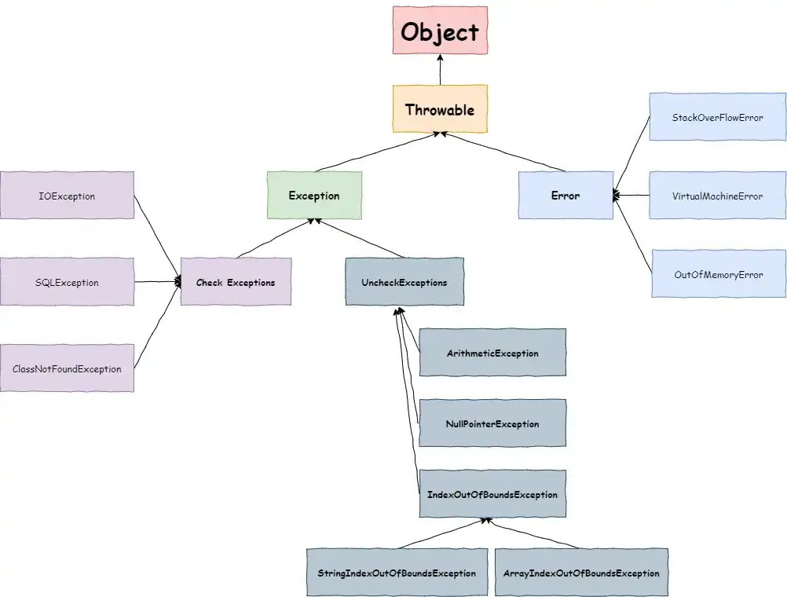
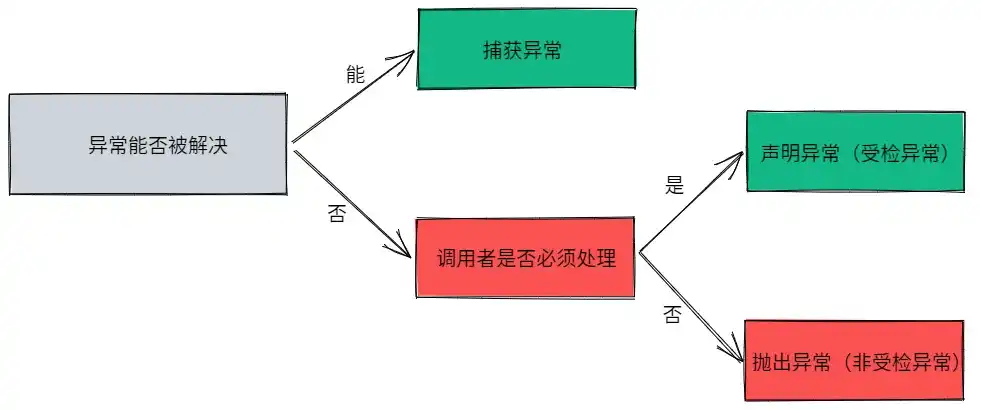

# 异常面试知识点

## 异常简介

### 异常类层次结构



从结构图可以看出，所有异常均继承自 `Throwable` 类，它有两个重要的子类：`Exception` 和 `Error` ，各自又包含大量子类。

1.  **Exception**

**程序本身可以处理的异常**，又可以分为 **受检异常** 和 **非受检异常** ，**受检异常** 可以用 `try...catch...` 语句进行捕获处理，而且能从异常中恢复。但 **非受检异常** 是程序运行时错误，会导致程序崩溃而无法恢复。

- **受检异常**

编译器要求必须处理的异常，正确的程序在运行时，经常会出现、预期范围内的情况。一旦发生该类异常，就必须使用某种方式进行处理。**包括除开 `RuntimeException` 及其子类之外的 `Exception` 异常**。编译器会检查此类异常，所以我们必须使用 `throws` 进行抛出或者 `try...catch` 进行捕获，否则将导致编译失败。

- **非受检异常**

编译器不会检查而且也不要求我们进行处理，即就算在程序中出现了此类异常，即便我们没有用 `try...catch` 进行捕获或者用 `throws` 进行抛出，编译都会成功。包括 **`RuntimeException` 及其子类和错误 `Error`**.

同时也可以分为：**运行时异常和编译时异常**。

- **运行时异常**

`RuntimeException` 类及其子类，表示 JVM 在运行期间可能出现的异常，Java 编译器不会检查它。没有通过 `throws` 抛出或 `try...catch` 捕获，仍然可以编译通过，常见的有 `NullPointerException、ArrayIndexOutBoundException、ClassCastException、ArithmeticException、NumberFormatException、IllegalArgumentException`；

- **编译时异常**

`Exception` 中除开运行时异常之外的异常，Java 编译器会检查它，一旦出现，必须使用 `throws` 进行声明抛出，或者使用 `try...catch` 进行捕获异常，否则不能通过编译。常见的有 `ClassNotFoundException、IOException`。在程序中，通常不会自定义该类异常，而是直接用系统提供的异常类，**该异常必须手动在代码中添加捕获语句来处理。**

2.  **Error**

**程序无法处理的错误**，表示程序运行过程中教严重的问题，大多与 coder 所做操作无关，而是代码运行时 JVM 出现的问题。此时说明故障发生于虚拟机本身、或者发生在虚拟机试图执行应用时。

### Throwable 常用方法

| 方法                                 | 说明                                                                                                       |
| ------------------------------------ | ---------------------------------------------------------------------------------------------------------- |
| `public String getMessage()`         | 返回异常发生时的简要描述                                                                                   |
| `public String toString()`           | 返回异常发生时的详细信息                                                                                   |
| `public String getLocalizeMessage()` | 返回异常对象的本地化信息，若子类重写该方法，可以生成本地化信息，若未重写，则返回信息同 `getMessage()` 方法 |
| `public void printStackTrace()`      | 在控制台中打印异常对象封装的异常信息                                                                       |

### try-catch-finally 和 try-with-resources

1.  **try-catch-finally**
    - **try** ：用于捕获异常，后接零个或多个 `catch`，没有 `catch` 则必须加上 `finally`；
    - **catch**：用于处理 `try` 捕获到的异常；
    - **finally**：无论是否捕获/处理异常，`finally` 块中内容均会执行，就算 `try` 或 `catch` 中有 `return` 语句，`finally` 中代码也将在方法返回之前执行；
2.  **try-with-resources**

当我们有必须要关闭的资源时，建议优先使用 `try-with-resources`，这样写出的代码更加简短清晰。

3.  **两者对比**

```java
// try-catch-finally
Scanner scanner = null;
try {
    scanner = new Scanner(new File("D:/demo.txt"));
    while (scanner.hasNext()) {
        System.out.println(scanner.nextLine());
    }
} catch (FileNotFoundException e) {
    e.printStackTrace();
} finally {
    if (scanner != null) {
        scanner.close();
    }
}
```

```java
// try-with-resources
try (Scanner scanner = new Scanner(new File("D:/demo.txt"))) {
    while (scanner.hasNext()) {
        System.out.println(scanner.nextLine());
    }
} catch (FileNotFoundException e) {
    e.printStackTrace();
}
```

## 异常处理

Java 中，异常处理机制分为 **声明异常、抛出异常和捕获异常**，根据异常的情况，可以对异常进行不同处理：



### 声明异常

对于知道如何进行处理的异常，一般要进行捕获，但此时不知道如何将处理的异常继续传递下去，可以通过在方法签名中使用 `throws` 来声明可能抛出的异常，有如下两点需要注意：

1.  **非受检异常（Error、RuntimeException 及其子类）** 不能使用 `throws` 关键字来声明要抛出的异常；
2.  **一个方法出现编译时异常，就需要 `try...catch/throws` 进行处理，否则会导致编译失败** ；

### 抛出异常

一旦觉得某些异常无法处理，但同时又不用我们进行处理，那我们就可以将其抛出。一般是使用 `throw` 在方法内部抛出一个 `Throwable` 类型的异常。

### 捕获异常

程序在运行前一般不会报错，但是运行后可能出现某些未知错误，如果不想直接抛出给上一级处理，那我们就需要通过 `try...catch...` 的形式对异常进行捕获，然后根据不同的情况来进行相应处理。

## 异常常见面试题

### Error 和 Exception 的区别？

`Exception` 类的异常能够在程序中进行捕获并处理，遇到该类异常，应该进行处理，从而使程序能够继续正常运行；

`Error` 类的错误一般是虚拟机相关错误，如系统崩溃、内存不足、堆栈溢出等，编译器不会检测这类错误。我们也不会对这类错误进行捕获，一旦发生，一般都会导致程序崩溃无法恢复；

### 运行时异常和受检异常的区别？

运行时异常包括 `RuntimeException` 及其子类，表示 JVM 运行期间可能出现的异常，不会被 Java 编译器检查。

而受检异常是除开 `RuntimeException` 及其子类之外的其他 `Exception`，会被 Java 编译器检查。

两者的 **区别** 在于：是否需要调用者必须处理该异常，**如果必须处理，则一般使用受检异常，否则一般选择非受检异常（RuntimeException）**；

### throw 和 throws 的区别？

- **throw：用于在方法内部抛出异常对象**
  1.  `throw` 用在方法体内，表示抛出异常，由方法体内的语句处理；
  2.  `throw` 是具体向外抛出异常的动作，所以抛出的是一个异常实例，执行 `throw` 一定是抛出了某种异常；
- **throws：用于在方法签名上声明该方法所要抛出的异常**
  1.  `throws` 语句使用在方法声明后，表示若抛出异常，则由该方法的调用者来进行异常的处理；
  2.  `throws` 主要是声明这个方法会抛出某种类型的异常，让它的使用者要知道需要捕获的异常的类型；
  3.  `throws` 表示出现异常的一种可能性，并非一定发生该种异常；

### final、finally、finallize 的区别？

`final` 用于修饰类、方法、变量，修饰类时表示类不能被继承；修饰方法时表示方法不能别重写，但是能够被重载；修饰变量时表示该变量是一个常量无法被重写赋值；

`finally` 一般作用于 `try...catch` 代码块，处理异常时，通常将必须要执行的代码放在 `finally` 代码块中，表示无论是否出现异常，此代码块均执行，一般用来存放一些关闭资源的代码；

`finallize` 是一个方法，属于 `Object` 类，Java 允许用 `finallize()` 方法在垃圾回收器将对象从内存中清除前做一些必要的清理工作；

### 常见的 RuntimeException 异常？

- `ClassCastException`
- `IndexOutOfBoundsException`
- `NullPointerException`
- `ArrayStoreException`
- `BufferOverFlowException`

### JVM 如何处理异常？

一旦某方法发生异常，该方法就会创建一个异常对象，并将其转交给 JVM，该异常对象一般包含 **异常名称、异常描述以及异常发生时应用程序的状态**。这个 **创建异常对象并转交给 JVM 的过程叫做抛出异常**。可能有一系列的方法调用，最终才能进入抛出异常的方法，这一系列方法调用的有序列表叫做调用栈。

JVM 沿着调用栈去查找是否有需要处理异常的代码，一旦发现则调用异常处理代码。当 JVM 发现可以处理异常的代码时，会将发生的异常传递给它。如果 JVM 未找到能够处理该异常的代码块，就会将其转交给默认的异常处理器（JVM 的一部分），由异常处理器打印出异常信息并终止应用程序；