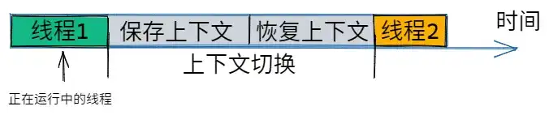
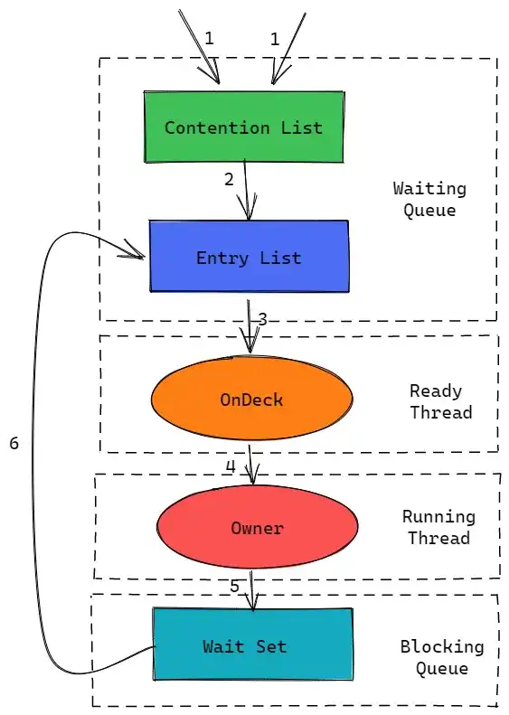

# 多线程面试知识点

## 1. 进程和线程

### 1.1 进程

进程是系统中正在运行的一个程序，是 **资源分配的基本单位，每个进程都有独立的地址空间**。

进程控制块（Process Control Block，PCB）描述了进程的基本信息和运行状态，所谓的创建和撤销进程，都是指对于 PCB 的操作；

### 1.2 线程

线程是 **独立调度的基本单位，被包含在进程中，是进程中的实际运作单位。一个进程中可以有多个线程，所有线程共享该进程的资源**。

###  1.3 进程和线程的区别？

1.  进程和线程均为并发单元，根本区别在于：**进程不共享公共内存，但线程共享进程资源**；
2.  从系统的角度来看，进程相当于一个独立软件，在其自己的虚拟内存空间中运行。系统通过将内存中的进程分开，这样一旦某一进程失败也不会干扰公共内存来拖累其他进程。因此一般 **进程是隔离的，通过进程间通信进行协作，进程间通信由操作系统定义为一种中间 API**。
3.  而线程是应用程序的一部分，和同一程序的其他线程共享公共内存，通过公共内存从而减少内存开销，能够更快的交换数据和进行线程间协作；

### 1.4 线程分类

Java 线程由两种，一种是 **用户线程**，一种是 **守护线程**；

#### 1.4.1 守护线程

1.  **守护线程的特点**

守护线程是一个较特殊的线程，主要被用作程序中后台调度以及支持性工作。当 Java 虚拟机中不存在非守护线程时，守护线程才会随着 JVM 一起结束工作；

2.  **Java 中的典型守护线程**

GC（垃圾回收器）

3.  如何设置守护线程

```java
Thread.setDaemon(true);
```

**注意：** `Daemon` 属性需要再启动线程前设置，不能再启动后设置；

## 2. 如何创建线程实例并运行

`Thread` 类本质上是实现 `Runnable` 接口的一个实例，代表一个线程的实例。创建线程实例一般有两种方法：

### 2.1 创建 Thread 的子类并重写 `run()`

```java
public class MyThread extends Thread {
    @Override
    public void run(){
        System.out.println("MyThread running");
    }
}  
```

`run()` 方法会在调用 `start()` 方法后被执行，而且一旦线程启动后 `start()` 方法后就会立即返回，而不是等到 `run()` 方法执行完毕后再返回。

```java
MyThread myThread = new MyThread();
myThread.start();
```

### 2.2 实现 Runnable 接口

```java
public class MyRunnable implements Runnable{
    @Override
    public void run(){
        System.out.println("MyRunnable running");
    }
}
```

在新建类时实现 `Runnable` 接口，然后在 `Thread` 类的构造函数中传入  `MyRunnable` 的实例对象，最后执行 `start()` 方法即可；

```java
Thread thread = new Thread(new MyRunnable());
thread.start();
```

## 3. Runnable vs Callable

### 3.1 Runnable

该接口表示必须在单独的线程中运行的计算单位，只有 `run()` 方法，而且不允许该方法返回值或抛出未经检查的异常；

### 3.2 Callable

该接口表示具有返回值的任务，只有一个 `call()` 方法，该方法可以返回一个值（也可以是 `void`），同时也支持抛出异常。`Callable` 通常在 `ExecutorService` 事例中用于启动异步任务，然后调用返回的实例从而获取其值；

## 4. 并发 vs 并行

### 4.1 并发

同一时间段，多个任务均在执行（单位时间内不一定同时执行）；

### 4.2 并行

单位时间内，多个任务同时执行；

## 5. 4 种线程池

Java 中线程池的顶级接口是 `Executor`，但严格来讲它并不是一个线程池，而只是一个执行线程的工具，真正的线程池接口应该是 `ExecutorService`，一般可以有如下 4 种线程池：

### 5.1 newCachedThreadPool

**创建一个根据需要来创建新线程的线程池**，但在以前构造的线程可用时将重用它们。对于执行许多短期异步任务的程序而言，这些线程池通常能够提高程序性能。**调用 `execute` 将重用以前构造的线程（若线程可用），若线程无可用的，则创建一个新线程并添加到线程池中。对于那些已经有 60s 未使用的线程，则从缓存中将其移除。** 因此长时间保持空闲的线程池不会使用任何资源。

### 5.2 newFixedThreadPool

**创建一个可重用固定线程数的线程池，以共享的无界队列方式来运行这些线程。** 在任意时间点，大多数 `nThreads` 线程将会处理任务的活动状态。如果在所有线程处于活动状态时提交附加任务，则在有可用线程前，附加任务将在队列中进行等待。如果在关闭前的执行期间由于失败而导致任何线程终止，则一个新的线程将代替它执行后续任务。在某个线程被显式关闭前，池中线程都将一直存在。

### 5.3 newScheduledThreadPool

**创建一个线程池，能够安排在给定延迟后运行命令或定期执行。**

### 5.4 newSingleThreadExecutor

`Executors.newSingleThreadExecutor()` 返回一个线程池（该线程池只有线程），**该线程池可以在线程死后（或发生异常时）重新启动一个线程来替代原来的线程继续执行下去**；

## 6. 线程生命周期及状态

### 6.1 线程状态

| 状态           | 说明                                                         |
| -------------- | ------------------------------------------------------------ |
| `NEW`          | 初始状态，创建线程，但还未调用 `start()` 方法                |
| `RUNNABLE`     | 可执行状态，“就绪” 和 “运行” 两种状态统称 “运行中”           |
| `BLOCKED`      | 阻塞状态，表示线程阻塞于锁                                   |
| `WAITING`      | 等待状态，线程进行登台状态，进入该状态表示当前线程需要等待其他线程做出通知或中断 |
| `TIME_WAITING` | 超时等待状态，不同于 `WAITING` ，经过指定时间后可以自行返回  |
| `TERMINATED`   | 终止状态，表示线程执行完毕                                   |


上图源自《Java 并发编程艺术》，可以看出一个线程的状态变迁过程：

线程创建后处于 `NEW` 状态，然后调用 `start()` 方法后开始运行，此时处于 `READY` 状态，接着一旦可运行状态的线程获得了 CPU 时间片之后，就处于 `RUNNING` 状态。如果线程执行了 `wait()` 方法，则进入 `WAITING` 状态。进入 `WAITING` 状态的线程池需要依靠其他线程的通知后才能返回 `RUNNING` 状态。而 `TIME_WAITING` 状态相当于在 `WAITING` 状态的基础上增加了超时限制，当超时后线程将自动返回 `RUNNABLE` 状态。当线程调用同步方法后，如果没有获取到锁，线程将进入 `BLOCKED` 状态。同时，如果线程执行了 `RUNNABLE` 的 `run()` 方法，线程将进入 `TERMINATED` 状态。

### 6.2 线程阻塞的三种情况

当线程因为某种原因放弃 CPU 使用权后，即让出了 CPU 时间片，暂时就会停止运行，知道线程进入可运行状态（`Runnable`），才有机会再次获得 CPU 时间片转入 `RUNNING` 状态。一般来讲，阻塞的情况可以分为如下三种：

1.  **等待阻塞（Object.wait -> 等待队列）**

`RUNNING` 状态的线程执行 `Object.wait()` 方法后，JVM 会将线程放入等待序列（waitting queue）；

2.  **同步阻塞（lock -> 锁池）**

`RUNNING` 状态的线程在获取对象的同步锁时，若该 **同步锁被其他线程占用，则 JVM 将该线程放入锁池（lock pool）中**；

3.  **其他阻塞（sleep/join）**

`RUNNING` 状态的线程执行 `Thread.sleep(long ms)` 或 `Thread.join()` 方法，或发出 I/O 请求时，JVM 会将该线程置为阻塞状态。当 `sleep()` 状态超时，`join()` 等待线程终止或超时、或者 I/O 处理完毕时，线程重新转入可运行状态（`RUNNABLE`）；

### 6.3 线程死亡的三种方式

1.  **正常结束**

`run()` 或者 `call()` 方法执行完成后，线程正常结束；

2.  **异常结束**

线程抛出一个未捕获的 `Exception` 或 `Error`，导致线程异常结束；

3.  **调用 stop()**

直接调用线程的 `stop()` 方法来结束该线程，但是一般不推荐使用该种方式，**因为该方法通常容易导致死锁**；

### 6.4 终止线程的 4 种方式

1.  **正常运行结束**

程序运行结束，线程自动结束。

2.  **使用退出标志退出线程**

一般 `run()` 方法执行完毕后，线程就会正常结束，但是有的线程是伺服线程，**需要长时间的运行，直到满足某些外部条件满足时，才能关闭**，一般通过使用关键字 `volatile` 来使退出标志进行同步（`volatile` 修饰时，同一时刻只能有一个线程来修改退出标志的值）；

```java
public class MyThread extends Thread{
    public volatile boolean flag = false;
    @Override
    public void run(){
        while(!flag){
            ……
        }
    }
}
```

3.  **Interrupt 方法结束线程**

利用 `interrput()` 方法来终止线程有两种情况：

-   **线程处于阻塞状态**

若使用了 `sleep`，同步锁的 `wait`，socket 中的 `receive、accept` 等方法时，线程会处于阻塞状态。当调用线程的 `interrupt()` 方法时，将抛出 `InterrputException` 异常，阻塞中的线程哪个方法抛出该异常，就通过代码来进行捕获，然后 `break` 跳出循环状态，从而让我们有机会结束该线程的执行。**并非调用了 `interrput()` 方法后线程就会结束，而是需要我们先捕获 `InterruptException` 异常后通过 `break` 来跳出循环，才能正常结束 `run()` 方法**；

-   **线程未处于阻塞状态**

使用`isInterrupted()` 判断线程的中断标志来退出循环，当使用 `interrupt()` 时，中断标志会置为 `true`，和使用自定义的退出标志来控制循环原理一致；

```java
public class ThreadSafe extends Thread {
    public void run() {
        // 非阻塞过程中通过判断中断标志来退出
        while (!isInterrupted()){
            try{
                // 阻塞过程捕获中断异常来退出
                Thread.sleep(5000);
            }catch(InterruptedException e){
                e.printStackTrace();
                // 捕获到异常之后，执行 break 跳出循环
                break;
            }
        }
    }
}
```

4.  **stop 方法终止进程（线程不安全）**

可以使用 `Thread.stop()` 来强行终止线程，但 **调用 `stop()` 后，创建子线程就会抛出 `ThreadDeathError` 的错误，且会释放子线程所持有的所有锁。一般任何进行加锁的代码块都是为了保护数据一致性，若在调用 `Thread.stop()` 方法后导致该线程所持有的的所有锁的突然释放（不受控制），则被保护数据就有可能呈现不一致性，其他线程在使用这些被破坏的数据时，就可能会导致一些奇怪的应用程序错误。**

## 7. 上下文切换

### 7.1 上下文切换活动

多线程编程时一般线程数量均比 CPU 核心数多，但一个 CPU 在任一时刻只能被一个线程占用，针对这一问题，CPU 通过 **给每个线程分配时间片并转轮**。当一个线程的时间片消耗完时，该线程进入就绪状态，而 CPU 此时就让给其他线程占用，这样的一个过程就是 **一次上下文切换**。

总结来说：当前线程在执行完 CPU 时间片之后切换到另一个线程前，会先保存自己的状态，从而方便下次切换回这个线程时，能够快速加载该线程的状态。**线程从保存到再加载的过程就是一次上下文切换**。



如上图，上下文切换的步骤可以总结为如下三步：

1.  首先挂起一个进程，然后将这个进程在 CPU 中的状态（上下文）存储在内存中某处；
2.  然后在内存中检索下一个进程的上下文并将其在 CPU  的寄存器中恢复；
3.  跳转到程序计数器指向的位置（即跳转到进程被中断时的代码行），然后恢复该进程；

### 7.2 上下文切换的原因

引起上下文切换的原因通常有如下几种：

1.  当前执行任务的时间片用完之后，系统 CPU 正常调度下一个任务；
2.  当前执行任务碰到 IO 阻塞，调度器将此任务挂起，继续下一任务；
3.  多个任务抢占锁资源，当前任务未抢到锁资源，被调度器挂起，继续下一个任务；
4.  用户代码挂起当前业务，让出 CPU 时间；
5.  硬件中断；

## 8. 锁

### 8.1 锁的分类

Java 中的锁有很多种，通常可以分为如下类型：

#### 8.1.1 乐观锁

乐观锁是一种乐观思想，认为 **读多写少，遇到并发写的可能性低，每次去拿数据时都认为别人不会修改，所以不会上锁。** 但是 **在更新时会判断一下在此期间别人有没有去更新这个数据，采取在写时先读出当前版本号，然后加锁操作（比较跟上一次的版本号，如果一样则更新），** 若失败则要重复读-比较-写操作。

Java 中的乐观锁基本都是通过 **CAS** 操作来实现，CAS 是一种更新的原子操作，**用于比较当前值与传入值是否一样，一样则更新，否则则失败**。

#### 8.1.2 悲观锁

悲观锁是一种悲观思想，认为 **写多读少，遇到并发写的可能性高。每次去拿数据时都认为别人会修改，所以每次在读写数据时均上锁，这样别人想读写该数据时就会阻塞直接拿到锁。**

Java 中的悲观锁就是 **Synchronized**，AQS 框架下的锁会先去尝试 CAS 乐观锁去获取锁，如果获取不到就转换为悲观锁。

#### 8.1.3 自旋锁

1.  **自旋锁原理**

**若持有锁的线程能在较短时间内释放锁资源，则那些等待竞争锁的线程就不需要做内核态和用户态之间的切换就会进入阻塞挂起状态，他们只需要等上一段时间（自旋），等待持有锁的线程释放锁之后就可以立刻释放锁，从而避免用户线程和内核的切换的消耗。**

2.  **自旋锁优缺点**

自旋锁能尽可能的减少线程的阻塞，对于锁的竞争不激烈，而且占用锁时间非常短的代码块而言性能会有大幅度的提升。因为自旋的消耗会小于线程阻塞挂起再唤醒的操作的消耗，这些操作将导致线程发生两次上下文切换。

但是如果锁的竞争比较激烈，或者持有锁的线程需要长时间的占用锁来执行同步块，此时就不适合使用自旋锁，因为自旋锁在获取锁之前一直都占用 CPU 做无用功。同时大量线程竞争一个锁，将导致获取锁的时间变长，线程自旋的消耗远远大于线程阻塞挂起操作的消耗，其他需要 CPU 的线程又获取不到 CPU，从而造成 CPU 的浪费，此时我们就应该关闭自旋锁。

#### 8.1.4 Synchronized 同步锁

`synchronized` 能把任意一个非 `NULL` 的对象当作锁，**属于独占式的悲观锁，同时又属于可重入锁。**

-   **Synchronized 作用范围**
    1.  作用于方法时，锁住的是对象实例（`this`）；
    2.  作用于静态方法时，锁住 `Class` 实例，而 `Class` 的相关数据存储在永久代（PermGen），属于全局共享区域，因此静态方法锁相当于类的一个全局锁，将锁住所有调用该方法的线程；
    3.  `synchronized` 作用于一个对象实例时，锁住的是所有以该对象为锁的代码块。有多个队列，当多个线程一起访问某个对象监视器时，对象监视器会将这些线程存储在不同的容器中；
-   **Synchronized  核心组件**

| 组件              | 说明                                                         |
| ----------------- | ------------------------------------------------------------ |
| `Wait Set`        | 调用 `wait()` 方法被阻塞的线程存放处                         |
| `Contention List` | **竞争队列**，所有 请求锁的线程首先被存放在该竞争队列        |
| `Entry List`      | **竞争队列中有资格成为候选资源的线程被移动到 `Entry List` 中** |
| `OnDeck`          | 任意时间，**最多只有一个线程正在竞争锁资源，该线程被叫做 `OnDeck`** |
| `Owner`           | 当前已经获取到锁资源的线程                                   |
| `!Owner`          | 当前释放锁的线程                                             |

-   **Synchronized  实现**



1.  JVM 每次从等待队列尾部取出一个数据用于锁竞争候选者（`OnDeck`） ，但在并发情况下，`Contention List` 会被大量的并发线程进行 CAS 访问，此时，为了降低对队列尾部元素的竞争，JVM 将一部分线程移动到 `Entry List` 中作为候选竞争线程；
2.  `Owner` 线程在 `unclock` 时，将 `Contention List` 中的部分线程迁移到 `Entry List`，并指定其中的某一线程为 `OnDeck` 线程（一般是最先进去的线程）；
3.  `Owner` 线程并不直接把锁传递给 `OnDeck` 线程，而是把锁竞争的权利交给 `OnDeck`，它需要重新竞争锁。虽然在一定程度上牺牲了公平性，但是能够极大地提高系统吞吐量，在 JVM  中这种选择行为叫做 “竞争切换”；
4.  `OnDeck` 线程获取到锁资源后就会变成 `Owner` 线程，未获取到锁资源的则仍然停留在 `Entry List` 中。如果 `Owner` 线程被 `wait()` 方法阻塞，则转移到 `Wait Set` 队列，直到某一时刻通过 `notify()/notifyAll()` 唤醒，则重新进入 `Entry List`；
5.  处于 `Contention List、Entry List、Wait Set` 中的线程均处于阻塞状态，该阻塞由操作系统来完成；
6.  `Synchronized` **是非公平锁**。`Synchronized` 在线程进入 `Contention List` 时，**等待的线程先尝试自旋获取锁，如果获取不到则进入 `Contention List`**；

### 8.2 锁的优化

1.  **减少锁持有时间**

只用在有线程安全要求的程序上加锁；

2.  **减小锁粒度**

将大对象（被多个线程访问）拆分为小对象，大大增加并行度，降低锁竞争。通过降低锁的竞争，偏向锁，轻量级锁的成功率才会提高，其中典型案例为 `ConcurrentHashMap`；

3.  **锁分离**

**最常见的锁分离就是读写锁 `ReadWriteLock`**，根据功能进行分离为读锁和写锁，这样一来读读不互斥，读写互斥，写写互斥，既能保证线程安全，又提高了性能；

4.  **锁粗化**

为了保证多线程间的有效并发，会要求每个线程持有锁的时间尽量短，即在使用完公共资源后，应该立即释放锁。**但如果对同一个锁不停地进行请求、同步和释放，其本身所消耗的系统资源也不利用性能优化**。

5.  **锁消除**

在即时编译器时，若发现不可能被共享的对象，则可以消除这些对象的锁操作；

### 8.3 线程死锁

1.  **定义**

所谓线程死锁，指的是 **多个线程同时被阻塞，其中的一个或全部均在等待某一资源被释放。** 由于线程被无限期阻塞，因此程序也不能正常终止。

2.  **产生死锁必备条件**

-   **互斥条件**：资源在任意一个时刻只被一个线程占用；
-   **请求与保持条件**：一个进程因请求资源而堵塞时，对已经获得的资源保持不放；
-   **不可抢占条件**：线程已获得的资源在未使用完前不能被其他线程强行哦度哦，只能在即使用完毕后才释放资源；
-   **循环等待条件**：若干线程间形成头尾相接的循环等待资源关系；

### 8.4 如何避免死锁

要产生死锁，必须满足上面说的 4 个条件，因此为了避免死锁，我们只要对上述 4 个条件中的一个即可；

1.  **破坏互斥条件**

通过人为破坏互斥条件是不可行的，因为锁的用途就是让其产生互斥。

2.  **破坏请求与保持条件**

我们直接一次性申请所有资源即可；

3.  **破坏不可抢占条件**

占用部分资源的线程进一步申请其他资源时如果申请不到，可以主动释放它所占有的资源；

4.  **破坏循环等待条件**

通过按序申请资源来预防，按某一顺序申请资源，释放资源则反序释放，从而破坏循环等待条件；

## 9. 线程常用方法

### 9.1 基本方法

| 方法          | 说明                                                         |
| ------------- | ------------------------------------------------------------ |
| `wait()`      | 调用后进入 `WAITING` 状态，只有等待另外线程的通知或被中断才会返回，而且调用后 **会释放对象占有的锁**，一般用于同步方法或同步代码块 |
| `sleep()`     | 调用后进入 `TIMED-WAITING` 状态，调用后 **不会释放对象占有的锁** |
| `yield()`     | 使当前线程 **让出 CPU 执行时间片**，与其他线程一起重新竞争 CPU 时间片。一般情况下优先级越高，竞争到 CPU 时间片的可能性更大 |
| `interrupt()` | 中断线程，本意是 **给线程一个通知信号，会影响该线程内部的一个中断标识位，该进程本身并不会因此改变状态** |
| `join()`      | **等待其他线程终止**，当前线程中调用一个线程的 `join()` 方法，则当前线程转为阻塞状态，回到另一个线程结束，当前线程再由阻塞状态变为就绪状态，等待 CPU 资源 |
| `notify()`    | **唤醒在此对象监视器上等待的单个线程，** 若所有线程均在此对象上等待，则会选择唤醒其中一个线程，选择是任意的，并在对实现做出决定时发生 |
| `idDaemon()`  | 判断一个线程是否为守护线程                                   |
| `isAlive()`   | 判断一个线程是否存活                                         |

### 9.2 sleep() 和 wait() 的区别

1.  `sleep()` 属于 `Thread` 类，`wait()` 属于 `Object` 类；
2.  `sleep()` 导致程序暂停执行指定时间，让出 CPU 给其他线程，但 **其监控状态依旧保持**，指定时间一过就会自动恢复运行状态；
3.  调用 `sleep()` 方法，**线程不会释放对象锁**；但调用 `wait()` 方法时，**线程会放弃对象锁，进入等待此对象的等待锁定池，只有针对此对象调用 `notify()` 方法后本现场才进入对象锁定池准备获取对象锁进入运行状态**；

### 9.3 start() 和 run() 的区别

1.  `start()` 方法用于启动线程，真正实现了多线程运行，无需等待 `run()` 方法体执行完毕就能直接继续执行下面的代码；
2.  通过调用 `Thread` 类的 `start()` 方法来启动一个线程，此时线程处于 **就绪状态**，并没有运行；
3.  方法 `run()` 称为线程体，主要包含要执行的线程的内容，线程就进入了 **运行状态，开始运行 `run()` 方法中的代码**，`run()` 方法运行结束，则线程终止，然后 CPU 再调度其他线程；

### 9.4 ThreadLocal（线程本地存储）

`ThreadLocal`，也叫作 **线程本地变量，其作用是提供线程内的局部变量，这种变量在线程生命周期内其作用，减少同一个线程内多个方法或组件间一些公共变量的传递的复杂度**；

### 9.5 volatile 和 synchronized 的区别

`volatile` 解决的是内存可见性问题，会使得所有对 `volatile` 变量的读写都直接写入主存，即 **保证了变量的可见性**。

`synchronized` 解决的事执行控制的问题，它会阻止其他线程获取当前对象的监控锁，这样一来就让当前对象中被 `synchronized` 关键字保护的代码块无法被其他线程访问，也就是无法并发执行。而且，`synchronized` 还会创建一个 **内存屏障**，内存屏障指令保证了所有 CPU 操作结果都会直接刷到主存中，从而 **保证操作的内存可见性**，同时也使得这个锁的线程的所有操作都 `happens-before` 于随后获得这个锁的线程的操作。

两者的区别主要有如下：

1.  volatile 本质是在告诉 JVM 当前变量在寄存器（工作内存）中的值是不确定的，需要从主存中读取； synchronized 则是锁定当前变量，只有当前线程可以访问该变量，其他线程被阻塞住。
2.  volatile **仅能使用在变量级别**；synchronized 则可以使用在 **变量、方法、和类级别的**
3.  volatile 仅能实现变量的修改可见性，**不能保证原子性**；而synchronized 则可以 **保证变量的修改可见性和原子性**
4.  volatile **不会造成线程的阻塞**；synchronized **可能会造成线程的阻塞**。
5.  volatile 标记的变量不会被编译器优化；synchronized 标记的变量可以被编译器优化。