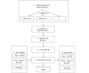

# MyBatis 面试知识点

## Hibernate 简介

### 什么是 Hibernate？

`Hibernate` 是一种 `ORM（Object Relational Mapping）` 框架，用于在 `Java` 对象和关系数据库之间建立某种映射，从而实现 `Java` 对象存取；

### Hibernate 优缺点

#### 优点

`Hibernate` 建立在 `POJO` 和数据库表模型的直接映射关系之上。通过 `XML` 或者注解就能和数据库表进行映射。通过 `POJO` 直接就能操作数据库中的数据，提供的是对于全表的映射模型。主要有如下优点：

1.  消除了代码映射规则，被分离到 `XML` 或注解中配置；
2.  配置在 `XML` 中后，无需再管理数据库连接；
3.  一个会话中，不用操作多个对象，只要操作 `Session` 对象即可；
4.  关闭资源只需关闭 `Session`；


#### 缺点

1.  由于是全表映射，所以某些操作不方便，比如更新需要发送所有字段；
2.  无法根据不同条件组装不同的 `SQL`；
3.  对多表关联和复杂 `SQL` 查询支持较差，需要自己写 `SQL`，返回后还需要自己将数据组成 `POJO`；
4.  不能有效支持存储过程；

## MyBatis 简介

### 什么是 MyBatis？

MyBatis 一款支持自定义 SQL 查询、存储过程和高级映射的持久层框架，消除了几乎所有 JDBC 代码和参数的手动配置以及结果集的检索。只需要使用 XML 或注解进行配置和映射，MyBatis 就能将参数映射到配置的 SQL 形成最终执行的 SQL 语句，最后将执行 SQL 的结果映射为 Java 对象返回；

### MyBatis 优缺点

####  优点

1.  小巧，学习成本低，会写 SQL 语句就能很快上手；
2.  无需过多配置 JDBC，主要专注 SQL 开发；
3.  方便维护管理，SQL 不用在 Java 代码中找，SQL 代码可以分离重用；
4.  灵活，支持动态 SQL；
5.  支持对象与数据库 ORM 字段关系映射；

#### 缺点

1.  主要工作集中在 SQL 开发，所以对 SQL 熟练度要求较高；
2.  移植性查，SQL 依赖于数据库，切换不同数据库会因语法差异而报错；

### MyBatis 和 Hibernate 的区别

####  相同点

均是对 JDBC 的封装，都是持久层的框架，用于 Dao 层的开发；

####  不同点

|           | 映射关系                                                     | SQL优化和移植性                                              | 开发难易程度和学习成本                     |
| --------- | ------------------------------------------------------------ | ------------------------------------------------------------ | ------------------------------------------ |
| Hibernate | 全自动映射，配置 Java 对象与数据库表的对应关系，多表关联关系配置复杂 | 对 SQL 语句封装，提供了日志、缓冲、级联等特性，此外还提供 HQL 操作数据库，数据库无关系支持好，但会多消耗性能 | 重量级，门槛高，适合需求稳定、中小型项目   |
| MyBatis   | 半自动映射，配置 Java 对象与 SQL 语句执行结果的对应关系，多表关联关系配置简单 | 需要手动编写 SQL，支持动态 SQL、处理列表、动态生成表名、支持存储过程；开发工作量相对较大，直接使用 SQL 语句操作数据库，不支持数据库无关性，但 SQL 语句优化容易 | 轻量级，门槛低，适合需求变化频繁、大型项目 |

Hibernate 属于全自动的 ORM 映射工具，使用 Hibernate 查询关联对象或关联集合对象时，能根据对象关系模型直接获取，所以说它是全自动的；

而 MyBatis 属于半自动 ORM 映射工具，因为在查询关联对象或关联集合对象时，需要自己手动编写 SQL 来完成；

## 解析和运行原理

###  MyBatis 核心组件

1.  **构造器**：`SqlSessionFactoryBuilder`，根据配置信息或点来生成 `SqlSessionFactory`；
2.  **工厂接口**：`SqlSessionFactory`，依靠工厂来生成 `SqlSession`；
3.  **会话**：`SqlSession`，是一个既可以发送 SQL 去执行返回结果，也可以获取 `Mapper` 接口；
4.  **SQL Mapper**：新设计的组件，由一个 Java 接口和 XML 文件（或注解）构成，需要给出对象的 SQL 和映射规则。负责发送 SQL 去执行，并返回结果；

### MyBatis 编程步骤

1.  创建 `SqlSessionFactory`；
2.  通过 `SqlSessionFactory` 创建 `SqlSession`；
3.  通过 `SqlSession` 执行数据库操作；
4.  调用 `session.commit()` 提交事务；
5.  调用 `session.close()` 关闭会话；

###  MyBatis 工作原理



1.  **首先读取 `MyBatis` 配置文件**：`mybatis-config.xml`，它是 MyBatis 的全局配置文件，配置了 MyBatis 的运行环境等信息；
2.  **接着加载映射文件**，即 SQL 映射文件，其中配置了操作数据库的 SQL 语句，需要在 MyBatis 配置文件 `mybatis-config.xml` 中加载。它可以加载多个映射文件，每个文件对应数据表中的一张表；
3.  **构造会话工厂**，通过 `mybatis` 的环境等配置信息构建会话工厂 `SqlSessionFactory`；
4.  **创建会话对象**，由会话工厂创建  `SqlSession` 对象，该对象包含执行 SQL 语句的所有方法；
5.  **`Executor` 执行器**，MyBatis 底层定义了一个 Executor 接口来操作数据库，它根据 `SqlSession` 传递的参数动态生成所需执行的 SQL 语句，同时负责查询缓存的维护；
6.  **`MappedStatement` 对象**，在 `Executor` 接口的执行方法中有一个 `MappedStatement` 类型的参数，该参数是对映射信息的封装，用于存储要映射的 SQL 语句的 `id`，参数等信息；
7.  **输入参数映射**，输入参数类型可以是 Map、List 等集合类型，也可以是基本数据类型和 POJO 类型，此过程类似于 JDBC 对 `preparedStatement` 对象设置参数的过程；
8.  **输出结果映射**，输出结果类型可以是 Map、List 等集合类型，也可以是基本数据类型和 POJO 类型，此过程类似于 JDBC 对结果集的解析过程；

##  映射器

###  ${} 和 #{} 的区别

1.  `${}` 是拼接符，字符串替换，无预编译处理；`#{}` 是占位符，预编译处理；
2.  处理 `#{}` 时，传入参数以 **字符串传入**，会将 SQL 中的 `#{}` 替换为 `?` ，调用 `PreparedStatement` 中的 `set` 方法来赋值；
3.  处理 `${}` 时，是 **原值传入**，会将 `${}` 替换为变量的值，相当于 JDBC 中的 `Statement` 编译；
4.  变量替换后 ，`#{}` 对应变量自动加上单引号 `‘’`，而 `${}` 对应变量不会加单引号 `‘’`；
5.  `#{}` 能有效防止 SQL 注入，提高系统安全性，原因在于 **预编译机制**，预编译完成后，SQL 的结构已经固定，即使用户输入非法参数，也不会对 SQL 结构产生影响，从而避免潜在的安全风险；但 `${}` 不能防止 SQL 注入；
6.  `#{}` 的变量替换是在 DBMS 中；`${}` 的变量替换是在 DBMS 外；

**预编译定义**：预编译是提前对 SQL 语句进行编译，而后注入的参数不会再进行 SQL 编译；而一般 SQL 注入是发生在编译过程中，因为恶意注入了某些特殊字符，最后被编译为了恶意的执行操作，而预编译机制则能很好的防止 SQL 注入；

**SQL 注入定义**：Sql 注入攻击是通过将恶意的 Sql 查询或添加语句插入到应用的输入参数中，再在后台 Sql 服务器上解析执行进行的攻击；主要有 **广泛性、隐蔽性、危害大、操作方便** 等特点；

###  模糊查询 like

1.  `'%{question}%'` 可能引起 SQL 注入，不推荐使用；
2.  `"%{question}%"`，因为 `#{}` 在解析时会在最外侧自动加单引号，所以外层需要使用双引号，不能使用单引号，否则将查询不到任何结果；
3.  `CONCAT('%', #{question}, '%')`，使用 `CONCAT()` 函数，推荐使用；
4.  使用 `bind` 标签；

```java
<select id="user" resultType="com.cunyu.User">
	<bind name="pattern" value = "'%' + userName + '%'"/>
    SELECT id, sex, age, username, password from persion where username LIKE #{pattern}
</select>
```

### mapper 中如何传递多个参数

1.  **顺序传参**

`#{}` 中的数字代表传入参数的顺序，不推荐使用，因为 SQL 层表达不直观，而且一旦顺序跳转则容易出错；

```java
public User selectUser(String name, int id);

<select id="selectUser" resultMap="UserResultMap">
    SELECT * FROM user WHERE user_name = #{0} and id = #{1}
</select>
```

2.  **@Param 注解传参**

`#{}` 中的名称对应注解 `@Param` 括号中修饰的名称，是更加推荐的一种方式；

```java
public User selectUser(@Param("name") String name, @Param("id") int id);

<select id="selectUser" resultMap="UserResultMap">
    SELECT * FROM user WHERE user_name = #{name} and id = #{id}
</select>
```

3.  **Map 传参**

`#{}` 中的名称对应的是 Map 中的 `key` 名称，适合传递多个参数，且参数易变且能灵活传递的情况；

```java
public User selectUser(Map<String, Object> params);

<select id="selectUser" resultMap="UserResultMap">
    SELECT * FROM user WHERE user_name = #{name} and id = #{id}
</select>
```

4.  **Java Bean 传参**

`#{}` 中名称对应的是类中的成员属性，通过这种方法更加直观，代码可读性强、业务逻辑处理方便；

```java
public User selectUser(User user);

<select id="selectUser" parameterType="com.cunyu.pojo.User" resultMap="UserResultMap">
    SELECT * FROM user WHERE user_name = #{name} and id = #{id}
</select>
```

### MyBatis 批量操作

####  使用 foreach 标签

`foreach` 主要用于构建 `in` 条件中，可以在 SQL 语句中进行迭代一个集合。`foreach` 标签的属性主要有 `item、index、collection、open、separator、close`；

| 标签         | 说明                                                         |
| ------------ | ------------------------------------------------------------ |
| `item`       | 表示集合中每个元素进行迭代时的别名，随便取的变量名           |
| `index`      | 指定一个名字，用于表示在迭代过程中，每次迭代到的位置         |
| `collection` | 必须指定，但在不同情况下的值不一样：<br />1. 若传入单参数且参数类型是 `List`，则其属性值为 `list`<br />2. 若传入单参数且参数类型是一个数组，则其属性置为 `array`<br />3. 若传入参数是多个时，需要将其封装为一个 `Map` |
| `open`       | 表示该语句以什么开始，常用 `(`                               |
| `separator`  | 表示在每次进行迭代之间以何种符号作为分隔符，常用 `,`         |
| `close`      | 表示该语句以什么结束，常用 `)`                               |

#### 使用 ExecutorType.BATCH

MyBatis 内置的 `ExecutorType` 有 3 种，默认为 `simple`，此时它为每个语句的执行创建了一个新的预处理语句，单挑提交 SQL；而 `batch` 模式重复使用已预处理的语句，且批量执行所有更新数据，其性能比 `batch` 更优；

## MyBatis 分页及原理

MyBatis 内部是通过 `RowBounds` 对象进行分页，它是针对 `ResultSet` 结果集执行的内存分页，而非物理分页，可以直接编写带物理分页的参数的 SQL 实现分页，也可以 MyBatis 的分页插件  Page-Helper；

**分页插件的基本原理：** 使用 MyBatis 所提供的插件接口，实现自定义插件，在插件的拦截方法内拦截待执行的 SQL，然后重写 SQL，根据 `dialect` 方言，添加对应物理分页语句和物理分页参数；
