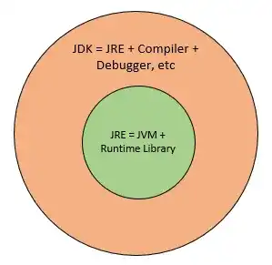
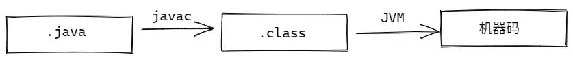
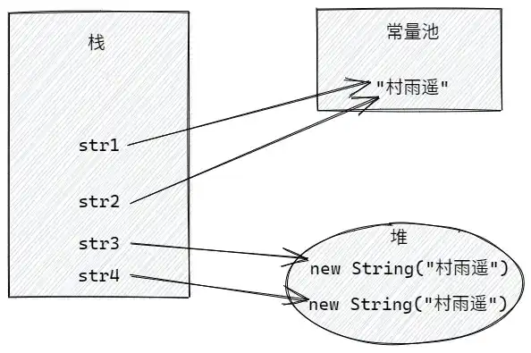
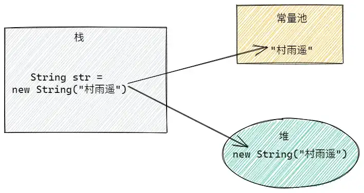
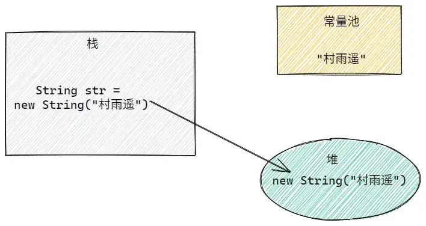
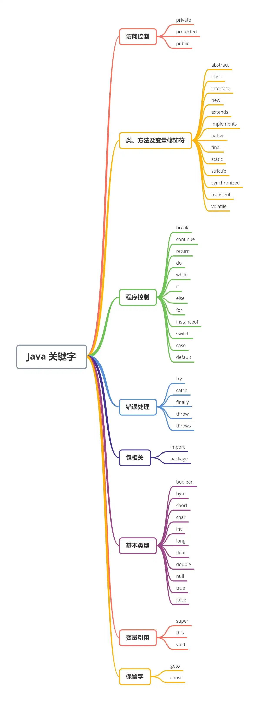
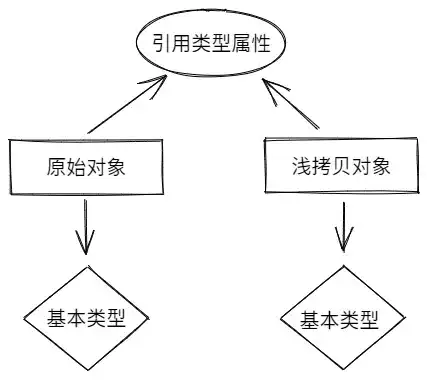
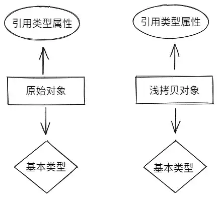

# Java 基础面试知识点

## 一个 Java 文件中是否可以存在多个类（修饰类除外）？

一个 Java 文件中是可以存在多个类的，但是一个 Java 文件中只能存在一个 `public` 所修饰的类，而且这个 Java 文件的文件名还必须和 `public` 所修饰类的类名保持一致，一个简单的实例如下。

```java
public class Person{
    private String name;
}

class Student{
    private Integer age;
}
```

## Java 有哪些特点？

1. 面向对象，具有封装、继承、多态三大特性
2. 平台独立，Java 通过 Java 虚拟机运行字节码，所以无论在哪个平台中，一旦进行编译后，都可以在其他平台运行。
3. 安全可靠
4. 支持多线程
5. 解释和编译共存
6. 安全性
7. 健壮性（Java 语言的强类型机制、异常处理、垃圾的自动收集等）

## Java 和 C++ 的区别

- **相同点**：两者均为 OOP（面向对象） 语言，均支持 OOP 的三大特性（封装、继承、多态）。
- **不同点**： 
    - Java 不存在指针的概念，所以内存更加安全。
    - Java 类是单继承（但是接口可以多继承），C++ 的类是多继承。
    - Java 中有自动内存管理机制，但是 C++ 中需要开发者手动释放内存。
    - C/C++ 中，字符串和字符数组最后均有一个额外的 `\0` 标志来表示结束，但 Java 中不存在这一概念。

## JRE  和 JDK 有什么不同。

- JRE：Java Runtime Environment，即 Java 运行时环境，是用来运行已经编译过的 Java 程序所需内容的集合（JVM、Java 类库、Java 命令等），不能用来开发新程序。
- JDK：Java Development Kit，即 Java 开发工具包，是功能齐全的 Java SDK，包含 JRE 拥有的一切，还有编译器和其他工具，如果我们想要创建和编译新程序，就必须使用到它。



## Java 程序编译过程



我们编译的源代码（`xxx.java`）经 JDK 中的 `javac` 命令编译后，成为 JVM 能够理解的 Java 字节码（`xxx.class`），然后经由 JVM 加载，通过解释器 **逐行解释执行**，这就是为什么能经常听见说 **Java 是一门编译和解释共存的语言**。

其中 JVM 是解释 Java 字节码（`xxx.class`） 的虚拟机，针对不同系统均有特定实现，方便一次编译，多次运行，即 Java 语言的平台独立性；

## 说一下 Java 中的数据类型

Java 中，数据类型主要包括 8 大基本数据类型和引用数据类型两大类。

### 基本数据类型

| 数据类型          | bit     | 字节   | 封装类      | 数据范围                     | 默认值 |
| ----------------- | ------- | ------ | ----------- | ---------------------------- | ------ |
| `byte`            | 8       | 1      | `Byte`      | $-2^7 \text{~} 2^7-1$             | `0`    |
| `short`           | 16      | 2      | `Short`     | $-2^{15} \text{~} 2^{15}-1$       | `0`    |
| `char`            | 16      | 2      | `Character` | `\\u0000`                    |        |
| ~ `\\uffff`       |         |        |             |                              |        |
| （$0 \text{~} 65535$） | `u0000` |        |             |                              |        |
| `int`             | 32      | 4      | `Integer`   | $-2^{31} \text{~} 2^{31}-1$       | `0`    |
| `long`            | 64      | 8      | `Long`      | $-2^{63} \text{~} 2^{63}-1$       | `0L`   |
| `float`           | 32      | 4      | `Float`     | $3.4e^{-45} \text{~} 1.4e^{38}$   | `0.0f` |
| `double`          | 64      | 8      | `Double`    | $4.9e^{-324} \text{~} 1.8e^{308}$ | `0.0D` |
| `boolean`         | 不确定  | 不确定 | `Boolean`   | `true`                       |        |
| 或 `false`        | `false` |        |             |                              |        |


**注意：**

1. `boolean` 一般用 1 `bit` 来存储，但是具体大小并未规定，JVM 在编译期将 `boolean` 类型转换为 `int`，此时 1 代表 `true`，`0` 代表 `false`。此外，JVM 还指出 `boolean` 数组，但底层是通过 `byte` 数组来实现;
2. 使用 `long` 类型时，需要在后边加上 `L`，否则将其作为整型解析，可能会导致越界；
3. 浮点数如果没有明确指定 `float` 还是 `double`，统一按 `double` 处理；
4. `char` 是用 **单引号 **`**‘’**` 将内容括起来，相当于一个整型值（ASCII 值），能够参加表达式运算；而 `String` 是用 **双引号 **`“”` 将内容括起来，代表的是一个地址值；

### 引用类型

| 数据类型 | 默认值 |
| -------- | ------ |
| 数组     | `null` |
| 类       | `null` |
| 接口     | `null` |


## 封装类

基本数据类型都有其对应的封装类，两者之间的赋值通过 **自动装箱** 和 **自动拆箱** 来完成；

- **自动装箱**：将基本数据类型装箱为封装类；

```java
// 实际调用 Integer.valueOf(12)
Integer x = 12;
```

- **自动拆箱**：将封装类拆箱为基本数据类型；

```java
Integer x = 12;
// 实际调用 x.intValue()
int y = x;
```

- **基本类型与对应封装类的不同** 
    1. 基本类型只能按值传递，封装类按引用传递；
    2. **基本类型** 会在 **栈** 中创建，效率较高，但可能存在内存泄露问题；**封装类对象会在堆中创建**，其 **引用在栈中创建；**

## 缓存池

以 `new Integer(123)` 和 `Integer.valueOf(123)` 为例：

- 通过 `new` 的方式每次都会创建一个新的对象；
- 通过 `valueOf()` 的方式则会优先判断该值是否位于缓存池，如果在的话就直接返回缓存池中的内容，多次调用指向同一个对象的引用；

```java
Integer x = new Integer(123);
Integer y = new Integer(123);
// false，通过 new 的方式，每次都会创建一个新对象，指向不同对象
System.out.println(x == y);    
Integer m = Integer.valueOf(123);
Integer n = Integer.valueOf(123);
// true，通过 valueOf（） 的方式，先到缓存池中查找，存在时则多次调用也是指向同一对象
System.out.println(m == n);
```

| 数据类型    | 默认缓存池       |
| ----------- | ---------------- |
| `Byte`      | $-2^7 \text{~} 2^7-1$ |
| `Character` | `\\u0000`        |
| ~ `\\u007F` |                  |
| `Short`     | $-2^7 \text{~} 2^7-1$ |
| `Integer`   | $-2^7 \text{~} 2^7-1$ |
| `Boolean`   | `true` & `false` |
|             |                  |


## 字符串 String

### 定义

```java
public final class String implements java.io.Serializable, Comparable<String>, CharSequence {
    /** The value is used for character storage. */
    private final char value[];
}
```

上述代码为 `Java 8` 中 `String` 的定义，其底层实际上使用的是字符（`char`）数组，而且由于被声明为 `final`，代表着它 **不能被继承**。而且一旦初始化之后就不能再去引用其他数组，这样就保证了 `String` 的不可变性，也因此 String 是线程安全的。

### 不可变性的优点

1. **用于缓存 **`**hash**`** 值**

由于 `String` 的 `hash` 值被频繁使用，它的不可变性使得 `hash` 值也不可变，此时只需要进行一次计算；

2. **字符串常量池（String Pool）的需要**

如果一个 `String` 对象已经被创建过，那么就会优先从字符串常量池中获取其引用，其不可变性确保了不同引用指向同一 `String` 对象；

3. **安全性**

我们经常用 `String` 作为我们方法的参数，其不变性能够保证参数不可变；

4. **线程安全**

`String` 的不可变性让它天生 **具备线程安全**，能够在多个线程中方便使用而不用考虑线程安全问题。

### String vs StringBuffer vs StringBuffer

主要从三个方面对三者进行对比：

|                 | 可变性 | 线程安全                               | 适用场景                                                     |
| --------------- | ------ | -------------------------------------- | ------------------------------------------------------------ |
| `String`        | 不可变 | 安全                                   | 操作少量的数据                                               |
| `StringBuffer`  | 可变   | 安全，内部使用 `synchronized` 进行同步 | 多线程操作字符串缓冲区下操作大量数据                         |
| `StringBuilder` | 可变   | 不安全                                 | 单线程操作字符串缓冲区下操作大量数据，性能高于 `StringBuffer` |


### 字符串常量池（String Pool）

String Pool 位于 **方法区**，通常保存着所有 [字符串字面量（literal strings）](https://baike.baidu.com/item/%E5%AD%97%E9%9D%A2%E9%87%8F)，在编译期间就被确定。此外，还可以用 `String` 中的 `intern()` 方法在运行过程中添加到 `String Pool` 中。当一个字符串调用 `intern()` 时，如果 `String Pool` 中已经存在字面量相同的字符串，则会返回 `String Pool` 中的引用；如果不存在，则向 `String Pool` 中添加一个新的字符串，同时返回新字符串的引用。

```java
String s1 = new String("aaa");
String s2 = new String("aaa");
// false 两个字符串指向不同对象
System.out.println(s1 == s2);   

String s3 = s1.intern();
String s4 = s1.intern();
// true，常量池中存在字面量相同的字符串，直接取出
System.out.println(s3 == s4);
```

在下面的代码中，内存分析如下图：

```java
String str1 = "村雨遥";
String str2 = "村雨遥";
String str3 = new String("村雨遥");
String str4 = new String("村雨遥");

// true，两个引用指向常量池中的同一对象
System.out.println(str1 == str2);
// false，两个引用指向堆中不同对象
System.out.println(str3 == str4);
```



### new String(“xxx”)

使用 `new` 的方式创建字符串对象，会有两种不同的情况：

1. **String Pool 中不存在 “xxx”**

此时会创建两个字符串对象，“xxx” 属于字符串字面量，因此在编译期会在 String Pool 中创建一个字符串对象，用于指向该字符串的字面量 “xxx”；然后 `new` 会在堆中创建一个字符串对象；



2. **String Pool 中存在 “xxx”**

此时只需要创建一个字符串对象，由于 String Pool 中已经存在指向 “xxx” 的对象，所以直接在堆中创建一个字符串对象；



## 基础语法

### 注释

- **单行注释**

```java
// 这是单行注释
String name = "村雨遥";
```

- **多行注释**

```java
/*
* 这是多行注释
* name，公众号
*/
String name = "村雨遥";
```

- **文档注释**

```java
/**
* @author : 村雨遥
* @param : name，公众号
*/
String name = "村雨遥";
```

### 常见关键字



### 标识符和关键字

- **标识符**：用于给程序、类、对象、变量、方法、接口、自定义数据类型等命名；
- **关键字**：特殊的标识符，被 Java 赋予了特殊含义，只能有特定用途；
- **标识符命名规则**（可以参考《阿里巴巴开发手册》，关注公众号【**村雨遥**】回复【资源下载】下载 PDF） 
    1. 标识符由英文字符大小写（a - z, A - Z）、数字（0 - 9）、下划线（`_`）和美元符号（`$`）组成；
    2. 不能以数字开头，不能是关键字；
    3. 严格区分大小写；
    4. 包名：多个单词组成是所有单词均小写；
    5. 类名和接口：大写驼峰命名法；
    6. 变量名和函数名：多个单词组成时，第一个单词全小写，其他单词采用大写驼峰命名法；
    7. 常量名：字母全部大写，单词之间用下划线（`_`）分割；

## 说一下 Java 中的访问控制

Java 主要提供了 3 中访问修饰符 `public`、`protected`、`private`，但实际使用过程中，一共可以形成 4 种访问权限，分别是 `public`、`protected`、`private`、`default`，其中 `default` 是不加任何修饰符时的访问权限。关于 4 种访问权限的对比如下表，✅ 表示可以访问，❌ 表示不可访问。

| 作用域 | 当前类 | 同一 `package` 的类 | 子类 | 其他 `package` 的类 |
| --- | --- | --- | --- | --- |
| `public` | ✅ | ✅ | ✅ | ✅ |
| `protected` | ✅ | ✅ | ✅ | ❌ |
| `default` | ✅ | ✅ | ❌ | ❌ |
| `private` | ✅ | ❌ | ❌ | ❌ |


### static、final、this、super

1. **static**

`static` 主要有如下 4 中使用场景：

- **修饰成员变量和成员方法**：被 `static` 修饰的成员属于类，属于静态成员变量，存储在 Java 内存中的 **方法区**，不属于单个对象，被所有对象共享，而且最好通过 `类名.静态成员名/静态方法名()` 调用；
- **静态代码块**：定义在类中方法外，先于非静态代码块之前执行（**静态代码块 -> 非静态代码块 -> 构造方法**） ，而且不管执行多少次创建新对象的操作，静态代码只执行一次；
- **静态内部类**：`static` 要修饰类时，只有修饰内部类这一种用法。非静态内部类在编译后会隐含保存一个引用，用于指向创建它的外部类，但是静态内部类不存在。即内部类的创建不用依赖外围类的创建，同时内部类也只能使用任意外部类的 `static` 成员变量和方法；
- **静态导包**：用于导入静态资源，`import static` 用于指定导入某一类中的静态资源，然后我们就可以直接使用类中的静态成员变量和方法；
- **注意：** 
    - `abstract` 方法不能同时是 `static` 的，因为 `abstract` 方法需要被重写，但 `static` 方法不可以；
    - 不能从 `static` 方法内部发出对非静态方法的调用，因为静态方法只能访问静态成员，而非静态方法的调用需要先创建对象；
    - `static` 不能用于修饰局部变量；
    - 内部类与静态内部类的区别：静态内部类相对外部类是独立存在的，在静态内部类中无法直接访问外部类中变量和方法。如果要进行访问，则必须 `new` 一个外部类对象，使用该对象来进行访问，但对于静态变量和静态方法，能够直接调用。而普通的内部类作为外部类的一个成员而存在，能够直接访问外部类属性，调用外部类方法。

2. **final**

- 修饰类时，被修饰的类不能被继承，而且类中所有成员方法均被隐式指定为 `final` 方法；
- 修饰方法时，表明该方法无法被重写；
- 修饰变量时，说明该变量是一个常量。若变量为基本数据类型，则一旦初始化后不能再改变；若变量是引用类型，则初始化后不能指向其他对象。

3. **this**

用于引用类的当前实例，比如我们最常用的构造方法中，注意不能用在 `static` 方法中；

```java
public class User{
    int age;
    
    public User(int age){
        this.age = age;
    }
}
```

其中 `this.age` 说明访问的是 `User` 类中的成员变量，而后面的 `age` 则代表传入的形参；

4. **super**

用于从子类访问父类中的变量和方法，注意不能用在 `static` 方法中。

```java
public class Father{
    String name;
    
    public Father(String name){
        this.name = name;
    }
    
    public Father(){
    }
}
```


```java
public class Son extends Father{
    public Son(String name){
        super();
        this.name = name + ".jr";
    }
}
```

### continue、break 和 return

| 关键字     | 说明                                                         |
| ---------- | ------------------------------------------------------------ |
| `continue` | 用于循环结构，指跳出当前循环，进入下一次循环                 |
| `break`    | 用于循环结构，指跳出整个循环体，继续执行循环下面的语句       |
| `return`   | 1. `return ;`进行同步：直接用 `return` 结束方法执行，用于没有返回值函数的方法；<br />2. `return value;` ：`return` 一个特定值，用于有返回值函数的方法 |


### while 循环与 do 循环

`while` 循环结构在循环开始前会判断下一个迭代是否应该继续，可能一次循环体都不执行。

`do……while` 会在循环的结果来判断是否继续下一轮迭代，至少会执行一次循环体。

### final、finally、finalize

1. **final**

`final` 既是一个修饰符，也是一个关键字，修饰不同对象时，表示的意义也不一样。

- **修饰类：** 表示该类无法被继承；
- **修饰变量**：若变量是基本数据类型，则其数值一旦初始化后就不能再改变，若变量是引用类型，则在其初始化之后便不能再让其指向另一个对象，但其指向的对象的内容是可变的。
- **修饰方法**：表示方法无法被重写，但是允许重载，`private` 方法会隐式指定为 `final` 方法。

2. **finally**

- `finally` 是一个关键字，在异常处理时提供 `finally` 块来执行任何清除操作，无论是否有异常被抛出或捕获，`finally` 块均会被执行，通常用于释放资源。
- `finally` 正常情况下一定会被执行，但是在如下两种情况下不会执行： 
    - 对应的 `try` 未执行，则该 `try` 块的 `finally` 块并不会被执行；
    - 若 `try` 块中 JVM 关机，则 `finally` 块也不会执行；
- `finally` 中如果有 `return` 语句，则会覆盖 `try` 或 `catch` 中的 `return` 语句，导致两者无法 `return`，所以建议 `finally` 中不要存在 `return` 关键字；

3. **finallize**

`finallize()` 是 `Object` 类的 `protected` 方法，子类能够覆盖该方法以实现资源清理工作；

`GC` 在回收前均会调用该方法，但是 `finalize()` 方法存在如下问题：

- Java 语言规范不保证 `finalize()` 方法会被及时执行，也不保证他们一定被执行；
- `finalize()` 方法会带来性能问题，因为 JVM 通常在单独的低优先线程中完成 `finalize` 的执行；
- `finalize()` 方法中，可将待回收对象赋值给 `GC Roots` 可达的对象引用，从而达到对象再生的目的；
- `finalize()` 方法最多由 GC 执行一次（但是可以手动调用对象的 `finalize` 方法）；

## 运算符

### 算术运算

| 操作符 | 描述                              | 例子               |
| ------ | --------------------------------- | ------------------ |
| `+`    | 加法 - 相加运算符两侧的值         | A + B 等于 30      |
| `-`    | 减法 - 左操作数减去右操作数       | A – B 等于 -10     |
| `*`    | 乘法 - 相乘操作符两侧的值         | A * B等于200       |
| `/`    | 除法 - 左操作数除以右操作数       | B / A等于2         |
| `％`   | 取余 - 左操作数除以右操作数的余数 | B%A等于0           |
| `++`   | 自增: 操作数的值增加1             | B++ 或 ++B 等于 21 |
| `--`   | 自减: 操作数的值减少1             | B-- 或 --B 等于 19 |


**注意**：`++` 和 `--` 可以放在操作数之前，也可以放在操作数之后；**位于操作数之前时，先自增/减，再赋值；位于操作数之后，先赋值，再自增/减**；总结起来就是 **符号在前就先加/减，符号在后就后加/减**。

### 关系运算符

| 运算符 | 描述                                                         | 例子             |
| ------ | ------------------------------------------------------------ | ---------------- |
| `==`   | 检查如果两个操作数的值是否相等，如果相等则条件为真。         | （A == B）为假。 |
| `!=`   | 检查如果两个操作数的值是否相等，如果值不相等则条件为真。     | (A != B) 为真。  |
| `>`    | 检查左操作数的值是否大于右操作数的值，如果是那么条件为真。   | （A> B）为假。   |
| `<`    | 检查左操作数的值是否小于右操作数的值，如果是那么条件为真。   | （A <B）为真。   |
| `>=`   | 检查左操作数的值是否大于或等于右操作数的值，如果是那么条件为真。 | （A> = B）为假。 |
| `<=`   | 检查左操作数的值是否小于或等于右操作数的值，如果是那么条件为真。 | （A <= B）为真。 |


### 位运算符

| 操作符 | 描述                                                         | 例子                                     |
| ------ | ------------------------------------------------------------ | ---------------------------------------- |
| `＆`   | 如果相对应位都是 1，则结果为 1，否则为 0                     | $(A\text{＆}B)$，得到 12，即 0000 1100          |
| `|`    | 如果相对应位都是 0，则结果为 0，否则为 1                     | 如果相对应位都是 0，则结果为 0，否则为 1 |
| `^`    | 如果相对应位值相同，则结果为 0，否则为1                      | $(A ^ B)$得到 49，即 0011 0001           |
| `〜`   | 按位取反运算符翻转操作数的每一位，即 0 变成 1，1 变成 0。    | $( \text{~} A)$ 得到 -61，即1100 0011            |
| `<<`   | 按位左移运算符。左操作数按位左移右操作数指定的位数。         | $A << 2$ 得到 240，即 1111 0000          |
| `>>`   | 按位右移运算符。左操作数按位右移右操作数指定的位数。         | $A >> 2$ 得到 15 即 $1111$               |
| `>>>`  | 按位右移补零操作符。左操作数的值按右操作数指定的位数右移，移动得到的空位以零填充。 | $A >>> 2$ 得到 15 即 $0000 1111$         |


### 逻辑运算符

| 操作符 | 描述                                                         | 例子              |
| ------ | ------------------------------------------------------------ | ----------------- |
| `&&`   | 称为逻辑与运算符。当且仅当两个操作数都为真，条件才为真。     | `（A && B）`      |
| `|`    | 称为逻辑或操作符。如果任何两个操作数任何一个为真，条件为真。 | `（A | B）`为真。 |
| `!`    | 称为逻辑非运算符。用来反转操作数的逻辑状态。如果条件为true，则逻辑非运算符将得到false。 | `!(A && B)`       |
| 为真。 |                                                              |                   |


### 赋值运算符

| 操作符    | 描述                                                         | 例子                                     |
| --------- | ------------------------------------------------------------ | ---------------------------------------- |
| `=`       | 简单的赋值运算符，将右操作数的值赋给左侧操作数               | C = A + B将把A + B得到的值赋给C          |
| `+=`      | 加和赋值操作符，它把左操作数和右操作数相加赋值给左操作数     | C + = A等价于C = C + A                   |
| `-=`      | 减和赋值操作符，它把左操作数和右操作数相减赋值给左操作数     | C - = A等价于C = C - A                   |
| `*=`      | 乘和赋值操作符，它把左操作数和右操作数相乘赋值给左操作数     | C _ = A等价于C = C _ A                   |
| `/=`      | 除和赋值操作符，它把左操作数和右操作数相除赋值给左操作数     | C / = A，C 与 A 同类型时等价于 C = C / A |
| `％=`     | 取模和赋值操作符，它把左操作数和右操作数取模后赋值给左操作数 | C％= A等价于C = C％A                     |
| `<< =`    | 左移位赋值运算符                                             | C << = 2等价于C = C << 2                 |
| `>>=`     | 右移位赋值运算符                                             | C >> = 2等价于C = C >> 2                 |
| `＆=`     | 按位与赋值运算符                                             | C＆= 2等价于C = C＆2                     |
| `^=`      | 按位异或赋值操作符                                           | C ^ = 2等价于C = C ^ 2                   |
| `&#124;=` | 按位或赋值操作符                                             | C &#124; = 2等价于C = C &#124; 2         |


### 条件运算符（? :）

也叫作三元运算符，共有 3 个操作数，且需要判断布尔表达式的值；

```java
variable x = (expression) ? value if true : value if false
```

### instanceof

用于操作对象实例，检查该对象是否是一个特定类型（类类型或接口类型）；

```java
( Object reference variable ) instanceof  (class/interface type)
```

### equals() 和 ==

- `==`

基本数据类型用 `==` 比较的是值，用于引用数据类型时判断两个对象的内存地址是否相等，即两对象是否是同一个对象；

> 本质来讲，由于 Java 中只有值传递，所以不管是基本数据类型还是引用数据类型，比较的其实都是值，只不过引用类型变量存的值是对象的地址；


- `equals()`

作用也是判断两个对象是否相等，但是 **不能用于基本数据类型变量的比较**。存在于 `Object()` 类中，所以所有类都具有 `equals()` 方法存在两种使用情况：

1. **类未覆盖 **`**equals()**`** 方法**：此时通过 `equals()` 比较该类的两个对象时，等价于 `==` 比较这两个对象，默认使用  `Object` 类中的 `equals()` 方法；
2. **类覆盖了 **`**equals()**`** 方法**：一旦覆盖了该方法，则用来比较两个对象的内容是否相等，如我们常用的 `String、BitSet、Data、File` 就覆盖了 `equals()` 方法；

## 方法

### 方法的类型

1. 无参无返回值；
2. 无参有返回值；
3. 有参无返回值；
4. 有参有返回值；

### 重载和重写

1. **重载（Overload）**

重载就是同样方法能够根据输入的不同，做出不同的处理。重载发生在 **编译期**，而且在同一个类中，**方法名必须相同，参数类型、参数个数、参数顺序不同，返回值和访问修饰符可以不同。** 总的而言：**重载就是同一类中多个同名方法根据不同传参来执行不同的逻辑处理。**

2. **重写（Override）**

重写是当子类继承自父类的相同方法，输入数据一样，但最终响应不同于父类。重写发生在 **运行期**，是子类对父类允许访问的方法的实现逻辑进行改写。重写方法的方法名、参数列表以及返回值必须相同，抛出的异常范围不超出父类，访问修饰符的范围也不能小于父类。此外，若父类方法别 `private/final/static` 修饰，则子类无法重写父类方法，但 `static` 修饰的方法能被再次声明。**构造方法是个特例，不能被重写**。总结起来就是：**重写即子类对父类方法的改造，外部样子不能改变，但能够改变内部逻辑**。

3. **重载 vs 重写**

| 不同点     | 重载     | 重写                                         |
| ---------- | -------- | -------------------------------------------- |
| 参数列表   | 必须不同 | 必须相同                                     |
| 返回类型   | 可不同   | 必须相同                                     |
| 访问修饰符 | 可不同   | 不能比父类更严格                             |
| 发生范围   | 同一类中 | 父子类                                       |
| 异常范围   | 可修改   | 可以减少或删除，不能抛新异常或范围更广的异常 |
| 发生阶段   | 编译期   | 运行期                                       |


### 深/浅拷贝

1. **浅拷贝**

浅拷贝是 **按位拷贝对象，会创建一个新对象，该对象具有原始对象属性值的精确拷贝。** 若属性是基本类型，则拷贝的是基本类型的值；若属性是引用类型（内存地址），则拷贝的是内存地址。因此，一旦其中任一对象改变了该引用类型属性，均会影响到对方；



2. **深拷贝**

深拷贝会 **拷贝所有属性，同时拷贝属性指向的动态分配的内存**。当对象和它引用的对象一起拷贝是即发生深拷贝，**相比于浅拷贝，深拷贝速度较慢同时花销更大**。



3. **总结**

浅拷贝后，改变其中任一份值都会引起另一份值的改变；而深拷贝后，改变其中任何一份值，均不会对另一份值造成影响；

### 值传递

推荐阅读：[https://juejin.im/post/5bce68226fb9a05ce46a0476](https://juejin.im/post/5bce68226fb9a05ce46a0476)

#### 形参和实参

1. **形参**：方法被调用时需要传递进来的参数，如 `func(String name)` 中的 `name` 就是一个形参，只有在 `func` 被调用时 `name` 才被分配内存空间，当方法执行完后，`name` 将自动销毁释放空间；
2. **实参**：方法调用时传入的实际值，在方法调用前就已经被初始化且在方法调用时被传入；

```java
public static void func(String name){
    System.out.println(name);
}

public static void main(String[] args) {
    //实参
    String name = "村雨遥";
    func(name);
}
```

#### 值传递和引用传递

1. **值传递**

方法被调用时，实参通过形参将其内容副本传入方法内部，此时形参接收的内容实际上是实参的一个拷贝，因此在方法内对形参的任何操作均只针对于实参的拷贝，不会影响到实参原始值的内容。即 **值传递的是实参的一个副本，对副本的操作不会影响实参原始值，也即无论形参如何变化，都不会影响到实参的内容。**

```java
public static void valueCrossTest(int age,float weight){
    System.out.println("传入的age："+age);
    System.out.println("传入的weight："+weight);
    age=33;
    weight=89.5f;
    System.out.println("方法内重新赋值后的age："+age);
    System.out.println("方法内重新赋值后的weight："+weight); 
}

public static void main(String[] args) {
    int a=25;
    float w=77.5f;
    valueCrossTest(a,w);

    // a = 25，原始值不收影响
    System.out.println("方法执行后的age："+a);
    // w = 77.5，原始值不收影响
    System.out.println("方法执行后的weight："+w)
}
```

2. **引用传递**

引用即指向真实内容的地址值，在方法调用时，**实参的地址被传递给相应形参，在方法体内，形参和实参指向同一个地址内存，因此此时操作形参也会影响到实参的真实内容。**

但 Java 中并 **不存在引用传递**，因为 **无论是基本类型还是引用类型，在实参传入形参时，均为值传递，即传递的都是一个副本，而非实参内容本身**。

3. **总结**

**如果是对基本数据类型的数据进行操作，由于实参原始内容和副本都是存储实际值，并且处于不同栈区，因此对形参的操作，实参原始内容不受影响。**

**如果是对引用类型的数据进行操作，分两种情况，**

- **一种是形参和实参保持指向同一个对象地址，则形参的操作，会影响实参指向的对象的内容。**

```java
public static void PersonCrossTest(Person person){
    System.out.println("传入的person的name：" + person.getName());
    person.setName("我是张小龙");
    System.out.println("方法内重新赋值后的name：" + person.getName());
}
```

- **另一种是形参被改动指向新的对象地址（如重新赋值引用），则形参的操作，不会影响实参指向的对象的内容。**

```java
public static void PersonCrossTest(Person person){
    System.out.println("传入的person的name：" + person.getName());
    person=new Person();
    person.setName("我是张小龙");
    System.out.println("方法内重新赋值后的name：" + person.getName());
}
```

## 面向对象

### 面向对象 vs 面向过程

推荐阅读：[https://www.zhihu.com/question/27468564/answer/757537214](https://www.zhihu.com/question/27468564/answer/757537214)

- **面向对象（Object Oriented）**

面向过程是一种 **对现实世界理解和抽象的方法**，**更容易维护、复用、扩展**。最主要的特点就是 **继承、封装、多态**，所以 设计出的系统耦合性较低，但比起面向过程性能要低。

- **面向过程（Procedure Oriented）**

面向过程是一种 **以过程为中心** 的编程思想，以正在发生为主要目标进行编程，不同于面向的的是谁受影响。最主要的不同就在于 **封装、继承、多态**，其性能比面向对象更高。

- **总结**

面向对象的方式使得每个类都各司其职，最后整合到一起来共同完成一个项目，而面向过程则是让一个类中的功能越来越多，就像一个全栈工程师能够一个人搞定所有事。

### 封装、继承、多态

1. **封装**

将客观事物封装为抽象的类，同时类能把自己的数据和方法只让可信的类或对象进行操作，对不可信的类进行信息隐藏。即把属于同一类事物的共性（属性与方法）归到一个类，从而方便使用。

通过 封装，实现了 **专业分工**，将能实现特定功能的代码封装为独立实体，供我们在需要时调用。此外，封装还 **隐藏了信息以及实现细节**，使得我们通过访问权限权限符就能将想要隐藏的信息隐藏起来。

2. **继承**

可以使用现有类的所有功能，且无需重写现有类来进行功能扩展，即个性对共性的属性与方法的接受，并加入特性所特有的属性与方法。通过继承的新类叫做 **子类/派生类**，被继承的类叫做 **父类/基类/超类**，具有如下特点：

- **子类拥有父类对象所有属性和方法，但父类中的私有属性和方法，子类是无法访问的**；
- 子类可以对父类进行扩展；
- 子类可以用自己的方式来实现父类的方法；

3. **多态**

多态是允许 **将父对象设置为和一个或多个其子对象相等的技术**，赋值后，父对象能够根据指向的子类对象的特性以不同方式运作，即 **父类引用指向子类对象实例**，有 **重载和重写** 两种实现方式。具有如下特点：

- 对象类型不可变，但引用类型可变；
- 对象类型和引用类型之间有继承（类）/实现（接口）的关系；
- 方法具有多态性，但属性不具有；
- 若子类重写了父类方法，则真正执行的是子类覆盖的方法，若子类未覆盖父类方法，则调用父类的方法。

### 成员变量 vs 局部变量 vs 静态变量

| 不同                               | 语法                              | 存储位置     | 生命周期                                          | 初始化值                   | 调用方式 | 别名 |
| ---------------------------------- | --------------------------------- | ------------ | ------------------------------------------------- | -------------------------- | -------- | ---- |
| 成员变量                           | 1、 属于类                        |              |                                                   |                            |          |      |
| 2、能被访问控制符、`static、final` |                                   |              |                                                   |                            |          |      |
| 等修饰                             | 堆                                | 与对象共存亡 | 有，基本数据类型为对应默认值，而对象统一为 `null` | 对象调用                   | 实例变量 |      |
| 局部变量                           | 1、属于方法（方法中的变量或参数） |              |                                                   |                            |          |      |
| 2、不能被访问控制符及 `static`     |                                   |              |                                                   |                            |          |      |
| 修饰，但可以被 `final`             |                                   |              |                                                   |                            |          |      |
| 修饰                               | 栈                                | 与方法共存亡 | 无，必须定义赋值后使用                            |                            |          |      |
| 静态变量                           | 1、属于类                         |              |                                                   |                            |          |      |
| 2、被 `static`                     |                                   |              |                                                   |                            |          |      |
| 修饰，被所有类对象共用             | 方法区                            | 与类共存亡   | 同成员变量初始化值                                | 类名调用（推荐）、对象调用 | 类变量   |      |


### 构造方法的特点

1. 方法名与类名同名；
2. 无返回值，但不能用 `void` 关键字声明；
3. 生成类对象时自动执行，无需显式调用；

### 抽象类 & 接口

1. **接口**

-  接口中所有方法默认是 `public`，而且不能有实现（Java 8 之前，Java 8 开始可以有默认实现）； 
-  接口中所有变量均为 `static、final`，不能有其他变量； 
-  一个类可以实现多个接口（通过 `implements` 关键字），而且接口自身可以通过 `extends` 来扩展多个接口； 
-  接口是对行为的抽象，属于行为规范； 

2. **抽象类**

- 抽象类中既可以有抽象方法，也可以有非抽象的方法；
- 一个类只能实现一个抽象类；
- 抽象方法可以被 `public、protected、default` 修饰，但不能用 `private`，否则不能被重写；
- 抽象是对类的抽象，是一种模板设计；

### Object 类中常见方法

| 方法                                                         | 说明                                                         |
| ------------------------------------------------------------ | ------------------------------------------------------------ |
| `public final native Class<?> getClass()`                    | 用于返回当前运行时对象的 Class 对象，使用了final 关键字修饰，故不允许子类重写 |
| `public native int hashCode()`                               | 用于返回对象的哈希码，主要使用在哈希表中，比如 JDK 中的 HashMap |
| `public boolean equals(Object obj)`                          | 用于比较 2 个对象的内存地址是否相等，String 类对该方法进行了重写用户比较字符串的值是否相等 |
| `protected native Object clone() throws CloneNotSupportedException` | 用于创建并返回当前对象的一份浅拷贝。一般情况下，对于任何对象 x，表达式 x.clone() != x 为true，x.clone().getClass() == x.getClass() 为 true。Object 本身没有实现 Cloneable 接口，所以不重写clone方法并且进行调用的话会发生CloneNotSupportedException 异常 |
| `public String toString()`                                   | 返回类的名字@实例的哈希码的16进制的字符串。建议Object所有的子类都重写这个方法 |
| `public final native void notify()`                          | 不能重写。唤醒一个在此对象监视器上等待的线程(监视器相当于就是锁的概念)。如果有多个线程在等待只会任意唤醒一个 |
| `public final native void notifyAll()`                       | 不能重写。跟notify一样，唯一的区别就是会唤醒在此对象监视器上等待的所有线程，而不是一个线程 |
| `public final native void wait(long timeout) throws InterruptedException` | 不能重写。暂停线程的执行注意：sleep方法没有释放锁，而wait方法释放了锁 。timeout是等待时间，调用该方法后当前线程进入睡眠状态，知道如下时间发生： |

1. 其他线程调用该对象的 `notify()/notifyAll()`
    方法；
2. 时间间隔到了；
3. 其他线程调用了 `interrupt()`
    中断该线程； |
    | `public final void wait(long timeout, int nanos) throws InterruptedException` | 多了nanos参数，这个参数表示额外时间（以毫微秒为单位，范围是 0-999999）。 所以超时的时间还需要加上 nanos 毫秒 |
    | `public final void wait() throws InterruptedException` | 跟之前的 2 个 wait 方法一样，只不过该方法一直等待，没有超时时间这个概念 |
    | `protected void finalize() throws Throwable { }` | 实例被垃圾回收器回收的时候触发的操作 |


### hashCode & equals

推荐阅读：[https://juejin.im/post/5a4379d4f265da432003874c](https://juejin.im/post/5a4379d4f265da432003874c)

#### equals

1. 重写 `equals()` 方法的准则：

| 准则                       | 说明                     |
| -------------------------- | ------------------------ |
| **自反性**                 | 对任意非空引用值 `x`     |
| ，`x.equals(x)`            |                          |
| 应该返回 `true`            |                          |
| **对称性**                 | 对于任何非空引用值 `x`   |
| 和 `y`                     |                          |
| ，当 `y.equals(x)`         |                          |
| 返回 `true`                |                          |
| 时，`x.equals(y)`          |                          |
| 也应返回 `true`            |                          |
| **传递性**                 | 对于任何非空引用值`x、y` |
| 和 `z`                     |                          |
| ，如果 `x.equals(y)`       |                          |
| 返回 `true`                |                          |
| ， 并且 `y.equals(z)`      |                          |
| 返回 `true`                |                          |
| ，那么 `x.equals(z)`       |                          |
| 也应返回 `true`            |                          |
| **一致性**                 | 对于任何非空引用值 `x`   |
| 和  `y`                    |                          |
| ，多次调用 `x.equals(y)`   |                          |
| 始终返回 `true`            |                          |
| 或始终返回 `false`         |                          |
| ， 前提是对象上 `equals`   |                          |
| 比较中所用的信息没有被修改 |                          |
| **非空性**                 | 对于任何非空引用值 `x`   |
| ，`x.equals(null)`         |                          |
| 都应返回 `false`           |                          |


#### hashCode

`hashCode` 用于返回对象 `hash` 值，主要是为了加快查找的快捷性，因为 `hashCode()` 是 `Object` 类中的方法，所以所有 Java 类均有 `hashCode()`，在 `HashTable` 和 `HashMap` 这类的散列结构中，均是通过 `hashCode()` 来查找在散列表中位置，通过 `hashCode` 能够较快的茶道小内存块。

#### 为什么重写 `equals()` 必须重写 `hashCode()`

1. 若两个对象相等，则 `hashCode()` 一定也相同，因为 `equals()` 是绝对可靠的；
2. 两个对象相等，则两个对象分别调用 `equals()` 方法也返回 `true`；
3. 两个对象有相同的 `hashCode()`，他们不一定相等，因为 `hashCode()` 不是绝对可靠的；
4. 如果重写了 `equals()`，但保留 `hashCode()` 的实现不变，则可能出现两者相等，但 `hashCode` 却不一样；
5. 因此，一旦重写了 `equals()` 方法，则必须重写 `hashCode()`，`hashCode()` 的默认行为是对堆上的对象产生独特值。如果没有重写 `hashCode()`，则该 `class` 的两个对象无论如何都不会相等（即使这两个对象指向相同的数据）。

### 序列化与反序列化

#### 定义

- **序列化**：指将对象转换为字节序列的过程；
- **反序列化**：指将字节序列转换为目标对象的过程；

#### 需要序列化的场景

当 Java 对象需要在网络上传输或者持久化存储到文件中时，我们就需要对象进行序列化；

#### 如何实现序列化

要实现序列化，只需要让类实现 `Serializable` 接口即可，此时就标注该类对象能够被序列化；

针对类中某些数据不想序列化时，可以使用 `transient` 关键字来实现，例如：

```java
// 通过关键字 transient 修饰，表明不参与序列化
transient private String telephone;
```