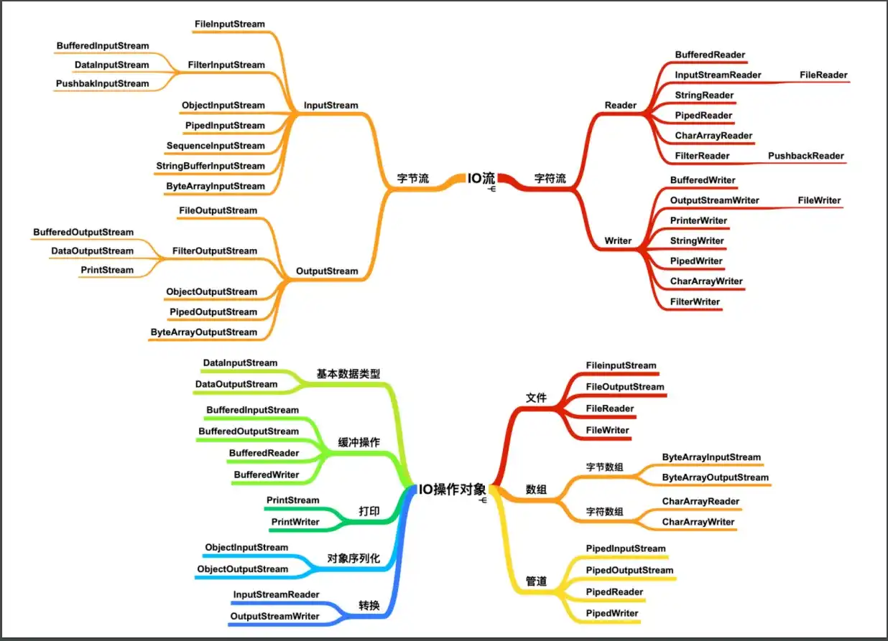
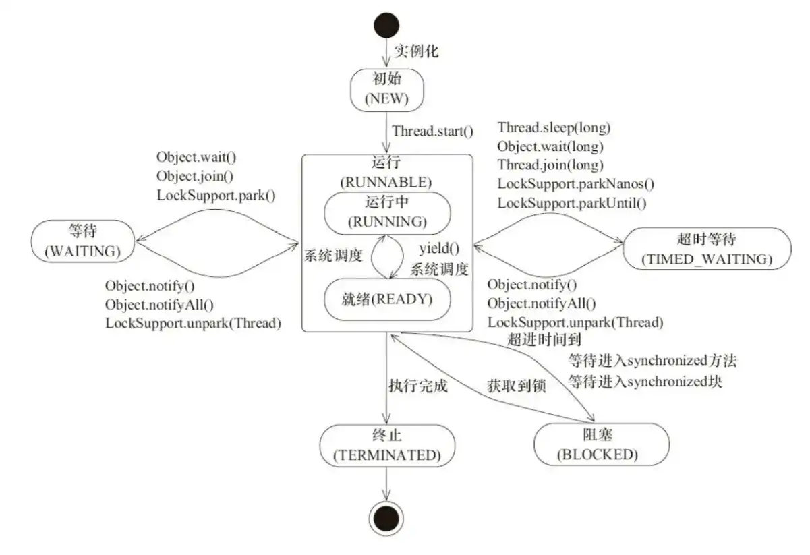
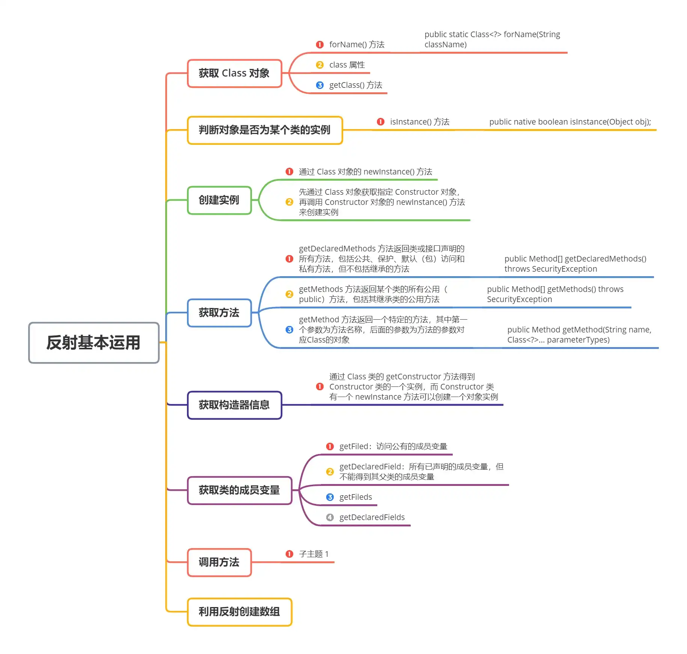

# Java 进阶面试知识点

## 异常

### 异常类层次结构


从结构图可以看出，所有异常均继承自 `Throwable` 类，它有两个重要的子类：`Exception` 和 `Error` ，各自又包含大量子类。

1. **Exception**

**程序本身可以处理的异常**，又可以分为 **受检异常** 和  **非受检异常** ，**受检异常** 可以用 `try...catch...` 语句进行捕获处理，而且能从异常中恢复。但 **非受检异常** 是程序运行时错误，会导致程序崩溃而无法恢复。

2. **Error**

**程序无法处理的错误**，表示程序运行过程中较严重的问题，大多与 coder 所做操作无关，而是代码运行时 JVM 出现的问题。此时说明故障发生于虚拟机本身、或者发生在虚拟机试图执行应用时。

### Throwable 常用方法

| 方法                                 | 说明                                                         |
| ------------------------------------ | ------------------------------------------------------------ |
| `public String getMessage()`         | 返回异常发生时的简要描述                                     |
| `public String toString()`           | 返回异常发生时的详细信息                                     |
| `public String getLocalizeMessage()` | 返回异常对象的本地化信息，若子类重写该方法，可以生成本地化信息，若未重写，则返回信息同 `getMessage()` |
| 方法                                 |                                                              |
| `public void printStackTrace()`      | 在控制台中打印异常对象封装的异常信息                         |


### try-catch-finally 和 try-with-resources

1. **try-catch-finally** 
    - **try** ：用于捕获异常，后接零个或多个 `catch`，没有 `catch` 则必须加上 `finally`；
    - **catch**：用于处理 `try` 捕获到的异常；
    - **finally**：无论是否捕获/处理异常，`finally` 块中内容均会执行，就算 `try` 或 `catch` 中有 `return` 语句，`finally` 中代码也将在方法返回之前执行；
2. **try-with-resources**

当我们有必须要关闭的资源时，建议优先使用 `try-with-resources`，这样写出的代码更加简短清晰。

3. **两者对比**

```java
// try-catch-finally
Scanner scanner = null;
try {
    scanner = new Scanner(new File("D:/demo.txt"));
    while (scanner.hasNext()) {
        System.out.println(scanner.nextLine());
    }
} catch (FileNotFoundException e) {
    e.printStackTrace();
} finally {
    if (scanner != null) {
        scanner.close();
    }
}
```

```java
// try-with-resources
try (Scanner scanner = new Scanner(new File("D:/demo.txt"))) {
    while (scanner.hasNext()) {
        System.out.println(scanner.nextLine());
    }
} catch (FileNotFoundException e) {
    e.printStackTrace();
}
```

## IO

### IO 流的定义

IO 流是一种数据的流从源头流到目的地，如文件拷贝操作，输入和输出流都包括了。输入流从文件中读取数据存储到进程，然后输出流从进程中读取数据写入到目标文件；

### IO 分类

Java IO 共涉及 40 多个类，均从如下 4 个抽象类中派生而来：

1. `InputStream`：所有输入流的基类，**字节输入流**
2. `OutputStream`：所有输出流的基类，**字节输出流**
3. `Reader`：所有输入流的基类，**字符输入流**
4. `Writer`：所有输出流的基类，**字符输出流**



### 字节流 vs 字符流

推荐阅读：[https://www.zhihu.com/question/39262026](https://www.zhihu.com/question/39262026)

1. **字节流**

`1 Byte = 8 bit`，**字节流处理的最基本单位为单个字节**，默认不使用缓冲区，而是直接操作磁盘文件，常用于处理音频、图片等媒体文件二进制数据；

2. **字符流**

`1 char = 2 Byte = 16 bit`，**字符流处理的最基本的单元是 Unicode 码元**，更适合对于操作需要通过 IO 在内存中频繁处理字符串的情况，因为字符流具有缓冲区，性能更高，常用于处理文本数据；

3. **有了字节流，为什么还要字符流？**

字节流由 JVM 将字节转换而来，但是该过程非常耗时，而且一旦编码未知就很容易导致乱码。为了解决这个问题，所以提供了一个直接操作字符的接口，从而方便我们对字符进行流处理。

### BIO、NIO 和 AIO

推荐阅读：[https://zhuanlan.zhihu.com/p/83597838](https://zhuanlan.zhihu.com/p/83597838)

1. **BIO (Blocking I/O)**

**BIO 特点**：就是 IO 执行的两个阶段用户进程都会阻塞住；

最传统的一种 IO 模型，在读写过程中会发生阻塞现象。当线程发出 IO 请求后，内核查看数据是否就绪，若未就绪就等待数据就绪，此时用户线程处于阻塞状态，用户线程交出 CPU。一旦数据准备就绪，内核就将数据拷贝到用户线程并返回结果给用户线程，此时用户线程才接触阻塞状态。

**同步阻塞** I/O 模式，数据的读取写入必须阻塞在一个线程内等待其完成。适合于连接数较小（小于单机 1000）且固定的框架，该方式对服务器资源要求较高，并发局限于应用中，是 JDK 1.4 之前唯一的选择。该模式让每一个连接专注于自己的 I/O 并且编程模型简单，也不用过多考虑系统的过载、限流等问题。

线程池本身就是一个天然的漏斗，可以缓冲一些系统处理不了的连接或请求。但是，当面对十万甚至百万级连接的时候，传统的 BIO 模型是无能为力的，因此，需要更加高效的模式来处理更高的并发量。

假设一个烧开水的场景，有一排水壶在烧开水，BIO 的工作模式就是， 一个线程对应一个水壶，在当前水壶烧开后，才去处理下一个水壶。但是实际上线程在等待水壶烧开的时间段什么都没有做。

总结而言，一个典型的读操作流程大致为：

- 用户进程调用 `recvfrom` 系统调用，内核此时开始 IO 第一阶段：**准备数据，将数据拷贝到内核缓冲区中**；
- 等到数据拷贝到操作系统内核缓冲区后，进入 IO 第二阶段：**将数据从内核缓冲区拷贝到用户内存，然后内核返回结果，用户进程才会解除 **`**block**`** 状态，重新运行起来**；

2. **NIO (Non-blocking/New I/O)**

**NIO 特点**：用户进程需要不断的主动询问内核数据准备好没有；

用户线程不断询问内核数据是否就绪，即 NIO 不会交出 CPU，而是一直占用 CPU，直到数据准备好。

NIO 是一种 **同步非阻塞** 的 I/O 模型，在 Java 1.4 中引入了 NIO 框架，对应 `java.nio` 包，提供了 Channel , Selector，Buffer 等抽象，适用于连接数目多且连接比较短（轻操作）的架构，比如聊天服务器。NIO 中的 N 可以理解为 `Non-blocking`，不单纯是 `New`。它支持 **面向缓冲** 的，**基于通道** 的 I/O 操作方法。

NIO 提供了与传统 BIO 模型中的 `Socket` 和 `ServerSocket` 相对应的 `SocketChannel` 和 `ServerSocketChannel` 两种不同的套接字通道实现,两种通道都支持阻塞和非阻塞两种模式。阻塞模式使用就像传统中的支持一样，比较简单，但是性能和可靠性都不好；非阻塞模式正好与之相反。对于低负载、低并发的应用程序，可以使用同步阻塞 I/O 来提升开发速率和更好的维护性；对于 **高负载、高并发的（网络）应用**，应使用 NIO 的非阻塞模式来开发。

还拿烧开水场景来说，NIO 的做法是让一个线程不断的轮询每个水壶的状态，看看是否有水壶的状态发生了改变，从而进行下一步的操作。

3. **AIO (Asynchronous I/O)**

AIO 中，**有一个线程不断去轮询多个 Socket 的状态，只有当 Socket 真正有读写事件时，才真正调用实际的 IO 读写操作**。

AIO 也就是 NIO 2，在 Java 7 中引入了 NIO 的改进版 NIO 2,它是 **异步非阻塞** 的 IO 模型，适合连接数目多且连接比较长（重操作）的架构，比如相册服务器。异步 IO 是基于事件和回调机制实现的，也就是应用操作之后会直接返回，不会堵塞在那里，当后台处理完成，操作系统会通知相应的线程进行后续的操作。

AIO 是异步 IO 的缩写，虽然 NIO 在网络操作中，提供了非阻塞的方法，但是 NIO 的 IO 行为还是同步的。对于 NIO 来说，我们的业务线程是在 IO 操作准备好时，得到通知，接着就由这个线程自行进行 IO 操作，IO 操作本身是同步的。

**AIO 比 NIO 效率高的原因在于在 NIO 中，不断询问 Socket 状态是通过用户线程去实现的，但在 AIO 中，轮询 Socket 状态是内核来进行的，效率比用户线程高**。

对应烧开水场景中就是，为每个水壶上面装了一个开关，水烧开之后，水壶会自动通知我水烧开了。

### 读取大数据量文件，如何选择流？

选用字节流时，选择 `BufferedInputStream` 和 `BufferedOutputStream`；

选用字符流时，选用 `BufferedReader` 和 `BufferedWriter`；

### NIO

#### NIO 与 IO 的区别？

| IO                             | NIO                                |
| ------------------------------ | ---------------------------------- |
| 面向流                         | 面向缓冲                           |
| 阻塞 IO                        | 非阻塞 IO                          |
| 无                             | 选择器                             |
| 少量连接，但每次要发送大量数据 | 大量连接，但连接每次只发送少量数据 |


NIO 是为了弥补传统 IO 不足而诞生，但也存在如下缺点：**因为 NIO 是面向缓冲区的操作，每次的数据处理均是对缓冲区进行的，所以在数据处理之前必须判断缓冲区的数据是否完整或已经读取完毕，如果没有，则假设数据只读取了一部分，对不完整的数据处理无任何意义。**

#### NIO 核心组件

1. NIO 核心组件可以分为如下三个： 
    - channel
    - buffer
    - selector
2. **channel**

一个 `channel` （通道）代表和某一实体的连接，该实体可以是文件、网络套接字等。即 NIO 中的 `channel` 相当于一个中介，用于程序和操作系统底层 I/O 服务进行交互；

一般最常用的通道实现有：

-  `FileChannel`：读写文件； 
-  `DatagramChannel`：UDP 协议网络通信； 
-  `SocketChannel` ：TCP 协议网络通信； 
-  `ServerSocketChannel`：监听 TCP 连接； 

3. **buffer**

NIO 中的缓冲区不是一个简单的 `byte` 数组，而是封装过的 `Buffer` 类，NIO 提供了 `ByteBuffer、CharBuffer、IntBuffer` 等，他们之间的区别在于读写缓冲区时的单位长度不一样；

`buffer` 有如下基本操作来进行读写数据：

- 将数据写入 `buffer`；
- 调用 `buffer.flip()`；
- 将数据从  `buffer` 中读取数据；
- 调用 `buffer.clean` 或 `buffer.compact()`；

4. **selector**

选择器是一个特殊组件，用于采集各个通道的状态。现将通道注册到选择器，并设置好关心的时间，然后就可以通过调用 `select()` 方法，等待事件发生即可；

## 集合

### Collections 工具类

`java.util.Collections` 工具类提供了许多常用方法，而且都是静态（`static`）的，可以分为如下几类：

1. **排序（主要针对 List 接口）**

| 方法                                   | 说明                                        |
| -------------------------------------- | ------------------------------------------- |
| `void reverse(List list)`              | 反转指定 `List`                             |
| 集合中元素的顺序                       |                                             |
| `void shuffle(List list)`              | 对 `List`                                   |
| 中的元素进行随机排序（洗牌）           |                                             |
| `void sort(List list)`                 | 对 `List`                                   |
| 里的元素根据自然升序排序               |                                             |
| `void sort(List list, Comparator c)`   | 自定义比较器进行排序                        |
| `void swap(List list, int i, int j)`   | 将指定 `List`                               |
| 集合中 `i`                             |                                             |
| 处元素和 `j`                           |                                             |
| 处元素进行交换                         |                                             |
| `void rotate(List list, int distance)` | 将所有元素向右移位指定长度，如果 `distance` |
| 等于 `size`                            |                                             |
| 那么结果不变                           |                                             |


2. **查找、替换（主要针对 Collection 接口）**

| 方法                                                         | 说明                                    |
| ------------------------------------------------------------ | --------------------------------------- |
| `int binarySearch(List list, Object key)`                    | 使用二分搜索法，以获得指定对象在 `List` |
| 中的索引，前提是集合有序                                     |                                         |
| `int max(Collection coll)`                                   | 返回最大元素                            |
| `int max(Collection coll, Comparator c)`                     | 根据自定义比较器，返回最大元素          |
| `int min(Collection coll)`                                   | 返回最小元素                            |
| `int min(Collection coll, Comparator c)`                     | 根据自定义比较器，返回最小元素          |
| `void fill(List list, Object obj)`                           | 使用指定对象填充 `List`                 |
| `int frequency(Collection c, Object o)`                      | 返回指定集合中指定对象出现的次数        |
| `int indexOfSubList(List list, List target)`                 | 统计 `target`                           |
| 在 `list`                                                    |                                         |
| 中第一次出现的索引，找不到则返回 -1                          |                                         |
| `boolean replaceAll(List list, Object oldVal, Object newVal)` | 替换                                    |


3. **同步控制**

| 方法                                      | 说明                                        |
| ----------------------------------------- | ------------------------------------------- |
| `synchronizedCollection(Collection<T> c)` | 返回指定 `collection`                       |
| 支持的同步（线程安全的）`collection`      |                                             |
| `synchronizedList(List<T> list)`          | 返回指定列表支持的同步（线程安全的）`List`  |
| `synchronizedMap(Map<K,V> m)`             | 返回由指定映射支持的同步（线程安全的）`Map` |
| `synchronizedSet(Set<T> s)`               | 返回指定 `set`                              |
| 支持的同步（线程安全的）`set`             |                                             |


4. **设置不可变集合**

| 方法                | 说明                                                         |
| ------------------- | ------------------------------------------------------------ |
| `emptyXxx()`        | 返回一个空的不可变的集合对象，此处的集合可以是 `List`        |
| 、`Set`             |                                                              |
| 、 `Map`            |                                                              |
| `singletonXxx()`    | 返回一个只包含指定对象（只有一个或一个元素）的不可变集合对象，此处的集合可以是 `List` |
| 、`Set`             |                                                              |
| 、 `Map`            |                                                              |
| `unmodifiableXxx()` | 返回指定集合对象的不可变视图，此处的集合既可以是`List`       |
| 、`Set`             |                                                              |
| 、 `Map`            |                                                              |


### Arrays 工具类

| 方法           | 说明         |
| -------------- | ------------ |
| `sort()`       | 排序         |
| `binarySearch` | 二分查找     |
| `equals()`     | 比较         |
| `fill()`       | 填充         |
| `asList()`     | 转换为列表   |
| `toString()`   | 转换为字符串 |
| `copyOf()`     | 复制         |


1. `sort()`

```java
// 数字排序
int[] a = {9, 8, 7, 2, 3, 4, 1, 0, 6, 5};
Arrays.sort(a);
for (int i = 0; i < a.length; i++) {
    System.out.print(a[i] + "\t");
}
System.out.println();

// 字符串排序
String[] a1 = {"a", "A", "b", "B"};
Arrays.sort(a1);
for (int i = 0; i < a1.length; i++) {
    System.out.print(a1[i] + "\t");
}
System.out.println();

// 字符串反向排序
String[] a2 = {"c", "C", "d", "D"};
Arrays.sort(a2, Collections.reverseOrder());
for (int i = 0; i < a2.length; i++) {
    System.out.print(a2[i] + "\t");
}
System.out.println();

// 数字反向排序，此时要使用封装类
Integer[] a4 = {9, 8, 7, 2, 3, 4, 1, 0, 6, 5};
Arrays.sort(a4, Collections.reverseOrder());
for (int i = 0; i < a.length; i++) {
    System.out.print(a4[i] + "\t");
}
System.out.println();

// 区间排序
int[] a5 = {9, 8, 7, 2, 3, 4, 1, 0, 6, 5};
Arrays.sort(a5, 3, 7);
for (int i = 0; i < a5.length; i++) {
    System.out.print(a5[i] + " ");
}
System.out.println();
```

2. `bianrySearch()`

```java
int[] b = new int[]{4, 43, 12, 312, 87, 21};
System.out.println("原数组为：");
for (int dim1 : b) {
    System.out.print("" + dim1 + " ");
}
// 排序
Arrays.sort(b);
System.out.println("\n排序后为：");
for (int x : b) {
    System.out.print(x + " ");
}
System.out.println();
int index = Arrays.binarySearch(b, 312);
System.out.println("关键字2的返回值为：" + index);
```

3. `equals()`

```java
String[] str1={"hello","world"};
String[] str2={"hello","world"};
System.out.println("Arrays.equals(e, f):" + Arrays.equals(str1, str2));
```

4. `fill()`

```java
Integer[] a = new Integer[10];
// 全部填充
Arrays.fill(a, 12);
System.out.println("当前数组容器："+Arrays.toString(a));

// 区间填充
// 填充的开始位
Integer startIndex = 1;
// 填充的结束位
Integer endIndex = 3;
Arrays.fill(a, startIndex, endIndex, 8);
System.out.println("当前数组容器："+Arrays.toString(a));
```

5. `asList()`

```java
Integer[] array1 = {5, 6, 9, 3, 2, 4};
List list = Arrays.asList(array1);
for (int i = 0; i < list.size(); i++) {
    System.out.print("\t" + list.get(i));
}
```

6. `toString()`

```java
String[] array02 = {"悟空", "八戒", "唐僧"};
System.out.println(array02);
System.out.println(Arrays.toString(array02));
```

7. `copyOf()`

```java
// array 和 array02 互不相干

int[] array = {5, 6, 9, 3, 2, 4};
System.out.println("array1的数组长度:" + array.length);
// 根据实际情况扩容
int[] array2 = Arrays.copyOf(array, array.length + 1);
System.out.println("array2的数组长度:" + array2.length);

array2[0] = 100;
System.out.println("array1:" + Arrays.toString(array));
System.out.println("array2:" + Arrays.toString(array2));
```

有关集合的更多内容，可以参看 [Java 容器知识点总结](4.Java%E5%AE%B9%E5%99%A8)。

## 泛型

推荐阅读：[https://juejin.im/post/5b614848e51d45355d51f792](https://juejin.im/post/5b614848e51d45355d51f792)

### 什么是泛型？使用泛型的好处？

泛型是 JDK 5 后引入的新特性，提供了 **编译期的类型安全检测机制**，确保将正确类型的对象放入集合，避免了运行时报 `ClassCastException`。其本质是 **参数化类型**，即所操作的数据类型被指定为一个参数。

**注意**：虽然编译期在编译过程中移除了参数的类型信息，但会保证类或方法内部参数类型的一致性；

### 泛型的工作机制？

类型擦除：指 Java 编译器生成的字节码不包含泛型信息；

泛型是通过 **类型擦除** 来实现，编译期在 **编译时擦除所有类型相关信息**，因此在运行时不存在任何类型相关的信息。我们无法在运行时访问到类型参数，因为编译器已经把泛型类型转换成了原始类型。

### 泛型的三种使用方式

- **泛型类**：通过传入不同类型的数据，可以存储相应类型的数据；

```java
// 一个泛型类声明如下，在实例化时，必须指定 T 的具体类型
public class Generic<T>{ 

    private T key;

    public Generic(T key) { 
        this.key = key;
    }
    
    public void setKey(T key){
        this.key = key;
    }

    public T getKey(){ 
        return key;
    }
}
```

- **泛型接口**：泛型接口未传入泛型实参时，与泛型类的定义相同，在声明类的时候，需将泛型的声明也一起加到类中；若泛型接口传入类型参数时，实现该泛型接口的实现类，则所有使用泛型的地方都要替换成传入的实参类型；

```java
// 一个泛型接口声明如下，要实现该接口，可以不指定具体类型，也可以指定具体类型
public interface Generator<T> {
    public T method();
}
```

```java
// 不指定具体类型
public class GeneratorImpl<T> implements Generator<T>{
	@Override
    public T method(){
        ...
    }
}
```

```java
// 指定具体类型
public class GeneratorImpl<T> implements Generator<String>{
	@Override
    public String method(){
        ...
    }
}
```

- **泛型方法**：可以存在泛型类中，也可以存在普通类中，**如果用泛型方法能够解决的问题，就尽量使用泛型方法**。

```java
// 一个具体的泛型方法声明如下，使用该方法时，我们可以传入不同类型的参数，提高复用率
public static < E > void printArray( E[] inputArray )
{         
    for ( E element : inputArray ){        
        System.out.printf( "%s ", element );
    }
    System.out.println();
}
```

### 泛型通配符？

- **T（type）**：表示具体的一个 Java 类型；
- **K V（key value）**：代表 Java 键值对；
- **E（element）**：代表 Element；
- **?**：表示不确定的 Java 类型；

### 限定通配符和非限定通配符？

**限定通配符** 对类型进行限制，分为两种（`<? extends T>` 和 `<? super T>`）.`<? extends T>` 通过确保类型必须为 `T` 的子类来设定类型的上界；而 `<? super T>` 通过确保类型必须是 `T` 的父类来设定类型的下界。泛型类型必须用限定内的类型来进行初始化，否则将导致编译错误。

**非限定通配符**，`<?>`，可以用任意类型来替代。

### 可以把 List 传递给一个接受 List

不可以，因为 `List<String>` 中只能用来存储 `String`，而  `List<Object>` 中却能存储任意类型的对象（`String、Integer` 等） 。

### Array 中是否可以使用泛型？

不可以，但是用 `List` 来代替 `Array`，因为 `List` 可以提供编译期的类型安全保证，但 `Array` 不能。

## 多线程

### 线程、进程、程序

推荐阅读：[https://juejin.im/post/5c932660f265da612524ad6d](https://juejin.im/post/5c932660f265da612524ad6d)

1. **程序**

程序是指令和数据的有序集合，其本身没有任何运行的含义，是一个**静态**的概念。

2. **线程**

有时被称为轻量进程(Lightweight Process，LWP），**是程序执行流的最小单元，是被系统独立调度和分派的基本单位**。线程是比进程更小的执行单位，一个进程在执行过程中可能会产生多个线程，但 **不同于进程是同类的多个线程共享同一块内存空间和一组系统资源**。

3. **进程**

进程是据有独立功能的程序在某个数据集合上的一次运行活动，**也是操作系统进行资源分配和保护的基本单位**，因此是动态的。

从 **原理** 角度上看：进程是支持程序执行的一种系统机制，对 CPU 上运行程序的活动规律进行抽象。

从 **实现** 角度看：进程是一种数据结构，用来准确的刻画运行程序的状态和系统动态变化状况。

系统运行一个程序即是一个进程从创建，运行到消亡的过程。简单来说，一个进程就是一个执行中的程序，它在计算机中一个指令接着一个指令地执行着，同时，每个进程还占有某些系统资源如 CPU 时间，内存空间，文件，输入输出设备的使用权等等。

换句话说，当程序在执行时，将会被操作系统载入内存中。 线程是进程划分成的更小的运行单位。**线程和进程最大的不同在于基本上各进程是独立的，而各线程则不一定**，因为同一进程中的线程极有可能会相互影响。

从另一角度来说，进程属于操作系统的范畴，主要是同一段时间内，可以同时执行一个以上的程序，而线程则是在同一程序内几乎同时执行一个以上的程序段。

### 线程基本状态

| 状态                         | 说明                                                         |
| ---------------------------- | ------------------------------------------------------------ |
| `NEW`                        | 初始状态，创建线程，但还未调用 `start()`                     |
| 方法                         |                                                              |
| `RUNNABLE`                   | 运行状态，“就绪” 和 “运行” 两种状态统称 “运行中”             |
| `BLOCKED`                    | 阻塞状态，表示线程阻塞于锁                                   |
| `WAITING`                    | 等待状态，线程进行等待状态，进入该状态表示当前线程需要等待其他线程做出通知或中断 |
| `TIME_WAITING`               | 超时等待状态，不同于 `WAITING`                               |
| ，经过指定时间后可以自行返回 |                                                              |
| `TERMINATED`                 | 终止状态，表示线程执行完毕                                   |




上图源自《Java 并发编程艺术》，可以看出一个线程的状态变迁过程：

线程创建后处于 `NEW` 状态，然后调用 `start()` 方法后开始运行，此时处于 `READY` 状态，接着一旦可运行状态的线程获得了 CPU 时间片之后，就处于 `RUNNING` 状态。如果线程执行了 `wait()` 方法，则进入 `WAITING` 状态。进入 `WAITING` 状态的线程池需要依靠其他线程的通知后才能返回 `RUNNING` 状态。而 `TIME_WAITING` 状态相当于在 `WAITING` 状态的基础上增加了超时限制，当超时后线程将自动返回 `RUNNABLE` 状态。当线程调用同步方法后，如果没有获取到锁，线程将进入 `BLOCKED` 状态。同时，如果线程执行了 `RUNNABLE` 的 `run()` 方法，线程将进入 `TERMINATED` 状态。

### 使用多线程的三种方式

1. **继承 Thread 类**

需要实现 `run()` 方法，其底层也实现了 `Runnable` 接口。当调用 `start()` 方法启动一个线程时，虚拟机会将该线程放入就绪队列中等待被调度，当一个线程被调度时会执行该线程的 `run()`方法。

```java
public class MyThread extends Thread{
    @Override
    public void run(){
        super.run();
        System.out.println("MyThread");
    }
}
```

```java
public class Main{
    public static void main(String[] args){
        MyThread myThread = new MyThread();
        myThread.start();
        System.out.println("运行结束");
    }
}
```

2. **实现 Runnable 接口**

使用 `Runnable` 实例再创建一个 `Thread` 实例，然后调用 `Thread` 实例中的 `start()` 方法来启动线程。

```java
public class MyRunnable implements Runnable {
    @Override
    public void run() {
        System.out.println("MyRunnable");
    }
}
```

```java
public class Run {

    public static void main(String[] args) {
        Runnable runnable=new MyRunnable();
        Thread thread=new Thread(runnable);
        thread.start();
        System.out.println("运行结束！");
    }

}
```

3. **实现 Callable 接口**

相比于 `Runnable`，`Callable` 可以有返回值，结果通过 `FutureTask` 进行封装；

```java
public class MyCallable implements Callable<Integer> {
    public Integer call() {
        return 123;
    }
}
```

```java
public static void main(String[] args) throws ExecutionException, InterruptedException {
    MyCallable myCallable = new MyCallable();
    FutureTask<Integer> futureTask = new FutureTask<>(myCallable);
    Thread thread = new Thread(futureTask);
    thread.start();
    System.out.println(futureTask.get());
    System.out.println("运行结束！");
    
}
```

### 线程优先级

每个线程都有各自优先级，默认情况下均为 `Thread.NORM_PRIORITY(5)`。线程优先级能在程序中表明该线程的重要性，若许多线程均处于就绪状态，系统就会根据优先级来决定哪一个线程优先进入运行状态。线程优先级均在 `Thread.MIN_PRIORITY(1)` 到 `Thread.MAX_PRIORITY(10)` 之间，数字越大，优先级越高，线程优先级有以下两个特点：

- **继承性**：如 A 线程启动 B 线程，则 B 线程的优先级和 A 线程一样；
- **随机性**：线程优先级高的不一定每次都先执行完，只能说是优先开始执行；

## 反射

推荐阅读：[https://zhuanlan.zhihu.com/p/80519709](https://zhuanlan.zhihu.com/p/80519709)

### 反射的定义及作用？

反射（`Reflection`）允许运行中的 Java 程序获取自身信息，并且可以操作类或对象的内部属性。**核心** 是 **JVM 在运行时才动态加载类或调用方法/访问属性，无需事先知道运行对象是谁**，主要提供如下功能：

- **运行时** 判断任意一个对象所属类；
- **运行时** 构造任意一个类的对象；
- **运行时** 判断任意一个类所具有的成员变量和方法；
- **运行时** 调用任意一个对象的方法；
- 生成动态代理

`Class` 和 `java.lang.reflect` 共同对反射提供了支持，`java.lang.reflect` 类库中主要包含了如下三个类：

- **Field**：用 `get()` 和 `set()` 方法来读取和修改 `Field` 对象相关联的成员属性；
- **Method**：利用 `invoke()` 方法调用与 `Method` 对象相关联的方法；
- **Constructor**：利用 `Construcctor` 中的 `newInstance()` 创建新的对象；

### 反射的优缺点

1. **静态和动态编译**

-  **静态编译**：在编译时确定类型，绑定对象 
-  **动态编译**：在运行时确定类型，绑定对象 

两者区别在于，动态编译能最大化支持多态，降低类的耦合性。

2. **优点**

-  运行时判断类，动态加载类，提高了代码的灵活度； 
-  最大化支持多态，降低类的耦合性； 

3. **缺点**

- **性能开销**：反射相当于一系列解释操作，告知 JVM 要做的事，比直接的代码要慢；
- **安全限制**：反射要求程序必须在一个无安全限制的环境下运行，如果一个程序必须要在安全的环境中运行，那么就无法应用反射了；
- **内部暴露**：我们虽然可以动态操作改变类的属性，但同时也暴露了类的内部；

### 反射的基本运用



### 如何利用反射创建对象

1. 通过 `Class.forName()` 获取一个对象；

```java
# 前提是已知类的全路径名
Class class2 = Class.forName("全限名");
```

2. 使用 `.class` 属性；

```java
# 前提是已知要操作的类
Class class2 = User.class;
```

3. 使用类对象的 `getClass()` 方法；

```java
User user = new User();
Class class3 = user.getClass();
```

### 反射中的一些注意事项

1. 反射会额外消耗一定系统资源，因此如果不需要动态创建一个对象，那么就尽量别用反射；
2. 反射调用方法时可以忽略权限检查，因此可能会破坏封装性而导致安全问题；

## 注解

推荐阅读：[https://www.cnblogs.com/acm-bingzi/p/javaAnnotation.html](https://www.cnblogs.com/acm-bingzi/p/javaAnnotation.html)

### 什么是注解？

Java 注解是附加在代码中的一些元信息，从 Java 5 开始引入的特性，用于一些工具在编译、运行时进行解析和使用，起着 **说明、配置的功能。**不会也不能影响代码实际逻辑，只起辅助性作用。

### 注解的用途？

1. 生成文档，比如 `@param、@return` 等用于给方法生成文档；
2. 跟踪代码依赖性，实现替代配置文件功能；
3. 在编译时进行格式检查，如 `@Override` 放在方法前，表明该方法要覆盖父类方法；

### 注解的原理？

注解实质上是继承了 `Annotation` 的特殊接口，具体实现类是 Java 运行时生成的动态代理类。当我们通过反射机制获取注解的时候，返回的是 Java 运行时所生成的动态代理对象。通过该代理对象来调用自定义注解（方法）的方法，最终会调用 `AnnotationInvocationHandler` 的 `invoke()` 方法。方法从 `memberValues` 中索引出对应值（`memberValues` 是一个 `Map`，来源于 Java 常量池）。

### 元注解

`java.lang.annotation` 中提供了四种元注解，用于注解其他注解（一般用于我们自定义注解时）。

| 元注解      | 说明               |
| ----------- | ------------------ |
| `Retention` | 定义注解声明周期： |

1. `SOURCE`
    ：编译阶段
2. `CLASS`
    ：类加载时
3. `RUNTIME`
    ：始终不丢弃 |
    | `Documented` | 是否将该注解信息加入 Java 文档 |
    | `Target` | 定义注解作用域
4. `CONSTRUCTOR`
5. `FIELD`
6. `LOCAL_VARIABLE`
7. `METHOD`
8. `PACKAGE`
9. `PARAMETER`
10. `TYPE` |
    | `Inherited` | 定义注解和子类的关系 |


### 自定义注解的规则

1. 注解应该定义为  `@interface`；
2. 参数成员只能用 `public` 或 `default` 两个访问控制符；
3. 参数成员只能有 8 大基本数据类型和 `String、Enum、Class、annotation` 等数据类型及其数组；
4. 获取类方法或字段的注解信息，必须通过反射技术来获取 `Annotation` 对象；
5. 注解中可以定义成员；