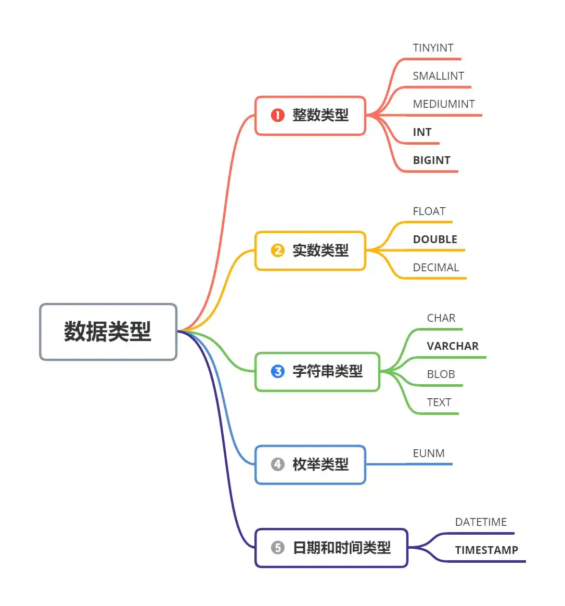
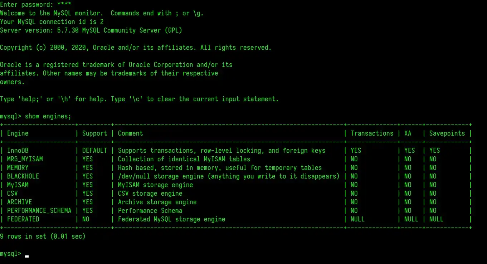

# MySQL 面试知识点

## 数据库基础

### 使用数据库的优点

最开始，我们是将数据保存在 **内存** 中，这能够保证我们十分 **快速存取，但是一旦断电，数据就丢失了，无法永久保存。** 于是我们将数据存放在 **文件** 中，这样一来我们就 **能够将数据永久保存，但每次都要进行频繁的 IO 操作，相对于内存来讲速度就慢了许多，而且进行查询操作也不方便。** 于是，我们转移到了 **数据库** 存储，通过这种方式不但 **能将永久保存数据，而且查询管理也更加高效方便**。

### 什么是 MySQL

MySQL 是一个关系型数据库管理系统，开源免费，且易扩展，是当前最流行的关系型数据库管理系统之一，在 Java Web 应用方面的应用十分广泛。其默认端口为 **3306**。

### 数据库三大范式

1. **第一范式：属性原子性**

最基本的范式，若数据库表中 **所有字段值均为不可分解的原子值**，则满足第一范式；

2. **第二范式：记录唯一性，确保表中每列均与主键相关**

在第一范式的基础上更进一步，需要确保数据库表中的每列均与主键相关，而不能只与主键的某一部分相关（主要针对联合主键）。即 **在一个数据库表中，一个表中只能保存一种数据，不能将多种数据保存在同一张数据库表中**；

3. **第三范式：字段冗余性，确保每列均与主键列直接相关，不存在传递依赖**

在第二范式的基础上，确保数据表中的 **每列数据和主键直接相关，而不依赖于其他非主键，即任何字段不能由其他字段派生**；

### MySQL 中自带的权限表

MySQL 通过权限表来控制用户对数据库的访问，一般是存放在 `mysql` 表中，由 `mysql_install_db` 脚本进行初始化，分别包括：

- **user**：记录允许连接服务器的用户账号信息，权限是全局性的；
- **db**：记录各个账号在不同数据库上的操作权限；
- **table_priv**：记录数据表级别的操作权限；
- **columns_priv**：记录数据列级别的操作权限；
- **host**：配合 **db** 表对给定主机上数据库级别的操作权限进行更进一步的控制，权限不受 **GRANT** 和 **REVOKE** 的影响；

## 数据类型

主要可以分为 5 大类型，而大类型下又具体划分了不同的子类型：



| **分类**           | **类型名称**   | **说明**                                                         |
| ------------------ | -------------- | ---------------------------------------------------------------- |
| **整数类型**       | `tinyInt`      | 很小的整数(8位二进制)                                            |
|                    | `smallint`     | 小的整数(16位二进制)                                             |
|                    | `mediumint`    | 中等大小的整数(24位二进制)                                       |
|                    | `int(integer)` | 普通大小的整数(32位二进制)                                       |
| **实数类型**       | `float`        | 单精度浮点数                                                     |
|                    | `double`       | 双精度浮点数                                                     |
|                    | `decimal(m,d)` | 压缩严格的定点数                                                 |
| **枚举类型**       | `enum`         |                                                                  |
| **日期和时间类型** | `year`         | YYYY 1901~2155                                                   |
|                    | `time`         | HH:MM:SS -838:59:59~838:59:59                                    |
|                    | `date`         | YYYY-MM-DD 1000-01-01~9999-12-3                                  |
|                    | `datetime`     | YYYY-MM-DD HH:MM:SS 1000-01-01 00:00:00~ 9999-12-31 23:59:59     |
|                    | `timestamp`    | YYYY-MM-DD HH:MM:SS 19700101 00:00:01 UTC~2038-01-19 03:14:07UTC |
| **字符串类型**     | `CHAR(M)`      | M为0~255之间的整数                                               |
|                    | `VARCHAR(M)`   | M为0~65535之间的整数                                             |
|                    | `TINYBLOB`     | 允许长度0~255字节                                                |
|                    | `BLOB`         | 允许长度0~65535字节                                              |
|                    | `MEDIUMBLOB`   | 允许长度0~167772150字节                                          |
|                    | `LONGBLOB`     | 允许长度0~4294967295字节                                         |
|                    | `TINYTEXT`     | 允许长度0~255字节                                                |
|                    | `TEXT`         | 允许长度0~65535字节                                              |
|                    | `MEDIUMTEXT`   | 允许长度0~167772150字节                                          |
|                    | `LONGTEXT`     | 允许长度0~4294967295字节                                         |
|                    | `VARBINARY(M)` | 允许长度0~M个字节的变长字节字符串                                |
|                    | `BINARY(M)`    | 允许长度0~M个字节的定长字节字符串                                |


## 存储引擎

要查看 MySQL 中所提供的引擎，可以通过如下命令：

```sql
show engines;
```



### 常用存储引擎
| 引擎     | 说明                                                                                   |
| -------- | -------------------------------------------------------------------------------------- |
| `InnoDB` | **提供对数据库 ACID 事务的支持，同时提供了行级锁和外键的约束**，其设计目标是处理大数据 |
| `MyIASM` | **默认引擎**，**不提供事务的支持，也不支持行级锁和外键**                               |
| `MEMORY` | 所有数据均存于内存，存取速度快，但是安全性低                                           |


### InnoDB vs MyISAM

- InnoDB 的 4 大特性

1. **插入缓冲（Insert Buffer）**
2. **二次写（Double Write）**
3. **自适应哈希索引（Ahi）**
4. **预读（Read Ahead）**

- 两者区别
| 对比项   | MyISAM                   | Innodb |
| -------- | ------------------------ | ------ |
| 存储结构 | 每张表被存放在三个文件：<br />1. `.frm` -表格定义<br />2. `.MYD` (MYData)-数据文件 <br />3. `.MYI`(MYIndex)-索引文件 | 所有的表都保存在同一个数据文件中（也可能是多个文件，或者是独立的表空间文件），大小只受限于操作系统文件的大小，一般为 2GB |
| 存储空间 | 可被压缩，存储空间较小 | 需要更多的内存和存储，会在主内存中建立其专用的缓冲池用于高速缓冲数据和索引 |
| 可移植性、备份及恢复 | 数据以文件形式存储，在跨平台的数据转移中会很方便，在备份和恢复时可单独针对某个表进行操作 | 免费的方案可以是拷贝数据文件、备份 binlog，或者用 mysqldump，在数据达到一定量（几十 G）的时候就相对痛苦了 |
| 文件格式 | 数据和索引是分别存储的，数据`.MYD`，索引`.MYI` |数据和索引是集中存储的，`.ibd`|
| 记录存储顺序 | 按记录插入顺序保存 | 按主键大小有序插入 |
| **外键** | **不支持** | **支持** |
| **事务** | **不支持** | **支持（默认 REPEATABLE-READ）** |
| **锁支持** | **表级锁定** | **行级锁定、表级锁定，锁定力度小并发能力高** |
| **MVVC 支持** | **不支持** | **支持** |
| **崩溃修复** | **不支持** | **支持** |
| **哈希索引** | **不支持** | **支持** |
| **全文索引** | **支持** | **不支持** |
| 查询性能 | 更佳 |  |
| 增删改性能 |  | 更佳 |
| 统计数据量 | 更快，内部维护了一个计数器，可以直接调取。 |  |
| 索引的实现方式 | B+ 树索引，myisam 是堆表 | B+ 树索引，Innodb 是索引组织表 |


两者主要区别如下：

1. InnoDB 索引是聚簇索引，而 MyISAM 是非聚簇索引；
2. InnoDB 的主键索引的叶子节点存储着行数据，因此主键索引效率高；MyISAM 索引的叶子节点存储的是行数据地址，需要多进行一次寻址操作才能够得到数据；
3. InnoDB 非主键索引的叶子节点存储的是主键和其他带索引的列数据，因此查询时做到覆盖索引更加高效；

### 如何选择存储引擎

- **MyISAM**：默认的 MySQL 插件式存储引擎，适合 **以读写插入为主**，是 Web、数据仓库和其他应用环境下最常使用的引擎之一；
- **InnoDB**：用于事务处理应用程序，如果 **更新删除等操作频率也高**，或者要 **保证数据完整性**，支持 **高并发、外键和事务等**；
- **Memory**：将所有数据保存在 `RAM` 中，在需要快速查找引用和其他类似数据情况下，能提供较快的访问；
- **Merge**：允许 MySQL DBA 或开发人员将一系列等同的 MyISAM 表以逻辑方式组合在一起并作为一个对象引用，适合于数据仓库等 VLDB 环境；

## 存储过程

### 定义

存储过程是一个可编程的函数，在数据库中创建并保存，由 SQL  语句和一些特殊的控制结构组成。优点是 **允许模块化设计，即一次创建，多次调用。** 是一个预编译的 SQL 语句，当需要多次执行 SQL 语句时，使用存储过程比单纯 SQL 语句效率更高。

### 优缺点

- **优点**

1. 由于是预编译，所以执行效率高；
2. 存储过程的代码直接在数据库中，通过存储过程名直接调用，能够减少网络通讯；
3. 安全性高，执行存储过程需要有一定权限的用户；
4. 能够重复使用，提高开发效率；

- **缺点**

1. 调试困难
2. 移植困难
3. 重新编译问题，由于存储过程是运行前编译，因此如果带有引用关系的对象发生改变时，受到影响的存储过程、包需要重新编译
4. 若在一个程序中大量使用存储过程，到交付使用时就会随着用户需求的改变而导致数据结构变化，此时系统维护成本较高

## 事务

### 事务定义

事务是一个不可分割的数据库操作序列，也是数据库并发控制的基本单位，其执行结果必须使数据库从一种一致性状态切换到另一中一致性状态。事务是逻辑上的一组操作，要么都执行，要么都不执行。事务能够在数据库提交工作时确保要么所有修改都保存，要么所有修改都不保存。**即事务是逻辑上的一组操作，要么都执行，要么都不执行**。

### 事务的 4 大特性

关系型数据库都需要遵循 ACID 规则：

1. **原子性（Atomicity）**

原子性是整个数据库事务中不可分割的工作单位，只有事务中的所有的数据库操作都执行成功，才代表整个事务成功，如果其中任一环节执行失败，那么就算已经执行成功的 SQL 语句也必须撤销，回滚到事务执行前的状态。即原子性能够保证 **动作要么全部完成，要么完全不起作用。** **即事务是最小的执行单位，不允许分割**。

2. **一致性（Consistency）**

指事务将数据库从一种一致性状态变为另一种一致性状态。在事务开始前后，数据库的完整性约束未被破坏。**在事务执行前后，数据能够保持一致，多个事务对统一数据读取的结果相同**。

3. **隔离性（Isolation）**

并发访问数据库时，隔离性要求每个读写事务对其他事务的操作对象能够相互分离，即一个用户的事务不被其他事务所干扰，各并发事务间数据库是独立的；

4. **持久性（Durability）**

表示事务一旦被提交，其结果就是永久性的，它对数据库中数据的改变是持久的，即便数据库发生故障也不应该对其产生影响；

### 事务隔离级别

#### 脏读、幻读 & 不可重复读

了解事务隔离级别之前，先来看看这几个读的概念：

1. **脏读（Dirty Read）**

表示某一事务已经更新了一份数据，另一个事务在此时读取了同一份数据。当前一个事务撤销操作后，就会导致后一个事务所读取的数据不正确。

2. **幻读（Phantom Read）**

在一个事务的两次查询中数据量不一致，假如有一个事务查询了几列数据，同时另一个事务中在此时查询了新的数据，则查询事务在后续查询中，就会发现数据比最开始的查询数据更丰富。

3. **不可重复读（Non-repeatable Read）**

一个事务中两次查询数据不一致，有可能是因为两次查询过程中插入了一个更新原有数据的事务。

**注意：不可重复读和幻读的区别在于：**

> **不可重复读的重点在于修改，** 比如多次读取一条记录发现其中某些列的值被修改，而 **幻读的重点在于新增或删除**，比如多次读取一条记录发现记录增多或减少了。


#### 隔离级别

SQL 标准定义了 4 个隔离级别，隔离级别从低到高分别是：

1. **READ-UNCOMMITTED（读取未提交）**

最低的隔离级别，允许读取尚未提交的数据变更，**可能导致脏读、幻读或不可重复读**。

2. **READ-COMMITTED（读取已提交）**

允许读取并发事务已经提交的数据，**能够阻止脏读，但可能导致幻读或不可重复读**。

3. **REPEATABLE-READ（可重复读）**

对同一字段的多次读取结果时一致的，除非数据是被本身事务自己所修改，**能够阻止脏读和不可重复读，但可能导致幻读**。

4. **SERIALIZABLE（可串行化）**

最高的隔离级别，完全服从 ACID 的隔离级别，所有事务依次逐个执行，这样事务之间就完全不可能产生干扰，**能够防止脏读、幻读以及不可重复读**、

| 隔离级别           | 脏读 | 不可重复读 | 幻读 |
| ------------------ | ---- | ---------- | ---- |
| `READ-UNCOMMITTED` | ✔    | ✔          | ✔    |
| `READ-COMMITTED`   | ❌    | ✔          | ✔    |
| `REPEATABLE-READ`  | ❌    | ❌          | ✔    |
| `SERIALIZABLE`     | ❌    | ❌          | ❌    |


## 锁

### 定义

当数据库中存在并发事务时，可能会导致数据库中的数据不一致，此时为了保证访问次序，我们就需要用到锁机制。

锁是为了支持对共享资源进行并发访问，提供数据的完整性和一致性，从而保证在高并发的情况下，访问数据库时不会出现问题；

### 事务隔离级别与锁的关系
| 隔离级别           | 锁                                               |
| ------------------ | ------------------------------------------------ |
| `READ-UNCOMMITTED` | 读取无需加共享锁                                 |
| `READ-COMMITTED`   | 读操作需要加共享锁，语句执行完后释放             |
| `REPEATABLE-READ`  | 读操作需要加共享锁，事务执行完毕后释放           |
| `SERIALIZABLE`     | **锁定整个范围的键**，并一直持有锁，直到事务完成 |


### 数据库中死锁的定义及解决方法

- **定义**

所谓死锁，**指的是两个或多个以上进程在同一资源上相互占用，并请求锁定对方的资源，从而导致恶性循环的现象**。

- **解决方法**

1. **若不同程序间并发存取多个表，则尽量约定以相同的顺序来访问表，从而大大降低死锁发生的概率；**
2. **同一事务中，尽量一次性锁定所需的所有资源，降低死锁发生的概率；**
3. **对于易发生死锁的业务部分，尝试使用升级锁定颗粒度；**

### 乐观锁 & 悲观锁

- **定义**

并发控制能够确保多个事务同时存取数据库中同一数据时不破坏事务的隔离性和统一性，以及数据库的统一性，而并发控制主要可分为乐观锁（乐观并发控制）和悲观锁（悲观并发控制）。

1. **乐观锁**

假定不会发生并发冲突，只在提交事务时检查时候违反数据完整性。修改数据时将事务加锁，通过 `version` 的方式来进行锁定，**一般使用版本号机制或CAS算法来实现** ；

2. **悲观锁**

假定会发生并发冲突，屏蔽一切可能违反数据完整性的操作。查询完数据时将事务加锁，直到提交事务，**一般使用数据库中的锁机制来实现**；

- **使用场景**

**乐观锁** 适合于 **读操作频繁，但写操作较少** 的情况，即冲突很少发生的场景，这样能够省去锁的开销，同时加大系统的吞吐量；

**悲观锁**  适合于 **写操作频繁，但读操作较少** 的情况，即冲突频发的场景；

## 索引

### 定义

所谓索引，就是一种特殊的文件，**包含数据表中所有记录的引用指针**。它是一种数据结构，数据库索引是数据库管理系统中一个排序的数据结构，能够协助快速查询、更新数据库表中数据，同时使用 B 树及其变种 B+ 树来实现。用通俗的话来讲就是相当于我们日常字典中的目录，能够帮助我们快速找到想要的字或词。

### 基本原理

使用索引的最终目录是快速查找具有特定值的记录，如果没有索引，当我们需要查找某一个值时，只能遍历整张表来查找，这样做查找效率就会大打折扣。

索引的原理也很简单，即 **将无序数据变为有序的查询**，根据索引查询数据的步骤如下：

1. **将创建了索引的列的内容进行排序**
2. **对排序结果生成倒排表**
3. **在倒排内容上拼上数据地址链**
4. **在查询时，先拿到倒排表内容，然后取出数据地址链，从而取出具体数据**

### 索引优缺点

- **优点**

1. 第一点毫无疑问是 **加快数据的检索速度**；
2. 第二点则是 **通过使用索引，能够在查询过程中使用优化隐藏器，提高性能**。

- **缺点**

1. **时间方面**：虽然能够加快检索速度，但是创建和维护索引也需要时间，而且随着数据的增多，索引也需要动态维护，这样将会降低增/删/改的执行效率；
2. **空间方面**：索引也是需要占据独立空间的，所以会随着数据的增多而占用更多的物理空间；

### 索引类型

#### 逻辑角度

索引从逻辑角度主要可分为 4 种索引，分别是：

1. **主键索引**

数据列不允许重复，不允许为 `NULL`，一个表中只能有一个主键；

2. **唯一索引**

数据列不允许重复，允许为 `NULL` 值，一个表中允许多个列创建唯一索引，可以通过如下两种方式进行创建唯一索引：

- **创建唯一索引**：`ALTER TABLE table_name ADD UNIQUE(column)`
- **创建唯一组合索引**：`ALTER TABLE table_name ADD UNIQUE(column1, column2)`；

3. **普通索引**

最基本的索引类型，没有唯一性的限制，允许为 `NULL` 值，通过如下两种方式来创建唯一索引：

- **创建普通索引**：`ALTER TABLE table_name ADD INDEX index_name (column)`；
- **创建普通索引组合**：`ALTER TABLE table_name ADD INDEX index_name (column1, column2)`；

4. **全文索引**

搜索引擎中也在使用的一种技术，通过 `ALTER TABLE table_name ADD FULLTEXT (column)` 来创建全文索引；

5. **组合索引**

多列值组成一个索引，专门用于组合搜索，其效率大于索引合并；

#### 物理存储角度

1. **聚集索引（clustered index）**
2. **非聚集索引（non-clustered index）**

#### 数据结构角度

1. **BTREE**
2. **HASH**
3. **FULLTEXT**
4. **R-Tree**

### 索引算法

常用的索引算法有 **Hash 算法 和 B 树算法**，分别多两个算法进行简单介绍：

1. **B+ 树算法**

最常用的 MySQL 算法，也是 MySQL 默认算法，既能够用于比较操作符（`=、>、<、between` 等），也能够用于 `like` 操作符，只要其查询条件是一个 **不以通配符开头的常量**。底层实现的是 **多路平衡查找树**，每次查询都要从根节点出发，查找到叶子节点方可获得所查询的键值，然后根据查询判断是否需要回表查询数据。

2. **Hash 算法**

Hash 算法索引只能用于对等比较（`=、>=、<=`），而且不像 B 树索引需要从根节点到枝节点，最后才能范文到页节点进行多次读写操作，它只需要一次定位数据，所以检索效率远高于 B 树索引。其底层是 Hash 表，进行查找时，调用一次 `Hash` 函数就能获取相应键值，然后进行回表查询获得实际数据。

3. **两者对比**

- Hash 索引进行等值查询更快，但是不能进行范围查询；
- Hash 索引不支持使用索引进行排序；
- Hash 索引不支持模糊查询以及多列索引的最左前缀匹配，因为 Hash 函数的结果不可预测；
- Hash 索引无法避免回表查询数据，但 B+ 树在一定条件下（聚簇索引、覆盖索引等）只需要通过索引完成查询；
- Hash 索引在等值查询时较快，但不稳定，性能不可预测；但 B+ 树的查询效率较稳定，对所有查询均是从根节点到叶子节点，且树的高度较低；

### 设计和创建索引的原则

#### 设计原则

1. **选择唯一性索引**

唯一性索引的值唯一，能够更加快速地通过该索引来确定某条记录；

2. **为经常需要排序、分组和联合操作的字段建立索引**

对于经常需要 `ORDER BY、GROUP BY、DISTINCT、UNION` 等操作的字段，排序时会浪费许多时间，因此我们可以为其建立索引，避免排序操作；

3. **为经常作为查询条件的字段建立索引**

若某个字段经常作为查询条件，则该字段的查询速度将影响整个表的查询速度，此时可以给该字段建立索引，从而提高整个表的查询速度；

4. **限制索引数目**

索引并非越多越好，每个索引都需要占用物理空间，索引越多占用的物理空间越大，修改表时对索引的重构和更新将十分麻烦；

5. **尽量使用数据量少的索引**

如果索引值较长，查询速度也会受到影响；

6. **使用短索引，尽量使用前缀来索引**

如果某索引字段值较长，最好使用值的前缀来进行索引；

7. **删除不再使用或很少使用的索引**

表中数据被大量更新，或者数据使用方式被改变落后，原有的一些索引可能不再需要，此时需要对这些索引进行删除，减少索引对更新操作的影响；

#### 创建原则

使用索引能够在一定程度上提高检索效率，但也不能无限制的使用，创建索引时，最好能够满足如下原则：

1. **最左前缀匹配原则**
2. **频繁查询的字段才创建索引**
3. **更新频繁的字段不适合创建索引**
4. **区分度不高的字段不适合做索引**
5. **尽量扩展索引，而不用去创建新的索引**
6. **定义有外键的数据列一定要建立索引**
7. **对于查询中很少涉及，而且重复值较多的字段无需建立索引**
8. **对于 **`**text、image、bit**`** 类型的字段不要建立索引**

### B+ 树索引 和 Hash 索引底层实现

1. **Hash 索引**

Hash 索引底层其实就是 Hash 表，进行查找时，调用一次 Hash 函数就能获取到响应的键值，然后进行回表查询获取数据库中的数据；

2. **B+ 树索引**

B+ 树底层实现是多路平衡查找树，对每次的查询均从根节点出发，查找到叶子节点就获得所要查询的键值，然后根据查询判断是否需要回表查询数据；

3. **Hash 索引与 B+ 树的不同**

- Hash 索引进行等值查询更快，但无法进行范围查询。因为 `Hash` 索引中经过 `hash()` 函数建立索引后，索引顺序与与原顺序无法保持一致，不能支持范围查询；而 B+ 树的所有节点皆遵循（左节点小于父节点，父节点小于右节点），天然支持范围查询；
- Hash 索引不支持使用索引进行排序；
- Hash 索引不支持模糊查询以及多列索引的最左前缀匹配，原理也是因为 `hash()` 函数的不可预测；
- Hash 索引任何时候都必须进行回表查询，但 B+ 树在符合某些条件时可以只通过索引完成查询；
- Hash 索引虽然等值查询较快，但是极其不稳定，性能不可预测，但某一键值存在大量重复时，会发生 Hash 碰撞，此时效率可能十分低下；而 B+ 树的查询效率比较稳定，对于所有的查询均是从根节点到叶子节点，且树的高度较低；

鉴于以上不同点，因此在大多数情况下，直接选用 B+ 树索引能够获得稳定且较好的查询速度，而不需要使用 Hash 索引；

## 视图

### 视图定义

为了提高复杂 SQL 语句的复用性和表操作的安全性，MySQL 数据库管理系统提供了视图。

视图的本质是 **一种虚拟表，在物理上不存在，其内容与真实的表相似，包含一系列带有名称的列和行数据。**  但视图并不在数据库中以存储的数据值形式存在，行和列数据来自定义视图的查询所引用基本表，且在具体引用视图时动态生成；

视图的操作一般包括如下四部分：

- **创建视图**
- **查看视图**
- **删除视图**
- **修改视图**

### 视图特点

1. 视图的列可以来自不同的表，是表的抽象在逻辑意义上建立的新关系；
2. 视图是有基本表（实表）产生的表（虚表）；
3. 视图的建立和删除不会对基本表造成影响；
4. 对视图内容的更新（添加、删除和修改）会直接影响到基本表；
5. 当视图来自多个基本表时，不允许添加和删除数据；

### 视图优缺点

#### 优点

1. **查询简单化**，视图能够简化用户操作，数据所见即所得；
2. **数据安全性**，视图使用户能从多个角度看待同一数据，用户只能查询或修改他们所能见到得到的数据，能够对机密数据提供安全保护；
3. **逻辑数据独立性**，视图对重构数据库提供了一定程度的逻辑独立性，屏蔽真实表结构变化所带来的影响；

#### 缺点

1. **性能相对较差**，简单的查询也会变得很复杂；
2. **修改限制**，尝试修改视图时，必须将其转化为对比本表的某些行的修改。对于复杂的聚合视图，基本无法改变；

## 优化

### 大表优化

当 MySQL 单表记录数过大时，数据库的 CURD 性能会明显下降，此时可以采取如下的优化措施：

1. **限定数据范围**

务必禁止不带任何限制数据范围条件的查询语句，此时会查询整个数据库，效率极低；

2. **读/写分离**

最经典的数据库拆分方案，主库负责写，从库负责读；

3. **垂直分区**

即根据数据库中数据表的相关性进行拆分，简单来讲就是指数据表的拆分，将一张列较多的表分为多张表。这样操作使得 **列数据变小，在查询时减少了读取的 Block 数，减少了 I/O 次数。同时，垂直分区也能够简化表的结构，易于维护**。但是，垂直拆分也存在一定缺点。首先拆分将 **导致主键出现冗余，此时就需要管理冗余列，同时会引起 Join 操作，可以通过在应用层进行 Join 来解决。此外，拆分还会让事务变得更加复杂。**

4. **水平分区**

**保持数据表结构不变，通过某一策略存储数据分片。这样一来每一片数据分散到不同表或库中，从而达到分布式的目的，而且通过水平切分能够支撑非常大的数据量。**

水平拆分是将数据表的行进行拆分，它能够 **支撑非常大的数据量存储**，应用端改造也少，但是 **分片事务难以解决，跨节点 Join 性能较差，逻辑复杂。**

一般来讲数据库分片操作的两种常见方案如下：

- **客户端代理：分片逻辑在应用端，封装在 jar 包中，通过修改或封装 JDBC 层来实现。**
- **中间件代理：在应用和数据间加一个代理层，分片逻辑统一维护在中间件服务中。**

## 其他

### sql 注入

用户传入的参数中符合 sql 的语法，从而破坏原有 sql 结构语义，从而达到攻击效果；

### NULL 和空串

`NULL` 是没有值的，不是空串，如果只指定 ‘’ （两个单引号，中间无任何字符），对于 `NOT NULL` 列是允许的，空串也是一个有效的值；

要对 `NULL` 进行判断，则需要使用 `IS NULL` 或者 `IS NOT NULL`；

### 如何创建用户并授权

1. **创建用户**

```sql
CREATE USER 'username'@'host' IDENTIFIED BY 'password';
```

2. **授权**

```sql
GRANT privileges ON databasename.tablename TO 'username'@'host';
```

### 如何删除表

| 方式       | 说明                                                                      | 实例                        |
| ---------- | ------------------------------------------------------------------------- | --------------------------- |
| `delete`   | 仅删除表数据，支持条件过滤，支持回滚，记录日志，因此较慢                  | `delete from table_name`    |
| `truncate` | 仅删除所有数据，不支持条件过滤，不支持回滚，不记录日志，效率高于 `delete` | `truncate table table_name` |
| `drop`     | 删除表数据同时删除表结构，将表所占空间均释放，删除效率最高                | `drop table table_name`     |