# 学生成绩管理系统

## 前言

对于计算机专业的学生来讲，一定对于学生成绩管理系统课程设计十分印象深刻。设计、上机、编码、写报告、答辩等一系列流程，虽然很简单，但也可以综合运用我们所学的一些知识了。

今天就来复习以下这个课题，用 Java SE 来实现该课题，也算是补上当初上课的时候没有好好写的遗憾吧。

虽然很简单，但是对于刚涉足编程学习的人来讲，还是有一定难度的，既要考虑界面打印，也要考虑条件判断、循环语句、输入输出控制等等技巧，所以在这里简单地实现一下，方便给初学的小伙伴们一个参考（对于我的界面比较丑的问题，就不要过于纠结了，下去可以自己调整😂，我们只关注功能实现🤣）。

对于学生成绩管理系统，主要可以分为如下几个功能：

1.  录入学生成绩
2.  统计学生成绩
3.  查找学生成绩
4.  修改学生成绩
5.  删除学生成绩
6.  按平均分排序
7.  显示所有成绩
8.  退出管理系统

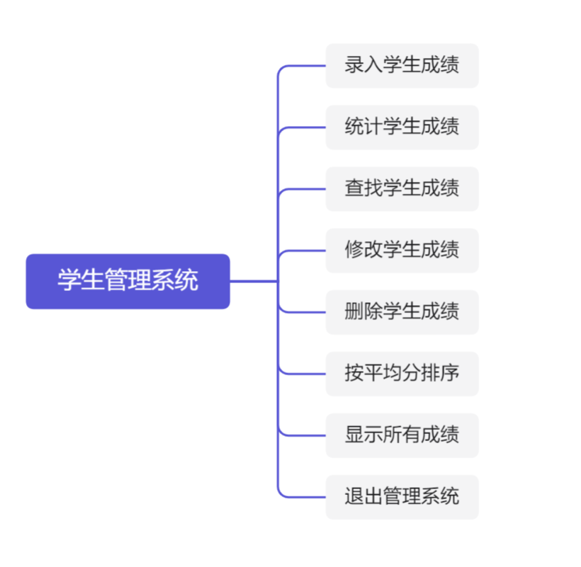

进入系统之后，我们应该有系统菜单，然后根据提示选择我们所要进行的操作。

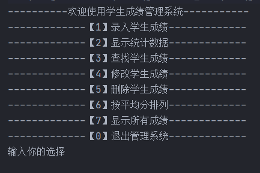

-   **录入学生成绩**

该功能是每次录入学生的成绩信息，或者在当前数据的基础上添加录入新的学生成绩信息；

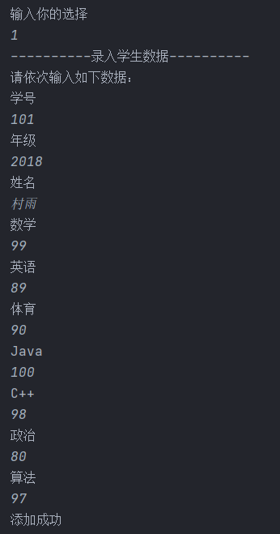

-   **统计学生成绩**

主要是对学生的成绩进行统计，然后输出平均分，并打印出对应信息；

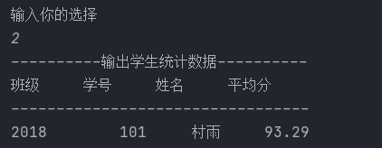

-   **查找学生成绩**

根据输入的学号来查找对应学生的相关成绩信息；

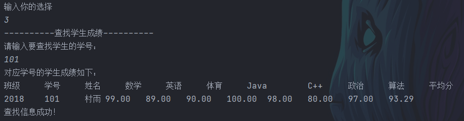

-   **修改学生成绩**

根据输入的学号来对对应学生的成绩进行修改；

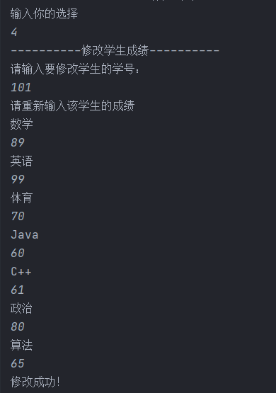

-   **删除学生成绩**

根据输入的学生学号，删除对应学生的成绩信息；

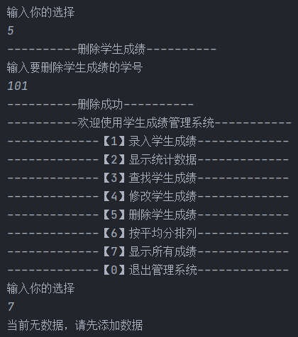

-   **按平均分排序**

按照平均分降序排序；

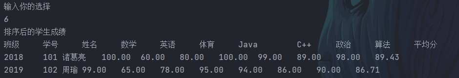

-   **显示所有成绩**

便利所有学生成绩，然后打印出来；

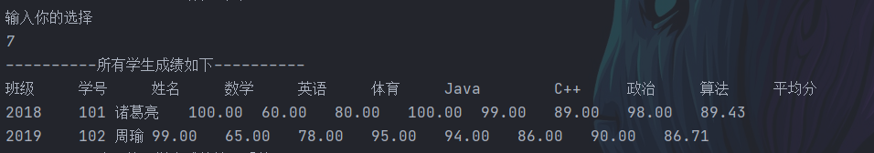

-   **退出管理系统**

退出菜单；

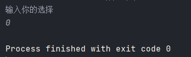

- **注意**

鉴于大家的留言说经常会报错找不到对应类，所以在这里也给出这个程序的包结构如下图所示。
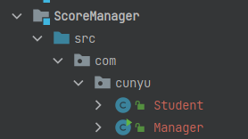


## 功能设计与实现

### 主界面

主要是打印出来系统功能的选择菜单，然后根据我们的输入进入不同的子功能模块；

```java
package com.cunyu;

import java.util.ArrayList;
import java.util.Scanner;

/**
 * @author : cunyu
 * @version : 1.0
 * @className : Manager
 * @date : 2021/4/4 23:54
 * @description : 管理系统
 */

public class Manager {
    public static Scanner scanner = new Scanner(System.in);
    public static ArrayList<Student> students = new ArrayList<>();

    public static void main(String[] args) {
        while (true) {
            System.out.println("----------欢迎使用学生成绩管理系统-----------");
            System.out.println("-------------【1】录入学生成绩-------------");
            System.out.println("-------------【2】显示统计数据-------------");
            System.out.println("-------------【3】查找学生成绩-------------");
            System.out.println("-------------【4】修改学生成绩-------------");
            System.out.println("-------------【5】删除学生成绩-------------");
            System.out.println("-------------【6】按平均分排列-------------");
            System.out.println("-------------【7】显示所有成绩-------------");
            System.out.println("-------------【0】退出管理系统-------------");

            Student student = new Student();

            System.out.println("输入你的选择【0-7】");
            String choice = scanner.next();
            switch (choice) {
                case "1":
                    // 录入成绩
                    student.addScore(students);
                    break;
                case "2":
                    // 统计信息
                    student.showAvg(students);
                    break;
                case "3":
                    // 查找成绩
                    student.lookupStudent(students);
                    break;
                case "4":
                    // 修改成绩
                    student.modifyStudent(students);
                    break;
                case "5":
                    // 删除成绩
                    student.deleteStudent(students);
                    break;
                case "6":
                    // 按照平均分排序
                    student.sortStudent(students);
                    break;
                case "7":
                    // 显示所有成绩
                    student.showAllStudent(students);
                    break;
                case "0":
                    System.exit(0);
                default:
                    break;
            }
        }
    }
}

```

### 主类设计

系统主要是针对学生成绩信息管理的，所以我们设计一个学生类，包括一系列属性（也就是简单的个人信息和各科成绩）；

```java
package com.cunyu;
/**
 * @author : cunyu
 * @version : 1.0
 * @className : Student
 * @date : 2021/4/4 23:31
 * @description : 学生类
 */

public class Student {
    //    班级
    private String grade;
    //    学号
    private long id;
    //    姓名
    private String name;
    //    高数
    private float math;
    //    英语
    private float english;
    //    体育
    private float sport;
    //    Java
    private float java;
    //    C++
    private float cPlusPlus;
    //    政治
    private float polity;
    //    算法
    private float algorithm;
    //    平均分
    private double average;
    
    // 各种 setter/getter 以及构造函数
}
```

### 录入学生成绩

首先录入学号，判断是否可用，不可用则重新输入，可用则输入其他信息；

然后将信息赋值到学生对象，最后将该学生对象加入集合就可以了。

```java
/**
* @param students 学生对象列表
* @return
* @description 录入学生信息
* @date 2021/4/5 9:14
* @author cunyu1943
* @version 1.0
*/
public void addScore(ArrayList<Student> students) {
    System.out.println("----------录入学生数据----------");
    System.out.println("请依次输入如下数据：");
    long id;
    while (true) {
        System.out.println("学号");
        id = scanner.nextInt();
        if (isValid(students, id)) {
            System.out.println("学号重复，请重新输入");
        } else {
            break;
        }
    }

    System.out.println("年级");
    String grade = scanner.next();
    System.out.println("姓名");
    String name = scanner.next();
    System.out.println("数学");
    float math = scanner.nextFloat();
    System.out.println("英语");
    float english = scanner.nextFloat();
    System.out.println("体育");
    float sport = scanner.nextFloat();
    System.out.println("Java");
    float java = scanner.nextFloat();
    System.out.println("C++");
    float cPlusPlus = scanner.nextFloat();
    System.out.println("政治");
    float polity = scanner.nextFloat();
    System.out.println("算法");
    float algorithm = scanner.nextFloat();

    //        创建对象，并设置属性，然后将其加入学生对象集合
    Student student = new Student();
    student.setId(id);
    student.setGrade(grade);
    student.setName(name);
    student.setMath(math);
    student.setAlgorithm(algorithm);
    student.setEnglish(english);
    student.setcPlusPlus(cPlusPlus);
    student.setJava(java);
    student.setSport(sport);
    student.setPolity(polity);
    //        获取平均分
    double avg = getAvg(student);
    student.setAverage(avg);
    //        添加到集合
    students.add(student);
    //        提示信息
    System.out.println("添加成功");
}
```

### 统计学生成绩

主要实现对于各学生平均成绩的统计，然后打印出信息；

```java
/**
* @param students 学生对象集合
* @return
* @description 显示简单统计数据
* @date 2021/4/5 10:08
* @author cunyu1943
* @version 1.0
*/
public void showAvg(ArrayList<Student> students) {
    System.out.println("----------输出学生统计数据----------");
    if (students.size() == 0) {
        System.out.println("当前无数据，请先添加数据！");
    } else {
        System.out.println("班级\t\t学号\t\t姓名\t\t平均分");
        System.out.println("---------------------------------");
        for (Student student : students) {
            System.out.format("%s\t\t%d\t\t%s\t\t%.2f\n", student.getGrade(), student.getId(), student.getName(), student.getAvg(student));
        }
    }
}
```

### 查找学生成绩

先判断是否有数据，有数据再进行后续操作。然后通过对输入的学号进行匹配，找到对应学号的学生成绩信息并打印；

```java
/**
* @param students 学生对象集合
* @return
* @description 查找对应学号学生的成绩信息
* @date 2021/4/5 12:59
* @author cunyu1943
* @version 1.0
*/
public void lookupStudent(ArrayList<Student> students) {
    System.out.println("----------查找学生成绩----------");
    if (students.size() == 0) {
        System.out.println("当前无数据，请添加后重试");
    } else {
        System.out.println("请输入要查找学生的学号：");
        long id = scanner.nextLong();
        int flag = -1;
        Student student = new Student();
        //        查找对应学号，找到就退出
        for (int i = 0; i < students.size(); i++) {
            student = students.get(i);
            if (student.getId() == id) {
                flag = i;
                break;
            }
        }

        if (flag == -1) {
            System.out.println("未找到对应学号的学生，请确认后重新输入！");
        } else {
            System.out.println("对应学号的学生成绩如下：");
            System.out.println("班级\t\t学号\t\t姓名\t\t数学\t\t英语\t\t体育\t\tJava\t\tC++\t\t政治\t\t算法\t\t平均分");
            System.out.format("%s\t\t%d\t\t%s\t\t%.2f\t\t%.2f\t\t%.2f\t\t%.2f\t\t%.2f\t\t%.2f\t\t%.2f\t\t%.2f\n", student.getGrade(), student.getId(), student.getName(), student.getMath(), student.getEnglish(), student.getSport(), student.getJava(), student.getcPlusPlus(), student.getPolity(), student.getAlgorithm(), student.getAvg(student));
            System.out.println("查找信息成功！");
        }
    }

}
```


### 修改学生成绩

先判断是否有数据，有数据再进行后续操作。然后通过对输入的学号进行匹配，找到对应学号的学生，然后对其成绩信息进行修改，但不修改个人其他信息；

```java
/**
* @param students 学生对象集合
* @return
* @description 修改对应学号学生的信息
* @date 2021/4/5 12:59
* @author cunyu1943
* @version 1.0
*/
public void modifyStudent(ArrayList<Student> students) {
    System.out.println("----------修改学生成绩----------");
    if (students.isEmpty()) {
        System.out.println("当前无数据，请添加后重试");
    } else {
        System.out.println("请输入要修改学生的学号：");
        long id = scanner.nextLong();

        for (Student student : students) {
            if (id == student.getId()) {
                System.out.println("请重新输入该学生的成绩");
                System.out.println("数学");
                float math = scanner.nextFloat();
                System.out.println("英语");
                float english = scanner.nextFloat();
                System.out.println("体育");
                float sport = scanner.nextFloat();
                System.out.println("Java");
                float java = scanner.nextFloat();
                System.out.println("C++");
                float cPlusPlus = scanner.nextFloat();
                System.out.println("政治");
                float polity = scanner.nextFloat();
                System.out.println("算法");
                float algorithm = scanner.nextFloat();

                student.setMath(math);
                student.setAlgorithm(algorithm);
                student.setEnglish(english);
                student.setcPlusPlus(cPlusPlus);
                student.setJava(java);
                student.setSport(sport);
                student.setPolity(polity);
                //                获取平均分
                double avg = getAvg(student);
                student.setAverage(avg);
                System.out.println("修改成功！");
            } else {
                System.out.println("未找到对应学号的学生，请确认后重新输入！");
            }
            break;
        }
    }
}
```

### 删除学生成绩

先判断是否有数据，有数据再进行后续操作。然后通过对输入的学号进行匹配，找到对应学号的学生，然后将其从集合中删除即可；

```java
/**
     * @param students 学生对象集合
     * @return
     * @description 删除学生成绩
     * @date 2021/4/5 14:28
     * @author cunyu1943
     * @version 1.0
     */
public void deleteStudent(ArrayList<Student> students) {
    System.out.println("----------删除学生成绩----------");
    if (students.isEmpty()) {
        System.out.println("当前无数据，请添加后重试");
    } else {
        System.out.println("输入要删除学生成绩的学号");
        long id = scanner.nextLong();

        int index = -1;
        for (int i = 0; i < students.size(); i++) {
            Student student = students.get(i);
            if (student.getId() == id) {
                index = i;
                break;
            }
        }
        if (index == -1) {
            System.out.println("未找到对应学号学生信息，请确认后再删除！");
        } else {
            students.remove(index);
            System.out.println("----------删除成功----------");
        }
    }
}
```

### 按平均分排序

先判断是否有数据，有数据再进行后续操作。然后对集合中的学生的平均成绩进行排序，然后依次从高到低打印出学生信息；

```java
/**
* @param students 学生对象集合
* @return
* @description 按照平均分排序
* @date 2021/4/5 14:29
* @author cunyu1943
* @version 1.0
*/
public void sortStudent(ArrayList<Student> students) {
    if (students.isEmpty()) {
        System.out.println("当前无数据，请添加后重试");
    } else {
        for (int i = 0; i < students.size() - 1; i++) {
            if (students.get(i).getAvg(students.get(i)) < students.get(i + 1).getAvg(students.get(i + 1))) {
                Student tmp = students.get(i);
                students.set(i, students.get(i + 1));
                students.set(i + 1, tmp);
            }
        }

        System.out.println("排序后的学生成绩");
        System.out.println("班级\t\t学号\t\t姓名\t\t数学\t\t英语\t\t体育\t\tJava\t\tC++\t\t政治\t\t算法\t\t平均分");
        for (Student student : students) {
            System.out.format("%s\t%d\t%s\t%.2f\t%.2f\t%.2f\t%.2f\t%.2f\t%.2f\t%.2f\t%.2f\n", student.getGrade(), student.getId(), student.getName(), student.getMath(), student.getEnglish(), student.getSport(), student.getJava(), student.getcPlusPlus(), student.getPolity(), student.getAlgorithm(), student.getAvg(student));
        }
    }
}
```


### 显示所有成绩

先判断是否有数据，有数据再进行后续操作。遍历学生对象集合，然后打印出各个学生的成绩信息。

```java
/**
* @param students 学生对象集合
* @return
* @description 显示所有学生成绩
* @date 2021/4/5 14:30
* @author cunyu1943
* @version 1.0
*/
public void showAllStudent(ArrayList<Student> students) {
    if (students.isEmpty()) {
        System.out.println("当前无数据，请先添加数据");
    } else {
        System.out.println("----------所有学生成绩如下----------");
        System.out.println("班级\t\t学号\t\t姓名\t\t数学\t\t英语\t\t体育\t\tJava\t\tC++\t\t政治\t\t算法\t\t平均分");
        for (Student student : students) {
            System.out.format("%s\t%d\t%s\t%.2f\t%.2f\t%.2f\t%.2f\t%.2f\t%.2f\t%.2f\t%.2f\n", student.getGrade(), student.getId(), student.getName(), student.getMath(), student.getEnglish(), student.getSport(), student.getJava(), student.getcPlusPlus(), student.getPolity(), student.getAlgorithm(), student.getAvg(student));
        }
    }
}
```

## 总程序

将上述所有模块整合之后，我们得到最终的程序；

1.  **Manager.java**

```java
package com.cunyu;

import java.util.ArrayList;
import java.util.Scanner;

/**
 * @author : cunyu
 * @version : 1.0
 * @className : Manager
 * @date : 2021/4/4 23:54
 * @description : 管理系统
 */

public class Manager {
    public static Scanner scanner = new Scanner(System.in);
    public static ArrayList<Student> students = new ArrayList<>();

    public static void main(String[] args) {
        while (true) {
            System.out.println("----------欢迎使用学生成绩管理系统-----------");
            System.out.println("-------------【1】录入学生成绩-------------");
            System.out.println("-------------【2】显示统计数据-------------");
            System.out.println("-------------【3】查找学生成绩-------------");
            System.out.println("-------------【4】修改学生成绩-------------");
            System.out.println("-------------【5】删除学生成绩-------------");
            System.out.println("-------------【6】按平均分排列-------------");
            System.out.println("-------------【7】显示所有成绩-------------");
            System.out.println("-------------【0】退出管理系统-------------");

            Student student = new Student();

            System.out.println("输入你的选择");
            String choice = scanner.next();
            switch (choice) {
                case "1":
                    student.addScore(students);
                    break;
                case "2":
                    student.showAvg(students);
                    break;
                case "3":
                    student.lookupStudent(students);
                    break;
                case "4":
                    student.modifyStudent(students);
                    break;
                case "5":
                    student.deleteStudent(students);
                    break;
                case "6":
                    student.sortStudent(students);
                    break;
                case "7":
                    student.showAllStudent(students);
                    break;
                case "0":
                    System.exit(0);
                default:
                    break;
            }
        }
    }
}

```

2.  **Student.java**

```java
package com.cunyu;

import java.util.ArrayList;
import java.util.Scanner;

/**
 * @author : cunyu
 * @version : 1.0
 * @className : Student
 * @date : 2021/4/4 23:31
 * @description : 学生类
 */

public class Student {
    public static Scanner scanner = new Scanner(System.in);
    //    班级
    private String grade;
    //    学号
    private long id;
    //    姓名
    private String name;
    //    高数
    private float math;
    //    英语
    private float english;
    //    体育
    private float sport;
    //    Java
    private float java;
    //    C++
    private float cPlusPlus;
    //    政治
    private float polity;
    //    算法
    private float algorithm;
    //    平均分
    private double average;

    public Student() {
    }

    public Student(String grade, long id, String name, float math, float english, float sport, float java, float cPlusPlus, float polity, float algorithm, double average) {
        this.grade = grade;
        this.id = id;
        this.name = name;
        this.math = math;
        this.english = english;
        this.sport = sport;
        this.java = java;
        this.cPlusPlus = cPlusPlus;
        this.polity = polity;
        this.algorithm = algorithm;
        this.average = average;
    }

    public String getGrade() {
        return grade;
    }

    public void setGrade(String grade) {
        this.grade = grade;
    }

    public long getId() {
        return id;
    }

    public void setId(long id) {
        this.id = id;
    }

    public String getName() {
        return name;
    }

    public void setName(String name) {
        this.name = name;
    }

    public float getMath() {
        return math;
    }

    public void setMath(float math) {
        this.math = math;
    }

    public float getEnglish() {
        return english;
    }

    public void setEnglish(float english) {
        this.english = english;
    }

    public float getSport() {
        return sport;
    }

    public void setSport(float sport) {
        this.sport = sport;
    }

    public float getJava() {
        return java;
    }

    public void setJava(float java) {
        this.java = java;
    }

    public float getcPlusPlus() {
        return cPlusPlus;
    }

    public void setcPlusPlus(float cPlusPlus) {
        this.cPlusPlus = cPlusPlus;
    }

    public float getPolity() {
        return polity;
    }

    public void setPolity(float polity) {
        this.polity = polity;
    }

    public float getAlgorithm() {
        return algorithm;
    }

    public void setAlgorithm(float algorithm) {
        this.algorithm = algorithm;
    }

    public double getAvg(Student student) {
        return (student.getAlgorithm() + student.getcPlusPlus() + student.getEnglish() + student.getSport() + student.getJava() + student.getPolity() + student.getMath()) / 7;
    }

    public void setAverage(double average) {
        this.average = average;
    }


    /**
     * @param students 学生对象列表
     * @return
     * @description 录入学生信息
     * @date 2021/4/5 9:14
     * @author cunyu1943
     * @version 1.0
     */
    public void addScore(ArrayList<Student> students) {
        System.out.println("----------录入学生数据----------");
        System.out.println("请依次输入如下数据：");
        long id;
        while (true) {
            System.out.println("学号");
            id = scanner.nextInt();
            if (isValid(students, id)) {
                System.out.println("学号重复，请重新输入");
            } else {
                break;
            }
        }

        System.out.println("年级");
        String grade = scanner.next();
        System.out.println("姓名");
        String name = scanner.next();
        System.out.println("数学");
        float math = scanner.nextFloat();
        System.out.println("英语");
        float english = scanner.nextFloat();
        System.out.println("体育");
        float sport = scanner.nextFloat();
        System.out.println("Java");
        float java = scanner.nextFloat();
        System.out.println("C++");
        float cPlusPlus = scanner.nextFloat();
        System.out.println("政治");
        float polity = scanner.nextFloat();
        System.out.println("算法");
        float algorithm = scanner.nextFloat();

        //        创建对象，并设置属性，然后将其加入学生对象集合
        Student student = new Student();
        student.setId(id);
        student.setGrade(grade);
        student.setName(name);
        student.setMath(math);
        student.setAlgorithm(algorithm);
        student.setEnglish(english);
        student.setcPlusPlus(cPlusPlus);
        student.setJava(java);
        student.setSport(sport);
        student.setPolity(polity);
        //        获取平均分
        double avg = getAvg(student);
        student.setAverage(avg);
        //        添加到集合
        students.add(student);
        //        提示信息
        System.out.println("添加成功");
    }

    /**
     * @param students 学生对象集合
     * @param id       学号
     * @return true，学号重复；false 学号可用
     * @description 判断学号是否可用
     * @date 2021/4/5 9:19
     * @author cunyu1943
     * @version 1.0
     */
    public boolean isValid(ArrayList<Student> students, long id) {
        for (Student student : students) {
            if (student.getId() == id) {
                return true;
            }
        }
        return false;
    }

    /**
     * @param students 学生对象集合
     * @return
     * @description 显示简单统计数据
     * @date 2021/4/5 10:08
     * @author cunyu1943
     * @version 1.0
     */
    public void showAvg(ArrayList<Student> students) {
        System.out.println("----------输出学生统计数据----------");
        if (students.size() == 0) {
            System.out.println("当前无数据，请先添加数据！");
        } else {
            System.out.println("班级\t\t学号\t\t姓名\t\t平均分");
            System.out.println("---------------------------------");
            for (Student student : students) {
                System.out.format("%s\t\t%d\t\t%s\t\t%.2f\n", student.getGrade(), student.getId(), student.getName(), student.getAvg(student));
            }
        }
    }

    /**
     * @param students 学生对象集合
     * @return
     * @description 查找对应学号学生的成绩信息
     * @date 2021/4/5 12:59
     * @author cunyu1943
     * @version 1.0
     */
    public void lookupStudent(ArrayList<Student> students) {
        System.out.println("----------查找学生成绩----------");
        if (students.size() == 0) {
            System.out.println("当前无数据，请添加后重试");
        } else {
            System.out.println("请输入要查找学生的学号：");
            long id = scanner.nextLong();
            int flag = -1;
            Student student = new Student();
            //        查找对应学号，找到就退出
            for (int i = 0; i < students.size(); i++) {
                student = students.get(i);
                if (student.getId() == id) {
                    flag = i;
                    break;
                }
            }

            if (flag == -1) {
                System.out.println("未找到对应学号的学生，请确认后重新输入！");
            } else {
                System.out.println("对应学号的学生成绩如下：");
                System.out.println("班级\t\t学号\t\t姓名\t\t数学\t\t英语\t\t体育\t\tJava\t\tC++\t\t政治\t\t算法\t\t平均分");
                System.out.format("%s\t%d\t\t%s\t\t%.2f\t%.2f\t%.2f\t%.2f\t%.2f\t%.2f\t%.2f\t%.2f\n", student.getGrade(), student.getId(), student.getName(), student.getMath(), student.getEnglish(), student.getSport(), student.getJava(), student.getcPlusPlus(), student.getPolity(), student.getAlgorithm(), student.getAvg(student));
                System.out.println("查找信息成功！");
            }
        }

    }

    /**
     * @param students 学生对象集合
     * @return
     * @description 修改对应学号学生的信息
     * @date 2021/4/5 12:59
     * @author cunyu1943
     * @version 1.0
     */
    public void modifyStudent(ArrayList<Student> students) {
        System.out.println("----------修改学生成绩----------");
        if (students.isEmpty()) {
            System.out.println("当前无数据，请添加后重试");
        } else {
            System.out.println("请输入要修改学生的学号：");
            long id = scanner.nextLong();

            for (Student student : students) {
                if (id == student.getId()) {
                    System.out.println("请重新输入该学生的成绩");
                    System.out.println("数学");
                    float math = scanner.nextFloat();
                    System.out.println("英语");
                    float english = scanner.nextFloat();
                    System.out.println("体育");
                    float sport = scanner.nextFloat();
                    System.out.println("Java");
                    float java = scanner.nextFloat();
                    System.out.println("C++");
                    float cPlusPlus = scanner.nextFloat();
                    System.out.println("政治");
                    float polity = scanner.nextFloat();
                    System.out.println("算法");
                    float algorithm = scanner.nextFloat();

                    student.setMath(math);
                    student.setAlgorithm(algorithm);
                    student.setEnglish(english);
                    student.setcPlusPlus(cPlusPlus);
                    student.setJava(java);
                    student.setSport(sport);
                    student.setPolity(polity);
                    //                获取平均分
                    double avg = getAvg(student);
                    student.setAverage(avg);
                    System.out.println("修改成功！");
                } else {
                    System.out.println("未找到对应学号的学生，请确认后重新输入！");
                }
                break;
            }
        }
    }


    /**
     * @param students 学生对象集合
     * @return
     * @description 删除学生成绩
     * @date 2021/4/5 14:28
     * @author cunyu1943
     * @version 1.0
     */
    public void deleteStudent(ArrayList<Student> students) {
        System.out.println("----------删除学生成绩----------");
        if (students.isEmpty()) {
            System.out.println("当前无数据，请添加后重试");
        } else {
            System.out.println("输入要删除学生成绩的学号");
            long id = scanner.nextLong();

            int index = -1;
            for (int i = 0; i < students.size(); i++) {
                Student student = students.get(i);
                if (student.getId() == id) {
                    index = i;
                    break;
                }
            }
            if (index == -1) {
                System.out.println("未找到对应学号学生信息，请确认后再删除！");
            } else {
                students.remove(index);
                System.out.println("----------删除成功----------");
            }
        }
    }

    /**
     * @param students 学生对象集合
     * @return
     * @description 显示所有学生成绩
     * @date 2021/4/5 14:30
     * @author cunyu1943
     * @version 1.0
     */
    public void showAllStudent(ArrayList<Student> students) {
        if (students.isEmpty()) {
            System.out.println("当前无数据，请先添加数据");
        } else {
            System.out.println("----------所有学生成绩如下----------");
            System.out.println("班级\t\t学号\t\t姓名\t\t数学\t\t英语\t\t体育\t\tJava\t\tC++\t\t政治\t\t算法\t\t平均分");
            for (Student student : students) {
                System.out.format("%s\t%d\t%s\t%.2f\t%.2f\t%.2f\t%.2f\t%.2f\t%.2f\t%.2f\t%.2f\n", student.getGrade(), student.getId(), student.getName(), student.getMath(), student.getEnglish(), student.getSport(), student.getJava(), student.getcPlusPlus(), student.getPolity(), student.getAlgorithm(), student.getAvg(student));
            }
        }
    }

    /**
     * @param students 学生对象集合
     * @return
     * @description 按照平均分排序
     * @date 2021/4/5 14:29
     * @author cunyu1943
     * @version 1.0
     */
    public void sortStudent(ArrayList<Student> students) {
        if (students.isEmpty()) {
            System.out.println("当前无数据，请添加后重试");
        } else {
            for (int i = 0; i < students.size() - 1; i++) {
                if (students.get(i).getAvg(students.get(i)) < students.get(i + 1).getAvg(students.get(i + 1))) {
                    Student tmp = students.get(i);
                    students.set(i, students.get(i + 1));
                    students.set(i + 1, tmp);
                }
            }

            System.out.println("排序后的学生成绩");
            System.out.println("班级\t\t学号\t\t姓名\t\t数学\t\t英语\t\t体育\t\tJava\t\tC++\t\t政治\t\t算法\t\t平均分");
            for (Student student : students) {
                System.out.format("%s\t%d\t%s\t%.2f\t%.2f\t%.2f\t%.2f\t%.2f\t%.2f\t%.2f\t%.2f\n", student.getGrade(), student.getId(), student.getName(), student.getMath(), student.getEnglish(), student.getSport(), student.getJava(), student.getcPlusPlus(), student.getPolity(), student.getAlgorithm(), student.getAvg(student));
            }
        }
    }

}

```

## 总结

虽然功能比较简陋，但还是需要一定时间来完成的。此外，本设计只是针对一次运行过程，一旦程序终止，录入的数据就无法保存了，这一点需要注意。后续考虑加入文件写入或者数据库的方式来实现该课程设计，以保存我们所录入的数据。