# 饭馆点菜系统

> 作者：[村雨遥](https://github.com/cunyu1943)
> 
> 不要哀求，学会争取，若是如此，终有所获
>

## 🎈 号外

最近，公众号之外，建立了微信交流群，不定期会在群里分享各种资源（影视、IT 编程、考试提升……）&知识。如果有需要，可以**扫码或者后台添加小编微信备注入群**。进群后**优先看群公告**，**呼叫群中【资源分享小助手】**，还能免费帮找资源哦～

<center>
 
</center>

## 前言

继上次写了一个 Java SE 版本的 学生成绩管理系统 之后，发现大家反响还不错，所以今天我有带来了差不多一样的点菜系统，希望利用我们所学的 Java SE 知识，实现我们的点菜系统。

而在上次文章的评论中，我也看到了大家的一些建议，可能没有及时回复大家，但是在这次文章中，我会尽量满足大家提的一些好的建议，向着更好的方向前进！

## 需求分析

此次可以，我们需要设计一个点菜系统，我们就需要对我们的系统进行分析，面向的对象是谁？对象常用的操作又有哪些？

既然是点菜系统，那我们的餐馆一般都是有一个固定的菜单，然后面向的对象一般都是顾客，顾客可以通过这个菜单进行点菜、删除菜，查看已经点过的菜，以及最后用完餐后的结账。

因此，对于点菜系统，主要所需功能如下：

1.   **初始化菜单**
2.   **点菜**
3.   **移除已点的菜**
4.   **查看已点的菜**
5.   **结账**
6.   **退出系统**

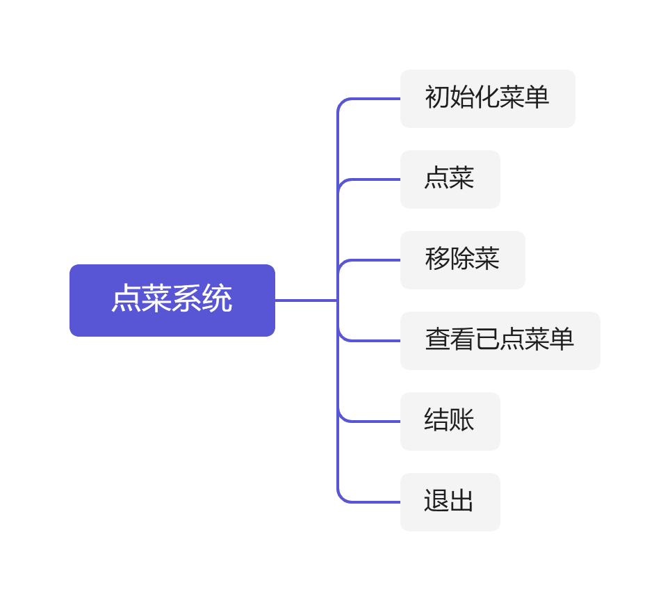

## 功能预览

### 系统菜单

进入我们的点菜系统之后，一般都是有系统菜单的，用于提示我们进行下一步的操作。

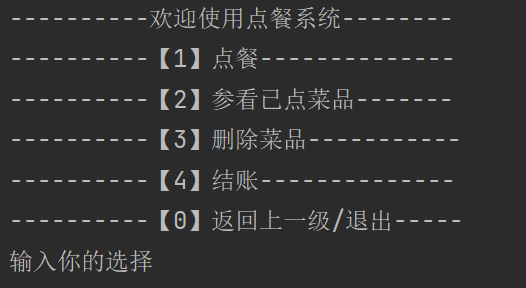

### 点菜

根据系统菜单进入点菜功能后，输入菜品序号进行点菜以及返回上一级菜单。

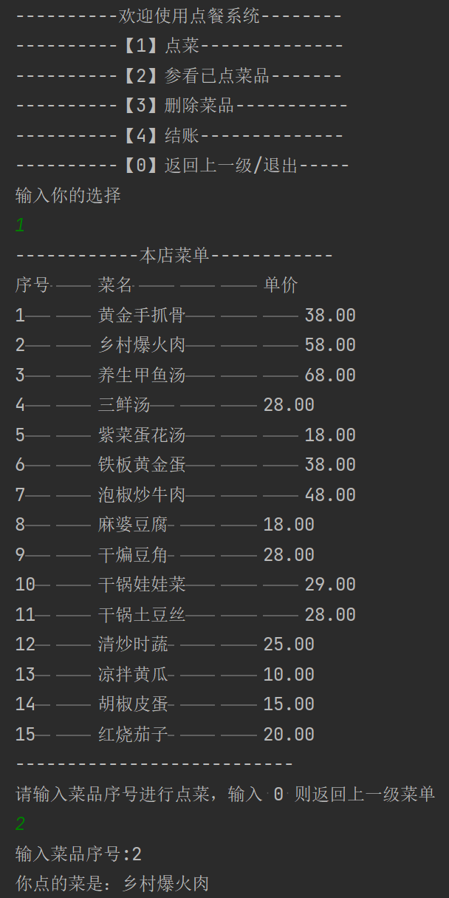

### 查看已点菜品

假设我们点完菜之后，要确认下有没有点重复的菜，此时就可以查看已点菜品。

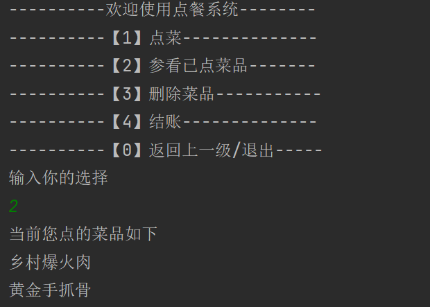

当然，上图是我们已经点过菜才会出现菜品，如果我们还没有点过菜，那么系统则会提示还未点菜。

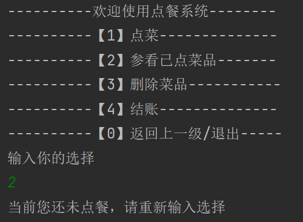


### 删除菜品

假设我们不小心点了重复的菜，那该怎么办呢？不用担心，我们直接选择删除菜品功能，然后删除对应重复菜品即可。

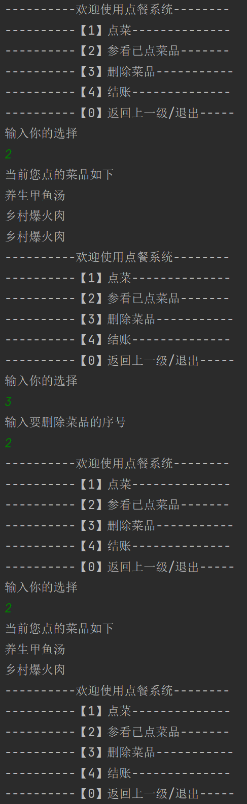

同样的，加入我们还未点菜就进入删除菜品功能，系统也会给出提示。

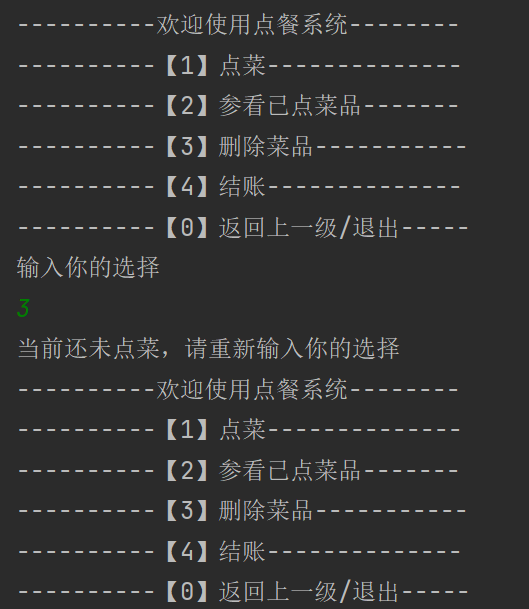

### 结账

当我们用完餐之后，接下来就是结账了。此时只要进入我们的结账选项，系统就会打印出本次所消费的所有金额。

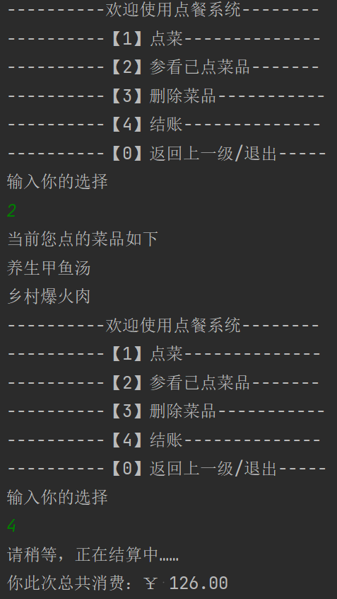

同样的，加入我们还未点菜就进入结账功能，系统也会给出提示。

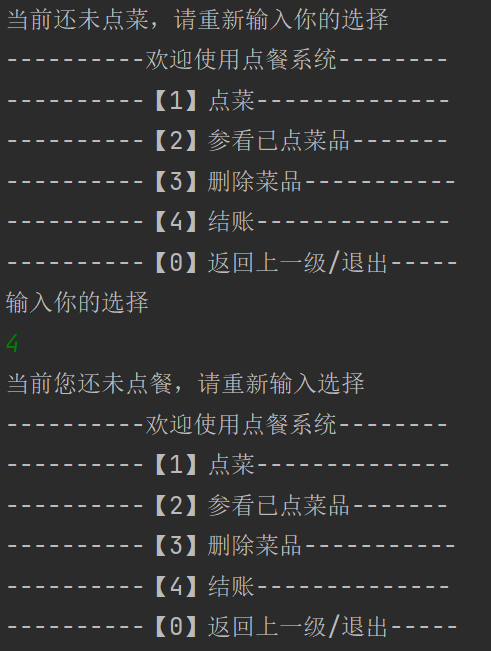

### 退出系统

当我们输入选择为 0 时，表示我们退出系统。

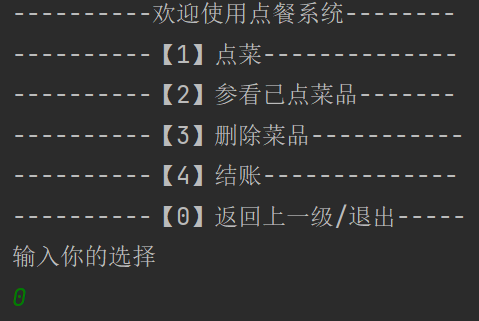

## 功能实现

### 主界面

系统主界面，主要是打印出功能选择菜单，然后根据我们的输入选择不同的子功能。

```java
package com.cunyu;

import java.util.ArrayList;
import java.util.List;
import java.util.Scanner;

/**
 * Created with IntelliJ IDEA.
 *
 * @author : 村雨
 * @version : 1.0
 * @project : Java 实战
 * @package : com.cunyu
 * @className : DishApp
 * @createTime : 2021/7/31 17:30
 * @email : 747731461@qq.com
 * @公众号 : 村雨遥
 * @website : https://cunyu1943.github.io
 * @description : 系统主界面
 */
public class DishApp {

    public static void main(String[] args) {
        Dish dish = new Dish();
        // 初始化菜单
        List<Dish> dishList = dish.initMenu();

        Scanner scanner = new Scanner(System.in);

        List<Dish> orderedList = new ArrayList<>();
        while (true) {
            System.out.println("----------欢迎使用点餐系统--------");
            System.out.println("----------【1】点菜--------------");
            System.out.println("----------【2】参看已点菜品-------");
            System.out.println("----------【3】删除菜品-----------");
            System.out.println("----------【4】结账--------------");
            System.out.println("----------【0】返回上一级/退出-----");

            System.out.println("输入你的选择");
            String choice = scanner.next();
            switch (choice) {
                case "1":
                    while (true) {
                        dish.showMenu(dishList);
                        System.out.println("请输入菜品序号进行点菜，输入 0 则返回上一级菜单");
                        int id = scanner.nextInt();
                        if (id == 0) {
                            break;
                        }

                        System.out.println("输入菜品序号:" + id);

                        System.out.println("你点的菜是：" + dishList.get(id - 1).getName());
                        // 把已点的菜加入已点菜单
                        orderedList.add(dishList.get(id - 1));
                    }
                    break;
                case "2":
                    dish.showOrderedMenu(orderedList);
                    break;
                case "3":
                    if (orderedList.isEmpty()) {
                        System.out.println("当前还未点菜，请重新输入你的选择");
                    } else {
                        System.out.println("输入要删除菜品的序号");
                        int id = scanner.nextInt();
                        dish.deleteDish(id, dishList, orderedList);
                    }
                    break;
                case "4":
                    dish.checkout(orderedList);
                    break;

                case "0":
                    System.exit(0);
                default:
                    break;
            }
        }
    }
}
```

### 主类设计

主要涉及的菜品，于是定义一个菜品类，主要包括序号、菜品名、菜品单价三个属性。

```java
package com.cunyu;

/**
 * Created with IntelliJ IDEA.
 *
 * @author : 村雨
 * @version : 1.0
 * @project : Java 实战
 * @package : com.cunyu
 * @className : Dish
 * @createTime : 2021/7/31 17:27
 * @email : 747731461@qq.com
 * @公众号 : 村雨遥
 * @website : https://cunyu1943.github.io
 * @description : 菜品类
 */
public class Dish {
    /**
     * 编号
     */
    private int id;
    /**
     * 菜名
     */
    private String name;
    /**
     * 价格
     */
    private double price;

    public int getId() {
        return id;
    }

    public void setId(int id) {
        this.id = id;
    }

    public String getName() {
        return name;
    }

    public void setName(String name) {
        this.name = name;
    }

    public double getPrice() {
        return price;
    }

    public void setPrice(double price) {
        this.price = price;
    }

    public Dish() {
    }

    public Dish(int id, String name, double price) {
        this.id = id;
        this.name = name;
        this.price = price;
    }
}
```

### 功能接口

上次的文章中，读者建议我把各个功能独立出接口，然后再实现，所以这里先将各个功能的接口给出来。

```java
package com.cunyu;

import java.util.List;

/**
 * Created with IntelliJ IDEA.
 *
 * @author : 村雨
 * @version : 1.0
 * @project : Java 实战
 * @package : com.cunyu
 * @className : DishInterface
 * @createTime : 2021/7/31 20:26
 * @email : 747731461@qq.com
 * @公众号 : 村雨遥
 * @website : https://cunyu1943.github.io
 * @description :
 */
public interface DishInterface {
    /**
     * 初始化菜单
     *
     * @return 返回餐厅当前所提供的菜品列表
     */
    public List<Dish> initMenu();

    /**
     * 显示菜单
     *
     * @param dishList 菜品列表
     */
    public void showMenu(List<Dish> dishList);


    /**
     * 显示已经点过的菜品
     *
     * @param orderedList 当前已点菜品
     */
    public void showOrderedMenu(List<Dish> orderedList);

    /**
     * 移除菜品
     *
     * @param id          菜品对应序号
     * @param dishList    菜品列表
     * @param orderedList 已点菜品列表
     */
    public void deleteDish(int id, List<Dish> dishList, List<Dish> orderedList);

    /**
     * 结账
     *
     * @param orderedList
     */
    public void checkout(List<Dish> orderedList);
}

```

### 初始化菜单

一般餐馆都是提供的固定的菜单，所以这里没有给出管理菜单的功能，直接进行初始化后给出各个菜品，将其存入列表中。

```java
/**
     * 初始化菜单
     *
     * @return 初始化后的菜单
     */
public List<Dish> initMenu() {
    List<Dish> dishList = new ArrayList<>();
    dishList.add(new Dish(1, "黄金手抓骨", 38));
    dishList.add(new Dish(2, "乡村爆火肉", 58));
    dishList.add(new Dish(3, "养生甲鱼汤", 68));
    dishList.add(new Dish(4, "三鲜汤", 28));
    dishList.add(new Dish(5, "紫菜蛋花汤", 18));
    dishList.add(new Dish(6, "铁板黄金蛋", 38));
    dishList.add(new Dish(7, "泡椒炒牛肉", 48));
    dishList.add(new Dish(8, "麻婆豆腐", 18));
    dishList.add(new Dish(9, "干煸豆角", 28));
    dishList.add(new Dish(10, "干锅娃娃菜", 29));
    dishList.add(new Dish(11, "干锅土豆丝", 28));
    dishList.add(new Dish(12, "清炒时蔬", 25));
    dishList.add(new Dish(13, "凉拌黄瓜", 10));
    dishList.add(new Dish(14, "胡椒皮蛋", 15));
    dishList.add(new Dish(15, "红烧茄子", 20));
    return dishList;
}
```

### 展示菜品列表

初始化菜单后，把整个菜单展示给顾客看。

```java
/**
     * 展示菜单
     *
     * @param dishList 菜品列表
     */
public void showMenu(List<Dish> dishList) {
    System.out.println("------------本店菜单------------");
    System.out.println("序号\t\t菜名\t\t\t\t单价");
    for (int i = 0; i < dishList.size(); i++) {
        System.out.format("%d\t\t%s\t\t\t%.2f\n", dishList.get(i).getId(), dishList.get(i).getName(), dishList.get(i).getPrice());
    }
    System.out.println("---------------------------");
}
```

### 展示已点菜品

```java
/**
     * 查看已点的菜
     */
public void showOrderedMenu(List<Dish> orderedList) {
    if (orderedList.isEmpty()) {
        System.out.println("当前您还未点餐，请重新输入选择");
    } else {
        System.out.println("当前您点的菜品如下");
        for (int i = 0; i < orderedList.size(); i++) {
            System.out.println(orderedList.get(i).getName());
        }
    }

}
```

### 移除菜品

找到对应序号对应的菜品，然后将其移除。

```java
/**
     * 删除对应菜品
     *
     * @param id          菜品对应序号
     * @param dishList    菜品列表
     * @param orderedList 已点菜品列表
     */
public void deleteDish(int id, List<Dish> dishList, List<Dish> orderedList) {
    if (!orderedList.isEmpty()) {
        orderedList.remove(dishList.get(id - 1));
    }
}
```

### 结账

先判断是否点菜，如果没有则提示，若已经点过餐，则直接结账。

```java
/**
     * 结账
     */
public void checkout(List<Dish> orderedList) {
    double money = 0.0d;
    if (orderedList.isEmpty()) {
        System.out.println("当前您还未点餐，请重新输入选择");
    } else {
        System.out.println("请稍等，正在结算中……");
        for (int i = 0; i < orderedList.size(); i++) {
            money += orderedList.get(i).getPrice();
        }
        System.out.format("你此次总共消费：￥ %.2f\n", money);
    }
}
```

## 总程序

好了，实现以上各个模块功能之后，将其整合到一起，就得到我们最后的总体程序。

各部分的代码都已经贴出来的，不过为了大家更方便，我这这里给出总程序结构。

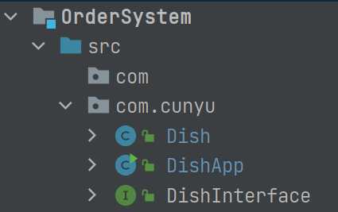

所有代码均位于 `com.cunyu` 包下，然后分别是实体类 `Dish`、接口类 `DishInterface` 以及主程序 `DishApp`。

## 总结

好了，以上就是我们点菜系统的实现了。如果你对 Java SE 部分的知识掌握较好的话，这一定不是啥难事，毕竟是个十分简单的控制台程序，主要语法熟悉，稍微理理逻辑即可。

好了，今天的内容就到此结束了，如果你有什么好的建议，欢迎留言交流。

最后的最后，贴出本设计的 Github 仓库地址：https://github.com/cunyu1943/java-in-actions

有需要的童鞋可以自取，当然了，也希望大家给我一个⭐ **star**，满足一下我这个菜鸟的虚荣心呀 ~ :heart::heart::heart: