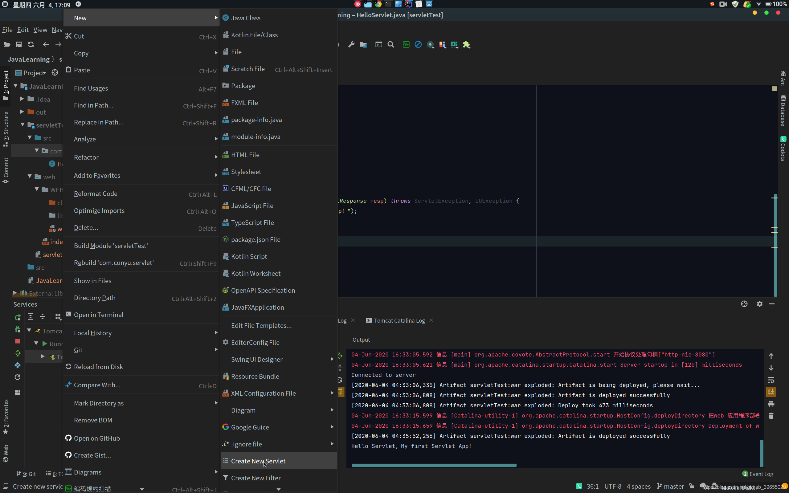
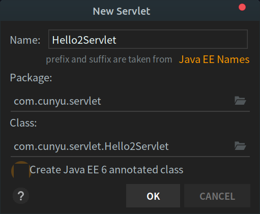
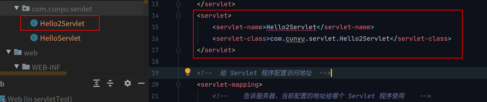
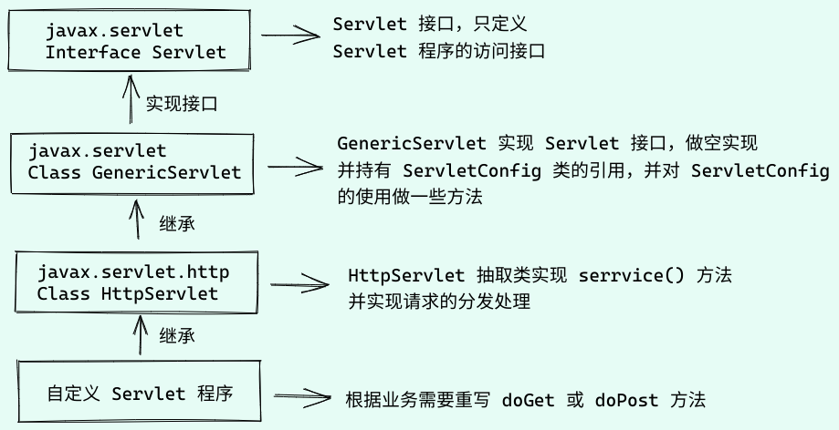
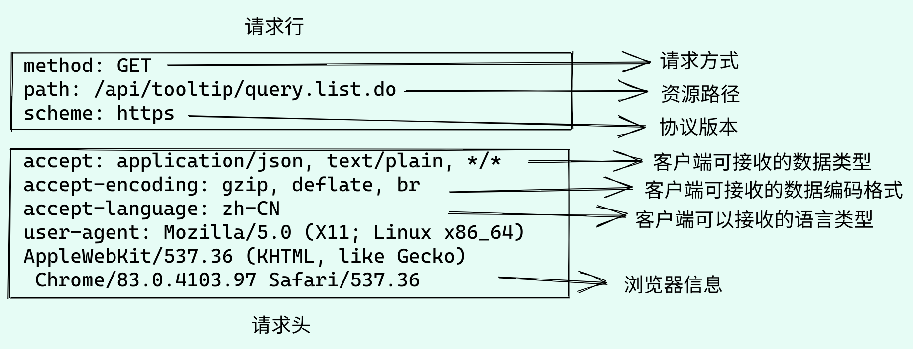
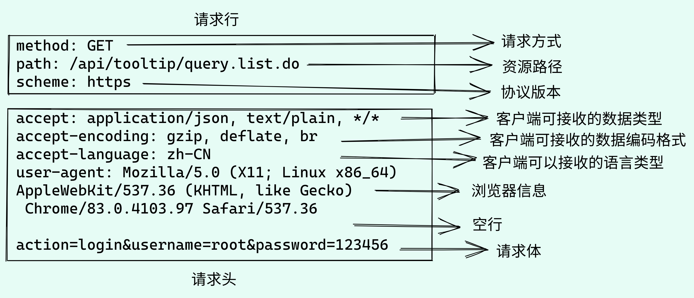
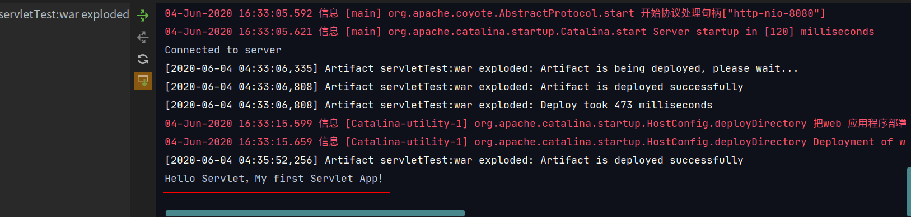
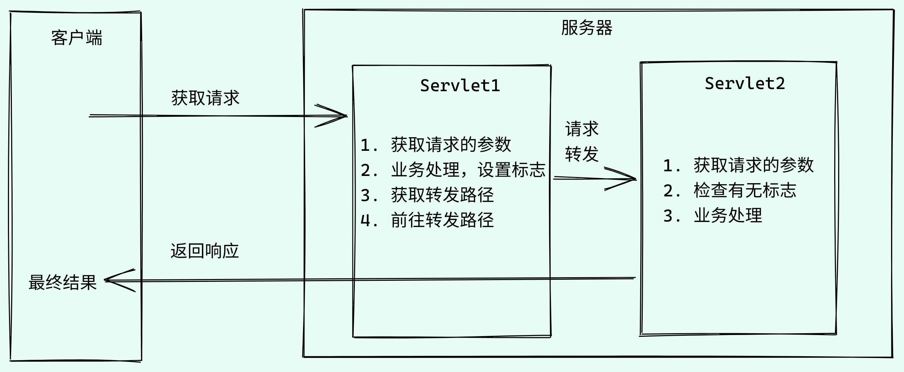
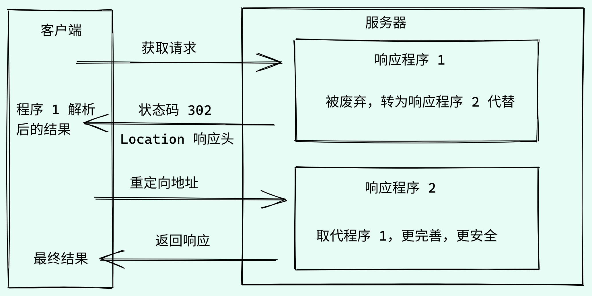

# Servlet 详细教程

## 1. Servlet 程序

### 1.1 什么是 Servlet

1. Servlet 是 JavaEE 规范（接口）之一
2. Servlet 是 JavaWeb 三大组件之一，三大组件分别是：**Servlet 程序、Filter 过滤器、Listener 监听器**
3. Servlet 是运行在服务器上的 Java 小程序，用于 **接收客户端发送的数据，同时响应给客户端**

### 1.2 如何手动创建实现 Servlet 接口

1. 首先编写一个类，用于实现 Servlet 接口

2. 重写 service 方法，用于处理客户端请求，同时响应数据

```java
package com.cunyu.servlet;

import javax.servlet.ServletException;
import javax.servlet.http.HttpServlet;
import javax.servlet.http.HttpServletRequest;
import javax.servlet.http.HttpServletResponse;
import java.io.IOException;

/**
 * Created with IntelliJ IDEA.
 * Version : 1.0
 * Author  : 村雨遥
 * Email   : cunyu1024@foxmail.com
 * Website : https://cunyu1943.github.io
 * 公众号   ：村雨遥
 * Date    : 2020/6/4 下午3:08
 * Project : JavaLearning
 * Package : com.cunyu.servlet
 * Class   : HelloServlet
 * Desc    : Hello 启动页
 */
public class HelloServlet extends HttpServlet {
    /**
     * service 专门用于处理请求和响应的方法
     *
     * @param req  请求
     * @param resp 响应
     * @throws ServletException
     * @throws IOException
     */
    @Override
    protected void service(HttpServletRequest req, HttpServletResponse resp) throws ServletException, IOException {
        System.out.println("Hello Servlet，My first Servlet App！");
    }
}

```

3. 完成上述步骤后，去 `web.xml` 中配置 Servlet 接口的访问地址

```xml
<?xml version="1.0" encoding="UTF-8"?>
<web-app xmlns="http://xmlns.jcp.org/xml/ns/javaee"
         xmlns:xsi="http://www.w3.org/2001/XMLSchema-instance"
         xsi:schemaLocation="http://xmlns.jcp.org/xml/ns/javaee http://xmlns.jcp.org/xml/ns/javaee/web-app_4_0.xsd"
         version="4.0">
    
    <!--  给 Tomcat 配置 Servlet 程序 -->
    <servlet>
        <!--    Servlet 程序别名（建议为类名）    -->
        <servlet-name>HelloServlet</servlet-name>
        <!--    Servlet 程序的全类名    -->
        <servlet-class>com.cunyu.servlet.HelloServlet</servlet-class>
    </servlet>

    <!--  给 Servlet 程序配置访问地址  -->
    <servlet-mapping>
        <!--    告诉服务器，当前配置的地址给哪个 Servlet 程序使用    -->
        <servlet-name>HelloServlet</servlet-name>
        <!--    配置访问地址，表示地址为 http://ip:port/工程路径/hello    -->
        <url-pattern>/hello</url-pattern>
    </servlet-mapping>
</web-app>
```

4. 启动 Tomcat 在浏览器中访问 `http://localhost:8080/servletTest/hello`，然后后台就会执行 `service()` 方法


### 1.3 Servlet 的生命周期

1. 执行 Servlet 构造器方法，只在第一次访问时创建 Servlet 程序会调用
2. 执行 `init` 初始化方法，只在第一次访问时创建 Servlet 程序会调用
3. 执行 `service()` 方法，每次访问均调用
4. 执行 `destory()` 销毁方法，Web 工程停止时调用

### 1.4 如何通过 IDEA 快速创建 Servlet 程序

选中 `src` 目录或者要生成 Servlet 的包，然后单击鼠标右键，`New -> Create New Servlet`，接着填写 Servlet 程序名，所属包以及 Servlet 全类名，同时 **取消勾选** Java EE 6 即可，勾选则会生成注解式配置，后续学习过程中才会接触到。





点击生成之后，就会生成 Servlet 程序以及在 `web.xml` 中的配置。

 

### 1.5 整个 Servlet 类的继承体系



## 2. ServletConfig 类

从类名上就可以看出，ServletConfig 是一个配置信息类。Servlet 程序和 ServletConfig 对象均由 Tomcat 创建，而我们只要使用就可以了。此外，Servlet 程序默认是在第一次访问时就创建了，而 **ServletConfig 对象则是每个 Servlet 程序创建时所对应创建**。

### 2.1 ServletConfig 类的三大作用

1. 获取 Servlet 程序的别名，即 `web.xml` 中配置的 `servlet-name`
2. 获取初始化参数，即 `web.xml` 中配置的 `init-param`
3. 获取 ServletContext 对象

加入我们的 `web.xml` 配置如下，然后就可以利用 初始化方法来获取上述三个值：

```xml
<?xml version="1.0" encoding="UTF-8"?>
<web-app xmlns="http://xmlns.jcp.org/xml/ns/javaee"
         xmlns:xsi="http://www.w3.org/2001/XMLSchema-instance"
         xsi:schemaLocation="http://xmlns.jcp.org/xml/ns/javaee http://xmlns.jcp.org/xml/ns/javaee/web-app_4_0.xsd"
         version="4.0">

    <!--  给 Tomcat 配置 Servlet 程序 -->
    <servlet>
        <!--    Servlet 程序别名（建议为类名）    -->
        <servlet-name>HelloServlet</servlet-name>
        <!--    Servlet 程序的全类名    -->
        <servlet-class>com.cunyu.servlet.HelloServlet</servlet-class>

        <init-param>
            <param-name>userName</param-name>
            <param-value>root</param-value>
        </init-param>
    </servlet>


    <!--  给 Servlet 程序配置访问地址  -->
    <servlet-mapping>
        <!--    告诉服务器，当前配置的地址给哪个 Servlet 程序使用    -->
        <servlet-name>HelloServlet</servlet-name>
        <!--    配置访问地址，表示地址为 http://ip:port/工程路径/hello    -->
        <url-pattern>/hello</url-pattern>
    </servlet-mapping>


</web-app>

```

```java
package com.cunyu.servlet;

import javax.servlet.ServletConfig;
import javax.servlet.ServletException;
import javax.servlet.http.HttpServlet;
import javax.servlet.http.HttpServletRequest;
import javax.servlet.http.HttpServletResponse;
import java.io.IOException;

/**
 * Created with IntelliJ IDEA.
 * Version : 1.0
 * Author  : 村雨遥
 * Email   : cunyu1024@foxmail.com
 * Website : https://cunyu1943.github.io
 * 公众号   ：村雨遥
 * Date    : 2020/6/4 下午3:08
 * Project : JavaLearning
 * Package : com.cunyu.servlet
 * Class   : HelloServlet
 * Desc    : Hello 启动页
 */
public class HelloServlet extends HttpServlet {
    /**
     * service 专门用于处理请求和响应的方法
     *
     * @param req  请求
     * @param resp 响应
     * @throws ServletException
     * @throws IOException
     */
    @Override
    protected void service(HttpServletRequest req, HttpServletResponse resp) throws ServletException, IOException {
        System.out.println("Hello Servlet，My first Servlet App！");
    }

    @Override
    public void init(ServletConfig config) throws ServletException {
        super.init(config);
        System.out.println("初始化方法");
//        获取 Servlet 程序别名 servlet-name
        System.out.println("别名：" + config.getServletName());
//        获取初始化参数 init-param
        System.out.println("初始化参数：" + config.getInitParameter("userName"));
//        获取 ServletContext 对象
        System.out.println(config.getServletContext());
    }
}
```

## 3. ServletContext 类

### 3.1 ServletContext 是啥

1. ServletContext 是一个接口，用于表示 Servlet 上下文对象

2. ServletContext 对象是一个 **域对象**

3. 每个 Web 工程只对应 **一个** ServletContext 对象实例 
4. 每个 ServletContext 在 Web 工程部署启动时创建，然后在 Web 工程停止时销毁

### 3.2 ServletContext 的作用

1. 获取 `web.xml` 配置中的上下文参数 `context-param`
2. 获取当前 Web 工程路径，如 `/ServletTest`
3. 获取工程部署后在服务器的中的绝对路径，包括各种静态资源等路径
4. ServletContext 是通过 **键值对（Map）** 一样存取数据

以下对上述 4 个作用进行实例介绍，首先在 `web.xml` 加入如下配置，然后通过程序来获取各种参数：

```xml
<!--context-param 是上下文参数，属于 Web 工程-->
    <context-param>
        <param-name>wechat</param-name>
        <param-value>cunyu1943</param-value>
    </context-param>

    <servlet>
        <servlet-name>ServletContextServlet</servlet-name>
        <servlet-class>com.cunyu.servlet.ServletContextServlet</servlet-class>
    </servlet>

    <servlet-mapping>
        <servlet-name>ServletContextServlet</servlet-name>
        <url-pattern>/servletContext</url-pattern>
    </servlet-mapping>
```

```java
package com.cunyu.servlet;

import javax.servlet.ServletContext;
import javax.servlet.ServletException;
import javax.servlet.http.HttpServlet;
import javax.servlet.http.HttpServletRequest;
import javax.servlet.http.HttpServletResponse;
import java.io.IOException;

/**
 * Created with IntelliJ IDEA.
 * Version : 1.0
 * Author  : 村雨遥
 * Email   : cunyu1024@foxmail.com
 * Website : https://cunyu1943.github.io
 * 公众号   ：村雨遥
 * Date    : 2020/6/5 上午8:36
 * Project : JavaLearning
 * Package : ${PACKAGE_NAME}
 * Class   : ${CLASS_NAME}
 * Desc    : ServletContext 功能
 */
public class ServletContextServlet extends HttpServlet {

    @Override
    protected void doGet(HttpServletRequest request, HttpServletResponse response) throws ServletException, IOException {
//        1. 获取上下文参数 context-param
        ServletContext servletContext = getServletContext();
        String url = servletContext.getInitParameter("url");
        System.out.println("URL 的值是：" + url);

//        2. 获取工程路径
        System.out.println("工程路径：" + servletContext.getContextPath());

//        3. 获取工程部署后服务器上的绝对路径
//        其中 / 被解析为：http://ip:port/工程名/ ，映射到 IDEA 代码的 web 目录
        System.out.println("工程部署绝对路径：" + servletContext.getRealPath("/"));

//        4. 通过 键值对 存取数据，注意：ServletContext 属于 Web 工程，所以只要工程启动创建之后，Servlet 程序都能访问，直到关停 Web 工程
        System.out.println("ServletContext 对象:" + servletContext);
//        存数据
        servletContext.setAttribute("password", "1234567");
//        取数据
        System.out.println("password 的值是：" + servletContext.getAttribute("password"));
    }
}
```

## 4. HTTP 协议

### 4.1 什么是 HTTP 协议

**协议** 即指两方或多方通过一定协商约定后，大家都要遵守的规则，叫做协议。

而 **HTTP 协议** ，即指 **客户端和服务器之间互相通信时，发送数据时所需要遵守的规则**，HTTP 协议中的数据又叫做 **报文**。

### 4.2 请求的 HTTP 协议格式

客户端向服务器发送数据的行为叫做 **请求**，而服务器向客户端回传数据的行为叫做 **响应**。

#### GET 请求

由 **请求行 + 请求头** 组成，其中 **请求行** 包括 **请求的方式、请求的资源路径以及请求的协议版本号**，而 **请求头** 则是由 `key-value` 对组成，不同键值对对应不同含义，具体请看如下图实例。GET 请求最常用的地方：

1.  `form` 标签 `method=get`
2.  `a` 标签
3.  `link` 标签引入 `css`
4.  `Script` 标签引入 `js` 
5.  `img` 标签引入图片
6.  `iframe` 引入 HTML 页面
7.  浏览器中地址栏输入地址后回车



#### POST 请求

POST 请求和 GET 的最大区别在于 **请求头（即发送给服务器的数据）**，POST 由 **请求行 + 请求头 + 请求体** 组成，其中请求行与请求头的含义和 GET 请求的含义相同，而 **请求头则是 POST 方式独有**，具体含义如下，最常用的地方：

1. `form` 标签 `method=post`



### 4.3 响应的 HTTP 协议格式

响应主要由 **响应行 + 响应头 + 响应体** 共同组成，响应行中又包括 **响应的协议和版本号、响应状态码以及响应状态描述符**，而 **响应头则是同样由不同的键值对组成**，**响应体中则是回传给客户端的数据**，具体看下边的示例：



### 4.4 常用响应码

| 响应码 | 说明                                                   |
| ------ | ------------------------------------------------------ |
| 200    | 请求成功                                               |
| 302    | 请求重定向                                             |
| 404    | 请求服务器已经收到，但需要的数据不存在（请求地址错误） |
| 500    | 服务器已经收到请求，但服务器内部错误（代码错误）       |

### 4.5 MIME 类型说明

MIME 全称 **多功能 Internet 邮件扩充服务** `（Multipurpose Internet Mail Extension）` ，是 HTTP 协议中的数据类型，格式是 **大类型/小类型**，并与某种文件扩展名相对应，最常见的 MIME 类型如下：

| 文件类型           | 文件扩展名    | MIME 类型                  |
| ------------------ | ------------- | -------------------------- |
| 超文本标记语言文本 | `.html、.htm` | `text/html`                |
| 普通文本           | `.txt`        | `text/plain`               |
| RTF 文本           | `.rtf`        | `application/rtg`          |
| GIF 图形           | `.gif`        | `image/gif`                |
| JPEG 图形          | `.jpeg、.jpg` | `image/jpeg`               |
| au 声音文件        | `.au`         | `audio/basic`              |
| MIDI 音乐文件      | `.mid、.midi` | `audio/midi、audio/x-midi` |
| RealAudio 音乐文件 | `.ra、.ram`   | `audio/x-pn-realaudio`     |
| MPEG 文件          | `.mpg、.mpeg` | `video/mpeg`               |
| AVI 文件           | `.avi`        | `video/x-msvideo`          |
| GZIP 文件          | `.gz`         | `application/x-gzip`       |
| TAR 文件           | `.tar`        | `application/x-tar`        |

## 5 HttpServletRequest 类

### 5.1 HttpServletRequest 类的作用

当每次 Tomcat 服务器接收到来自浏览器的请求时，Tomcat 服务器都会把请求过来的 HTTP 协议信息解析好封装到 `Request` 对象中，然后传递到 `service` 方法（`doGet` 和 `doPost`）供浏览器使用。而我们则可以通过 `HttpServletRequest` 对象获取到 **所有请求的信息**。

### 5.2 HttpServletRequest 类常用方法

| 方法                       | 说明                                 |
| -------------------------- | ------------------------------------ |
| `getRequestURI()`          | 获取请求的资源路径                   |
| `getRequestURL()`          | 获取请求的统一资源定位符（绝对路径） |
| `getRemoteHost()`          | 获取客户端的 ip                      |
| `getHeader()`              | 获取请求头                           |
| `getParameter()`           | 获取请求的参数                       |
| `getParameterValues()`     | 获取请求的参数（多个值）             |
| `getMethod()`              | 获取请求的方式 GET 或 POST           |
| `setAttribute(key, value)` | 设置域数据                           |
| `getAttribute(key)`        | 获取域数据                           |
| `getRequestDispatcher()`   | 获取请求转发对象                     |

### 5.3 POST 和 GET 请求方式的中文乱码问题

当以 POST 或 GET 方式请求时，遇到中文可能会出现乱码，对应解决方法如下：

- **POST 方式**：直接将请求体的字符集设置为 UTF-8 即可
- **GET 方式**：先以 iso8859-1 进行编码，然后再以 UTF-8 进行解码

```java
package com.cunyu.servlet;

import javax.servlet.ServletException;
import javax.servlet.http.HttpServlet;
import javax.servlet.http.HttpServletRequest;
import javax.servlet.http.HttpServletResponse;
import java.io.IOException;

/**
 * Created with IntelliJ IDEA.
 * Version : 1.0
 * Author  : 村雨遥
 * Email   : cunyu1024@foxmail.com
 * Website : https://cunyu1943.github.io
 * 公众号   ：村雨遥
 * Date    : 2020/6/6 下午9:18
 * Project : JavaLearning
 * Package : ${PACKAGE_NAME}
 * Class   : ${CLASS_NAME}
 * Desc    : 获取请求参数中文乱码问题
 */
public class ParameterServlet extends HttpServlet {
    @Override
    protected void doPost(HttpServletRequest req, HttpServletResponse resp) throws ServletException, IOException {
//        POST 中文乱码，设置请求体字符集 UTF-8，要在获取参数前调用
        req.setCharacterEncoding("UTF-8");
        System.out.println(req.getParameter("hobby"));

    }

    @Override
    protected void doGet(HttpServletRequest request, HttpServletResponse response) throws ServletException, IOException {
        String username = request.getParameter("username");
        String password = request.getParameter("password");

//        GET 中文乱码
//        先以 iso8859-1 进行编码
//        然后以 UTF-8 进行解码
        username = new String(username.getBytes("ISO-8859-1"), "UTF-8");
        System.out.println("用户名：" + username);
        System.out.println("密码：" + password);
    }
}
```

### 5.4 请求的转发

#### 定义

请求的转发即 **当服务器收到来自客户端的请求时，从一个资源跳转到另一个资源的操作**。



#### 特点

- 地址栏未变
- 属于一次请求
- 共享 Request 域中的参数
- 可以转发到 WEB-INF 目录下
- 不能访问工程之外的资源

### 5.5 base 标签的作用

用于设置页面相对路径工作时参照的路径，参照某一地址进行跳转。

```html
<base href="https:cunyu1943.github.io">
```

### 5.6 Web 中 / 的不同意义

在 Web 中 /  是一种绝对路径，若 **被浏览器解析**，则得到的地址是 ：`http:/ip:port/`；若 **被服务器解析**，则得到的地址是：`http://ip:port/工程路径`。

**注意： `response.sendRedirect("/");`**，表示将 / 发送给浏览器解析，得到 `http://ip:port/`

## 6. HttpServletResponse 类

### 6.1 HttpServletResponse 的作用

同 `HttpServletRequest` 类一样，当每次来自客户端的请求进来时，服务器都会创建一个 `Response` 对象，然后传递给 Servlet 程序使用。**`HttpServletRequest` 表示请求过来的信息，`HttpServletResponse` 则表示所有响应的信息。** 当设置服务器返回给客户端信息时，通过 `HttpServletResponse` 对象进行。

### 6.2 两个输出流

输出流分为 **字节流和字符流**，两者对应的方法和功能如下表所示，当我们使用时，**只能同时使用其中之一** 。

| 输出流类型 | 方法                | 功能                         |
| ---------- | ------------------- | ---------------------------- |
| 字节流     | `getOutputStream()` | 常用于下载（传递二进制数据） |
| 字符流     | `getWriter()`       | 常用于回传字符串             |

### 6.3 如何向客户端回传数据及中文乱码

通常我们需要向客户端回传数据，如果是回传字符串等数据，我们可以使用 **字符流方法 `getWriter()`**。

```java
public class ResponseIOServlet extends HttpServlet{
    @Override
    protected void doGet(HttpServletRequest req, HttpSevletResponse resp) throws ServletException, IOException{
        // 向客户端回传 字符串 数据
        PrintWriter writer = resp.getWriter();
        writer.write("response's content!!!");
    }
}
```

但当我们回传中文时，可能会出现乱码问题，为了解决这一问题，通常有两种解决方案：

1. 设置服务器字符集为 UTF-8，同时通过响应头设置浏览器也使用 UTF-8 字符集

```java
// 设置服务器字符集
resp.setCharacterEncoding("UTF-8");
// 通过响应头设置浏览器字符集
resp.setHeader("Content-Type", "text/html;charset=UTF-8");
```

2. 同时设置服务器和客户端均使用 UTF-8 字符集，但是必须在获取流对象之前调用，**更为推荐**

```java
// 同时设置服务器和客户端字符集
resp.setContentType("text/html;charset=UTF-8")
```

### 6.4 请求重定向

#### 定义

请求重定向是 **指客户端给服务器发送请求，然后服务器回传给客户端一些地址，然客户端去访问。之所以叫做重定向，是因为之前的地址可能已经被废弃**。



#### 特点

1. 地址栏变化
2. 两次请求
3. 不共享 Request 域中数据
4. 不能重定向到 WEB-INF 目录下资源
5. 能访问工程外的资源

#### 实现重定向的两种方式

1. 设置响应状态码 302 表示重定向，然后通过设置响应头说明新地址

```java
// 设置响应状态码
resp.setStatus(302);
// 通过设置响应头，说明新地址
resp.setHeader("Location", "https://cunyu1943.github.io");
```

2. 直接使用 `sendRedirect()` 方法设置新地址即可，**更为推荐**

```java
resp.sendRedirect("https://cunyu1943.github.io");
```