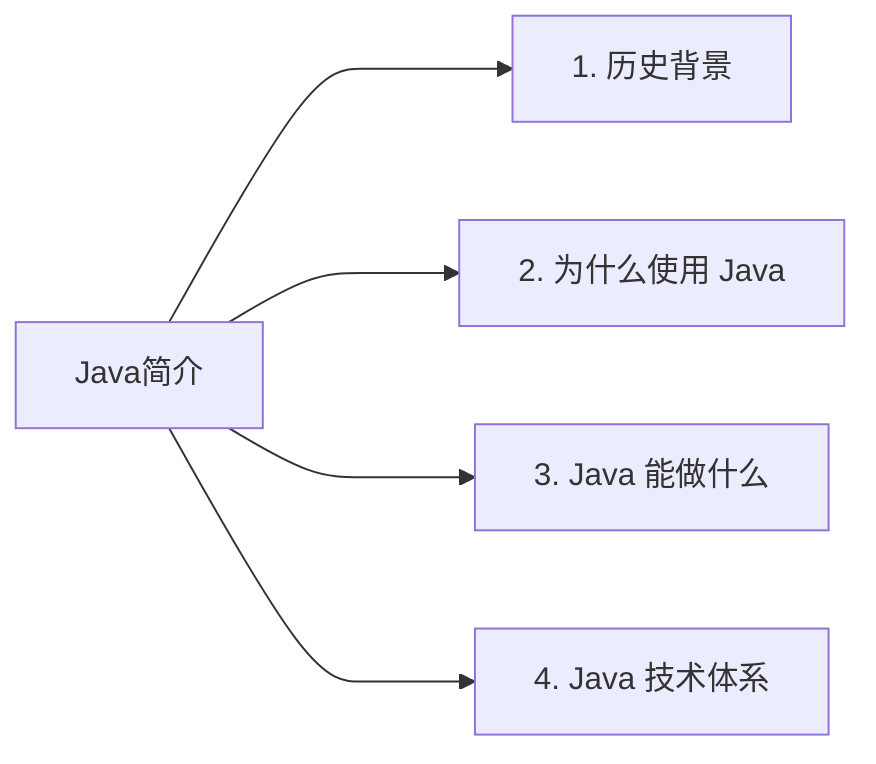
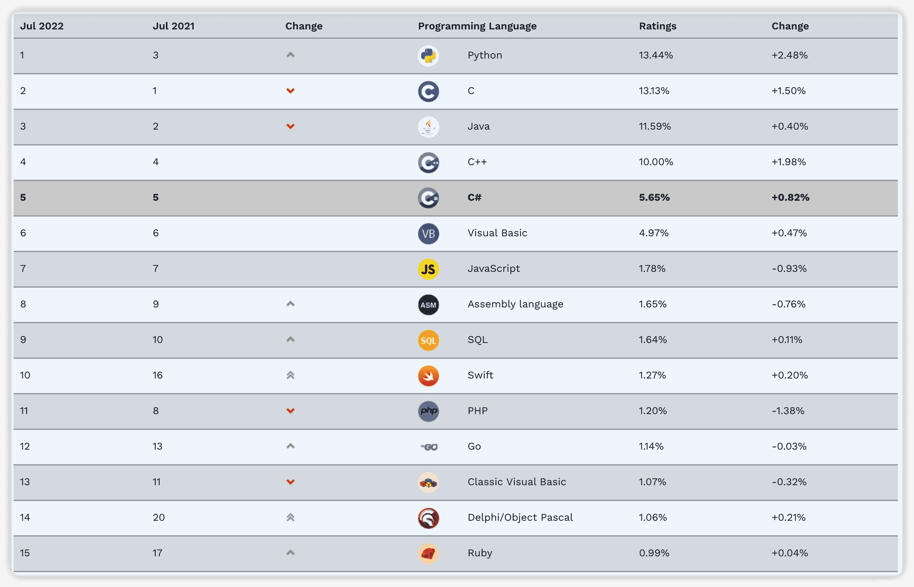
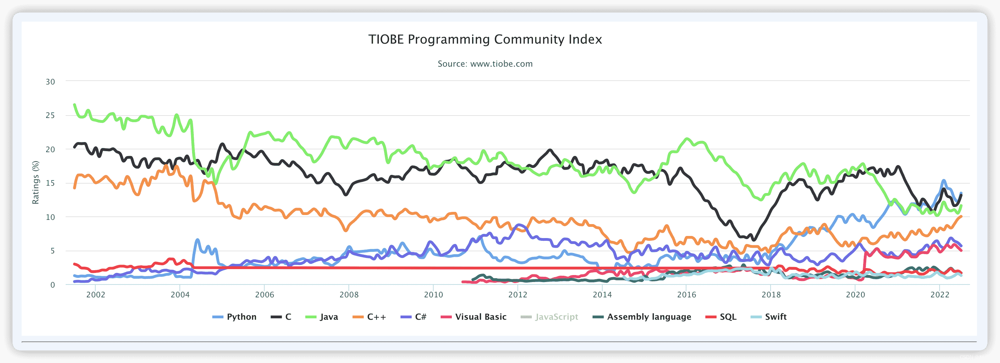
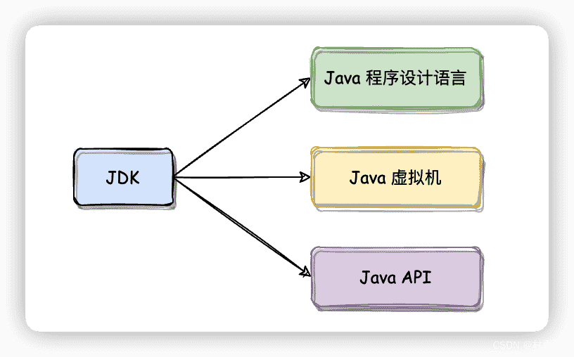
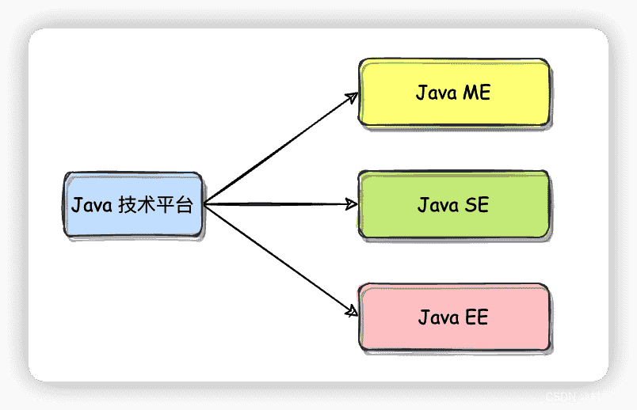

# Java 入门简介

::: info 共勉
不要哀求，学会争取。若是如此，终有所获。
:::
::: tip 原文
https://mp.weixin.qq.com/s/aGz8CBOK5mW8xjAlstlMQw

:::

## 一、前言

既然要学习一门技术，那么就先来了解下它的历史，我们为什么要使用它，以及我们能用它来干啥。

## 二、历史背景

1990 年代初，`Sun` 公司的詹姆斯·高斯林等人为了实现电视机、电话、闹钟等家用电器的控制和通信，开发了一套用于设置在家用电器等小型系统中的编程语言。在当时，这门语言被命名为 `Oka`。但由于市场需求不高，所以该计划被逐渐放弃。

随着 1990 年代互联网的发展，`Sun` 公司发现 `Oka` 语言在互联网中的应用前景广泛。于是决定对 `Oka` 进行改造，并在 1995 年 5 月以 `Java` 的名义正式发布。

随着互联网的迅猛发展，Java 也得以逐渐成为重要的网络编程语言，詹姆斯·高斯林也被大家公认为 `Java` 之父。

到了 2009 年， `Sun` 公司被 `Oracle` 公司所收购，自此 `Java` 成为 `Oracle` 公司的一大产品直至今日。

以下是截止到本文写作时间（2022 年 7 月 23 日）`Java` 的历史年表，累计经过了 18 次主要版本更新，目前来到了 `Java SE` 18。而 `Java SE` 19 早期预览版也已经流出，根据官方给出的发布时间表，大概会在 9 月份发布 `Java SE` 19 的 `GA` 版本。不过虽然 `Java` 已经经历了这么多版本的更新，但国内目前用的最多的应该还是 Java 1.8 版本。而出于对稳定性的考虑，企业开发更喜欢 `LTS` 版本，这也是为什么至今 `Java` 1.8 还占有如此高的市场比例。

|         版本         |   发布日期    |                              主要事件                              |
| :------------------: | :-----------: | :----------------------------------------------------------------: |
|       JDK Beta       |     1995      | `Java` 语言发布，用 `Java` 实现的浏览器和 `Java Applet` 被大量应用 |
|       JDK 1.0        | 1996 年 1 月  |               奠定了 `JDK`、`JRE`、`JVM` 的体系结构                |
|       JDK 1.1        | 1997 年 2 月  |                    加入 `JIT`，提升 `JDK` 效率                     |
|       J2SE 1.2       | 1998 年 12 月 |                确立 `J2SE`、`J2EE`、`J2ME` 产品结构                |
|       J2SE 1.3       | 2000 年 5 月  |                          内置 HotSpot JVM                          |
|       J2SE 1.4       | 2002 年 2 月  |                   XML 处理、断言、支持正则表达式                   |
|       J2SE 5.0       | 2004 年 9 月  |    静态导入、泛型、for-each 循环、自动拆，装箱、枚举、可变参数     |
|      Java SE 6       | 2006 年 12 月 |                   提供动态语言支持、同步垃圾回收                   |
|      Java SE 7       | 2011 年 7 月  |                  字符串的 switch 语句、多异常捕抓                  |
|   Java SE 8 (LTS)    | 2014 年 3 月  |                           Lambda 表达式                            |
|      Java SE 9       | 2017 年 9 月  |                 轻量级 json API、垃圾收集机制更新                  |
|      Java SE 10      | 2018 年 3 月  |            局部变量类型推断，Java 后续版本快速迭代更新             |
|   Java SE 11 (LTS)   | 2018 年 9 月  |       常用类增强，Java 11 是继 Java 8 之后的首个长期支持本版       |
|      Java SE 12      | 2019 年 3 月  |                         switch 表达式增强                          |
|      Java SE 13      | 2019 年 9 月  |                             文本块支持                             |
|      Java SE 14      | 2020 年 3 月  |                     `instanceof` 支持模式匹配                      |
|      Java SE 15      | 2020 年 9 月  |               `EdDSA` 数字签名算法、 密封类、隐藏类                |
|      Java SE 16      | 2021 年 3 月  |                  启用 C++ 14 语言特性、Vector API                  |
| **Java SE 17 (LTS)** | 2021 年 9 月  |            恢复总是严格的浮点语义、增强型伪随机数生成器            |
|      Java SE 18      | 2022 年 3 月  |            默认 UTF-8 编码、代码片段、简单的网络服务器             |

## 三、为什么使用 Java

既然编程语言有那么多，那我们为什么要使用 Java 语言呢？以下就来看看 Java 被广泛使用的几个原因。

1.  **世界范围内流行，国内使用最为广泛的编程语言之一。**

以下是截止 2022 年 7 月 TIOBE 统计的编程语言排行榜，可以看到 Java 处于前三的位置。而从历年编程语言所占市场份额趋势图也可以看出，Java 虽然没有一直独占鳌头，但绝大数时间都是占据领先地位。

2. **移植性高**

由于 Java 中 JVM 的特性，所以能够做到一次编译，随处运行，其移植性也就更高。

3.  **开发社区完善**

社区完善也是 Java 为什么使用多的原因，各种封装 API，比起 C、C++ 语言使用起来更加方便。虽然 `Python` 的封装程度更高，但是其效率比起 `Java` 却打了折扣。毕竟封装程度和效率是成反比的，`Java` 兼具了效率高和使用方便的特点，所以更受人们青睐。

## 四、Java 能做什么

Java 应用广泛，在我们日常中就能经常见到由 Java 所开发的程序。常见的的应用应用领域如下：

1. **桌面 GUI 应用开发**
2. **服务器系统**
3. **企业级应用开发**
4. **大数据开发**
5. **移动应用开发**
6. **游戏开发**
7. ……

## 五、Java 技术体系

根据传统意义上 Sun 官方定义， Java 技术体系的组成主要就是我们常说的 JDK，即以下三部分：

1.  **Java 程序设计语言**
2.  **Java 虚拟机**
3.  **Java API 类库**

同时，Java 技术体系又可以主要分为以下 3 个平台。

1.  **Java SE**

Java Standard Edition，即 Java 标准版。主要是 Java 技术的核心和基础，要想学好 Java，那么首先你得掌握好这部分。主要运行在桌面级应用，如 Windows 应用程序。

2.  **Java EE**

Java Enterprise Editon，即 Java 企业版。从它的名字就不难看出，这是 Java 针对企业级应用开发所提供的一套解决方案，主要用于架设高性能企业网站。

3.  **Java ME**

Java Micro Edition，即 Java 小型版。主要是 Java 针对移动设备应用所提供的一套解决方案，主要运行在手机、pad 等移动端。

## 六、总结

本文主要从 Java 历史背景、选择 Java 的理由、Java 能做什么、Java 技术体系等 4 方面对 Java 语言做了一个简单介绍。接下来的文章我们就来看看，如何搭建 Java 的开发环境以及实现一个简单的入门程序。

## ⏳ 联系

想解锁更多知识？不妨关注我的微信公众号：**村雨遥（id：JavaPark）**。

扫一扫，探索另一个全新的世界。

<Share colorful />