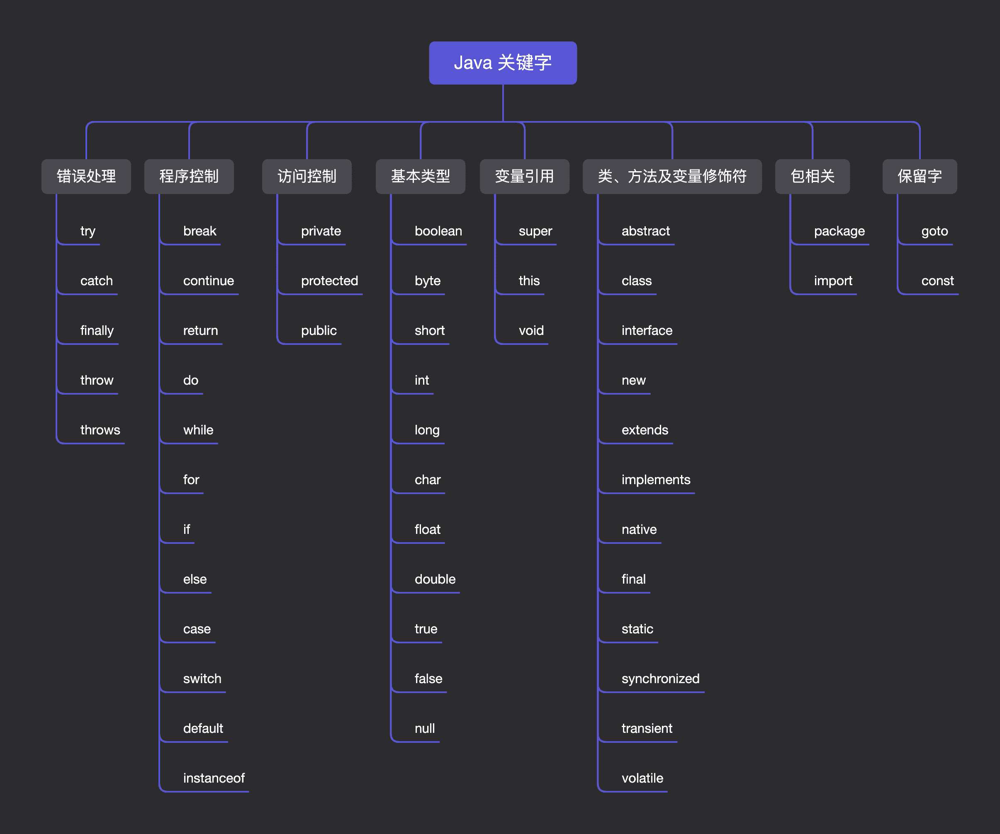
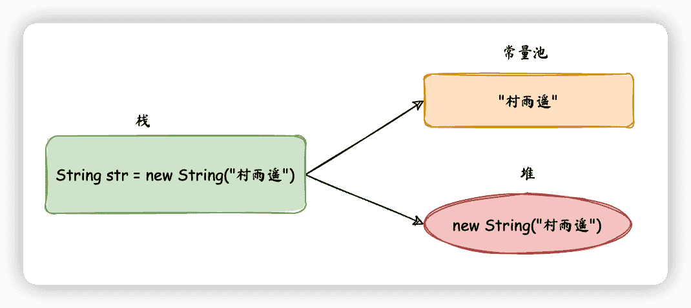
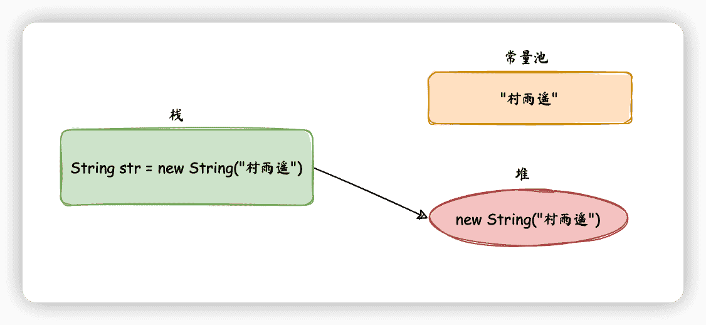

# 变量与数据类型

:::info 共勉
不要哀求，学会争取。若是如此，终有所获。
:::

:::tip


原文：https://mp.weixin.qq.com/s/Yz41IdWSNTgqgj0R-Ffgqw

:::

## 前情回顾

在之前的文章中，我们已经介绍了如何搭建 Java 开发环境以及如何使用 IDEA，现在就开始正式学习 Java 语言的相关语法吧！😎

本期内容预告如下：

1.  **变量**
2.  **数据类型**
3.  **变量作用域**
4.  **常量**

本文将主要从以上四个方面出发，带领大家来看一下 Java 中的变量和数据类型。

## 变量

### 什么是变量？

所谓变量，就是用来命名一个数据的标识符，其定义格式如下：

```java
数据类型 变量名称 = 初始值;
```

其中数据类型是用于限制存储数据的形式，后面会讲到 Java 中的常见数据类型；变量名称是用于代表变量的一个符号，就好比我们每个人的名字；初始值则代表该变量存储时的初始数据。

在 Java 中，变量主要分为两种：

- **基本类型的变量**
- **引用类型的变量**

```java
// 基本类型的变量
int id = 1;
// 引用类型的变量
String name = "村雨遥";
```

其中 `int` 是基本数据类型，表示这是一个整型数；而 `String` 则是引用类型，表示这是一个引用类型；

`id` 和 `name` 则是标识符，也就是我们所说的 **变量**；

`=` 则是赋值操作符，而 `1` 则是基本类型的值，`村雨遥` 则是引用类型的值；

### 变量的特点

在使用变量时，需要注意以下的几个问题。

1.  变量一定要先声明然后再使用。
2.  声明一个变量的类型后，不能用它来存储其他类型的数据。
3.  变量定义时可以不赋初始值，但是在使用时必须赋值。
4.  变量是有使用范围的，在同一使用范围内，不能重复定义同一个变量。
5.  变量最重要的一个特点就是可以重新赋值。

```java
public class Main {
    public static void main(String[] args) {
		// 定义int类型变量id，并赋予初始值1
        int id = 1;
		// 打印该变量的值，观察是否为1
        System.out.println(id);
 		// 重新赋值为2
        id = 2;
        // 打印该变量的值，观察是否为2
        System.out.println(id);
    }
}
```

### 变量命名规则

变量命名也是一门学问，并不是我们想怎么命名就怎么命名，日常开发中最常见的变量命名规则主要有如下几条：

1.  **强制**：变量命名只能使用 **字母（大小写均可）、数字、\$、\_**；
2.  **强制**：变量名不能使用关键字（就是 Java 中内置的一些关键字，如 `int、for、long…`）；
3.  **强制**：变量第一个字符不能使用数字，只能用字母、`$`、`_`；
4.  更多命名规则推荐参考阿里巴巴推出的《Java 开发手册》，下载链接：https://github.com/cunyu1943/ebooks

### 常见关键字

这是一种事先定义好的，有特定意义的标识符，也叫做保留字。对于 Java 编译器有着特殊意义，用来表示一种数据类型，或者表示程序的结构等。此外，关键字不能用作变量名、方法名、类名、包名和参数名。常见的关键字可以分为如下几类，具体的关键字如下图所示：

- **访问控制类**
- **类、方法及变量修饰符类**
- **程序控制类**
- **错误处理**
- **包相关**
- **基本类型**
- **变量引用**
- **保留字**

<!--  -->



## 数据类型

### 基本数据类型

Java 中，共有 8 种基本数据类型，由 Java 语言预定好的，每个数据类型都属于关键字，而且每种基本变量都有其对应的封装类，这 8 种基本数据类型分别是：

- **整型（4 种）**
- **浮点型（2 种）**
- **字符型（1 种）**
- **布尔型（1 种）**

下面的表就是 Java 中 8 大数据类型所占的内存空间，对应封装类，数据表示范围以及默认值的一下相关情况。

| 数据类型  | bit | 字节   | 封装类      | 数据范围                             | 默认值  |
| --------- | --- | ------ | ----------- | ------------------------------------ | ------- |
| `byte`    | 8   | 1      | `Byte`      | $-2^7$ ~ $2^7-1$                     | `0`     |
| `short`   | 16  | 2      | `Short`     | $-2^{15}$ ~ $2^{15}-1$               | `0`     |
| `char`    | 16  | 2      | `Character` | `\u0000` ~ `\uffff`（$0$ ~ $65535$） | `u0000` |
| `int`     | 32  | 4      | `Integer`   | $-2^{31}$ ~ $2^{31}-1$               | `0`     |
| `long`    | 64  | 8      | `Long`      | $-2^{63}$ ~ $2^{63}-1$               | `0L`    |
| `float`   | 32  | 4      | `Float`     | $1.4e^{-45}$ ~ $3.4e^{38}$           | `0.0f`  |
| `double`  | 64  | 8      | `Double`    | $4.9e^{-324}$ ~ $1.8e^{308}$         | `0.0D`  |
| `boolean` | 1   | 不确定 | `Boolean`   | `true` 或 `false`                    | `false` |

**注意：**

1.  `boolean` 一般用 1 `bit` 来存储，但是具体大小并未规定，JVM 在编译期将 `boolean` 类型转换为 `int`，此时 1 代表 `true`，`0` 代表 `false`。此外，JVM 还指出 `boolean` 数组，但底层是通过 `byte` 数组来实现。
2.  使用 `long` 类型时，需要在后边加上 `L/l`，否则将其作为整型解析，可能会导致越界。
3.  浮点数如果没有明确指定 `float` 还是 `double`，统一按 `double` 处理。
4.  `char` 是用 **单引号 `''`** 将内容括起来，**只能存放一个字符**，相当于一个整型值（ASCII 值），能够参加表达式运算；而 `String` 是用 **双引号 `""`** 将内容括起来，代表的是一个地址值。
5.  `Java` 在内存中是采用 `Unicode` 表示，所以无论是一个中文字符还是英文字符，都能用 `char` 来表示。

那么如何给一个基本类型变量赋值呢？

在 `Java` 中，基本数据类型属于 `Java` 的一种内置的特殊数据类型，不属于任何类，所以可以直接对其进行赋值；给基本类型的变量赋值的方式就叫做 **字面值**；

```java
float score = 89.0f;
int age = 26;
```

### 引用数据类型

#### 常见引用数据类型

| 数据类型 | 默认值 |
| -------- | ------ |
| 数组     | `null` |
| 类       | `null` |
| 接口     | `null` |

而对于引用数据类型，我们经常是需要 `new` 关键字来进行赋值，但是引用类型中的 **接口是不能被实例化的，我们需要对其进行实现**；

```java
// 初始化一个对象
Pet dog = new Pet();
// 初始化一个数组
int[] arr = new int[10];
```

#### String

对于引用数据类型中的 `String`，我们需要特别关注。

`String` 不同于 `char`，它属于引用类型，而 `char` 属于基本数据类型。用双引号 `""` 括起来表示字符串，一个字符串能够保存 0 个到任意个字符，它一旦创建就不能被改变。

而针对字符串，如果我们要打印一些特殊的字符，比如字符串本来就包含 `"`，那么这个时候就需要借助于转义字符 `\`，最常见的转义字符主要有：

| 转义字符 | 含义         |
| -------- | ------------ |
| `\"`     | 字符 `"`     |
| `\'`     | 字符 `'`     |
| `\\`     | 字符 `\`     |
| `\n`     | 换行符       |
| `\t`     | 制表符 `Tab` |
| `\r`     | 回车符       |

> 那多个字符串之间或者字符串和其他类型数据之间，该如何进行连接呢？

Java 编译器中，对于字符串和其他数据类型之间，可以使用 `+` 进行连接，编译器会自动将其他数据类型自动转换为字符串，然后再进行连接；

> `String` 既然是不可变，那有什么优点呢？

1.  **用于缓存 `hash` 值**

由于 `String` 的 `hash` 值被频繁使用，它的不可变性使得 `hash` 值也不可变，此时只需要进行一次计算；

2.  **字符串常量池（String Pool）的需要**

如果一个 `String` 对象已经被创建过，那么就会优先从字符串常量池中获取其引用，其不可变性确保了不同引用指向同一 `String` 对象；

3.  **安全性**

我们经常用 `String` 作为我们方法的参数，其不变性能够保证参数不可变；

4.  **线程安全**

`String` 的不可变性让它天生 **具备线程安全**，能够在多个线程中方便使用而不用考虑线程安全问题。

> `String、StringBuilder、StringBuffer` 对比，该如何选择？

|                 | 可变性 | 线程安全                               | 适用场景                                                      |
| --------------- | ------ | -------------------------------------- | ------------------------------------------------------------- |
| `String`        | 不可变 | 安全                                   | 操作少量的数据                                                |
| `StringBuffer`  | 可变   | 安全，内部使用 `synchronized` 进行同步 | 多线程操作字符串缓冲区下操作大量数据                          |
| `StringBuilder` | 可变   | 不安全                                 | 单线程操作字符串缓冲区下操作大量数据，性能高于 `StringBuffer` |

> 通过 `new String(“xxx”)` 创建字符串的两种情况？

使用 `new` 的方式创建字符串对象，会有两种不同的情况：

1.  **String Pool 中不存在 “xxx”**

此时会创建两个字符串对象，“xxx” 属于字符串字面量，因此在编译期会在 String Pool 中创建一个字符串对象，用于指向该字符串的字面量 “xxx”；然后 `new` 会在堆中创建一个字符串对象。



2.  **String Pool 中存在 “xxx”**

此时只需要创建一个字符串对象，由于 String Pool 中已经存在指向 “xxx” 的对象，所以直接在堆中创建一个字符串对象。



### 数据类型转换

对于基本数据类型，不同类型之间是可以相互转换的，但是需要满足一定的条件；

> **从小到大自动转，从大到小强制转**。

即就是，对于低精度的数据类型，如果要转换为高精度的数据类型，直接将低精度的值赋给高精度的值即可；

但对于高精度的数据类型，如果想要转换为低精度的数据类型，则需要采用 **强制转换** 的手段，但此时需要承担精度丢失的风险，就像从一个大杯子往一个小杯子里倒水，你要做好小杯子可能装不下溢出的情况；

```java
int a = 110;
long b = 113;
// 低精度转高精度，由于 long 的范围比 int 大，所以可以自动转
b = a;
// 高精度住低精度，由于 long 的范围比 int 大，所以需要强制转
a = (int)b;
```

#### 隐式转换（自动类型转换）

当满足如下条件时，如果将一种类型的数据赋值给另一种数据类型变量时，将执行自动类型转换：

> 1.  两种数据类型彼此兼容；
> 2.  目标数据类型的取值范围大于源数据类型；

一般而言，隐式转换的规则是从低级类型数据转换为高级类型数据，对应规则如下：

> - **数值类型**：`byte -> short -> int -> long -> float -> double`
> - **字符类型转整型**：`char -> int`

#### 显式转换（强制类型转换）

那既然满足上述两个条件时会发生隐式转换，那不满足我们又想进行数据类型转换时，我们该怎么办呢？

这个时候就需要我们的 **显式转换** 登场了，其语法格式如下：

```java
(type) variableName;
```

我们举个例子来说下：

```java
int num = 3;
double ans = 5.0;
// 要将 double 类型的值赋值给 int，则需要强制转换
num = (int)ans;
```

**注意：**强制转换可能会导致精度丢失，所以一般情况下尽量能不用就不用。

#### 常见数据类型转换方法

1.  **字符串与其他类型之间的转换**

- **其他类型 -> 字符串**

> 1.  调用类的串转换方法：`X.toString()`；
> 2.  自动转换：`"" + X`；
> 3.  利用 `String` 的方法：`String.valueOf(X)`；

```java
// 方法 1
String str1 = Integer.toString(int num);
String str2 = Long.toString(long num);
String str3 = Float.toString(flaot num);
String str4 = Double.toString(double num);

// 方法 2
String str = "" + num ; // num 是 int、long、float、double 类型

// 方法 3
String str1 = String.valueOf(int num);
String str2 = String.valueOf(long num);
String str3 = String.valueOf(float num);
String str4 = String.valueOf(double num);
```

- **字符串 - > 其他类型**

1.  调用 `parseXXX` 方法，比如 `parseLong、parseFloat、parseDouble...`；
2.  先调用 `valueOf()`，方法，然后再调用 `xxxValue()` 方法；

```java
// 方法 1
int num1 = Integer.parseInt(String str);
Long num2 = Long.parseLong(String str);
Float num3 = Float.parseFloat(String str);
Double num4 = Double.parseDouble(String str);

// 方法 2
int num1 = Integer.valueOf(String str).intValue();
Long num2 = Long.valueOf(String str).longValue();
Float num1 = Float.valueOf(String str).floatValue();
Double num1 = Double.valueOf(String str).doubleValue();
```

2.  **int、float、double** 之间的转换

- `float -> double`

```java
float num = 1.0f;
Float num1 = new Float(num);
double num2 = num1.doubleValue();
```

- `double -> float`

```java
double num = 100.0;
float num1 = (float)num;
```

- `double -> int`

```java
double num = 100.0;
Double num1 = new Double(num);
int num2 = num1.intValue();
```

- `int -> double`

```java
int num = 200;
double num1 = num;
```

## 变量作用域

我们已经学会了如何定义变量，也知道了使用各种数据类型来定义变量。但是还有一点不知道大家有没有注意到，如果我们的定义变量在不同的位置，其作用是不是相同的呢？

这就涉及到变量的作用域，一般根据其作用域的不同，可以分为：

- **成员变量**：定义在方法体和语句块外，不属于任何一个方法，能在整个类中起作用；
- **局部变量**：定义在方法或方法体中的变量，作用域是其所在的代码块；

### 成员变量

成员变量又可以分为 **全局变量（又叫实例变量）** 和 **静态变量（也叫类变量）**，两者的区别如下：

| 名称     | 修饰符   | 访问方式      | 生命周期                                   |
| -------- | -------- | ------------- | ------------------------------------------ |
| 全局变量 | 无       | 对象名.变量名 | 一旦对象被引用，则实例变量就存在           |
| 静态变量 | `static` | 类名.变量名   | 同类共生死，只有当类被 GC 回收时才会被销毁 |

```java
public class Person {
    // 成员变量，全局变量
    String name;
    // 成员变量，全局变量
    int age;

    // 成员变量，静态变量
    public static final String wechatPublic = "公众号：村雨遥";
    // 成员变量，静态变量
    public static final String website = "http://cunyu1943.site";
}
```

### 局部变量

成员变量指定义在方法或方法体中的变量，作用域是其所在的代码块，可以分为如下三种：

- 形参

```java
public class Main {
    // 方法中的参数
    public static void func(int num) {
        System.out.println("num = " + num);
    }

    public static void main(String[] args) {
        func(3);
    }
}
```

- 方法内定义

```java
public class Main {
    public static void main(String[] args) {
        int num = 10;
        if (num > 5) {
            // 声明一个 int 类型的局部变量
            int tmp = 5;
            System.out.println("tmp = " + tmp);
            System.out.println("num = " + num);
        }
        System.out.println("num = " + num);
    }
}
```

- 代码块定义

```java
public class Main {
    public static void func() {
        try {
            System.out.println("Hello!Exception!");
        } catch (Exception e) { // 异常处理块，参数为 Exception 类型
            e.printStackTrace();
        }
    }

    public static void main(String[] args) {
        func();
    }
}
```

## 常量

### 简介

既然有变量，那就有与之相对的常量（也就是值是固定的，不能再变）。

常量又叫做字面常量，是通过数据直接来表示的，在程序运行过程中不能发生改变。通常我们把 Java 中用 `final` 关键字所修饰的成员变量叫做常量，它的值一旦给定就无法再进行改变！

### 分类

Java 中使用 `final` 关键字来声明常量，其语法格式如下：

```java
final 数据类型 常量名 = 常量初始值;
```

```java
public class Main{
    public static void main(String[] args){
        // 声明一个常量并赋值
        final int num = 1024;

        // 再次赋值，将导致编译错误
        num = 1943;

        // 声明一个常量但不赋值
        final int id;
        // 因为声明时未赋值，所以可以进程初次赋值
        id = 1;
        // 常量已经赋值过了，再次赋值将导致编译错误
        id = 2;
    }
}
```

常量可以分为如下 3 种类型：

- **静态常量**：`final` 之前用 `public staic` 修饰，表示该常量的作用域是全局的，我们不用创建对象就能够访问它。
- **成员常量**：类似于成员变量，但是最大的不同在于它不能被修改。
- **局部常量**：作用类似于局部变量，不同之处也在于不能修改。

```java
public class Main{
    // 静态变量
    public static final dobule PI = 3.14;

    // 成员常量
    final int num = 1024;

    public static void main(String[] args){
        // 局部变量
        final long count = 1000;
    }
}
```

PS：`final` 修饰变量后，该变量则变为常量。而 `final` 也还可以用来修饰类和方法，修饰方法时，表示这个方法不能被重写（但可以重载）；修饰类时，则表明该类无法被继承。这些东西这时候你可能会觉得很陌生，不过等我们后续学习了面向对象之后，你就会发现其实很简单。

## 总结

以上就是本期文章的所有内容了，集中介绍了 Java 中的变量、数据类型、变量作用域以及常量等主要知识点。内容虽然蛮多的，但如果大家能够静下心来慢慢学习，掌握起来还是不难的。

最后，码字不易，如果觉得本文对您有所帮助，可以点赞关注，帮忙分享一波哦！🙏

## ⏳ 联系

想解锁更多知识？不妨关注我的微信公众号：**村雨遥（id：JavaPark）**。

扫一扫，探索另一个全新的世界。


<Share colorful />
