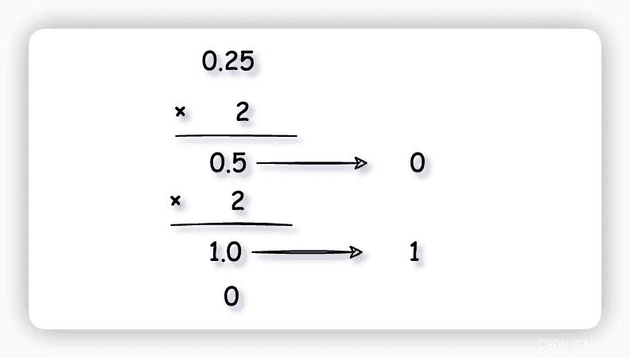
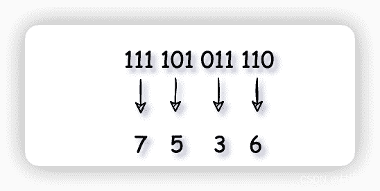
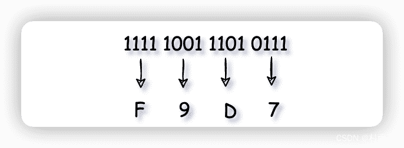

# 常用进制转换

::: info 共勉
不要哀求，学会争取。若是如此，终有所获。
:::
::: tip 原文
https://mp.weixin.qq.com/s/2f_dODoVco-tSS66lF0U5A

:::

## 前言

所谓进制转换，就是人们利用符号来计数的方法。进制转换由一组数码符号和两个基本因素“基数”和“位权”所构成。其中**基数**是指进位计数制中所采用的数码的个数，逢 `n` 进 1 中的 `n` 就是基数。而**位权**则指的是进位制中每一个固定位置所对应的单位制，而每一种进制中的某一个数的每位上都有一个权值 `m`，而且权值是位数减一，比如个位上的数的权值为 `0`（位数 1 - 1 = 0），而十位的权值为 `1`（位数 2 - 1 = 1）。

在 Java 学习中，我们难免会和各种进制打交道。今天就来看看，在 Java 中最常用的几个进制的相关概念，以及如何利用 Java 来实现他们之间的相互转换！

## 二进制

二进制是计算机中采用最广泛的一种数制，用 0 和 1 两个数码来表示，其进位规则是逢二进一，而借位规则则是借一当二。

如果要将二进制转换为十进制，则采用 **按权展开求和**方法，其步骤是先将二进制的数写成加权系数展开式，然后再更具十进制的加法规则进行求和。

$$(1011)_2=1*2^3+0*2^2+1*2^1+1*2^0 = (11)_{10}$$

## 十进制

而一个十进制数要转换为二进制数，则需要将整数和小数部分分别转换，最后再进行组合。其中，整数部分采用**除二取余，逆序排序**的方法。具体方法是用 2 来整除一个十进制数，从而得到一个商和余数；然后再用 2 去除以商，从而又得到一个商和余数，重复这个步骤，直到最后得到的商小于 1 时为止。最后把按照得到余数的先后顺序，逆序依次排列，得到的数即为这个十进制数的二进制表示。

$$(15)_{10}=(1111)_2$$


小数部分则不同于整数部分，小数部分要使用**乘 2 取整法**，即用十进制的小数部分乘以 2，然后取结果的整数部分，然后再用剩下的小数重复刚才的步骤，直到最后剩余的小数为 0 时停止。最后将每次得到的整数部分按照先后顺序正序排列，从而得到对应的二进制表示。

$$(0.25)_{10}=(0.01)_2$$



## 八进制

所谓八进制，就是每 3 位二进制作为一个单元，其中最小的数是 0，最大的数是 7，一共 8 个数字。

要将二进制的数转换为八进制，需要将 3 个连续的数拼成一组，然后再独立转成八进制中的数字。

例如，二进制的 $111101011110$ 可以转换为八进制中的 $7536$。



## 十六进制

所谓十六进制，就是每 4 位二进制作为一个单元，其中最小数是 0，最大数是 15，一共 16 个数字，分别用 0 ~ 9、A、B、C、D、E、F 表示。

要将二进制转换为十六进制，需要将 4 个连续的数拼成一组，然后再独立转换为十六进制中对应的数字。

例如，二进制的 $1111100111010111$ 可以转换为十六进制中的 $F9D7$。



## 常用进制转换

当然，Java 中也已经将常用的进制转换方法封装好了，我们只需要调用对应方法即可。

| 转换               | 方法                               | 返回           |
| ------------------ | ---------------------------------- | -------------- |
| 十进制 -> 二进制   | `Integer.toBinary(int num)`        | 二进制字符串   |
| 十进制 -> 八进制   | `Integer.toOctalString(int num)`   | 八进制字符串   |
| 十进制 -> 十六进制 | `Integer.toHexString(int num)`     | 十六进制字符串 |
| 十进制 -> N 进制   | `Integer.toString(int num, int N)` | N 进制字符串   |

```java
public class Main {
	public static void main(String[] args) {
		int num = 200;
        System.out.println(num + " 的二进制是:" + Integer.toBinaryString(num));
        System.out.println(num + " 的八进制是:" + Integer.toOctalString(num));
        System.out.println(num + " 的十六进制是:" + Integer.toHexString(num));
        System.out.println(num + " 的三进制是:" + Integer.toString(num, 3));
	}
}
```


相反的，如果我们要将一个 `N` 进制的字符串 `str` 转换为十进制数，那么可以使用以下方法。

| 转换             | 方法                                  | 返回     |
| ---------------- | ------------------------------------- | -------- |
| N 进制 -> 十进制 | `Integer.parseInt(String str, int N)` | 十进制数 |

```java
public class Main {
	public static void main(String[] args) {
		String str = "21104";
        int N = 5;
        System.out.println(str + " 的十进制是:" + Integer.parseInt(str, N));
 	}
}
```


## 总结

以上就是有关二进制、十进制、八进制、十六进制相关的知识点了。此外还介绍了 Java 中如何进行十进制向其他进制的转换方法，以及如何将其他进制转换为十进制。如果你刚好这些内容对你有所帮助，那就来个一键三连吧！

## ⏳ 联系

想解锁更多知识？不妨关注我的微信公众号：**村雨遥（id：JavaPark）**。

扫一扫，探索另一个全新的世界。


<Share colorful />