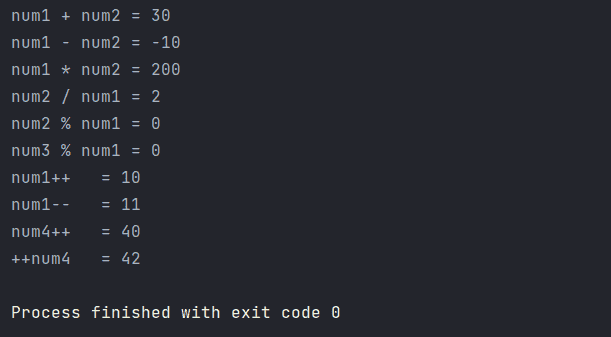
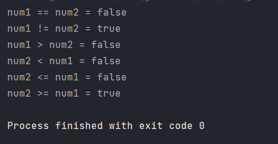
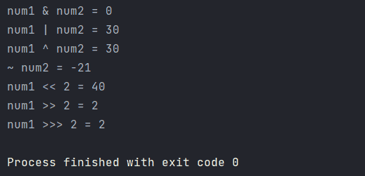
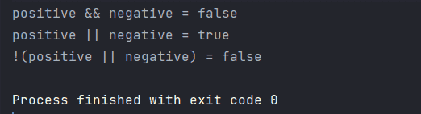
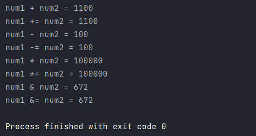
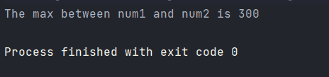
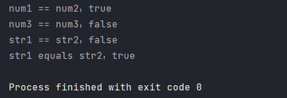

# 操作符


::: info 共勉
不要哀求，学会争取。若是如此，终有所获。
:::
::: tip 原文
https://mp.weixin.qq.com/s/49KRDz8bpcGdPlU15OJD0g
:::

## 前言

[之前的文章](https://mp.weixin.qq.com/s/Yz41IdWSNTgqgj0R-Ffgqw) 中介绍了 Java 变量和数据类型，那么如何对他们进行运算呢？这就要用到运算符的相关知识点了。所谓运算符，就是指 Java 中对变量或者字面量进行操作的符号。下面就来具体看看，常用的操作符。

本文主要内容预告如下：

-   **算术运算符**
-   **关系运算符**
-   **位运算符**
-   **逻辑运算符**
-   **赋值运算符**
-   **条件运算符**

好了，话不多说，开始正式内容吧！

## 算术运算符

常见的算术运算符主要有下表中的几种，主要是针对整型和浮点类型的运算。

| 操作符 | 描述                              |
| :----- | :-------------------------------- |
| `+`    | 加法 - 相加运算符两侧的值         |
| `-`    | 减法 - 左操作数减去右操作数       |
| `*`    | 乘法 - 相乘操作符两侧的值         |
| `/`    | 除法 - 左操作数除以右操作数       |
| `％`   | 取余 - 左操作数除以右操作数的余数 |
| `++`   | 自增: 操作数的值增加1             |
| `--`   | 自减: 操作数的值减少1             |

**注意**：`++` 和 `--` 可以放在操作数之前，也可以放在操作数之后；**位于操作数之前时，先自增/减，再赋值；位于操作数之后，先赋值，再自增/减**；总结起来就是**符号在前就先加/减，符号在后就后加/减**。

以下是部分算术运算符的示例以及运行结果：

```java
/**
 * @author : cunyu1943
 * @version : 1.0
 * @className : Main
 * @date : 2021/4/15 9:43
 * @description : 算术运算符演示
 */

public class Main {
    public static void main(String[] args) {
        int num1 = 10;
        int num2 = 20;
        int num3 = 30;
        int num4 = 40;

        System.out.println("num1 + num2 = " + (num1 + num2));
        System.out.println("num1 - num2 = " + (num1 - num2));
        System.out.println("num1 * num2 = " + (num1 * num2));
        System.out.println("num2 / num1 = " + (num2 / num1));
        System.out.println("num2 % num1 = " + (num2 % num1));
        System.out.println("num3 % num1 = " + (num3 % num1));
        System.out.println("num1++   = " + (num1++));
        System.out.println("num1--   = " + (num1--));
        // 查看 ++ 在操作数前后位置时结果的不同
        System.out.println("num4++   = " + (num4++));
        System.out.println("++num4   = " + (++num4));
    }
}
```



这里不难看出，无论是 `++` 还是 `--`，当它们单独写一行时，不管是放在变量前边还是后边，其最终结果都是一样的。但如果将它们参与运算，此时的效果就不一样了，这里需要注意。

```java
int a = 10;
int b = a++;
```
以上代码中，先进行了 `b = a` 的赋值操作，所以此时 `b` 的值是 `10`。

```java
int a = 10;
int b = ++a;
```
而此时，先要对 `a` 进行加一的操作之后，再将 `a` 的值赋予 `b`，所以此时 `b` 的值为 `11`。


## 关系运算符

关系运算符主要是指两个数据间的关系，两者之间的比较结果用逻辑值来表示，常用来比较判断两个变量或常量的大小。常见的关系运算符及含义如下表：

| 运算符 | 描述                                                           |
| :----- | :------------------------------------------------------------- |
| `==`   | 检查如果两个操作数的值是否相等，如果相等则条件为真             |
| `!=`   | 检查如果两个操作数的值是否相等，如果值不相等则条件为真         |
| `> `   | 检查左操作数的值是否大于右操作数的值，如果是那么条件为真       |
| `< `   | 检查左操作数的值是否小于右操作数的值，如果是那么条件为真       |
| `>=`   | 检查左操作数的值是否大于或等于右操作数的值，如果是那么条件为真 |
| `<=`   | 检查左操作数的值是否小于或等于右操作数的值，如果是那么条件为真 |

以下是部分关系运算符的示例以及运行结果：

```java
/**
 * @author : cunyu
 * @version : 1.0
 * @className : Main
 * @date : 2021/4/15 9:45
 * @description : 关系运算符
 */

public class Main {
    public static void main(String[] args) {
        int num1 = 100;
        int num2 = 220;


        System.out.println("num1 == num2 = " + (num1 == num2));
        System.out.println("num1 != num2 = " + (num1 != num2));
        System.out.println("num1 > num2 = " + (num1 > num2));
        System.out.println("num2 < num1 = " + (num2 < num1));
        System.out.println("num2 <= num1 = " + (num2 <= num1));
        System.out.println("num2 >= num1 = " + (num2 >= num1));

    }
}
```



## 位运算符

位运算符主要用来对操作数二进制的位进行运算，其运算结果是整型的。常见的位运算符及功能描述如下表所示：

| 操作符 | 描述                                                                             |
| ------ | -------------------------------------------------------------------------------- |
| `＆`   | 如果相对应位都是 1，则结果为 1，否则为 0                                         |
| `\|`   | 如果相对应位都是 0，则结果为 0，否则为 1                                         |
| `^`    | 如果相对应位值相同，则结果为 0，否则为 1                                         |
| `〜`   | 按位取反运算符翻转操作数的每一位，即 0 变成 1，1 变成 0                          |
| `<<`   | 按位左移运算符。左操作数按位左移右操作数指定的位数                               |
| `>>`   | 按位右移运算符。左操作数按位右移右操作数指定的位数                               |
| `>>>`  | 按位右移补零操作符。左操作数的值按右操作数指定的位数右移，移动得到的空位以零填充 |

以下是部分位运算符的示例以及运行结果：

```java
/**
 * @author : cunyu
 * @version : 1.0
 * @className : Main
 * @date : 2021/4/15 10:02
 * @description : 位运算符
 */

public class Main {
    public static void main(String[] args) {
        int num1 = 10;
        int num2 = 20;

        System.out.println("num1 & num2 = " + (num1 & num2));
        System.out.println("num1 | num2 = " + (num1 | num2));
        System.out.println("num1 ^ num2 = " + (num1 ^ num2));
        System.out.println("~ num2 = " + (~num2));
        System.out.println("num1 << 2 = " + (num1 << 2));
        System.out.println("num1 >> 2 = " + (num1 >> 2));
        System.out.println("num1 >>> 2 = " + (num1 >>> 2));
    }
}
```




##  逻辑运算符

逻辑运算符通过将关系表达式连接起来，从而组成一个复杂的逻辑表达式，从而判断程序中的表达式是否成立，其结果返回 `true` 或 `false`。

| 操作符 | 描述                                                                                        |
| :----- | :------------------------------------------------------------------------------------------ |
| `&&`   | 称为逻辑与运算符。当且仅当两个操作数都为真，条件才为真                                      |
| `\|\|` | 称为逻辑或操作符。如果任何两个操作数任何一个为真，条件为真                                  |
| `!`    | 称为逻辑非运算符。用来反转操作数的逻辑状态。如果条件为 `true`，则逻辑非运算符将得到 `false` |

以下是逻辑运算符的示例以及运行结果：

```java
/**
 * @author : cunyu
 * @version : 1.0
 * @className : Main
 * @date : 2021/4/15 10:07
 * @description : 逻辑运算符
 */

public class Main {
    public static void main(String[] args) {
        boolean positive = true;
        boolean negative = false;

        System.out.println("positive && negative = " + (positive && negative));
        System.out.println("positive || negative = " + (positive || negative));
        System.out.println("!(positive || negative) = " + !(positive || negative));

    }
}

```



##  赋值运算符

赋值运算符表示一个动作，将其右侧的值送到左侧的变量中。常见的赋值运算符及含义如下表所示：

| 操作符 | 描述                                                         |
| :----- | :----------------------------------------------------------- |
| `=`    | 简单的赋值运算符，将右操作数的值赋给左侧操作数               |
| `+=`   | 加和赋值操作符，它把左操作数和右操作数相加赋值给左操作数     |
| `-=`   | 减和赋值操作符，它把左操作数和右操作数相减赋值给左操作数     |
| `*=`   | 乘和赋值操作符，它把左操作数和右操作数相乘赋值给左操作数     |
| `/=`   | 除和赋值操作符，它把左操作数和右操作数相除赋值给左操作数     |
| `％=`  | 取模和赋值操作符，它把左操作数和右操作数取模后赋值给左操作数 |
| `<< =` | 左移位赋值运算符                                             |
| `>>=`  | 右移位赋值运算符                                             |
| `＆=`  | 按位与赋值运算符                                             |
| `^=`   | 按位异或赋值操作符                                           |
| `\|=`  | 按位或赋值操作符                                             |

以下是部分赋值运算符的示例以及运行结果：

```java
/**
 * @author : cunyu
 * @version : 1.0
 * @className : Main
 * @date : 2021/4/15 10:13
 * @description : 赋值运算符
 */

public class Main {
    public static void main(String[] args) {
        int num1 = 100;
        int num2 = 1000;

        System.out.println("num1 + num2 = " + (num1 + num2));
        System.out.println("num1 += num2 = " + (num1 += num2));
        System.out.println("num1 - num2 = " + (num1 - num2));
        System.out.println("num1 -= num2 = " + (num1 -= num2));
        System.out.println("num1 * num2 = " + (num1 * num2));
        System.out.println("num1 *= num2 = " + (num1 *= num2));
        System.out.println("num1 & num2 = " + (num1 & num2));
        System.out.println("num1 &= num2 = " + (num1 &= num2));
    }
}
```



##  条件运算符（? :）

也叫作三元运算符，共有 3 个操作数，且需要判断布尔表达式的值，常用来取代某个 `if-else` 语句。其语法结构如下所示：
```java
关系表达式?表达式 1:表达式 2;
```

```java
variable x = (expression) ? value if true : value if false
```

以下是条件运算符的示例以及运行结果：

```java
/**
 * @author : cunyu
 * @version : 1.0
 * @className : Main
 * @date : 2021/4/15 10:18
 * @description : 条件运算符
 */

public class Main {
    public static void main(String[] args) {
        int num1 = 30;
        int num2 = 300;

        int result = num1 > num2 ? num1 : num2;
        System.out.println("The max between num1 and num2 is " + result);
    }
}
```




##  instanceof

用于操作对象实例，检查该对象是否是一个特定类型（类类型或接口类型），其语法结构如下。该知识点涉及到类与对象，此处就不做展开，等到后边学习类与对象之后，就能理解了。

```java
( Object reference variable ) instanceof  (class/interface type)
```
## 运算符优先级
运算符有很多，如果我们将多个运算符组合在一起，那它们又该先计算哪一个，然后再计算哪一个呢？其实就像我们日常排队一样，运算符也是有优先级的。
常用运算符的优先级如下表所示，在我们使用时，如果涉及到一个表达式中含有多个运算符，一定要注意运算符的优先级。当然了，让我们背下来这些也是挺难的。不过不要紧，我们只需要学会灵活运用 `()` 就好了。我们可以利用 `()` 将需要先计算的表达式括起来，然后再去进行下一步的运算。

| 优先级 | 运算符                                  |
| ------ | --------------------------------------- |
| 1      | `.`、`()`、`{}`                         |
| 2      | `!`、`~`、`++`、`--`                    |
| 3      | `*`、`/`、`%`                           |
| 4      | `+`、`-`                                |
| 5      | `<<`、`>>`、`>>>`                       |
| 6      | `<`、`<=`、`>`、`>=`、`instanceof`      |
| 7      | `==`、`!=`                              |
| 8      | `&`                                     |
| 9      | `^`                                     |
| 10     | `\|`                                    |
| 11     | `&&`                                    |
| 12     | `\|\|`                                  |
| 13     | `?:`                                    |
| 14     | `=`、`+=`、`-=`、`*=`、`/=`、`%=`、`&=` |

##  equals() 和 ==

-   `==`

基本数据类型用 `==` 比较的是值，而 用于引用数据类型时判断两个对象的内存地址是否相等，即两对象是否是同一个对象；

>   本质来讲，由于 Java 中只有值传递，所以不管是基本数据类型还是引用数据类型，比较的其实都是值，只不过引用类型变量存的值是对象的地址；

-   `equals()`

作用也是判断两个对象是否相等，但是 **不能用于基本数据类型变量的比较**。存在于 `Object()` 类中，所以所有类都具有 `equals()` 方法存在两种使用情况：

1.  **类未覆盖 `equals()` 方法**：此时通过 `equals()` 比较该类的两个对象时，等价于 `==` 比较这两个对象，默认使用  `Object` 类中的 `equals()` 方法；
2.  **类覆盖了 `equals()` 方法**：一旦覆盖了该方法，则用来比较两个对象的内容是否相等，如我们常用的 `String、BitSet、Data、File` 就覆盖了 `equals()` 方法；

```java
/**
 * @author : cunyu
 * @version : 1.0
 * @className : Main
 * @date : 2021/4/15 13:26
 * @description : == 和 equals 用法
 */

public class Main {
    public static void main(String[] args) {
        int num1 = 10;
        int num2 = 10;
        int num3 = 20;
        String str1 = "村雨遥";
        String str2 = new String("村雨遥");

        // == 用于基本数据类型，用于比较两者是否相等
        System.out.println("num1 == num2：" + (num1 == num2)); // true
        System.out.println("num3 == num3：" + (num2 == num3)); // false
        // 而用于引用类型则表示两者是否指向同一对象
        System.out.println("str1 == str2：" + (str1 == str2)); // false

        // equals 用于比较引用类型是否内容是否相同
        System.out.println("str1 equals str2：" + str1.equals(str2)); // true

        // equals 不能用于基本数据类型比较
        //        System.out.println(num1.equals(num2));
    }
}
```



## 总结

好了，以上就是有关操作符系列的相关知识点了。老规矩，如果您觉得对您有所帮助，那就点个赞吧 🥳.

对于文中所遗漏或者存在错误的知识点，也欢迎大家评论指正呀！


**关注公众号，获取最新文章更新**

::: center

:::

## ⏳ 联系

想解锁更多知识？不妨关注我的微信公众号：**村雨遥（id：JavaPark）**。

扫一扫，探索另一个全新的世界。


<Share colorful />