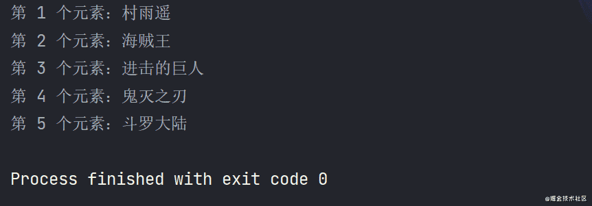
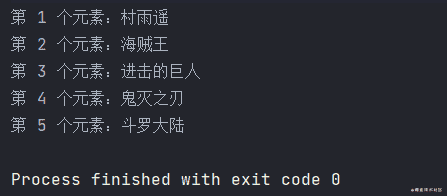
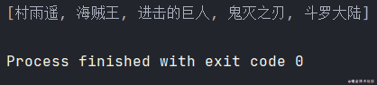
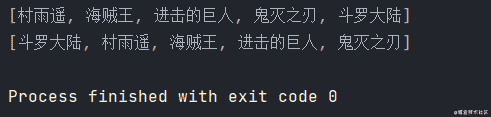
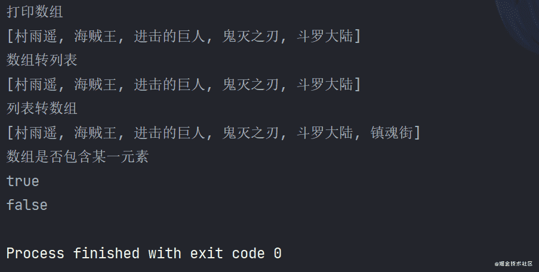

# 数组操作的奇技淫巧


::: info 共勉
不要哀求，学会争取。若是如此，终有所获。
:::
::: tip 原文
https://mp.weixin.qq.com/s/2Ff14d3cwjVflhtz67k3vQ
:::

## 前言

前边已经讲过了 Java 中的 8 大基本数据类型，这篇文章主要就来讲讲引用类型中的数组。主要内容安排如下：

- **数组简介**
- **遍历**
- **排序**
- **常用方法**

## 数组简介

所谓数组，其实就是多个相同数据类型的元素按一定顺序排列而成的集合。即将有限个类型相同的变量放到一个容器中，然后按照编号去访问各个元素，而这个容器的名字就叫做数组名，各个元素的编号就叫做索引位置。而其中索引位置是从 `0` 开始计数，而不是我们日常所习惯的 `1`。

要定义一个数组类型的遍历，其语法为 `数据类型 []`，比如 `int[]`，而且在初始化时必须指定数组大小，如 `int[] arr = new int[10]`，表示 `arr` 数组可以容纳 `10` 个 `int` 类型的元素。

数组的特点：

- 数组中的元素初始化时都是有默认值的，整型对应 `0`，浮点型对应 `0.0`，而布尔型对应 `false`。
- 数组一经创建，其大小（长度）就不可再变。
- 要访问数组中的某一元素，需要用到索引，索引从 `0` 开始。
- 如果要修改数组中的某一元素，直接对对应索引位置的元素使用赋值语句即可。

和变量一样，既然定义了，那么就要对数组进行初始化。所谓数组的初始化，指的是在内存中，为数组容器开辟空间，然后将数据存入容器中的过程。而常用的初始化方式主要有两种：

- **静态初始化**
- **动态初始化**

### 一维数组

#### 初始化

1.  **静态初始化**

所谓静态初始化，就是在定义数组的同时将其初始化。

静态初始化的完整格式如下：

```java
数据类型[] 数组名 = new 数据类型[]{元素 1, 元素 2, 元素 3…};
```

但在开发时，为了方便，也可以对上面的代码进行简写：

```java
数据类型[] 数组名 = {元素 1, 元素 2, 元素 3…};
```

两种方式最终得到的结果是一样的，但第二种更加简洁方便。

```java
int[] arr1 = {1, 3, 5, 8, 10};
int[] arr2 = new int[] {1, 3, 5, 8, 10};
```

2.  **动态初始化**

动态初始化，就是先声明数组长度定义之后，再由系统对其分配初始值。

```java
数据类型[] 数组名 = new 数据类型[数组长度];
```

```java
int[] arr = new int[5];
arr[0] = 1;
arr[1] = 3;
arr[2] = 5;
arr[3] = 8;
arr[4] = 10;
```

PS：注意数组的索引位置不能超过数组的长度，如上面例子中的数组长度为 `5`，所以我们数组的索引位置最大只能为 `4`，否则就会报数组越界错误。

#### 求数组长度

求数组的长度，利用数组的 `length` 属性即可；

```java
int[] arr = new int[10];
int size = arr.length; // 10
System.out.println("size = " + size);
```

### 二维数组

#### 初始化

1.  **静态初始化**

```java
int[][] arr1 = {{1, 2, 4}, {5, 7, 9}, {19, 12, 18}};
```

2.  **动态初始化**

二维数组动态声明时，一种是把行和列的长度都指定，而另一种是只需要指定行的长度，不用指定列的长度，列的长度会在初始化时自动确认。

```java
int[][] arr1= new int[3][3];
arr1 = new int[][]{{1, 2, 4}, {5, 7, 9}, {19, 12, 18}};

int[][] arr2= new int[3][];
arr2 = new int[][]{{1, 2, 4}, {5, 7, 9}, {19, 12, 18}};
```

#### 求数组长度

不同于一维数组，因为二维数组有行和列，所需求长度时需要分别求。

```java
int[][] arr = new int[10][20];

// 求行的长度
int row = arr.lenght;
// 求列的长度，此时求任意一行所在的列的长度即可
int col = arr[0].length;
```

### 静态初始化和动态初始化的区别

上面分别对一维数组和二维数组进行了静态初始化和动态初始化，通过比较总结出两者的区别如下：

**动态初始化**：手动指定数组长度，然后由系统给出默认初始化值。

**静态初始化**：手动指定数组元素，然后系统会根据元素个数计算出数组长度。

## 数组遍历

既然我们已经学会了数组的声明及初始化，接下来就是对数组进行操作，而最常见的则是遍历数组。所谓遍历，就是将数组中的所有元素取出来，然后操作这些取出来的元素。

假设我们有一个数组如下：

```java
String[] arr = new String[5];
arr = new String[]{"村雨遥", "海贼王", "进击的巨人", "鬼灭之刃", "斗罗大陆"};
```

### 标准 for 循环

首先，我们来使用标准的 `for` 循环来遍历该数组，只需要通过数组的索引位置来访问即可。

```java
/**
 * @author : cunyu1943
 * @version : 1.0
 * @className : TraverseTest
 * @date : 2021/4/25 11:52
 * @description : 遍历
 */

public class TraverseTest {
    public static void main(String[] args) {
        String[] arr = new String[5];
        arr = new String[]{"村雨遥", "海贼王", "进击的巨人", "鬼灭之刃", "斗罗大陆"};

//        数组长度
        int size = arr.length;
        for (int i = 0; i < size; i++) {
            System.out.println("第 " + (i + 1) + " 个元素：" + arr[i]);
        }
    }
}
```



### 增强 for 循环

```java
/**
 * @author : cunyu
 * @version : 1.0
 * @className : EnforceTraverseTest
 * @date : 2021/4/26 9:14
 * @description : 增强 for 循环
 */

public class EnforceTraverseTest {
    public static void main(String[] args) {
        String[] arr = new String[5];
        arr = new String[]{"村雨遥", "海贼王", "进击的巨人", "鬼灭之刃", "斗罗大陆"};
        int index = 0;
        for (String name : arr) {
            System.out.println("第 " + (index + 1) + " 个元素：" + name);
            index++;
        }
    }
}
```



**两者的区别**：标准 `for` 循环是通过计数器来进行遍历，我们能够很清晰的得知每个元素所对应的索引位置，而增强 `for each` 循环则是直接访问数组中的元素值，而不关心每个元素对应的索引位置。

### 标准库遍历

通过调用标准库 `Arrays` 中的 `toString()` 方法，我们可以将任意类型的数组转换为一个字符串表示形式，从而打印出来。

```java
import java.util.Arrays;

/**
 * @author : cunyu
 * @version : 1.0
 * @className : StandardLibraryTest
 * @date : 2021/4/26 9:22
 * @description : 标准库遍历
 */

public class StandardLibraryTest {
    public static void main(String[] args) {
        String[] arr = new String[5];
        arr = new String[]{"村雨遥", "海贼王", "进击的巨人", "鬼灭之刃", "斗罗大陆"};
        System.out.println(Arrays.toString(arr));
    }
}
```



以上的遍历主要是针对一维数组，而针对二维数组，当我们要访问其中的一个元素时，可以使用 `array[row][col]` 来进行访问，而对于二维及更多维的数组，可以使用 `Arrays.deepToString()`。

## 数组排序

### 使用排序算法

排序算法多样，最常用的则有 **冒泡排序、插入排序、快速排序等**，进行排序时会修改数组本身；

冒泡排序：经过一轮循环，将最大的数置换到末尾，然后进入下一轮循环，每轮均比上一轮的结束位置靠前一位；

```java
import java.util.Arrays;

/**
 * @author : cunyu
 * @version : 1.0
 * @className : BubbleSort
 * @date : 2021/4/26 10:16
 * @description : 冒泡排序
 */

public class BubbleSort {
    public static void main(String[] args) {
        char[] chArray = {'c', 'u', 'n', 'y', 'u'};
        // 排序前
        System.out.println(Arrays.toString(chArray));

        for (int i = 0; i < chArray.length - 1; i++) {
            for (int j = 0; j < chArray.length - 1 - i; j++) {
                // 从大到小
                if (chArray[j] < chArray[j + 1]) {
                    // 交换
                    char temp = chArray[j];
                    chArray[j] = chArray[j + 1];
                    chArray[j + 1] = temp;
                }
            }
        }
        // 冒泡排序后
        System.out.println(Arrays.toString(chArray));
    }
}
```


### 标准库排序

```java
import java.util.Arrays;

/**
 * @author : cunyu
 * @version : 1.0
 * @className : StandardLibrarySortTest
 * @date : 2021/4/26 10:22
 * @description : 标准库排序
 */

public class StandardLibrarySortTest {
    public static void main(String[] args) {
        String[] arr = new String[]{"村雨遥", "海贼王", "进击的巨人", "鬼灭之刃", "斗罗大陆"};

//        排序前
        System.out.println(Arrays.toString(arr));
//        标准库排序
        Arrays.sort(arr);
//        排序后
        System.out.println(Arrays.toString(arr));
    }
}
```



## 常用方法

对于数组而言，Java 标准库中已经内置了许多方法，常用的有如下一些方法：

| 返回值               | 方法                   | 描述                 |
| -------------------- | ---------------------- | -------------------- |
| `static String`      | `toString(Object[] a)` | 输出数组的字符串形式 |
| `static <T> List<T>` | `asList(T…… a)`        | 数组转 `List`        |

```java
import java.util.ArrayList;
import java.util.Arrays;
import java.util.List;

/**
 * @author : cunyu
 * @version : 1.0
 * @className : CommonMethodsTest
 * @date : 2021/4/26 10:37
 * @description : 常用方法
 */

public class CommonMethodsTest {
    public static void main(String[] args) {
        String[] arr = new String[]{"村雨遥", "海贼王", "进击的巨人", "鬼灭之刃", "斗罗大陆"};
//        输出数组的字符串形式
        System.out.println("打印数组");
        System.out.println(Arrays.toString(arr));
//        数组转列表
        System.out.println("数组转列表");
        List<String> list = new ArrayList<String>(Arrays.asList(arr));
        System.out.println(list);

        System.out.println("列表转数组");
        list.add("镇魂街");
        String[] newArr = new String[list.size()];
        list.toArray(newArr);
        System.out.println(Arrays.toString(newArr));

        System.out.println("数组是否包含某一元素");
        System.out.println(Arrays.asList(newArr).contains("进击的巨人"));
        System.out.println(Arrays.asList(newArr).contains("网球王子"));
    }
}
```



## 总结

数组相关的内容就到此结束了，主要从 4 个方面简单介绍了数组的一些相关用法，如果你有更多想要了解的内容，欢迎评论区留言交流。最后，都看到这儿了，不给个赞和关注再走么 🤔.

**关注公众号，获取最新文章更新**

::: center

:::

## ⏳ 联系

想解锁更多知识？不妨关注我的微信公众号：**村雨遥（id：JavaPark）**。

扫一扫，探索另一个全新的世界。


<Share colorful />