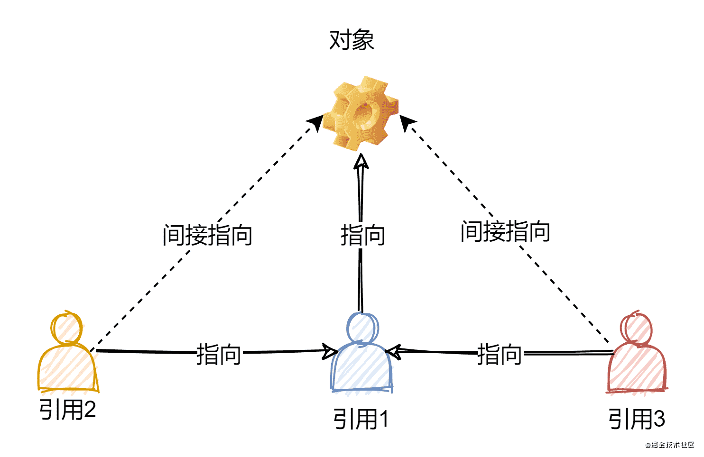

# 类的相关知识


::: info 共勉
不要哀求，学会争取。若是如此，终有所获。
:::
::: tip 原文
https://mp.weixin.qq.com/s/1BPFnyNuC3fdYBVxP7J3VA
:::

## 前言

学习了面向对象编程的思想，今天就来看看面向对象编程思想在 Java 中的体现 - 类。以及有关类的相关知识，比如属性、方法、引用等。

## 类与对象

以我们日常生活为例，我们现在很多人都养宠物，而宠物 **都有一些共同状态**，比如名字、毛色、年龄…… 这样一来我们就可以设计一个叫做**类**的东西，用来 **代表宠物** 这一类事物。

```java
public class Pet{
    // 名字
    public String name;

    // 毛色
    public String furColor;

    // 年龄
    public int age;
}
```

有了这个类之后，它就相当于我们的一个模板，根据这个模板我们就能够创建一个个具体的宠物，而这些宠物，就叫做 **对象**。

```java
public class Pet{
    // 名字
    public String name;

    // 毛色
    public String furColor;

    // 年龄
    public int age;

    public static void main(String[] args){
        // 创建一个对象
        Pet dog = new Pet();
        dog.name = "博美";
        dog.furColor = "white";
        dog.age = 1;

        Pet cat = new Pet();
        cat.name = "英短";
        cat.furColor = "orange";
        cat.age = 2;
    }
}
```

总结起来，类就是对对象所共有特征的描述，而对象则是真实存在的具体实例。在 Java 中，必须先设计类，然后才能创建并使用对象。

## 属性

每个宠物都有自己的名字、毛色和年龄等一系列状态，而这些状态就叫做一个类的**属性**。而属性的类型既可以是基本类型（比如上述例子中的 `int`），也可以是引用类型（上述例子中的 `String`）。而在 Java 语言中，这些属性就叫做成员变量。成员变量的命名虽然没有强制规定，但是一般都是有一套大家通用的命名方法，即：

> 若成员变量是一个单词组成，那么一般都是小写。
>
> 若成员变量是多个单词组成，那么则采用驼峰法。
>
> 关于更多的命名规定，推荐参考阿里巴巴出品的 《Java 开发手册》，下载地址：https://github.com/cunyu1943/ebooks

成员变量的完整定义格式语如下，一般来说无需指定初始化值，它是存在默认值的。

```java
修饰符 数据类型 变量名 = 初始化值;
```

| 数据类型 | 明细                                   | 默认值  |
| -------- | -------------------------------------- | ------- |
| 基本类型 | `byte`、`short`、`char`、`int`、`long` | 0       |
| 基本类型 | `float`、`double`                      | 0.0     |
| 基本类型 | `boolean`                              | `false` |
| 引用类型 | 类、接口、数组、`String`               | `null`  |

要访问属性，通常需要先创建一个对象，然后通过**对象名.成员变量**的方式来进行访问。

## 方法

### 方法的定义

而除开属性之后，每个对象还能够有许多其他的功能，就像宠物都能吃东西、会叫……，那么这些他们能够做的事情，在类里边就可以用 **方法** 来进行表示。所谓方法就是程序中最小的执行单元，一般用于封装重复且具有独立功能的代码，从而提高代码的复用性和可维护性。

```java
public class Pet{
    // 名字
    public String name;

    // 毛色
    public String furColor;

    // 年龄
    public int age;

    // 吃东西对应的方法
    public void eat(){
        System.out.println("吃东西！");
    }

    // 吠叫对应的方法
    public void bark(){
        System.out.println("吠叫！");
    }
}
```

方法的定义格式如下：

```java
修饰符 返回值类型 方法名(形参列表){
    方法体代码(需要执行的功能代码);
    return 返回值;
}
```

其中，修饰符主要有以下 4 种不同的访问权限：

1.  `default`：默认什么都不写的情况，表示在同一个包内可见，主要用于修饰类、接口、变量、方法。
2.  `private`：表示在同一类中可见，常用于修饰变量和方法，但要注意，它不能用来修饰类（外部类）。
3.  `protected`：表示对同一个包内的类和所有子类可见，常用于修饰变量、方法，同样的，它也不能修饰类（外部类）。
4.  `public`：表示对所有类可见，常用于修饰类、接口、变量、方法。

| 修饰符      | 当前类 | 同一包内 | 子类（同一包） | 子类（不同包） | 其他包 |
| ----------- | ------ | -------- | -------------- | -------------- | ------ |
| `private`   | ✅      | ❎        | ❎              | ❎              | ❎      |
| `default`   | ✅      | ✅        | ✅              | ❎              | ❎      |
| `protected` | ✅      | ✅        | ✅              | ✅              | ❎      |
| `public`    | ✅      | ✅        | ✅              | ✅              | ✅      |

同样的，和属性一样，如果要调用一个方法，那么也需要先创建一个 Java 对象，然后通过**对象名.方法名(……)**的形式调用。

### 方法的分类

而对于方法，也有需要注意的几点：

1.  方法是可以有返回值的，如果要返回对应值，则其返回值的类型要与返回值相对于，对于不需要返回值的方法，则将其返回类型设置为 `void`；
2.  方法是可以有参数的，我们上述例子的方法中都是不带参数的，但如果我们有需要，就可以加上自己需要的参数，但此时注意要带上参数的类型；

总结起来，可以分为如下四种方法：

1.  **无参无返回值**

```java
public void methodName(){
    ……
}
```

2.  **无参有返回值**

```java
public boolean methodName(){
    ……
    return false;
}
```

3.  **有参无返回值**

```java
public void methodName(String name){
    ……
}
```

4.  **有参有返回值**

```java
public boolean methodName(String name){
    ……
    return false;
}
```

```java
public class Pet{
    // 名字
    public String name;

    // 毛色
    public String furColor;

    // 年龄
    public int age;

    // 具有返回值的方法
    int getAge(){
        return age;
    }

    // 带有参数的方法
    void setAge(int age){
        this.age = age;
    }

    // 吃东西对应的方法
    void eat(){
        System.out.println("吃东西！");
    }

    // 叫唤对应的方法
    void bark(){
        System.out.println("叫唤！");
    }
}
```

而对于方法命名的方式，也是有一定讲究的。因为一般而言方法都是一个类的动作行为，所以 **一般都是以动词开头，而如果有多个单词组合，则除开第一个单词全部小写之外，后面每个单词的第一个字母都要使用大写**。

注意到这里有个关键字 `return`，它主要用于设置方法的返回。

如果一个方法没有返回值，那么此时可以省略不写，一旦书写，那么就代表着该方法结束。比如，以下这个方法的两种书写方式最终效果都是一样的。

- 带 `return`

```java
public void fire(){
    System.out.println("开火……");
    return;
}
```

- 不带 `return`

```java
public void fire(){
    System.out.println("开火……");
}
```

而如果一个方法有返回值，那么此时 `return` 就必须写，它表示结束方法并返回结果。

```java
public int sum(int num1, int num2){
    return num1 + num2;
}
```

### 重写与重载

此外，既然提到了方法，那肯定少不了重写和重载了，下面就来看看重写和重载之间的区别。

1.  **重写**

所谓重写，其实就是子类对父类中允许访问的方法的实现过程进行加工重新编写，是面向对象编程中多态性的体现，通常发生在父类和子类之间。

重写时，方法的参数和返回值都不能改变。通过重写，子类可以根据自己的需要，从而去重新定义区别于父类的行为。

```java
public class Hero{
    public void fight(){
        System.out.println("战斗");
    }
}
```

```java
pubilc class Shooter extends Hero{
    @Override
    public void fight(){
        System.out.println("远程战斗");
    }
}
```

2.  **重载**

而重载则是让类以统一的方式来处理不同类型数据的一种方式。一个类中存在多个同名方法，但他们具有不同的参数个数或者类型。

简单来说，就是在 Java 的一个类中，我们可以创建多个相同名字的方法，但是这些方法之间的参数和返回值有所不同。

```java
public class Calc{
    public int sum(int num1, int num2){
        return num1 + num2;
    }

    public int sum(int num1, int num2, int num3){
        return num1 + num2 + num3;
    }

    public double sum(double num1, double num2){
        return num1 + num2;
    }
}
```

### 参数传递机制

了解参数传递前，先来了解下形参和实参的相关概念。

**实参**，指在调用时所传递给方法的参数，可以是常量、变量、表达式、函数等。无论实参是何种类型的值，在进行方法调用时，都必须有确定的值，从而将这些值传递给形参。

**形参**，在方法定义时，`()` 中所声明的参数，目的是用来接收调用方法时传入的参数。不是实际存在的变量，所以又叫做虚拟变量。

Java 中，方法的参数传递都是通过**值传递**的机制来实现的。所谓值传递，就是在传输实参给方法的形参时，并非传输的是实参变量本身，而是通过传输实参变量中所存储的值。

但是要注意区分的是，Java 中的**基本数据类型的参数传输的是存储的数据值**，而**引用类型的参数传输的是存储的地址值**。

## 构造方法

上面我们说了实例（也就是对象）和属性，那么当我们创建一个实例的时候，通常我们想要把它的属性也给它设置好。为了实现这一功能，这时候我们可以添加方法，从而达到这一目的，以上述设置宠物的年龄为例。

```java
// 首先创建一个实例
Pet pet = new Pet();
// 接着调用方法设置年龄
pet.setAge(3);
// 查看设置年龄是否成功
System.out.println(pet.getAge());
```

可以发现通过上述调用方法的方式是可以完成这一目的的，但假设我们需要设置的属性很多，此时要全部设置属性值时就需要调用许多次 `setter` 方法，一旦遗漏一个，则实例内部状态就紊乱了。那我们就想了，有没有一种简单点的方法，能够让我们在创建实例对象的同时就把内部属性初始化了呢？

答案是：Yes！🎉🎉🎉

这时候我们就可以用到一类特殊的方法 - **构造方法**，所谓构造方法，就是定义在类中可以用来初始化一个类的对象，并返回对象的地址，以下就来看看这个构造方法的特殊之处。构造方法的格式如下：

```java
修饰符 类名(形参列表){
    ……
}
```

其实在上面我们创建实例的时候就已经调用了构造方法了，只不过它是没有带任何参数的构造方法。以上述动物类 `Pet` 为实例，我们来看看如何编写它的构造方法。

```java
public class Pet{
        // 名字
    public String name;

    // 毛色
    public String furColor;

    // 年龄
    public int age;

    // 无参构造方法
    public Pet(){}

    // 带参构造方法
    public Pet(String name, String furColor, int age){
        this.name = name;
        this.furColor = furColor;
        this.age = age;
    }
}
```

以上我们只是给出了无参的构造方法和带了所有属性的构造方法，除了上面的两个构造方法之外，我们还可以根据需要创建带有部分属性的构造方法。

其中，无参构造方法（默认存在）在初始化对象时，成员变量的数据均采用的默认值，而有参构造方法在初始化对象时，同时可以接收参数来给对象赋值。

经过对比可以发现，相比于普通的方法，构造方法有着明显的特点：

1.  **没有返回值**：是的，无论是带参还是不带参的构造函数，它们都是没有返回值的，而它也是 **每个类默认的构造方法**。
2.  **方法名同类名一样**：必须确保构造方法的名字和类名一致，否则它就不是构造方法了。

有了构造方法之后，我们创建实例时就可以直接给它初始化了，而不用再去麻烦地调用各个 `setter` 方法来初始化实例。

```java
// 调用无参构造方法
Pet pet1 = new Pet();
// 调用有参构造方法
Pet pet2 = new Pet("柯基", "黄色", 1);
```

🎈 Tips：对于实例的属性值，在未经构造方法初始化时，各数据类型都有默认值，整型默认值为 `0`，浮点型默认值为 `0.0`，布尔类型默认值为 `false`，引用类型默认值为 `null`。

## 引用

既然知道了什么是面向对象以及面向对象中的一些关键知识点如对象、属性、方法的概念，那我们就趁热来看看啥是引用。

所谓引用，其实在之前学习的时候就已经涉及到了。你是否还记得 `String` 这个特殊的数据类型，其实在我们创建一个 `String` 对象时，也就创建了一个引用。

```java
String str = new String("村雨遥");
```

其中 `str` 既是一个变量，也是一个引用，指向一个值为 `"村雨遥"` 的 `String` 对象，后续如果我们要访问这个 `String` 对象，就需要使用 `str` 这个引用来代表它。


以上我们说的是一个引用指向一个对象，但是我们也可以用多个引用指向同一个对象。就好比你家买了一辆车，不仅你可以开，你老婆也可以开，你爸妈也可以开。而这时候的车就好比一个“对象”，而使用它的人就是多个“引用”。

```java
// 对象 1
String str1 = new String("村雨遥");
// 对象 2
String str2 = str1;
// 对象 3
String str3 = str1;
```



## JavaBean

`JavaBean` 也可以称为实体类，其对象可以用在程序中封装数据。对于一个标准的 `JavaBean`，定义时需要满足以下要求：

- 成员变量均使用 `private` 修饰。
- 提供成员变量所对应的 `getXxx()/setXxx()` 方法。
- 必须提供一个标准的无参构造器，而有参构造器则是可写可不写。

## 总结

今天的内容就到此结束了，主要对面向对象中的类、对象、属性、方法、构造方法以及引用做了介绍，关于更多面向对象的知识，我们下一篇文章再见！

## ⏳ 联系

想解锁更多知识？不妨关注我的微信公众号：**村雨遥（id：JavaPark）**。

扫一扫，探索另一个全新的世界。


<Share colorful />