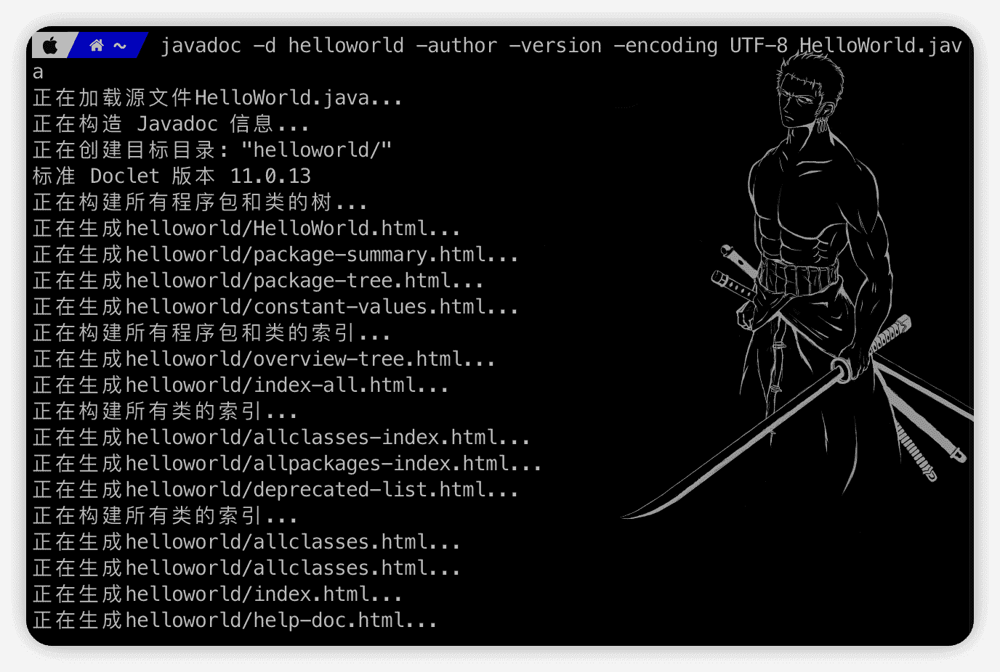
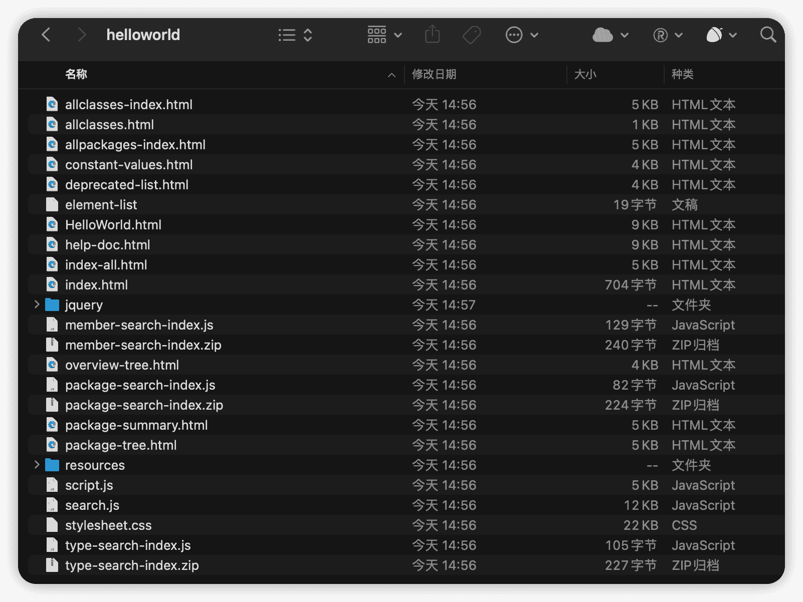
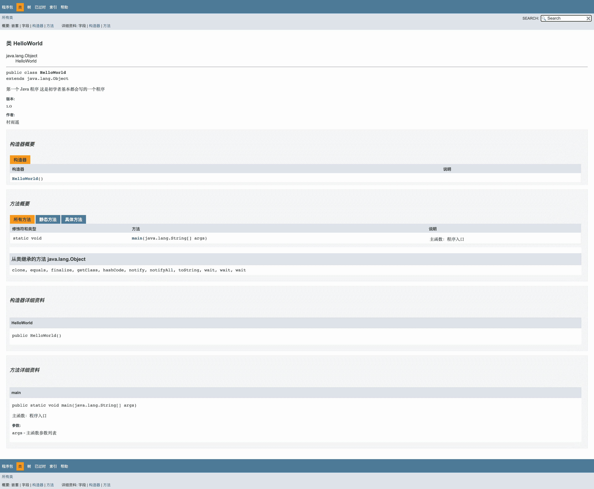
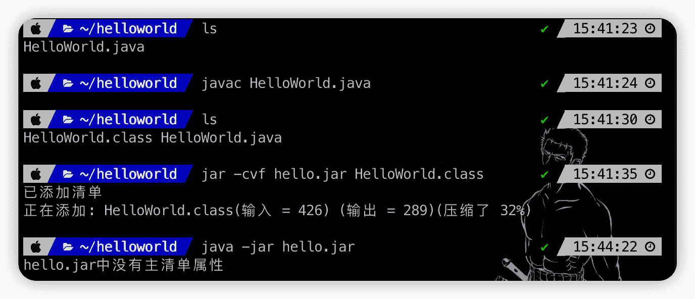

# 包和 jar 文件的创建


::: info 共勉
不要哀求，学会争取。若是如此，终有所获。
:::
::: tip 原文
https://mp.weixin.qq.com/s/l4O4bhDMgHamQ5DVPcqUYA

:::

## 前言

在之前的文章中，讲到了面向的 3 大特性（**封装、继承、多态**）和面向对象设计的 5 大原则（SRP、OCP、LSP、DIP、ISP）。此外，我们还讲了如何创建一个类，并且在创建类后如何构造一个对象。然后还介绍了类中的属性和方法，并对构造方法和引用也做了简单的讲解。

有了上面的基础之后，今天我们来继续学习面向对象的相关知识，主要内容预告如下：

- **包**
- **注释**
- **jar 文件的创建**

## 包

假设现在有这么一种情况，诸葛亮、周瑜、曹操共同开发一款程序。其中，周瑜和曹操均在自己代码模块中写了一个 `PublicUtil` 类，现在诸葛亮要调用周瑜和曹操模块中代码，需要同时用到他们中的 `PublicUtil` 类，这时候就犯难了，诸葛亮在他的代码中使用 `PublicUtil` 类时，该怎么区分是调用周瑜的，还是调用的曹操的呢？

针对这个问题，开发 Java 的前辈们当然也想到了。于是，他们在 Java 中定义了一种名字空间，也就是我们今天要讲的包：`package`。通过使用包机制，就十分容易区别类名的命名空间了。

一般包名的规则为：公司域名反写 + 包的作用，而且全部都要用英文小写。

假设曹操的 `PublicUtil` 类代码如下：

```java
// 申明包名
package caocao;
public class PublicUtil{
    ……
}
```

周瑜的 `PublicUtil` 类代码如下：

```java
// 申明包名
package zhouyu;
public class PublicUtil{
    ……
}
```

此时，如果诸葛亮要同时使用他们俩代码中的 `PublicUtil` 类，此时就可以通过引入他们俩的包，然后通过使用 `包名.类名` 的引用方式来进行区分即可。

```java
package zhugeliang;
import caocao;
import zhouyu;
public class Util{
    // 使用周瑜代码
    zhouyu.PublicUtil.xxx();
    ……
    // 使用曹操代码
    caocao.PublicUtil.xxx();
    ……
}
```

以上代码中的 `import` 你可能也在其他代码中见到过，但你不知道啥作用。其实它就是为了包的使用而生，如果我要使用另一个人的包，那该怎么做呢？其实很简单，只需要在程序中使用关键字 `import` 即可完成包的导入。

通过使用包，可以达到以下的作用：

1.  将功能类似或或相关的类以及接口组织放在同一个包中，方便类的查找与使用。
2.  包也像文件夹一样，采用了树形目录的存储方式。同一个包中的类名不同，不同包中的类名可以相同。当同时调用两个不同包中的同一类名的类时，通过加上完整的包名就可以加以区分，从而避免类名冲突。
3.  同时包也限定了访问权限，只有拥有包访问权限的类才能间接去访问包中的类。

## 注释

所谓注释，就是写在程序里边对代码进行结束说明的文字，既方便自己也方便他人查看，更快理解程序含义。而且注释是不影响程序的执行的，在我们对 Java 源代码进行编译后，字节码文件中不含源代码中的注释内容。

在 Java 中，通常支持三种注释方式，它们分别是：

- `//`：单行注释
- `/* */`：多行注释
- `/** */`：文档注释

### 单行注释

单行注释是以双斜杠 `//` 来标识，表示只注释当前行内容，一般用在需要注释的内容较少的地方，以下就是一个单行注释的实例。

```java
// 第一个 Java 程序
public class HelloWorld{
	public static void main(String[] args){
    	System.out.println("Hello World!");
    }
}
```

### 多行注释

通常我们把要注释的内容放在 `/*` 和 `*/` 之间，表示在两者之间的内容都是我们的注释内容，以下是一个多行注释的实例。

```java
/*
* 第一个 Java 程序
* 这是许多初学者都会写的一个程序
*/
public class HelloWorld{
	public static void main(String[] args){
    	System.out.println("Hello World!");
    }
}
```

### 文档注释

文档注释和多行注释很像，它是将我们所需要注释的内容包含在 `/**` 和 `*/` 之间。而文档注释和其他两种注释最大的区别就在于：我们可以利用 `javadoc` 工具来提取文档注释，然后生成一个 HTML 文档，类似于 Java 官网所提供的 API 文档，以下是一个文档注释的实例。

```java
/**
* 第一个 Java 程序
* 这是许多初学者都会写的一个程序
*/
public class HelloWorld{
    /**
    * 主函数
    * @param args 主函数参数列表
    */
	public static void main(String[] args){
    	System.out.println("Hello World!");
    }
}
```

然后我们通过终端，使用 `javadoc` 命令就可以为上述文件生成一个 HTML 文档。

```bash
javadoc HelloWorld.java
```

而文档注释相比于其他两种注释，也有更多值得注意的地方，下面就分别来看看需要留意的地方。

1.  **常用文档注释分类**

- **类注释**

顾名思义，所谓类注释，就是针对整个类的说明，它必须放在 `import` 之后，但又必须放在类定义之前。以下是一个类注释的实例：

```java
/**
* Animal，动物类
*/
public class Animal{
	...
}
```

这里需要注意的是，在 `/**` 和 `*/` 之间的其他行注释，`*` 是可有可无的，之所以加上，更大情况出于美观的考虑，上面的实例写成如下样式也是合法的。

```java
/**
  Animal，动物类
*/
public class Animal{
	...
}
```

- **方法注释**

同样的，方法注释也就是针对类中方法的注释，它必须放在所描述的方法之前。而一般情况下，除开说明该方法的功能之外，我们经常使用如下标记来对方法进行注释。

| 标记                          | 说明                                 |
| ----------------------------- | ------------------------------------ |
| `@param variable description` | 用于介绍当前方法的参数，可以占据多行 |
| `@return description`         | 用于描述当前方法的返回值，可以跨多行 |
| `@throws class description`   | 用于表示该方法有可能抛出的异常       |

以下就是一个方法注释的实例：

```java
/**
* 求两数之h
* @param num1 加数1
* @param num2 加数2
@ return 两数之和
*/
public int add(int num1, int num2){
	return num1 + num2;
}
```

- **字段注释**

字段注释顾名思义，也就是对于类中字段的说明，用于描述字段的含义，以下是一个字段注释的例子。

```java
public class Cunyu{
	/**
	* 公众号
	*/
    public String wePublic;
}
```

当然，如果你不喜欢把一个字段的注释分成多行的话，也可以写成以下格式。

```java
public class Cunyu{
	/**公众号*/
    public String wePublic;
}
```

两种方式都是可以的，也没有优劣之分，可以根据自己的风格来选择。但是在 IntelliJ IDEA 等 IDE 中，如果对代码进行格式化，IDEA 会将第二种方式格式化成第一种方式，这一点需要注意。

2.  **如何提取文档注释**

假设有以下一段代码，我们需要生成关于代码的文档说明。那么就可以使用 JDK 中所提供的 `javadoc` 命令来提取代码的文档注释。

```java
/**
* 第一个 Java 程序
* 这是初学者基本都会写的一个程序
* @author 村雨遥
* @version 1.0
*/
public class HelloWorld {
    /**
    * 主函数：程序入口
    * @param args 主函数参数列表
    */
	public static void main(String[] args){
    	System.out.println("Hello World!");
    }
}
```

然后利用以下命令就可以生成我们的文档注释。

```shell
javadoc -d helloworld -author -version -encoding UTF-8 HelloWorld.java
```

以上命令的意思就是，对名为 `HelloWorld.java` 的提取其中的文档注释，并将输出的文件放在 `helloworld` 文件夹下，并且在文档中包含程序作者和版本，编码方式为 `UTF-8`。



生成的文件列表详情见下图，打开其中的 `index.html` 就可以查看提取的文档注释。





## jar 文件的创建

其实关于这个，我在之前的文章也写过。不过我是利用 IntelliJ IDEA 来对进行代码的打包，如果感兴趣，可以点击下方传送门去看看。

> [如何利用 IntelliJ IDEA 创建 Java 入门应用](https://cunyu1943.github.io/JavaPark/dev-tools/idea/java-quick-start-with-idea "如何利用 IntelliJ IDEA 创建 Java 入门应用")

不过那是借助工具来生成的，今天我们来看看如何利用 JDK 所提供的命令行工具，来创建一个能打印出 `Hello World!` 的 `jar` 包。

同样的，我们仍然是需要先准备一个能输出 `Hello World!` 的 Java 源代码，命名为 `HelloWorld.java`。

```java
public class HelloWorld {
	public static void main(String[] args){
    	System.out.println("Hello World!");
    }
}
```

接着，利用 `javac` 命令对该文件进行编译，然后会生成 `HelloWorld.class` 字节码文件。

```shell
javac HelloWorld.java
```

然后，利用 `jar` 命令来对生成的字节码文件进行打包。

```shell
jar -cvf hello.jar HelloWorld.class
```

其中 `c` 表示创建一个新 `jar` 包，`v` 表示创建过程中打印创建过程中的信息，`f` 则表示对新生成的 `jar` 命名。

最后，利用以下命令来运行 `jar` 包。

```java
java -jar hello.jar
```

不过并不会顺利出现我们想要的结果，此时会报错 `hello.jar` 中没有主清单属性。这是因为我们还没有在 `MENIFEST.MF` 文件中添加 `Main-Class` 属性。


用压缩软件打开刚创建的 `hello.jar`，里边除了 `HelloWorld.class` 文件之外，还会多一个 `META-INF` 文件夹，里边还有一个 `MENIFEST.MF` 文件，此时我们只需要用编辑器打开该文件，然后在文件中加入以下代码。（**记得添加之后要保证整个文件最后保留一行空行**）

```
Main-Class: HelloWorld
```


添加完成之后，再次运行 `java -jar hello.jar` ，就可以成功在控制台打印 `Hello World!` 了。

## 总结

以上就是今天博客的所有内容了，如果您觉得本文不错，那就来个一键三连吧，您的关注就是我坚持的不懈动力！

**关注公众号，获取最新文章更新**

::: center

:::

## ⏳ 联系

想解锁更多知识？不妨关注我的微信公众号：**村雨遥（id：JavaPark）**。

扫一扫，探索另一个全新的世界。


<Share colorful />